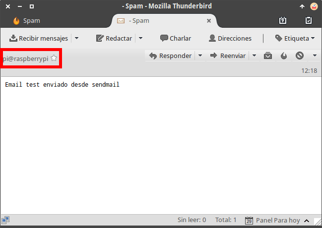
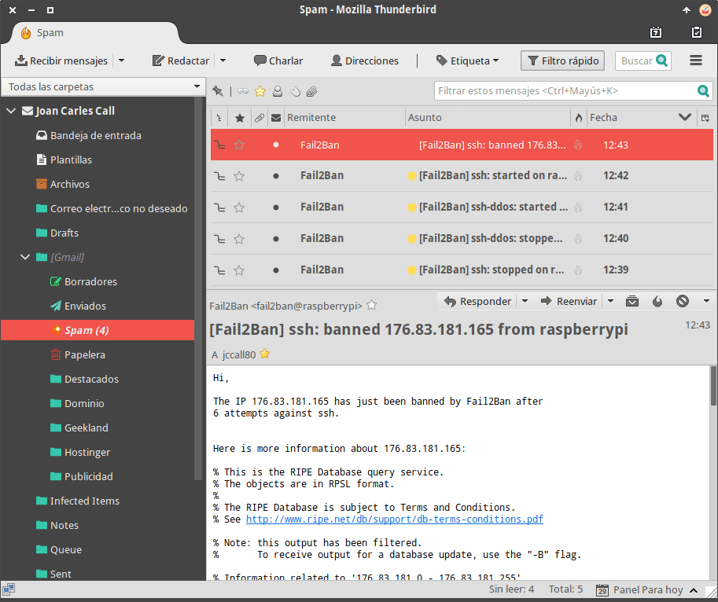

A continuación vamos a instalar y configurar Fail2ban con el fin de prevenir ataques de fuerza bruta en nuestro equipo o en nuestro servidor.<!--more-->

## ¿QUÉ ES Y QUE FUNCIÓN REALIZA FAIL2BAN?

Fail2ban es una herramienta de seguridad escrita en Python fundamental para cualquier servidor que preste servicios públicos.

Su principal función es securizar un servidor del siguiente modo:

1. **Evitando accesos indeseados** a nuestro equipo o servidor.
2. **Evitando ataques de fuerza bruta** para que un tercero averigüe nuestra contraseña o tumbe el servidor.

La forma en que fail2ban securiza nuestro servidor se describe a continuación.

## ¿CÓMO TRABAJA FAIL2BAN?

Por un lado fail2ban está monitorizando las autenticaciones que una determinada IP hace a un determinado/s puerto/s y servicio/s.

Para ello fail2ban está consultando permanente los logs de autenticación de nuestro sistema como por ejemplo el **/var/log/auth.log**.

Si fail2ban detecta un número determinado de intentos de conexión fallidos bloqueará la IP que está intentando acceder a nuestro equipo o el servicio. La forma de bloquear la IP será introduciendo una regla en el Firewall de nuestro equipo o servidor durante un tiempo determinado que por ejemplo pueden ser 600 segundos.

Una vez transcurridos los 600 segundos, o el tiempo que nosotros queramos, se borrará la regla del firewall. Por lo tanto la IP que fue bloqueada podrá intentar conectar de nuevo a nuestro servidor.

## INSTRUCCIONES PARA INSTALAR FAIL2BAN

Para instalar fail2ban tenemos que seguir las siguientes instrucciones.

En **Debian** y en distribuciones derivadas de Debian ejecutaremos el siguiente comando en la terminal:

> ```
> sudo apt-get install fail2ban
> ```

En **Fedora** y distribuciones derivadas de Fedora tendremos que ejecutar el siguiente comando en la terminal:

> ```
> sudo dnf install fail2ban
> ```

En sistemas operativos como por ejemplo **CentOS** ejecutaremos el siguiente comando:

> ```
> sudo yum install fail2ban
> ```

###### Nota: Si el paquete fail2ban no está disponible en sus repositorios lo pueden instalar siguiendo las instrucciones que encontrarán en la [plataforma de desarrollo](https://github.com/fail2ban/fail2ban) de fail2ban.

Si además queremos que se **nos informe mediante un email cada vez que se bloquee una ip** o se reinicie una de las jaulas deberemos instalar sendmail.

Para ello en **Debian** y distribuciones derivadas de Debian ejecutaremos el siguiente comando en la terminal:

> ```
> sudo apt-get install sendmail
> ```

En **Fedora** y distribuciones de Fedora ejecutaremos el siguiente comando en la terminal:

> ```
> sudo dnf install sendmail
> ```

Para finalizar, en sistemas operativos como por ejemplo **CentOS** deberemos ejecutar el siguiente comando en la terminal:

> ```
> sudo yum install sendmail
> ```

## INSTRUCCIONES PARA CONFIGURAR FAIL2BAN

En los siguientes apartados mostraremos como podemos configurar de forma sencilla fail2ban.

### Configuración y consulta de los filtros

La ubicación que contiene la totalidad de filtros de fail2ban es la siguiente:

> ```
> /etc/fail2ban/filter.d
> ```

Algunos de los filtros que podemos encontrar son los siguientes:

 
|   **Archivo que contiene el filtro**   |   **Función**   |
| --- | --- |
|   **sshd.conf**   |   Filtro para detectar autenticaciones erróneas a un servidor SSH   |
|   **proftpd.conf**   |   Filtro para detectar autenticaciones erróneas al servidor ftp Proftp   |
|   **exim.conf**   |   Filtro para detectar autenticaciones a un servidor de correo Exim.   |
|   **Etc.**   |  |

La función de los filtros es definir las expresiones regulares para detectar autenticaciones erróneas o ataques a nuestro equipo o servicio.

Una vez definida una expresión regular se irá comprobando que esta expresión no aparezca en ninguno de los logs de autenticación de nuestros servicios. En el caso que la expresión regular aparezca en los logs se contabilizará un intento fallido de autenticación.

Si pretendemos usar los servicios estándares predeterminados de fail2ban no será necesario modificar ni crear ningún filtro.

### Configuración y consulta de las acciones

Otra ubicación interesante para la configuración de fail2ban es la siguiente:

> ```
> /etc/fail2ban/action.d
> ```

En esta ruta se guardan la totalidad de scripts que definen diferentes tipos de acciones a aplicar cuando se detecta un intento de ataque, se arranca alguna de las jaulas, etc.

En principio no tendremos que modificar ni configurar parámetro de este apartado. Fail2ban ya trae predefinidas multitud de acciones.

### Configuración de las reglas especificas para un servicio en el archivo jail.conf

**jail.conf** es el archivo de configuración más importante. En este archivo es donde activamos, desactivamos y configuramos fail2ban para que proteja determinados servicios. De forma genérica se puede decir que en el archivo jail.conf realizamos las siguientes acciones

1. Activamos o desactivamos la protección de fail2ban para un servicio determinado.
2. Definimos el filtro y las acciones que se aplican a cada uno de los servicios.
3. Se define el puerto de funcionamiento de un servicio determinado para que fail2ban pueda funcionar de forma adecuada.
4. Se establece el log a controlar para detectar los intentos de autenticación erróneos.
5. Se establece el número de intentos fallidos que permitimos antes que se aplique la acción para bloquear los intentos de autenticación erróneos.
6. Etc.

Antes de iniciar la configuración es recomendable duplicar el archivo de configuración jail.conf. Para ello ejecutamos el siguiente comando en la terminal:

> ```
> sudo cp /etc/fail2ban/jail.conf /etc/fail2ban/jail.local
> ```

Una vez duplicado el archivo se deshabilitará la configuración del archivo jail.conf y se aplicará la del archivo jail.local. De esta forma siempre tendremos una copia de la configuración predeterminada de fail2ban.

Para acceder a la configuración de las reglas ejecutamos el siguiente comando en la terminal:

> ```
> sudo nano /etc/fail2ban/jail.local
> ```

El contenido del fichero **jail.local** está repleto de preconfiguraciones estándares para cada uno de los servicios que podemos proteger. Para activar y configurar las preconfiguraciones tan solo tenemos que comentar, descomentar y modificar los parámetros de cada una de la secciones.

A modo de ejemplo localizamos la sección destinada a proteger nuestro servidor SSH contra ataques DdoS.

```
[ssh-ddos]
enabled = false
port = ssh
filter = sshd-ddos
logpath = /var/log/auth.log
maxretry = 6
```

Una vez localizada la sección vemos que la protección está desactivada porque el parámetro enabled tiene el valor false. Por lo tanto, para activar la protección modificaremos el valor campo **enabled** de false a **true**.

```
[ssh-ddos]
enabled = true
port = ssh
filter = sshd-ddos
logpath = /var/log/auth.log
maxretry = 6
```

El resto de parámetros de la sección los adaptaremos en función de nuestras necesidades. El significado de los parámetros que nos podemos encontrar dentro de una sección es el siguiente:

 
|   **Parámetro**   |   **Función**   |
| --- | --- |
|   **enabled =**   |   Con los valores **true** y **false** activamos y desactivamos la protección que ofrece fail2ban para un determinado servicio.   |
|   **port =**   |   Definición de los puertos en que están trabajando los servicios que queremos proteger.   |
|   **filter =**   |   Se define el nombre del filtro a aplicar para detectar intentos de autenticación fallidos. Para ver la totalidad de filtros disponibles se puede visitar la ubicación **/etc/fail2ban/filter.d**   |
|   **logpath =**   |   Definición del log a monitorizar para detectar los intentos fallidos de autenticación.   |
|   **maxretry =**   |   Número de intentos de autenticación máximos fallidos antes de aplicar una acción de bloqueo.   |
|   **action =**   |   Para definir las acciones de bloqueo que se aplicarán en cada uno de los servicios que queremos proteger. La totalidad de acciones disponibles se hallan en la ubicación **/etc/fail2ban/action.d**   |
|   **findtime =**   |   Definimos el tiempo ha transcurrir para que el contador de intentos fallidos de una determinada IP se resetee.   |
|   **bantime =**   |   Definimos el tiempo en segundos que queremos bloquear una determinada IP. Normalmente un valor de **600** segundos es más que apropiado.   |

###### Nota: Si la sección de un servicio no dispone de los parámetros mencionados en la tabla, entonces toman se toman los parámetros por defecto configurados en la sección \[DEFAULT\].

Una vez modificados la totalidad de parámetros de la sección **\[ssh-ddos\]** guardamos los cambios y salimos del fichero. Para que los cambios se hagan efectivos ejecutamos el siguiente comando para reiniciar fail2ban:

> ```
> sudo service fail2ban restart
> ```

Acto seguido ya estaremos protegiendo nuestro servidor SSH contra ataques de denegación de servicio.

### Configuración de alertas vía email en Fail2ban

Si queremos podemos hacer que fail2ban nos avise cada vez que se bloquee una IP o haya alguna incidencia. Para ello, como hemos visto en apartados anteriores tendremos que tener instalado sendmail.

Una vez instalado sendmail ejecutaremos el siguiente comando para averiguar la dirección de email usada por sendmail para enviar los emails:

> ```
> echo "Email test enviado desde sendmail" | /usr/sbin/sendmail dirección_de_email_personal
> ```

###### Nota: La parte de color rojo del comando la deberéis reemplazar por vuestro correo electrónico.

Acto seguido abrimos nuestro correo electrónico y revisamos la bandeja de entrada y la bandeja de spam.

[](images/direccion-email-usada-sendmail.png)

Tal y como pueden ver en la captura de pantalla sendmail usa la dirección **pi@raspberrypi** para enviar los emails.

Acto seguido accedemos dentro del fichero de configuración jail.local ejecutando el siguiente comando en la terminal:

> ```
> sudo nano /etc/fail2ban/jail.local
> ```

A continuación, dentro de la sección **\[ACTIONS\]** localizamos y configuramos los siguientes parámetros del fichero de configuración:

 
|   **Parámetro a configurar**   |   **Valor**   |
| --- | --- |
|   **destemail =**   |   Introducimos la dirección de email de gmail, hotmail, etc en la que queremos recibir los avisos.   |
|   **s****endername** **\=**   |   En este apartado figurará el nombre de la persona o servicio que nos enviará el email. En mi caso dejo el valor por defecto que es:  **Fail2Ban**   |
|   **s****ender** **\=**   |   En el apartado sender introducimos la dirección con la que fail2ban enviará los emails. Como vimos al inicio de este apartado en mi caso tengo que introducir:  **pi@raspberrypi**   |
|   **mta =**   |   Tenemos que asegurar que este parámetro sea:  **sendmail**   |
|   **action =**   |   Dentro del archivo de configuración encontrarán varios valores para este campo. Para que se envíen las notificaciones podemos usar los siguientes valores:  **%(action\_mw)s**  o  **%(action\_mw)s**   |

Una vez modificados la totalidad de parámetros guardamos los cambios y salimos del fichero. Para que los cambios se hagan efectivos ejecutamos el siguiente comando para reiniciar fail2ban:

> ```
> sudo service fail2ban restart
> ```

A partir de estos momentos cada vez que se arranque o pare una de las jaulas de fail2ban o se bloquee una ip se nos enviará notificaciones vía email.

[](images/notificaciones-email-con-fail2ban.png)

### Otras configuraciones en la sección \[DEFAULT\] de jail.conf

En el fichero jail.conf o jail.local existen otros parámetros de configuración que también podemos que considerar. Son los siguientes:

 
|   **Parámetro a configurar**   |   **Valor**   |
| --- | --- |
|   **ignoreip =**   |   Se trata de una lista blanca de IP. En este campo podemos indicar una IP, varias IP o un rango de IP que no queremos que sean bloqueadas.  En mi caso introduzco el valor **127.0.0.1/8**. De esta forma ningún equipo de mi red local va a ser bloqueado por fail2ban.   |
|   **ignorecommand =**   |   Definimos un comando o script que no se aplicará cuando una determinada IP se intente conectarse a nuestro equipo o servidor. Un ejemplo del contenido de este campo podría se:  **ignorecommand = /scripts/fail2ban\_ipcheck 176.15.12.230**   |
|   **bantime =**   |   Definición del tiempo de baneo estándar en segundos de una IP determinada. **600** segundos es un valor más que adecuado.   |
|   **maxretry =**   |   Número de veces que una determinada IP puede fallar la contraseña para acceder a un servicio. El valor estándar por defecto es **3**.   |
|   **backend =**   |   Especificamos el modo en que fail2ban va a monitorizar los logs. En mi caso tengo el modo **auto**. El modo inicialmente probará pyinotify, entonces gamin y finalmente polling.   |
|   **usedns =**   |   Especificamos el comportamiento de fail2ban frente a la resolución inversa de peticiones DNS en los logs de autenticación de nuestros servicios.   |

###### Nota: Si la sección de un servicio, como por ejemplo \[ssh\], contiene alguno de los parámetros de la sección \[DEFAULT\], entonces la configuración de la sección del servicio \[ssh\] prevalecerá sobre la configuración de la sección \[DEFAULT\].

### Otras configuraciones en la sección \[ACTIONS\] de jail.conf

En el apartado \[ACTIONS\] del fichero de configuración jail.local podemos configurar otros parámetros. Algunos de ellos son los siguientes:

 
|   **Parámetro a configurar**   |   **Valor**   |
| --- | --- |
|   **banaction =**   |   Indicamos el bloqueo que se aplicará cuando se tenga que bloquear una ip. La diferentes opciones de bloqueo se hallan en la ubicación **/etc/fail2ban/action.d/.**  En mi caso la configuración que acostumbro a usar es:  **iptables-multiport**   |
|   **protocol =**   |   Se define el tipo de puertos que bloqueará fail2ban. El valor por defecto es **tcp**, pero en función de nuestras necesidades podemos seleccionar **udp** o **all**.   |
|   **chain =**   |   En este apartado tenemos que definir la cadena de iptables que queremos utilizar para bloquear las IP. Por defecto el valor es **INPUT**. En el 99,999% de cases tenemos tendremos que usar la cadena Input porque que Fail2ban está destinado a bloquear tráfico del exterior hacia nuestro servidor.   |
|   **port =**   |   En este apartado definimos el rango de puertos en que Fail2ban puede añadir en el Firewall. Por defecto se define el rango de puertos **0:****65535**.   |
|   **action =**   |   Existen varias acciones predefinidas. En nuestro caso tenemos que elegir la acción a llevar a termino en caso que se tenga que bloquear a un IP determinada.   |

###### Nota: Por norma general la configuración estándar de este fichero es adecuada y no es necesario modificarla.

### Consultar y definir la configuración general de fail2ban

Inicialmente es recomendable duplicar el archivo de configuración genérico de fail2ban. Para ello ejecutamos el siguiente comando en la terminal:

> ```
> sudo cp /etc/fail2ban/fail2ban.conf /etc/fail2ban/fail2ban.local
> ```

Una vez duplicado el archivo se deshabilitará la configuración del archivo fail2ban.conf y aplicará del archivo fail2ban.local. De esta forma siempre tendremos una copia de la configuración predeterminada de fail2ban.

Para acceder a la configuración general de fail2ban ejecutamos el siguiente comando en la terminal:

> ```
> sudo nano /etc/fail2ban/fail2ban.local
> ```

Dentro de este fichero podemos modificar los siguientes parámetros:

 
|   **Parámetro**   |   **Explicación del parámetro**   |
| --- | --- |
|   **loglevel =**   |   Según la versión de fail2ban disponemos de diversos valores. Estos valores determinan el nivel de detalle que tendrán los logs de fail2ban. Por defecto el nivel de detalle es el **3** o el **INFO**.   |
|   **l****ogtarget** **\=**   |   Se determina la ubicación del archivo que almacenará los logs de fail2ban. La ubicación por defecto es la **/var/log/fail2ban.log**   |
|   **socket =**   |   Especificamos la ruta del archivo que se usará para que las partes que actúan como cliente y servidor de fail2ban se puedan comunicar. La ruta por defecto es **/var/run/fail2ban/fail2ban.sock** y no es necesario modificarla.   |
|   **pidfile =**   |   Ruta del fichero que se usa para almacenar el numero de proceso del servidor fail2ban. Por defecto el fichero es el **/var/run/fail2ban/fail2ban.pid**   |
|   **dbfile =**   |   A partir de la versión 0.9 fail2ban guarda los datos de bloqueo en una base de datos sqlite. En este apartado indicaremos la ruta del archivo que contendrá la base de datos. La ruta por defecto es la **/var/lib/fail2ban/fail2ban.sqlite3**  Si únicamente pretendemos almacenar los logs de bloqueo en memoria, el valor de dbfile tendrá que ser **:memory:**. De esta forma los logs de bloqueo solo se guardarán mientras fail2ban esté activo.  Si no queremos almacenar ninguna base de datos fijaremos el valor de dbfile en **None**   |
|   **dbpurgeage =**   |   Indicamos el periodo de tiempo que queremos almacenar las IP bloqueada en nuestra base de datos sqlite.   |

###### Nota: El fichero de configuración genérica es válido para 99,9% de los casos. Por lo tanto rara vez tendremos que modificar ningún parámetro en este fichero.

## SERVICIOS CON LOS QUE PODEMOS USAR FAIL2BAN

Fail2ban viene preconfigurado de forma predeterminada para poder usarse en multitud de servicios como por ejemplo los siguientes:

1. SSH
2. Servidores web como por ejemplo lighttpd, nginx y Apache
3. Servidores ftp como por ejemplo vsftpd, proftpd, pure-ftpd. wuftpd
4. En servidores de email como por ejemplo Postfix, exim, squirrelmail, Courier, dovecot, sasl, etc.
5. Servicios de proxy como Squid.
6. Otros servicios como Asterisk, FreeSWITCH, Drupal, Wordpress, etc.
7. etc.

## VER LAS REGLAS DEL FIREWALL APLICADAS POR FAIL2BAN

Supongamos que se bloquea una IP. Para confirmar que realmente se ha bloqueado la IP ejecutaremos el siguiente comando en la terminal:

> ```
> sudo iptables -L -n --line-numbers
> ```

Acto seguido veréis un contenido parecido al siguiente:

| Chain INPUT (policy ACCEPT) num target prot opt source destination 1 fail2ban-ssh-ddos tcp -- 0.0.0.0/0 0.0.0.0/0 multiport dports 2018 2 fail2ban-ssh tcp -- 0.0.0.0/0 0.0.0.0/0 multiport dports 2018Chain FORWARD (policy ACCEPT) num target prot opt source destinationChain OUTPUT (policy ACCEPT) num target prot opt source destinationChain **fail2ban-ssh** (1 references) num target prot opt source destination **1** REJECT all -- 146.83.221.242 0.0.0.0/0 reject-with icmp-port-unreachable 2 RETURN all -- 0.0.0.0/0 0.0.0.0/0Chain fail2ban-ssh-ddos (1 references) num target prot opt source destination 1 RETURN all -- 0.0.0.0/0 0.0.0.0/0 |
| :-- |

Por lo tanto podrán ver que la IP 146.83.221.242 ha sido bloqueado. Para que esta IP sea desbloqueada podemos esperar que transcurra el tiempo que hayamos definido. Si no queremos esperar podemos ejecutar el siguiente comando en la terminal:

Para borrar la IP de la línea **1** de la jaula **fail2ban-ssh** ejecutaremos el siguiente comando en la terminal:

> ```
> sudo iptables -D fail2ban-ssh 1
> ```

Acto seguido si volvemos a aplicar el comando

> ```
> sudo iptables -L -n --line-numbers
> ```

Veremos que ya no existe ningún tipo de bloqueo en el firewall.

## INSTRUCCIONES PARA CONSULTAR LOS LOGS

Si quieren consultar los logs de fail2ban les invito a seguir las instrucciones que se mencionan en el siguiente artículo:

https://geekland.eu/como-consultar-logs-de-fail2ban/
