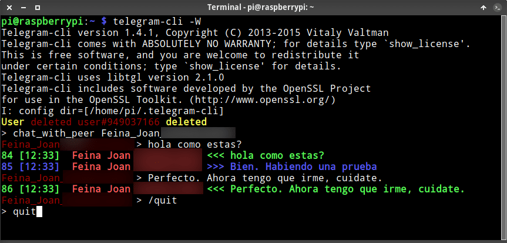

En el siguiente artículo veremos las instrucciones para instalar y usar Telegram-cli. Telegram-cli es un software para la terminal que nos permitirá usar Telegram de forma más o menos sencilla y práctica.<!--more-->

## VENTAJAS Y DESVENTAJAS DE USAR TELEGRAM-CLI EN LA TERMINAL

Para mi la ventaja principal de usar Telegram en la terminal es que **mediante scripts podremos automatizar la publicación de contenido en Telegram** o programar tareas en función de eventos.

Adicionalmente, una vez domines los comandos necesarios para usar telegram-cli verás que en algunas ocasiones es igual de útil o incluso más útil que la aplicación de escritorio. Por ejemplo:

1. Cuando un canal, grupo o persona publica un contenido es más rápido de ver con Telegram-cli.
2. Si tienes que conversar con una persona o en grupo Telegram-cli se defiende y no echas de menos la interfaz gráfica.
3. Esté donde esté me puedo conectar a mi Raspberry Pi de forma remota y usar Telegram sin necesidad de instalar ningún cliente.
4. De forma fácil podemos integrar Telegram en nuestro gestor de archivos para por ejemplo poder enviar documentos a un contacto desde el gestor de archivos.

**Las desventajas** y problemas que he encontrado en mi caso son los siguientes:

1. En el momento que accedes dentro de un grupo o chat te debería mostrar por defecto el historial de conversaciones. No obstante no es un gran problema ya que tan solo tienes que ejecutar el comando `/history` dentro del chat para ver los últimos 40 mensajes. Si precisan ver aún más comandos, por ejemplo 100, pueden ejecutar el comando `/history 100`.
2. En la terminal perderemos la capacidad de usar emoticonos, enviar stickers y enviar mensajes de voz.
3. Desde una terminal sin soporte para un servidor gráfico no es posible visualizar contenido multimedia.
4. En mi caso no he sabido o no me ha sido posible realizar chats secretos. Puedo establecer el chat y puedo enviar mensajes. Pero los mensajes que recibo no se pueden descifrar.
5. No he sabido enviar contenido multimedia estando dentro de un chat. Para ello tengo que salir del chat, enviar el contenido y volver a entrar el chat.

## INSTALAR TELEGRAM-CLI PARA SER USADO EN LA TERMINAL

> **Nota**: Si quieren instalar Telegram-cli de forma sencilla en Raspbian buster mediante un paquete .deb y sin tener que compilar nada lo pueden hacer siguiendo las instrucciones del final de este apartado.
> 
> **Nota**: El método de instalación ha sido testeado en Raspbian Buster. En otras distribuciones no ha sido testeado pero también debería funcionar.

En mi caso quiero instalar Telegram-cli en Raspbian Buster. Telegram-cli está en los repositorios de Raspbian Buster, pero el paquete binario de los repositorios no me ha funcionado. Tampoco me ha funcionado el paquete snap. Por lo tanto para instalarlo me ha tocado compilar a partir de el código fuente. Para ello lo primero que tenemos que realizar es instalar la totalidad de dependencias para poder compilar Telegram-cli. Para ello ejecutaremos el siguiente comando en la terminal:

```shell
sudo apt-get install libreadline-dev libconfig-dev libssl-dev lua5.2 liblua5.2-dev libevent-dev libjansson-dev libpython-dev libssl1.0-dev checkinstall make git
```

Una vez instaladas todas las dependencias descargamos Telegram-cli ejecutando el siguiente comando en la terminal:

```shell
git clone --recursive https://github.com/kenorb-contrib/tg.git && cd tg
```

Una vez descargado Telegram-cli tenemos que comprobar que cumplimos todas las dependencias necesarias y dejarlo todo ajustado para la compilación. Para ello ejecutaremos el siguiente comando en la terminal:

```shell
./configure --prefix=$HOME
```

Finalmente compilamos el programa ejecutando el siguiente comando en la terminal.

`make`

Una vez finalizada la compilación tendremos todos los binarios listos para instalar Telegram-cli.

## INICIAR TELEGRAM-CLI POR PRIMERA VEZ E INTEGRARLO EN EL SISTEMA OPERATIVO

Una vez finalizada la compilación, dentro de la ubicación`tg/bin` existirá una paquete binario llamado telegram-cli. Para acceder al directorio /bin ejecutaremos el siguiente comando:

`cd bin`

Una vez dentro del directorio ejecutaremos el siguiente comando:

`./telegram-cli -k tg.pub`

A continuación tendremos que introducir nuestro número de teléfono. Una vez introducido presionamos Enter y nos pedirá que introduzcamos un código de autenticación. El código de autenticación lo recibirán en la aplicación de Telegram del teléfono móvil que hayan introducido. Una vez conozcan el código lo introducen y presionan Enter. Con estos simples pasos ya estaremos listos para empezar a usar Telegram-cli:

```shell
pi@raspberrypi:~/tg/bin $ ./telegram-cli -k tg.pub
Telegram-cli version 1.4.1, Copyright (C) 2013-2015 Vitaly Valtman
Telegram-cli comes with ABSOLUTELY NO WARRANTY; for details type `show_license'.
This is free software, and you are welcome to redistribute it
under certain conditions; type `show_license' for details.
Telegram-cli uses libtgl version 2.1.0
Telegram-cli includes software developed by the OpenSSL Project
for use in the OpenSSL Toolkit. (http://www.openssl.org/)
I: config dir=[/home/pi/.telegram-cli]
phone number: +34X4XXX5443
code ('CALL' for phone code): 72452
User Joan updated flags -- [2020/06/22 22:28:31]
> 
```

Una vez logueados a Telegram salgan presionando la combinación de teclas `Ctrl+C` o ejecutando el comando `safe_quit`.

### Integrar Telegram-cli en el sistema operativo

Una vez hayamos accedido a Telegram recomiendo integrar los ficheros binarios que se han creado durante la compilación en el sistema operativo. Para ello ejecutaremos el comando `sudo make install`. En mi caso el resultado obtenido ha sido el siguiente:

```shell
pi@raspberrypi:~/tg $ sudo make install
install bin/telegram-cli //usr/local/bin
rm -rf dep auto bin objs libs dep/auto objs/auto objs/crypto dep/crypto config.log config.status > /dev/null || echo "all clean"
```

**Nota**: Básicamente lo único que hace el comando es copiar el fichero `tg/bin/telegram-cli` al directorio `/usr/local/bin`.

En estos momentos la instalación ha finalizado completamente. En el caso que quisieran crear un paquete .deb para instalar Telegram-cli en otros equipos con la misma arquitectura de forma mucho más sencilla tan solo tienen que ejecutar el siguiente comando en la terminal:

`sudo checkinstall --install=no`

Después de ejecutar el comando verán que se creará un paquete .deb para instalar Telegram-cli en otros equipos. En mi caso el paquete se ha creado en `/home/pi/tg/`.

`Done. The new package has been saved to  /home/pi/tg/telegram-cli_20200624-1_armhf.deb You can install it in your system anytime using:        dpkg -i telegram-cli_20200624-1_armhf.deb`

Si quieren descargar el paquete que he generado para instalar Telegram-cli fácilmente en una Raspberry Pi o cualquier otro dispositivo con arquitectura ARM pueden descargarlo del [siguiente enlace.](https://drive.google.com/file/d/1dtz9XfNeK2cEfHchuemAGncNLs30X3OT/view?usp=sharing "enlace para descargar Telegram-cli en Linux") Una vez descargado el paquete podrán realizar la instalación ejecutando el siguiente comando:

```shell
sudo dpkg -i telegram-cli_20200624-1_armhf.deb
```

**Nota**: El paquete .deb únicamente permitirá la instalación de Telegram-cli en dispositivos ARM como por ejemplo la Raspberry Pi.

Otra solución de instalación aún más sencilla seria utilizando Snap. En mi caso no me ha funcionado. Es posible que en otros sistemas operativos y/o arquitecturas si funcione. Por lo tanto si lo quieren intentar tan solo tendrán que ejecutar el siguiente comando:

```shell
sudo snap install telegram-cli
```

## INSTRUCCIONES O COMANDOS PARA USAR TELEGRAM-CLI DE FORMA EFECTIVA

Para iniciar Telegram les recomiendo que siempre lo hagan mediante el siguiente comando:

```shell
telegram-cli -W -N
```

- **\-N:** Para que se muestre el número de mensaje. Conocer el número de mensaje es útil para por ejemplo reenviar mensajes, descargar archivos multimedia, etc.
- **\-W:** Para que se ejecute el comando `dialog_list` justo al entrar. Si no se arranca con este parámetro es posible que Telegram-cli no detecte los contactos y no podamos acceder dentro de los chat.

Una vez ejecutado el comando accederemos a Telegram-cli. Los comandos que tenemos que conocer para usar Telegram-cli son los siguientes:

### Comandos útiles para enviar mensajes

| Función | Sintaxis | Ejemplo |
| --- | --- | --- |
| Enviar un mensaje | msg <canal grupo o usuario> texto | `msg Geekland mensaje vía Telegram-cli` |
| Enviar mensaje con salto de línea | msg <canal grupo o usuario> "texto1 \\ntexto2" | `msg Geekland "Hola,\n\nGracias por acceder al canal\n\nSaludos,\nDe parte de Geekland"` |
| Reenviar un mensaje | fwd <canal o usuario> Núm\_mensaje a reenviar | `fwd Geekland 90` |
| Establecer un chat con un usuario, grupo o canal | chat\_with\_peer <usuario o nombre canal> | `chat_with_peer uGeek_Grupo` |
| Salir de dentro de un chat, grupo o canal | /quit | `/quit` |
| Borrar un mensaje | delete\_msg <num\_mensaje\_a\_borrar> | `delete_msg 90` |
| Marcar los mensajes de un chat como leídos | mark\_read <canal grupo o usuario> | `mark_read Geekland` |
| Ver los 40 últimos mensajes de un grupo o chat | history <nombre canal grupo o usuario> | `history uGeek_Grupo` |
| Ver los 80 últimos mensajes de un grupo o chat | history <nombre canal grupo o usuario> Núm\_mensajes\_a\_mostrar | `history uGeek_Grupo 80` |
| Reenviar un mensaje multimedia | fwd\_media <canal o usuario> Núm\_mensaje\_reenviar | `fwd_media Geekland 214` |
| Responder un mensaje determinado | reply texto <número mensaje> respuesta | `reply 90 Es perfecto, gracias` |

**Nota**: Al introducir un nombre de usuario, canal o grupo tengan en cuenta lo siguiente. Si el nombre contiene un espacio, en vez de un espacio escribiremos **\_**

**Nota**: No es posible recuperar mensajes borrados en chats secretos o después que haya pasado un determinado tiempo.

**Nota**: Telegram-cli diferencia mayúsculas de minúsculas. Por lo tanto recordad de poner bien los nombres. Para escribir bien los nombres es útil usar la tecla TAB para autocompletar los nombres y/o comandos.

### Enviar y recibir archivos multimedia

| Función | Sintaxis | Ejemplo |
| --- | --- | --- |
| Enviar una foto | send\_photo <canal, grupo o usuario> ruta video a subir "Descripción foto" | `send_photo Notificaciones /home/pi/vacaciones.jpg La mejor foto de mis vacaciones` |
| Enviar un audio | send\_audio <canal, grupo o usuario> ruta audio a subir "Descripción del audio" | `send_audio Notificaciones /home/pi/podcast.mp3 Podcast de Linux` |
| Enviar un vídeo | send\_video <canal, grupo o usuario> ruta video a subir "Descripción vídeo" | `send_video Notificaciones /home/pi/youtube/test.mkv Video de prueba para el canal Geekland` |
| Enviar archivo de texto | send\_text <canal, grupo o usuario> ruta archivo texto | `send_text Notificaciones /home/pi/youtube/youtube.sh` |
| Enviar un documento o cualquier archivo | send\_document <canal, grupo o usuario> ruta documento "Descripción del documento" | `send_document Angel /home/pi/tg/telegram-cli_20200624-1_armhf.deb Paquete .deb para instalar Telegram-cli` |
| Reenviar un mensaje multimedia evitando compartir información acerca del creador del contenido multimedia | fwd\_media <canal, grupo o usuario> Número de mensaje a reenviar | `fwd_media Geekland 214` |
| Descargar una foto | load\_photo <número de mensaje que contiene la foto> | `load_photo 300` |
| Descargar una foto e visualizarla con la aplicación predeterminada del sistema | view\_photo <número de mensaje que contiene la foto> | `view_photo 300` |
| Descargar un vídeo | load\_video <número de mensaje que contiene el vídeo> | `load_video 350` |
| Descargar el vídeo y reproducirlo con la aplicación predeterminada del sistema | view\_video <número de mensaje que contiene el vídeo> | `view_video 350` |
| Descargar un documento | load\_document <número de mensaje que contiene el documento> | `load_document 450` |
| Descargar un documento y abrirlo mediante la aplicación predeterminada del sistema | view\_document <número de mensaje que contiene el documento> | `view_document 450` |
| Descargar un archivo de audio | load\_audio <número de mensaje que contiene el documento> | `load_audio 50` |
| Descargar el audio e intentarlo reproducir con la aplicación predeterminada del sistema | view\_audio <número de mensaje que contiene el documento> | `view_audio 50` |

**Nota:** Cuando envías un archivo de texto con el comando `send_text` no se envía el archivo. Lo que se envía es el contenido de dentro del fichero de texto a un chat concreto.

**Nota:** Para enviar archivo multimedia tienes que estar fuera de cualquier canal o grupo.

### Usar chats secretos

**Nota**: Como he comentado esta característica no me funciona de forma adecuada. Es posible que si los 2 clientes están usando Telegram-cli si funcione. En mi caso lo he intentando en un cliente de Android y un cliente Telegram-cli.

| Función | Sintaxis | Ejemplo |
| --- | --- | --- |
| Crear un chat secreto | create\_secret\_chat <usuario> | `create_secret_chat Joan` |
| Ver los chats secretos | chat\_with\_peer !\_ + tecla TAB | chat\_with\_peer !\_<TAB> |
| Aceptar un chat secreto en el caso que se haya iniciado telegram-cli con la opción -E | accept\_secret\_chat <nombre chat secreto> | `accept_secret_chat !_Geekland` |
| Determinar el tiempo de autodestrucción de los mensaje | set\_ttl  <nombre chat secreto> <tiempo duración> | `set_ttl !_Geekland 40` |
| Ver la clave de cifrado que se está usando. Si los 2 interlocutores tienen la misma clave la conversación es segura | visualize\_key <nombre chat secreto> | `visualize_key !_Geekland` |

### Obtener información de un usuario o un grupo

| Función | Sintaxis | Ejemplo |
| --- | --- | --- |
| Obtener un listado de nuestros contactos | contact\_list | `contact_list` |
| Listar los usuarios y grupos en que estamos | dialog\_list <número contactos a visualizar> Si no especificamos ninǵun número se mostrarán todos | `dialog_list 15` |
| Conseguir información sobre un usuario | user\_info <usuario> | `user_info Joan` |
| Listar información de nuestro propio usuario | get\_self | `get_self` |
| Conocer los administradores de un grupo | channel\_get\_admins <nombre canal> | `channel_get_admins uGeek_Grupo` |
| Ver los miembros de un canal | channel\_get\_members <nombre canal> | `channel_get_members Geekland` |
| Mostrar información de nuestros contactos y chats | stats | `stats` |

### Salir de Telegram

| Función | Sintaxis | Ejemplo |
| --- | --- | --- |
| Salir de Telegram | quit | `quit` |
| Salir de Telegram de forma segura | safe\_quit | `safe_quit` |

### Obtener información sobre todos los comandos disponibles en Telegram-cli

En este artículo no se muestran todas las opciones ni todos los comandos que se pueden usar con Telegram-cli. Si quieren obtener más información dentro de Telegram-cli ejecuten el siguiente comando:

`> help`

El comando `help` les mostrará todos los comandos disponibles en Telegram-cli. Adicionalmente también pueden consultar la siguiente web en la podrán ver todos los [comandos disponibles](https://github.com/vysheng/tg/wiki/Telegram-CLI-Commands "Enlace para ver más comandos disponibles en Telegram-cli").

## CAMBIAR LA CARPETA DE DESCARGAS DEL CLIENTE DE TELEGRAM Y OTRAS CONFIGURACIONES

Modificando el archivo de configuración de Telegram-cli podemos modificar ciertos parámetros del programa. El archivo de configuración se halla dentro de la partición `/home`.

### Modificar la ruta del directorio de descargas

Para modificar la ruta donde se realizan las descargas tan solo tienen que modificar el archivo de configuración. Para ello ejecuten el siguiente comando:

```shell
nano ~/.telegram-cli/config
```

Una vez se abra el editor de texto introducen el siguiente código para definir la ruta de descarga:

`# This is an empty config file # Feel free to put something here  downloads = "/media/datos/downloads";`

**Nota**: En vuestro deberéis reemplazar la ruta `/media/datos/downloads` por la ruta que queréis usar para realizar las descargas.

### Ver los números de mensaje de forma predeterminada

Al arrancar Telegram usábamos la opción `-N`para visualizar los números de mensaje. Si queremos evitar la introducción de este parámetro en el arranque tan solo tendremos que añadir el siguiente código en el archivo de configuración de Telegram-cli:

```shell
# This is an empty config file
# Feel free to put something here

downloads = "/media/datos/downloads";
msg_num = true;
```

Una vez realizados todos los cambios los guardan y cierran el fichero. La próxima vez que se ejecute Telegram-cli las modificaciones se aplicarán.

### Ajustar la cantidad de información mostrada al usar Telegram-cli

Se puede ajustar la cantidad de información que sale en pantalla cuando usas Telegram-cli. Lo podemos hacer añadiendo la siguiente línea en el fichero de configuración:

```shell
# This is an empty config file
# Feel free to put something here

downloads = "/media/datos/downloads";
msg_num = true;
log_level = 1;
```

Existen 4 niveles de nivel de log y en mi caso uso el 1. De este modo no se me estará constantemente informando cuando un cliente se conecta o desconecta.

## EJEMPLO BÁSICO DE USO Y CONCLUSIONES

A continuación mostraré un pequeño ejemplo de como usar Telegram-cli. El ejemplo es el siguiente:

[](images/ejemplo-chat-con-telegram-cli.png)

Como pueden ver su uso es simple. Telegram-cli tiene gran utilidad y a excepción de los puntos mencionados funciona bien. No es un programa para todo el mundo, pero si para todos aquellos que les gusta realizar sus tareas a través de la terminal. Además es una herramienta extremadamente útil en el caso que se quieran automatizar publicaciones mediante scripts. Es realmente una pena que el desarrollo de este aplicación esté tan parado. La última versión disponible data del año 2016.

##### Fuentes

[https://github.com/vysheng/tg](https://github.com/vysheng/tg)

[https://github.com/kenorb-contrib/tg](https://github.com/kenorb-contrib/tg)
