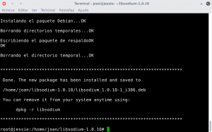
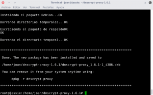
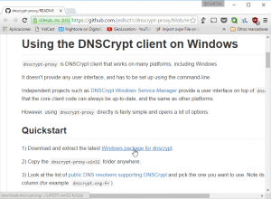
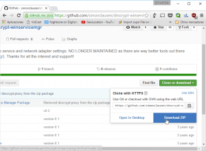
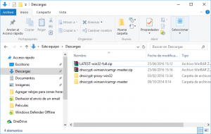
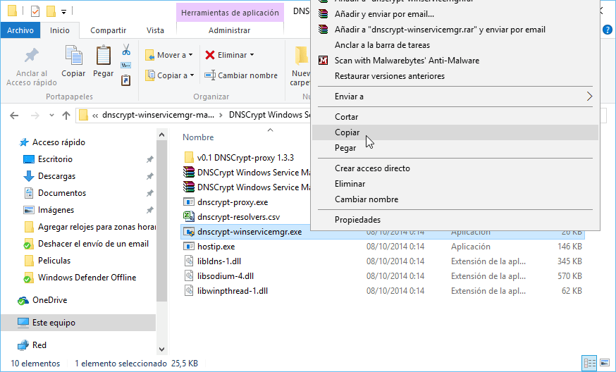
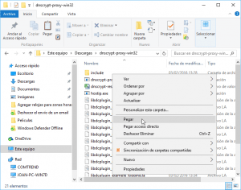

La semana anterior publiqué un post en el que detallaba los [motivos y razones que tenemos para cifrar nuestras peticiones DNS](). Una vez vista la necesidad de cifrar las peticiones DNS veremos como podemos instalar DNSCrypt en Linux, en Ubuntu y en Windows para de esta forma preservar nuestra privacidad y nuestra seguridad.<!--more-->

## INSTRUCCIONES PARA INSTALAR DNSCRYPT EN LINUX

En función del sistema operativo y de la distro que usamos tenemos varios métodos para la instalación de DNScrypt.

### Instalar DNSCrypt a partir de los repositorios de la distro

Si DNSCrypt está en los repositorios de nuestra distro, el proceso de instalación es muy sencillo ya tan solo tenemos seguir los siguientes pasos:

**En el caso de ser usuarios de Debian**, o de distribuciones derivadas de Debian, tenemos que ejecutar el siguiente comando en la terminal:

> ```
> sudo apt-get install dnscrypt-proxy
> ```

**En el caso de ser usuarios de Arch Linux** o de distribuciones derivadas de Arch Linux, como por ejemplo Manjaro o Antergos, tenemos que ejecutar el siguiente comando en la terminal:

> ```
> sudo pacman -S dnscrypt-proxy
> ```

**En el caso de ser usuarios de Fedora** o de distribuciones derivadas de Fedora, tenemos que ejecutar el siguiente comando en la terminal:

> ```
> sudo dnf install dnscrypt-proxy
> ```

Una vez ejecutado el comando se instalará DNSCrypt y la totalidad de dependencias necesarias y el proceso de instalación habrá finalizado.

### Instalar DNSCrypt en el caso que no esté presente en los repositorios

Si DNSCrypt no está en nuestros repositorios deberemos descargar y compilar el código fuente del programa. Para ello tienen que seguir los siguientes pasos:

Primero tendremos que asegurar que tenemos instalado el software básico para poder compilar e instalar DNSCrypt. Para ello abrimos una terminal y ejecutamos el siguiente comando:

> ```
> sudo apt-get update && sudo apt-get install build-essential libtool automake libsodium13 pkg-config checkinstall wget gdebi
> ```

#### Instalación de libsodium

A continuación tenemos que descargar, compilar e instalar la librería criptográfica libsodium. Para ello descargamos el código fuente ejecutando el siguiente comando en la terminal:

> ```
> wget https://download.libsodium.org/libsodium/releases/LATEST.tar.gz
> ```

Una vez descargado lo descomprimimos ejecutando el siguiente comando en la terminal:

> ```
> tar -zxvf LATEST.tar.gz
> ```

Seguidamente accedemos a la carpeta que acabamos de descomprimir y que contiene el código fuente de libsodium. Para ello en mi caso tengo que ejecutar el siguiente comando en la terminal:

> ```
> cd libsodium-1.0.10
> ```

Una vez dentro de la carpeta ejecutaremos el siguiente comando para crear el archivo makefile necesario para la compilación de libsodium:

> ```
> ./configure
> ```

A continuación ya podemos compilar libsodium. Para ello ejecutamos el siguiente comando en la terminal:

> ```
> make
> ```

Una vez realizada la compilación vamos a construir el paquete binario que usaremos para la instalar libsodium. Para ello ejecutamos el siguiente comando en la terminal:

> ```
> sudo checkinstall
> ```

Durante la ejecución de checkinstall se harán una serie de preguntas. Tan solo hay que leer detenidamente e ir contestando las preguntas que nos van preguntando. Si quieren pueden contestar las respuestas por defecto y el proceso de construcción del paquete se realizará correctamente.

Una vez contestadas todas las preguntas, tal y como se puede ver en la captura de pantalla, la instalación habrá finalizado:

[](images/Paquete-Libsodium-generado.png)

Una vez creado el archivo binario ya lo podemos instalar mediante gdebi o el método que prefiramos. En mi caso como estoy usando Debian lo he instalado ejecutando el siguiente comando en la terminal:

> ```
> sudo dpkg -i libsodium1.0.10-1_i386.deb
> ```

#### Instalación de dnscrypt

Una vez hayamos instalado libsodium procederemos a descargar el programa DNScrypt. Para descargarlo ejecutamos el siguiente comando en la terminal:

> ```
> wget https://download.dnscrypt.org/dnscrypt-proxy/LATEST.tar.gz
> ```

Una vez descargado lo descomprimimos ejecutando el siguiente comando en la terminal:

> ```
> tar -zxvf LATEST.tar.gz
> ```

Seguidamente accedemos a la carpeta que acabamos de descomprimir y que contiene el código fuente de DNSCrypt. Para ello en mi caso tengo que ejecutar el siguiente comando en la terminal:

> ```
> cd dnscrypt-proxy-1.6.1
> ```

Una vez dentro de la carpeta ejecutaremos el siguiente comando para evitar problemas durante la compilación de DNSCrypt:

> ```
> sudo /sbin/ldconfig
> ```

A continuación ejecutaremos el siguiente comando para crear el archivo makefile necesario para la compilación de DNSCrypt

> ```
> ./configure
> ```

Seguidamente ya podemos compilar DNSCrypt. Para ello ejecutamos el siguiente comando en la terminal:

> ```
> make
> ```

Una vez realizada la compilación vamos a construir el paquete binario que usaremos para la instalar DNSCrypt. Para ello ejecutamos el siguiente comando en la terminal:

> ```
> sudo checkinstall
> ```

Durante la ejecución de checkinstall se harán una serie de preguntas. Tan solo hay que leer detenidamente e ir contestando las preguntas que nos van preguntando. Si quieren pueden contestar las respuestas por defecto y el proceso de construcción del paquete se realizará correctamente.

Una vez contestadas todas las preguntas, tal y como se puede ver en la captura de pantalla, la instalación ha finalizado:

[](images/Paquete-DNScrypt-generado.png)

Una vez creado el archivo binario ya lo podemos instalar mediante gdebi o el método que prefiramos. En mi caso como estoy usando Debian lo he instalado ejecutando el siguiente comando en la terminal:

> ```
> sudo dpkg -i dnscrypt-proxy_1.6.1-1_i386.deb
> ```

## INSTRUCCIONES PARA INSTALAR DNSCRYPT EN UBUNTU Y EN DISTRIBUCIONES DERIVADAS DE UBUNTU

Si queremos instalar DNSCrypt en Ubuntu el procedimiento es mucho más sencillo. En el caso de usar Ubuntu podemos instalar DNSCrypt mediante repositorios del sistema operativo o mediante el uso de repositorios ppa.

### Instalar DNSCrypt mediante los repositorios del sistema operativo

Si instalamos DNSCrypt mediante los repositorios del sistema operativo tan solo tenemos que abrir una terminal y ejecutar el siguiente comando:

> ```
> sudo apt-get install dnscrypt-proxy
> ```

Una vez realizada esta simple operación el procedimiento ha finalizado.

### Instalar DNSCrypt mediante repositorios ppa

El primer paso para la instalación es agregar el repositorio ppa en nuestro sistema operativo. Para ello ejecutamos el siguiente comando en la terminal:

> ```
> sudo add-apt-repository ppa:anton+/dnscrypt
> ```

Seguidamente actualizamos nuestros repositorios ejecutando el siguiente comando en la terminal:

> ```
> sudo apt-get update
> ```

Finalmente ya podemos instalar DNSCrypt ejecutando el siguiente comando en la terminal:

> ```
> sudo apt-get install dnscrypt-proxy
> ```

Una vez realizados estos simples pasos el proceso de instalación ha finalizado.

## INSTRUCCIONES PARA INSTALAR DNSCRYPT EN WINDOWS

Para la instalación de DNSCrypt en Windows tan solo tenemos que seguir los pasos que veréis a continuación.

Empezaremos por acceder a la siguiente URL mediante nuestro navegador web:

[https://github.com/jedisct1/dnscrypt-proxy/blob/master/README-WINDOWS.markdown](https://github.com/jedisct1/dnscrypt-proxy/blob/master/README-WINDOWS.markdown "Link para descargar DNSCrypt en Windows")

Una vez dentro de la URL descargamos DNScrypt clicando encima del link **Windows package for dnscrypt** que pueden ver en la captura de pantalla:

[](images/Descargar-DNSCrypt.png)

Una vez descargado DNSCrypt accedemos a la siguiente URL:

[https://github.com/simonclausen/dnscrypt-winservicemgr](https://github.com/simonclausen/dnscrypt-winservicemgr "URL para descargar la interfaz gráfica de DNSCrypt")

Una vez dentro de la página de github descargamos la interfaz gráfica de DNSCrypt clicando encima del botón **Clone or Download** y seguidamente clicando encima del botón **Download ZIP**.

[](images/Descargar-la-interfaz-Gráfica-de-DNSCrypt.png)

A continuación, tal y como se puede ver en la captura de pantalla, descomprimimos los 2 archivos zip que acabamos de descargar:

[](images/Descomprimir-DNSCrypt-y-Libsodium.png)

Una vez terminada la descompresión dispondremos de las siguientes carpetas:

1. **dnscrypt-proxy-win32:** Carpeta en la que está disponible DNSCrypt.
2. **dnscrypt-winservicemgr-master:** Carpeta en la que está disponible la interfaz gráfica de DNSCrypt.

Accedemos a la carpeta **dnscrypt-winservicemgr-master\\DNSCrypt Windows Service Manager Package** y copiamos el archivo **dnscrypt-winservicemgr.exe**

[](images/Copiar-la-interfaz-gráfica.png)

Una vez copiado el archivo lo pegamos dentro de la carpeta **dnscrypt-proxy-win32**

[](images/Pegar-la-interfaz-gráfica.png)

Una vez pegado el archivo copiamos la carpeta **dnscrypt-proxy-win32** dentro de la carpeta **C:\\Program Files**. Después de seguir estos simples pasos habremos finalizado con el proceso de instalación de DNSCrypt en Windows.

## CONFIGURACIÓN DE DE DNSCRYPT EN LINUX

Una vez finalizada la instalación tan solo nos falta configurar y comprobar que DNSCrypt funciona de forma adecuada. Para ello pueden seguir las instrucciones que encontrarán en el siguiente enlace:

https://geeklandlinux.github.io/posts/configurar-dnscrypt-en-gnu-linux/

## CONFIGURACIÓN DE DE DNSCRYPT EN WINDOWS

Una vez finalizada la instalación tan solo nos falta configurar y comprobar que DNSCrypt funciona de forma adecuada. Para ello pueden seguir las instrucciones que dejo en el siguiente enlace:

https://geeklandlinux.github.io/posts/configurar-dnscrypt-en-windows/
