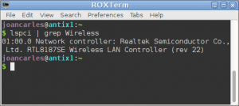
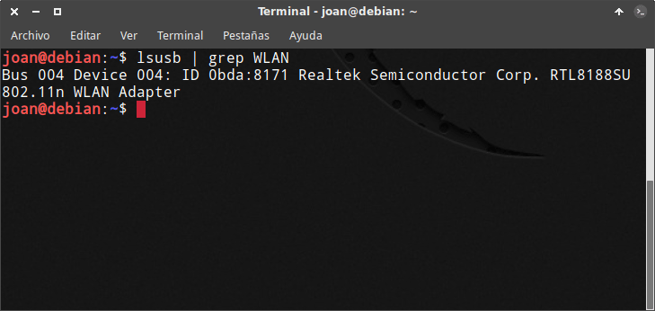
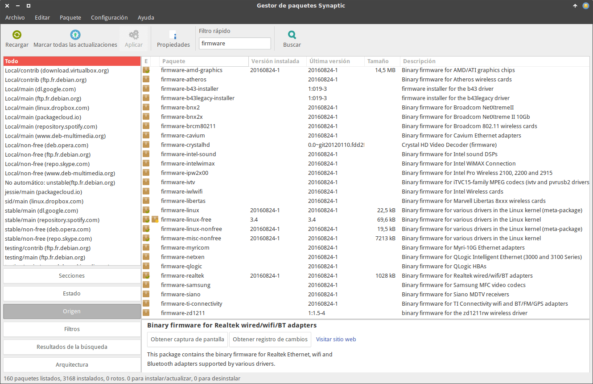
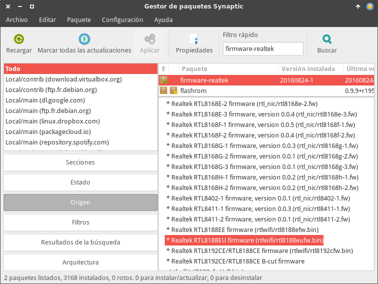

Es posible que justo al terminar la instalación de Debian se encuentren con la sorpresa que no tengan Wifi y que les sea completamente imposible usar su tarjeta de red wifi.

La solución a este problema acostumbra a ser bastante sencilla en la mayoría de los casos. Lo único que tenemos que realizar para solucionar el problema es instalar los drivers de nuestra tarjeta de red wifi de ka siguiente forma.<!--more-->

## ACTIVAR LOS REPOSITORIOS NO LIBRES

Lo más probable es que nuestra tarjeta de red inalámbrica no funcione porque no tiene instalados los drivers apropiados.

En la mayoría de casos, los drivers que necesitaremos se encuentran en los repositorios no libres de Debian. Por lo tanto lo primero que tendremos que realizar es activar los repositorios no libres de Debian siguiendo las instrucciones que encontrará en el siguiente enlace:

[https://geekland.eu/activar-los-repositorios-privativos-debian/]()

## IDENTIFICAR EL CHIP DE NUESTRA TARJETA DE RED WIFI

Una vez activados lo repositorios privativos tendremos que conocer la marca y el modelo de nuestra tarjeta de red inalámbrica.

En el caso que vuestra tarjeta de red wifi esté integrada dentro del ordenador tendremos que ejecutar el siguiente comando en la terminal:

> ```
> lspci | grep Wireless
> ```

En mi caso el resultado obtenido es el siguiente:

[](images/chip-tarjeta-de-red-PCI.png)

Por lo tanto queda en mi caso estoy usando una tarjeta de red Wifi Realtek con el chip RTL8187SE

En el caso que uséis una tarjeta de red wifi del tipo USB tendréis que cambiar ligeramente el comando. El comando a ejecutar será el siguiente:

> ```
> lsusb | grep WLAN
> ```

En este caso el resultado obtenido en mi ordenador de sobremesa es el siguiente:

[](images/Chip-tarjeta-de-red-Wifi-USB.png)

Al igual que antes también estoy usando una tarjeta Realtek, pero en este caso con el chip RTL8188SU.

Por lo tanto queda claro que en mis 2 únicos ordenadores estoy usando una tarjeta de red inalámbrica Realtek.

## INSTALAR LOS DRIVERS DE NUESTRA TARJETA DE RED INALÁMBRICA

En estos momentos lo único que falta es instalar los paquetes precisos para que funcione nuestra tarjeta de red wifi.

Para ello abrimos Synaptic Package Manager y realizamos una búsqueda de paquetes usando el término **firmware**:

[](images/Drivers-wifi-disponibles-en-Debian.png)

De este modo podremos conocer fácilmente el paquete que tenemos que instalar para que funcione nuestra tarjeta de red inalámbrica.

Los paquetes a instalar en función de la tarjeta de red que dispongamos son los siguientes:

 
|   **Marca**   |   **Paquete**   |
| --- | --- |
|   Atheros   |   firmware-atheros   |
|   Broadcom   |   firmware-b43-installer, broadcom-sta-dkms, firmware-b43legacy-installer o firmware-brcm80211   |
|   Intel   |   Firmware-ipw2x00, firmware-intelwimax o firmware-iwlwifi   |
|   Realtek   |   firmware-realtek   |
|   ti   |   firmware-ti-connectivity   |
|   ZyDas   |   firmware-zd1211   |

Como en mi caso uso una tarjeta de Realtek procederé a la instalación del paquete firmware-realtek ejecutando el siguiente comando en la terminal:

> ```
> sudo apt-get install realtek
> ```

Si además quieren confirmar que su chip esta soportado por el driver que nos ofrece Debian lo tenemos muy fácil. Tal y como se puede ver en la captura de pantalla, la descripción de los paquetes nos ofrecen información detallada de los chips que soporta cada uno de los drivers.

[](images/Chips-soportados-por-cada-driver.png)

Finalmente tan solo nos falta reiniciar el ordenador. La próxima vez que reiniciemos el ordenador nuestra tarjeta de red wifi debería funcionar sin ningún tipo de problema.

## RECOMENDACIÓN EN CASO DE PROBLEMAS

Si después de seguir las instrucciones aún tienen problemas para usar el wifi, les recomiendo que abran una terminal y ejecuten el siguiente comando:

> ```
> sudo apt-get install firmware-linux firmware-linux-free firmware-linux-nonfree firmware-misc-nonfree
> ```

Una vez finalizada la instalación de los paquetes deberán reiniciar de nuevo el ordenador.

Si esta medida tampoco ha sido efectiva únicamente nos quedan 2 soluciones:

1. Buscar un driver apropiado en Internet para nuestra tarjeta de red Wifi y realizar una instalación manual.
2. Usar ndiswrapper para poder usar los drivers de Windows en nuestra distribución Linux.
