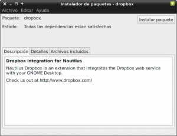
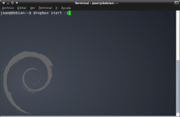
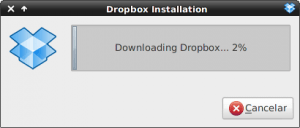
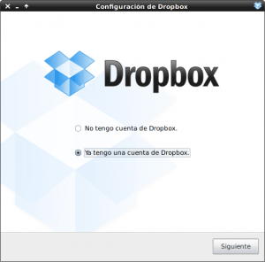
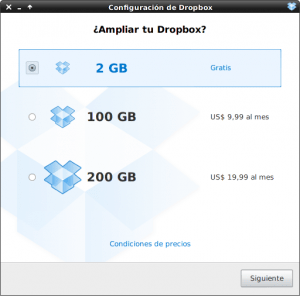
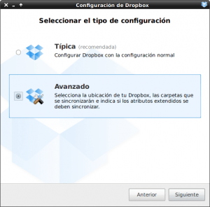
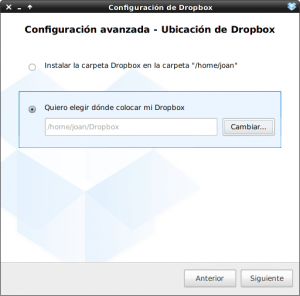
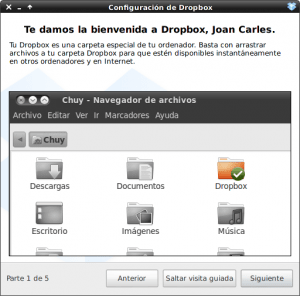
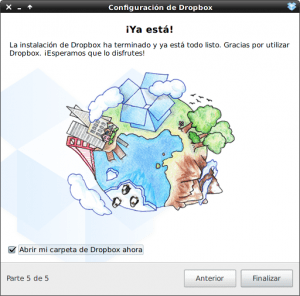

Hoy veremos como instalar dropbox para poderlo usar sin ningún tipos de problema en sistemas dual boot. Hay muchos usuarios que tienen un Dual boot con windows y alguna de las muchas distros de Linux existentes. Para poder acceder al contenido de dropbox tanto en linux como en windows sin tener necesidad de duplicar el contenido tenemos que instalar dropbox de la siguiente forma:<!--more-->

#### **PASO 1. Montar la partición NTFS o FAT adecuadamente para que Dropbox funcione tanto en Windows como en Linux**

1- La Ubicación de la carpeta de Dropbox tiene que ser una unidad NTFS que sea accesible mediante Windows y mediante Linux. En mi caso es una partición en formato NTFS de 200 gigas que uso tanto para Linux como para Windows con el fin de almacenar información.

2- En Linux para que dropbox funcione adecuadamente en una partición NTFS, esta debe montarse en el arranque del sistema. Para montar la partición NTFS adecuadamente y con los permisos correspondientes consultar el siguiente link:

[https://geekland.eu/montar-particion-ntfs-fat-o-ext4-en-el-arranque-del-sistema/]()

#### **PASO 2. Instalar dropbox en cada uno de los SO operativos que tenemos dentro del mismo ordenador**

1- Descargamos el paquete adecuado en función del sistema operativo que estamos usando. Para ello consultar el siguiente link:

[https://www.dropbox.com/install](https://www.dropbox.com/install)

 2- Una vez descargado el fichero procedemos a su instalación mediante el instalador de paquetes que disponga nuestro equipo. En este post se muestra el proceso de instalación en GNU Linux. Para windows el proceso es similar. En las siguientes imágenes se pueden ver las pasos que hay que ir siguiendo:

\- Instalamos el paquete descargado de la página de dropbox mediante cualquier instalador de paquetes existente. En mi caso he usado Gdebi.

\- Una vez instalado el paquete, como podeis ver en la imagen, ejecutamos el siguiente comando en la terminal:

> dropbox start -i

\- Como se puede ver en la imagen al  teclear el comando empezará la instalación de dropbox.

\- Una vez terminado el proceso de instalación solo hace falta configurar la cuenta. En mi caso Como ya tengo una cuenta creada elijo la opción "Ya tengo una cuenta creada" y le damos a siguiente.

\- Introducimos los detalles de nuestra cuenta que ya tenemos creada y le damos a Siguiente. En el caso de tener que crear una cuenta nueva el proceso es muy sencillo.

\- Elegimos nuestro tipo de cuenta. En mi caso de la de 2GB y le damos a siguiente.

\- Elegimos configuración avanzada para poder instalar nuestra carpeta de dropbox en la ubicación NTFS.

\- En la configuración avanzada indicamos la ruta donde queremos ubicar la carpeta de sincronización de Dropbox. En nuestro caso la ubicaremos en una unidad NTFS que sea común tanto en Windows como en Linux. Cuando repitamos el proceso de instalación en Windows debemos indicar exactamente la misma ruta. Una vez terminamos le damos a siguiente.

 

 

 

 

 

 

 

 

 

 

\- Seguidamente en mi caso elijo que quiero sincronizar la totalidad de carpetas. Es vuestra elección. Le damos a instalar.

\- Ya hemos  terminado de instalar dropbox. Simplemente nos falta seguir la visita guiada. En mi caso elegiré saltar la visita guiada.

\- Ya hemos completado los pasos necesarios para instalar dropbox. Ahora simplemente tenemos que instalar dropbox en Windows. Durante el proceso de instalación es importante que elijamos la misma ubicación de la carpeta que en Linux. De esta manera conseguiremos usar dropbox en un sistema Dual boot sin necesidad de duplicar el contenido en el disco duro.
