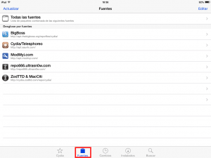
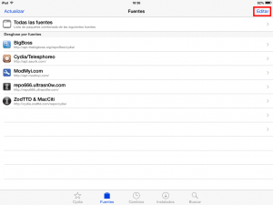
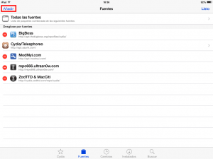
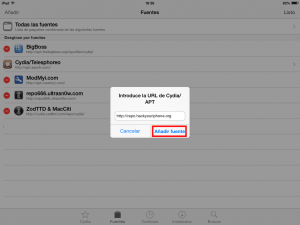
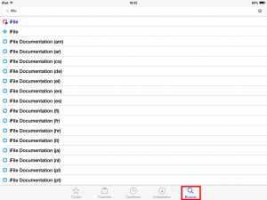
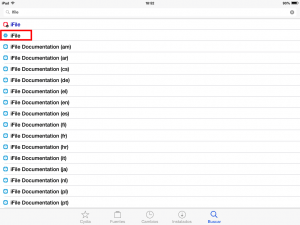
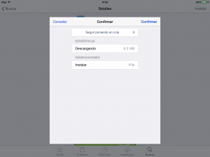
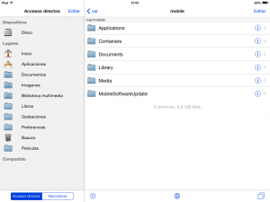

Para la gran mayoría de personas no es imprescindible disponer de un explorador de archivos para poder usar el iPad o el iPhone, pero si lo tenemos mejor que mejor ya que nos puede ser útil en ciertas situaciones que comentaremos mas adelante Por este motivo en el siguiente post detallaré el proceso para instalar el explorador de archivos iFile en nuestro dispositivo móvil iOS. Existen otros exploradores que archivos alternativos a iFile y que no requieren de Jailbreak como por ejemplo Goodreader, Documents, Briefcase Pro, etc. No obstante en este post me focalizo en iFile por ser de largo el mejor explorador de archivos existente para iOS.<!--more-->

###### Nota: Para poder seguir el tutorial mostrado en este post es necesario disponer de un dispositivo iOS con el Jailbreak realizado.

## UTILIDADES QUE PODEMOS DAR AL GESTOR DE ARCHIVOS IFILE

Las utilidades que nos ofrece el gestor de archivos iFile son numerosas y únicas. Algunas de las tareas que podremos realizar con iFile son las siguientes:

1. **Abrir archivos desde el explorador de archivos**. Así por lo tanto desde el explorador de archivos podemos abrir cualquier archivo con la App que nosotros queramos.
2. Nos permite **prescindir de iTunes**. iFile dispone de un servidor web incorporado que nos permitirá **traspasar información de nuestro ordenador al dispositivo iOS y viceversa sin necesidad de usar ningún cable ni iTunes**. En un futuro cercano escribiré un post detallando como realizar lo que acabo de comentar.
3. Podemos **enlazar el explorador de archivos iFile con Dropbox, Box.net, con servidores FTP, con servidores WebDAV** como el que nos proporciona por ejemplo Owncloud, etc.
4. Ofrece la posibilidad de **comprimir y descomprimir archivos, enviar archivos vía email o bluetooth, instalar archivos ejecutables .deb o .ipa**, etc.
5. **Ver la totalidad de archivos almacenados en nuestro dispositivo** iOS. Los gestores de archivos mencionados en la introducción están capados y no permiten entrar en los archivos de sistema ni en los archivos de las aplicaciones.

Por lo tanto el explorador de archivos iFile incluso ofrece funcionalidades superiores a las que nos puede ofrecer el explorador de archivos de nuestro ordenador.

## INSTALAR EL EXPLORADOR DE ARCHIVOS iFILE

Los pasos a realizar para instalar el Explorador de archivos iFile son los siguientes:

### Añadir el repositorio para descargar iFile

El primero paso a realizar es **acceder a Cydia**. Una vez dentro de Cydia, tal y como se puede ver en la captura de pantalla, **presionamos el botón Fuentes**.

Seguidamente tal y como se puede ver en la captura de pantalla **presionamos el botón Editar**.

Como tercer paso tenemos que **clicar encima del botón Añadir**.

Finalmente, tal y como se puede ver en la captura de pantalla, **en la ventana Introduce la URL de Cydia/APT tecleamos la siguiente dirección:**

**http://repo.hackyouriphone.org**

Una vez introducida **presionamos el botón Añadir fuente** y el proceso ha finalizado.

### Instrucciones para instalar iFile

Una vez añadido el repositorio, tal y como se puede ver en la captura de pantalla, **presionamos el botón de Buscar** y **en el cuadro de búsqueda buscamos iFile**:

Encontraremos varias opciones para la instalación de iFile. Deberéis **clicar encima de la opción que pertenece al repositorio de hackyouriphone que en mi caso** ,tal y como se puede ver en la captura de pantalla, **es la opción número 2**.

Seguidamente tendremos que **presionar el botón Instalar**.

Finalmente como último paso tan solo tenemos que **presionar sobre Confirmar**.

Después de presionar el botón confirmar se procederá de forma automática a la instalación de iFile. Una vez se haya instalado podemos salir de Cydia, y tal y como se puede ver en la captura de pantalla, podremos usar iFile sin ningún tipo de problema.

## PRECAUCIONES CON iFILE

Hay que ir con sumo cuidado cuando estamos usando el explorador de archivos iFile ya que con este explorador de archivos tendremos acceso a la totalidad de archivos de nuestro dispositivo. Si por accidente borramos algún archivo que no debemos borrar es posible que nuestro dispositivo no arranque o funcione de forma anormal.
