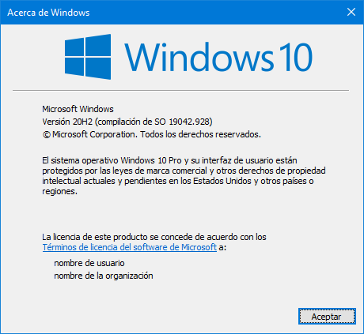
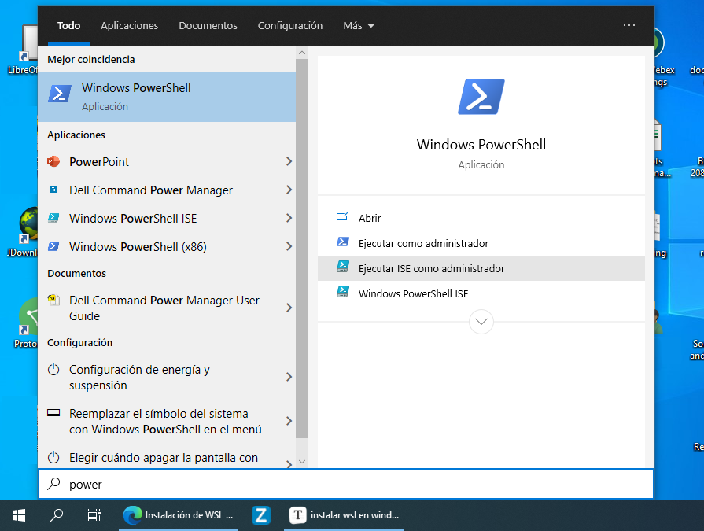
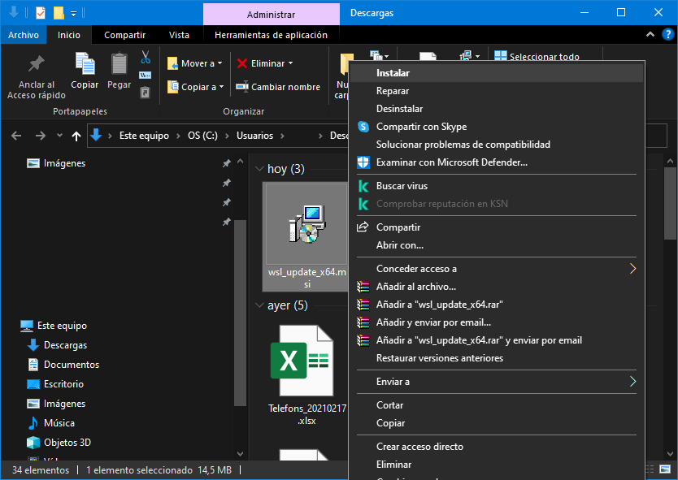
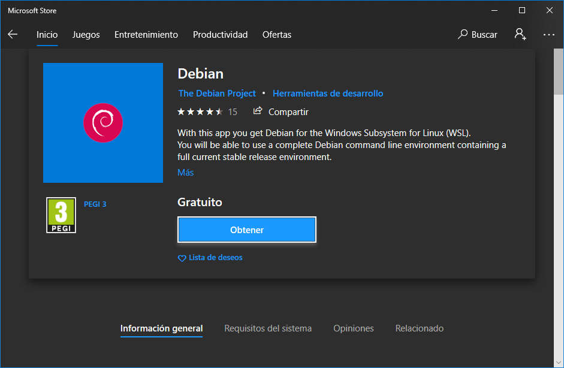
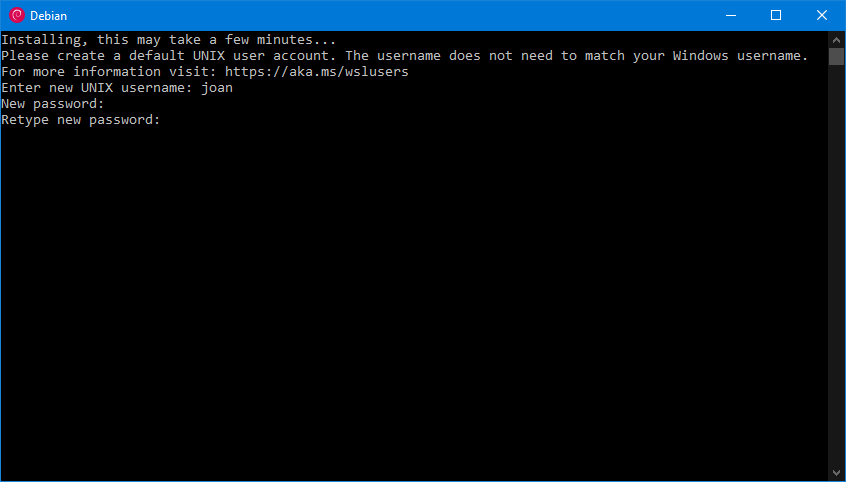
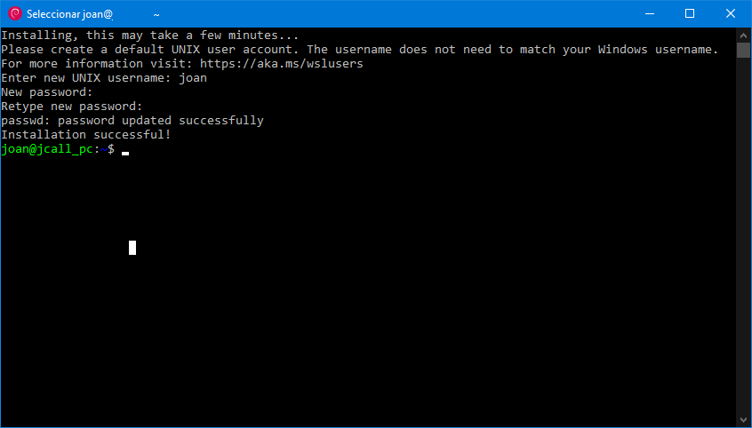

En el caso que tengan que usar un sistema operativo Windows por imposición y echen de menos determinadas características de Linux tienen una solución sencilla. Esta solución es instalar el subsistema de Windows para Linux (WSL). Con la versión 2 de versión de WSL tendrán una consola de bash y toda la paqueteria de la distribución que elijan. Además si tienen una build de Windows superior a la 21362 y WSL 2 podrán usar aplicaciones gráficas de Linux en Windows con un buen rendimiento y disponiendo de audio.<!--more-->

## INSTALAR EL SUBSISTEMA DE WINDOWS PARA LINUX (WSL)

El procedimiento de instalación del subsistema de Windows para Linux es sencillo y es el que verán a continuación.

### INSTALACIÓN SIMPLIFICADA

La instalación de WSL es sumamente sencilla **si forman parte del programa Windows Insider y tienen una build de Windows 20262 o posterior**. Para ver la versión de Windows que tienen instalada tienen presionar la combinación de teclas `Win+R`, cuando aparezca la ventana `Ejecutar` escriben `winver` y presionan sobre el botón `Aceptar`.

[](images/ejecutar-comando-windows-10.jpg)

Acto seguido aparecerá la información que detalla la build de Windows que tienen instalada. En mi caso tengo la 19042.928. Por lo tanto no puedo aplicar el método de instalación detallado en este apartado. Para proceder con la instalación deberé saltar al apartado ([Instalación Manual](#instalación-manual))

[](images/version-windows.png)

En el caso que la build de mi Windows permitiera la instalación tan solo tendría que abrir una powershell de Windows con permisos de administrador.

[](images/abrir-powershell-admin.png)

Una vez abierta la consola tendría que ejecutar el siguiente comando.

> ```shell
> wsl.exe --install
> ```

A continuación se instalaría de forma automática el subsistema de Windows para Linux versión 2. La distribución Linux que se instalaría por defecto seria Ubuntu.

### INSTALACIÓN MANUAL

En caso que no puedan instalar WSL de forma simplificada tendrán que hacerlo manualmente. Para ello lo primero que tenemos que realizar es abrir una powershell con permisos de administrador.

[](images/abrir-powershell-admin.png)

Acto seguido deberán seguir los siguientes pasos.

#### Paso 1: Habilitar el subsistema de Windows para Linux

Para habilitar el subsistema de Windows para Linux tan solo tenemos que ejecutar el siguiente comando en la powershell de Windows.

> ```shell
> dism.exe /online /enable-feature /featurename:Microsoft-Windows-Subsystem-Linux /all /norestart
> ```

El resultado de aplicar el comando que acabamos de detallar es el que muestro a continuación:

> ```shell
> PS C:\WINDOWS\system32> dism.exe /online /enable-feature /featurename:Microsoft-Windows-Subsystem-Linux /all /norestart
> 
> Herramienta Administración y mantenimiento de imágenes de implementación
> Versi¢n: 10.0.19041.844
> 
> Versi¢n de imagen: 10.0.19042.928
> 
> Habilitando características
> 
> [                           0.1%                           ] 
> 
> [                           1.1%                           ] 
> 
> [=====                      10.2%                          ] 
> 
> [===========================74.8%===========               ] 
> 
> [==========================100.0%==========================] 
> La operación se completó correctamente.
> ```

En estos momentos ya hemos habilitado la versión 1 del subsistema de Windows para Linux. Por lo tanto si queremos ya podemos reiniciar el ordenador e instalar la distribución que queramos siguiendo las instrucciones del apartado (Paso 6: Instalar La distribución Linux que queramos). Pero os recomiendo encarecidamente en vez de la versión 1 uséis la versión 2. Para usar la versión 2 del subsistema Windows para Linux deberán seguir la siguientes instrucciones.

#### Paso 2: Comprobar si cumplimos los requisitos para instalar la versión 2 del subsistema Windows para Linux (WSL2)

Para instalar la versión 2 del subsistema de Windows para Linux en un equipo con **arquitectura x64** tenemos que cumplir los siguiente requisitos:

- Su **versión de Windows** tiene que ser igual o superior a la **1903**.
- Su **compilación de Windows** tiene que ser igual a superior a la **18362**.

Si estamos usando un equipo con **arquitectura ARM64**:

- Su **versión de Windows** tiene que ser igual o superior a la **2004**.
- Su **compilación de Windows** tiene que ser igual a superior a la **19041**.

Para ver la arquitectura de nuestro equipo abriremos una powershell con permisos de administrador y ejecutaremos el siguiente comando:

> ```shell
> systeminfo | find "Tipo de sistema"
> ```

El resultado del comando en mi caso es el siguiente:

> ```shell
> C:\WINDOWS\system32> systeminfo | find "Tipo de sistema"
> Tipo de sistema:                           x64-based PC
> ```

La salida contiene el valor `x64-based PC`. Por lo tanto en mi caso estoy usando un equipo con arquitectura x64. Para averiguar la versión de Windows y su número de compilación o build tenéis que presionar la combinación de teclas `Win+R`, cuando aparezca la ventana `Ejecutar` escriban `winver` y presionen sobre el botón `Aceptar`.

[](images/ejecutar-comando-windows-10.jpg)

Acto seguido aparecerá la información que detalla la build de Windows que tienen instalada. En mi caso tengo la 19042.928. Por lo tanto puedo instalar la versión 2 de WSL.

[](images/version-windows.png)

**Nota**: En mi caso puedo instalar WSL2, pero no podré ejecutar aplicaciones gráficas de Linux en Windows. El motivo es que mi compilación de Windows es inferior a la 21362.

#### Paso 3: Habilitar la característica Máquina Virtual

Para que WSL 2 funcione tenemos que habilitar la característica de plataforma de máquina virtual. Para ello abriremos una Powershell con permisos de administrador y ejecutaremos el siguiente comando en la powershell de Windows:

> ```shell
> dism.exe /online /enable-feature /featurename:VirtualMachinePlatform /all /norestart
> ```

Una vez ejecutado el comando verán que se procede a la activación de la característica de plataforma de máquina virtual.

> ```shell
> PS C:\WINDOWS\system32> dism.exe /online /enable-feature /featurename:VirtualMachinePlatform /all /norestart
> 
> Herramienta Administración y mantenimiento de imágenes de implementación
> Versión: 10.0.19041.844
> 
> Versión de imagen: 10.0.19042.928
> 
> Habilitando características
> 
> [                           0.1%                           ] 
> 
> [====                       8.1%                           ] 
> 
> [=====                      9.1%                           ] 
> 
> [===========================74.8%===========               ] 
> 
> [==========================100.0%==========================] 
> La operación se completó correctamente.
> ```

A estás alturas tan solo tenemos que reiniciar nuestro equipo para que se complete el proceso de instalación de la versión 2 de WSL.

#### Paso 4: Descargar el paquete de actualización para el Kernel de Linux

A continuación tenemos que actualizar el Kernel que usa WSL. Para descargar el archivo de actualización en equipos con arquitectura x64 tenéis que clicar en el siguiente enlace:

[https://wslstorestorage.blob.core.windows.net/wslblob/wsl\_update\_x64.msi](https://wslstorestorage.blob.core.windows.net/wslblob/wsl_update_x64.msi)

En el hipotético caso que usen un equipo con arquitectura ARM64 deberán clicar en el siguiente enlace para descargar el archivo de actualización del Kernel:

[https://wslstorestorage.blob.core.windows.net/wslblob/wsl\_update\_arm64.msi](https://wslstorestorage.blob.core.windows.net/wslblob/wsl_update_arm64.msi)

Una vez descargado el archivo de actualización clicamos sobre él y procedemos a su instalación.

[](images/instalar-kernel.png)

#### Paso 5: Definir que la versión predeterminada de WSL sea la 2

Para definir que la versión predeterminada del Subsistema de Windows para Linux sea la 2 tenéis que ejecutar el siguiente comando en un Powershell con permisos de administrador.

> ```shell
> wsl --set-default-version 2
> ```

Si el comando se ejecuta correctamente verán la siguiente salida:

> ```shell
> PS C:\WINDOWS\system32> wsl --set-default-version 2
> 
> P a r a   i n f o r m a c i ó n   s o b r e   l a s   d i f e r e n c i a s   c l a v e   c o n   W S L   2 ,   v i s i t a   https://aka.ms/wsl2
> ```

#### Paso 6: Instalar la distribución Linux que queramos

Finalmente ya podemos instalar la distribución que nosotros queramos. Tan solo tenéis que abrir la Windows Store, buscar la distribución que os guste más e instalarla presionando encima del botón obtener.

[](images/instalar-debian.png)

**Nota**: Algunas de las distribuciones que pueden instalar son Debian, Ubuntu, OpenSuse, Fedora, etc. En mi caso he instalado Debian.

Una vez instalada la distribución tan solo debemos buscarla en nuestro menú de inicio de Windows y arrancarla. La primera vez que se arranque tendremos que definir un usuario y una contraseña

[](images/definir-usuario-en-wsl.png)

Una vez hayamos introducido el usuario y la contraseña ya tendremos una distribución Linux dentro de nuestro ordenador.

[](images/subsistema-windows-para-linux-instalado.png)

A partir de estos momentos podré crear y ejecutar scripts en bash, podré instalar Python, podré montarme mi propio entorno de desarrollo, etc.

##### Fuentes

[https://docs.microsoft.com/es-es/windows/wsl/install-win10](https://docs.microsoft.com/es-es/windows/wsl/install-win10)
