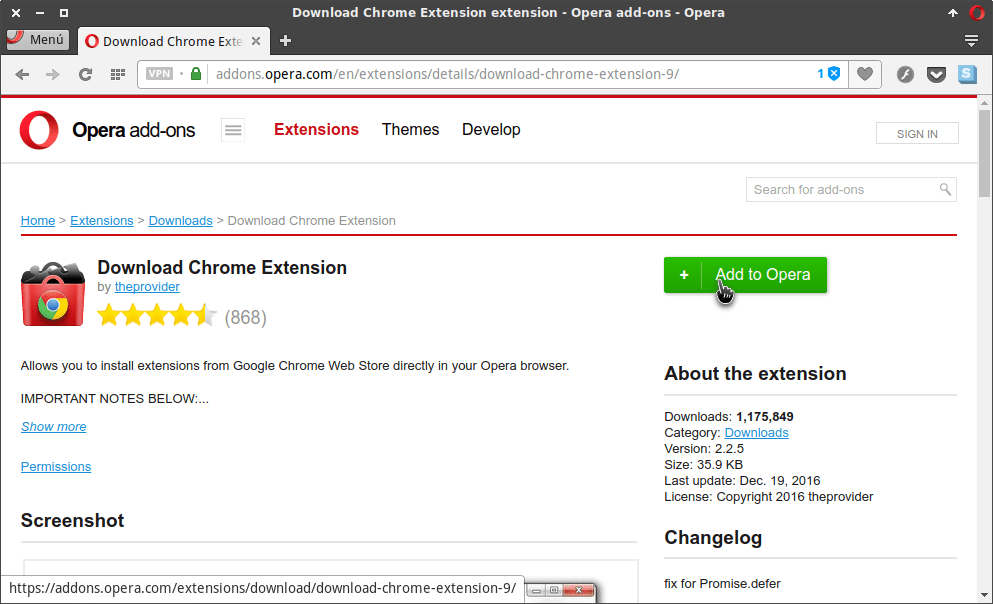
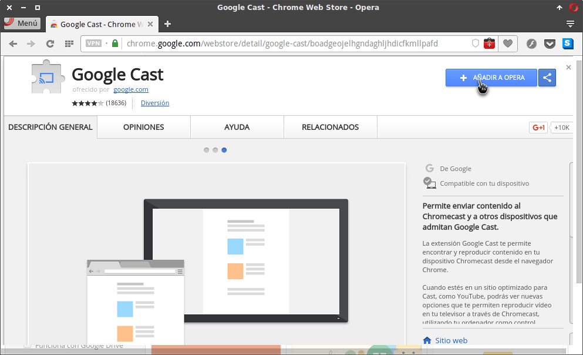
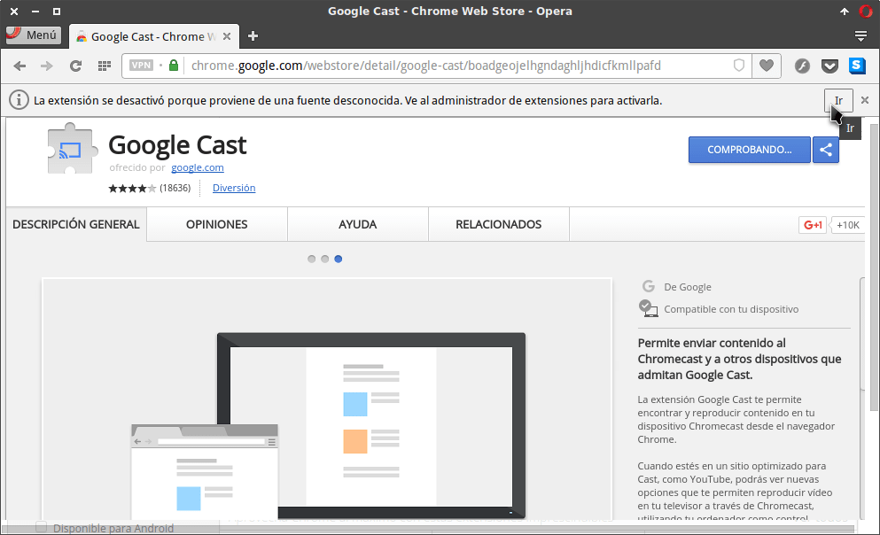
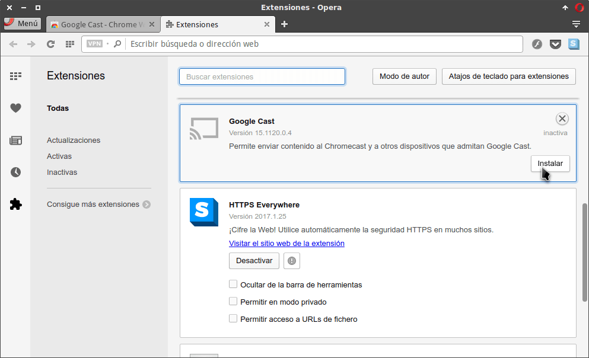

El navegador Opera dispone de bastantes extensiones, pero es posible que existan casos en que busquemos una determinada extensión y no exista. Por este motivo a continuación veremos un método para poder instalar extensiones de Chrome en Opera de forma muy sencilla.<!--more-->

Algunos casos en los que echemos de menos las extensiones de Chrome pueden ser los siguientes:

1. En Opera no está disponible la extensión Google Cast para poder lanzar contenido a Chromecast.
2. En Opera que yo sepa no existen extensiones tipo Mercury Reader para poder leer páginas web sin anuncios y sin distracciones.
3. Etc.

Una vez finalizada la introducción podemos pasar a ver el proceso a seguir para  instalar las extensiones de Chrome en Opera.

## INSTALAR DOWNLOAD CHROME EXTENSION

El primer paso a realizar es instalar la extensión Download Chrome extension. Para ello clicamos encima de la siguiente URL:

[https://addons.opera.com/en/extensions/details/download-chrome-extension-9/?display=en](https://addons.opera.com/en/extensions/details/download-chrome-extension-9/?display=en "Link para acceder a la URL de instalación de Download Chrome extension")

Una vez dentro de la URL instalamos la extensión clicando encima del botón Add to Opera.

## INSTALAR EXTENSIONES DE CHROME EN OPERA

En estos momentos accedemos a la Chrome Webstore. Para ello clicamos encima de la siguiente URL:

[https://chrome.google.com/webstore/category/extensions](https://chrome.google.com/webstore/category/extensions "Link para acceder a la Chrome Store")

Dentro de la Chrome webstore buscamos la extensión que queremos instalar que en mi caso es Google Cast. Una vez encontrada presionamos encima del botón Añadir a Opera.

A continuación nos aparecerá un mensaje de advertencia indicando que la extensión se ha desactivado porque estamos instalando una extensión de una fuente desconocida. Para activar la extensión tendremos que presionar encima del botón Ir en el mensaje de advertencia.

Finalmente activaremos la extensión clicando encima del botón Instalar.

Una vez instalada la extensión ya podré ver vídeos de Youtube o Netflix en mi televisor sin ningún tipo de problema usando el navegador Opera.

## LIMITACIONES DEL MÉTODO MOSTRADO EN EL ARTÍCULO

Este método sirve para instalar y usar extensiones de Chrome en Opera. Este método no es válido para poder usar Apps o temas de Chrome en Opera.

La gran mayoría de extensiones funcionan a la perfección. No obstante existen casos en que algunas funcionalidades de una extensión no funcionan de forma adecuada.

A modo de ejemplo la extensión Google Cast me permite ver vídeos de Youtube o Netflix sin problema alguno, pero no me permite compartir pestañas de mi navegador al televisor.
