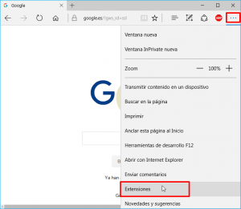
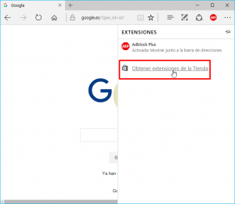
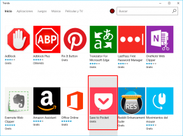
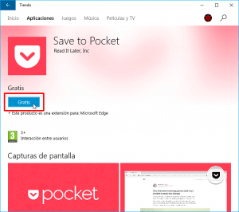
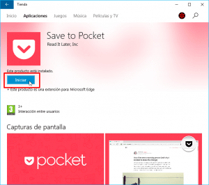
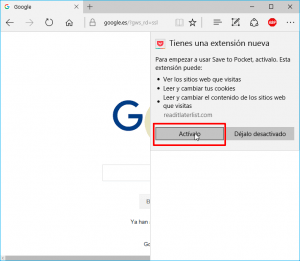
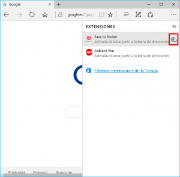
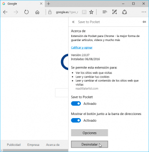
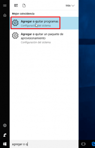
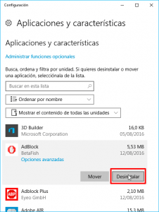

Desde la llegada de la actualización de Windows 10 aniversario, el navegador Microsoft Edge permite instalar extensiones del mismo modo que lo hacen Chrome, Firefox u Opera.

El procedimiento para instalar extensiones es realmente simple. Tan solo tenemos que seguir los siguientes pasos:<!--more-->

## ACCEDER A LAS EXTENSIONES DISPONIBLES PARA INSTALAR

Abrimos el navegador Microsoft Edge. Una vez abierto clicamos encima de los 3 puntos de la parte superior derecha. Seguidamente se abrirá un menú en el que deberemos clicar encima de la opción **Extensiones**.

A continuación tenemos que clicar encima de la opción **Obtener extensiones de la Tienda**.

Después de clicar encima de la opción se abrirá la tienda de Windows en la que podremos ver la totalidad de extensiones disponibles.

###### Nota: En la actualidad existen pocas extensiones y la gran mayoría están en estado Beta. No obstante las extensiones existentes son de suma utilidad ya que entre ellas se encuentran Adblock, Last Pass, Pocket, etc.

### Instalar extensiones que precisemos en Edge

Buscamos la extensión que queremos instalar, que en mi caso es Save to Pocket, y clicamos encima de ella.

Finalmente presionamos encima del botón **Gratis** y la extensión se descargará e instalará.

Así de fácil es instalar extensiones en Microsoft Edge.

### Activar la extensión que acabamos de instalar

Una vez instalada la extensión presionamos encima del botón **Iniciar**.

Seguidamente se abrirá Microsoft Edge con un menú desplegable informativo que acabamos de instalar la extensión. En el menú desplegable presionamos sobre el botón **Actívalo**.

Después de presionar encima del botón la extensión se activará y podremos empezar a usarla.

## CONFIGURAR Y GESTIONAR LAS EXTENSIONES INSTALADAS

Una vez instalada y activada la extensión es posible que necesitemos configurarla. Para ello clicamos encima de los 3 puntos de la parte superior derecha. Seguidamente se abrirá un menú en el que deberemos clicar encima de la opción **Extensiones**.

A continuación aparecerán la totalidad de extensiones instaladas. Tal y como se puede ver en la captura de pantalla, nos ubicamos encima de la extensión que queremos configurar y presionamos encima del icono de configuración.

Finalmente aparecerá un menú en el que podremos configurar y gestionar la extensión en cuestión.

A modo de ejemplo, las opciones de configuración que nos ofrece Save to Pocket son las siguientes:

1. Activar y desactivar la extensión
2. Mostrar el botón de pocket en la barra de Edge para guardar páginas de forma instantánea.
3. Si clicamos encima del botón opciones encontraremos más opciones de configuración para la extensión como por ejemplo configurar un atajo de teclado para guardar contenido en Pocket, etc.
4. Desinstalar la extensión.

De este modo tan simple podemos modificar la configuración de las extensiones y en caso que lo consideremos oportuno también las podemos desinstalar.

## DESINSTALAR EXTENSIONES EN MICROSOFT EDGE

Tal y como hemos visto en el apartado anterior, a partir de las opciones de configuración de cada una de las extensiones podemos ir desinstalándolas.

Otra opción disponible es desinstalar las extensiones a través del menú de **Aplicaciones y características**.

Para ello en el menú de búsqueda de Windows tecleamos **Agregar o quitar programas**. Una vez realizada la búsqueda clicamos encima de la opción **Agregar o quitar programas**.

Dentro del menú de aplicaciones y características buscamos la extensión que queremos desinstalar y clicamos sobre ella.

Finalmente tan solo tenemos que presionar encima del botón **Desinstalar**.

 Con estos simples pasos podremos instalar, configurar y desinstalar extensiones en Microsoft Edge de forma rápida y sencilla.
