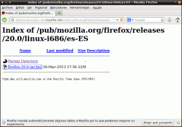
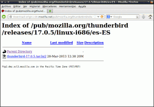
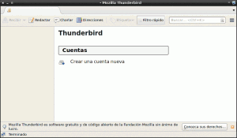
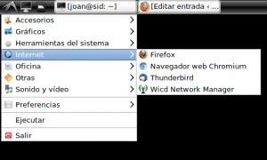
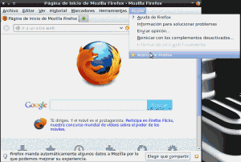
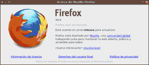

Hoy vamos a ver como instalar Firefox y Thunderbird en Debian fácilmente. Soy relativamente nuevo en Linux y hasta día de hoy siempre había usado Ubuntu pero gracias a Unity he descubierto que existen otras distros. Algo bueno tenia que tener Unity, no? Recientemente he decidido pasarme definitivamente a Debian en su rama testing con el escritorio XFCE 4.8.<!--more-->

Al principio vas un poco perdido y hay bastantes cosas que se echan de menos, pero poco a poco vas encontrando solución a cada uno de los problemas. Uno de estos problemas es que hecho de menos Firefox y Thunderbird. Usaría Icedove pero la verdad es que aunque lo instales de la rama experimental van varias versiones por detrás. Por lo tanto una solución para instalar Firefox y Thunderbird rápida e ideal para principiantes es usar los repositorios de Linux Mint Debian. Otra solución muy fácil y efectiva es descargar los binarios e instalarlos. Por lo tanto para instalar Firefox y Thunderbird en Debian podemos proceder de las siguientes formas:

## MÉTODO 1: USAR LOS REPOSITORIOS DE LINUX MINT DEBIAN

###### Nota: Este método para instalar Firefox y Thunderbird solo es aconsejable para usuarios de Debian Testing. También se puede usar en distros derivadas de Debian Testing.

### Paso 1. Agregar los repositorios de Linux Mint

**Abrimos una terminal**

Tecleamos:

> ```
> sudo gedit /etc/apt/sources.list
> ```

###### Nota: Si no tienes instalado gedit usa el editor que uses habitualmente.

Pegamos el repositorio de LMDE en el archivo de texto que acabamos de abrir:

> ```
> deb http://packages.linuxmint.com debian import
> ```

Seguidamente descargamos el keyring del repositorio de Linux Mint Debian pegando el siguiente comando en la terminal:

> ```
> sudo wget http://packages.linuxmint.com/pool/main/l/linuxmint-keyring/linuxmint-keyring_2009.04.29_all.deb
> ```

Una vez finalizada la descarga instalamos el Keyring con el siguiente comando:

> ```
> sudo /home/tu_usuario dpkg ­-i linuxmint-­keyring_2009.04.29_all.deb
> ```

Ahora vamos a actualizar los repositorios:

> ```
> sudo apt-get update
> ```

### Paso 2. Instalar Firefox y Thunderbird

Para finalizar ya podemos proceder a la instalación. Para instalar Thunderbird tecleamos:

> ```
> sudo apt-get install thunderbird thunderbird-­l10n­-es
> ```

Para instalar Firefox tecleamos:

> ```
> sudo apt-get install firefox firefox-l10n-es
> ```

La aplicación de esta solución no debe suponer futuros problemas de estabilidad si estas usando la rama Testing the Debian. Solo hay que seguir estos pasos para instalar Firefox y Thunderbird satisfactoriamente. Hay que tener en cuenta que Linux Mint Debian deriva y usa los mismos paquetes que Debian Testing.

## MÉTODO 2 A PARTIR DE LOS BINARIOS DE LOS PROGRAMAS

###### Nota: El método 2  para instalar Firefox y Thunderbird lo podemos usar en cualquier distribución Linux y no debe generar problemas.

En el caso de no querer mezclar repositorios de debian testing con repositorios de LMDE podéis optar por descargar los ficheros binarios tanto de Thunderbird como de Firefox. Con este método podremos instalar Firefox y Thunderbird en cualquier distro.

### Instalación de Firefox

En el caso que tengamos instalado Firefox o Thunderbird lo primero que tenemos que hacer es una copia de seguridad de los archivos de configuración de estas aplicaciones para prevenir problemas futuros.

Dentro de nuestra ~/home crearemos una carpeta con el nombre backups que albergará la copia de nuestros archivos de configuración de Thunderbird y/o Firefox. Para ello abrimos una terminal y tecleamos:

> ```
> mkdir ~/backups
> ```

Seguidamente copiamos el contenido de la carpeta .mozilla ubicada en nuestra home dentro de la carpeta backups que acabamos de crear. Esto lo podemos hacer con el siguiente comando:

> ```
> cp -avr ~/.mozilla/ ~/backups
> ```

Ahora ya podemos descargar el paquete binario tar.bz2 que contiene Firefox. Para ello copiamos el siguiente link en el navegador:

> ```
> http://download-origin.cdn.mozilla.net/pub/mozilla.org/firefox/releases/
> ```

Cuando se haya cargado la página tendremos que seleccionar la versión de Firefox que queremos descargar. En mi caso elegiré la última versión estable que en estos momentos es la **20.0/**.

Seguidamente tenemos que elegir la arquitectura. En el caso de disponer de una arquitectura de 32 bits tenéis que elegir la opción **linux-i686/**. En el caso de disponer de una arquitectura de 64 bits tendremos que elegir la opción **linux-x86\_64/**. Como en mi caso dispongo de una arquitectura de 32 bits elijo la opción **linux-i686/**.

Como paso final tenemos que elegir el idioma. En mi caso español de España que es la opción **es-ES/**.

Ahora como podéis ver en la captura de pantalla solamente nos falta dar un clic encima del paquete tar.bz2 para descargar Firefox.

[](images/Descargar-Firefox2.png)

Una vez descargado el paquete tenemos que descomprimir su contenido en la carpeta /opt. Esta operación la podemos hacer con el comando:

> ```
> sudo tar -jxvf firefox-20.0.tar.bz2 -C /opt
> ```

###### Nota: firefox-20.0.tar.bz2 se tiene que sustituir en función de la versión y nombre de paquete que hemos descargado.

###### Nota: En caso de no querer usar el comando se puede realizar manualmente abriendo nuestro gestor de ventanas en modo root.

Seguidamente crearemos un enlace simbólico del archivo ejecutable de Firefox al directerio /usr/bin/. Para ello en la terminal teclearemos el siguiente comando:

> **`sudo ln -s /opt/firefox/firefox /usr/bin/firefox`**

Una vez realizada esta operación ya podemos ejecutar Firefox. Para ello abrimos una terminal y tecleamos el comando:

> ```
> /opt/firefox/firefox
> ```

Y como podemos ver en la siguiente imagen Firefox se ejecuta sin problema alguno.

[](images/Firefox-instalado1.png)

Para tener que evitar arrancar Firefox vía terminal podemos crear un lanzador e incluirlo en el los menús de vuestra distro. Cada distro tiene diferentes métodos para crear sus lanzadores. Por lo tanto para que este post sea útil para todo el mundo crearé el lanzador con un método que sirve para cualquier distro.

Creamos un fichero de texto en la ubicación **/usr/share/applications** y lo guardamos con el nombre Firefox.desktop. Abrimos el fichero creado con un editor de textos y copiamos el siguiente texto:

\[_Desktop Entry\]_ _#Nombre de la aplicación_ _Name=Firefox_ _#Comentario que aparece al seleccionar el lanzador_ _Comment=Explorar la web_ _#Comando a ejecutar, generalmente el nombre de la aplicación_ _Exec=/opt/firefox/firefox_ _#Icono del lanzador, puede ser generico o especificar la ruta del mismo_ _Icon=/opt/firefox/browser/icons/mozicon128.png_ _#Para no abrir una terminal_ _Terminal=false_ _#Tipo de archivo_ _Type=Application_ _#Codificación del texto_ _Encoding=UTF-8_ _#Categoria de la aplicación_ Categories=Application;Network;WebBrowser; MimeType=text/html;text/xml;application/xhtml+xml;application/xml;application/vnd.mozilla.xul+xml;application/rss+xml;application/rdf+xml;image/gif;image/jpeg;image/png; StartupWMClass=Firefox-bin StartupNotify=true

Guardamos el archivo, y como se puede ver en la imagen en el menú ya nos aparecerá el icono de Firefox.

[](images/Accesos-directos2.png)

### Instalación de Thunderbird

El procedimiento de instalación de Thunderbird es prácticamente idéntico al de Firefox. Por lo tanto esta parte repite el mismo proceso que se acaba de describir.

En el caso que tengamos instalado Firefox o Thunderbird lo primero que tenemos que hacer es una copia de seguridad de los archivos de configuración de estas aplicaciones para prevenir problemas futuros.

Dentro de nuestra ~/home crearemos una carpeta con el nombre backups que albergará la copia de nuestros archivos de configuración de Thunderbird y/o Firefox. Para ello abrimos una terminal y tecleamos:

> ```
> mkdir ~/backups
> ```

Seguidamente copiamos el contenido de la carpeta .mozilla ubicada en nuestra home dentro de la carpeta backups que acabamos de crear. Esto lo podemos hacer con el siguiente comando:

> ```
> cp -avr ~/.mozilla/ ~/backups
> ```

Ahora ya podemos descargar el paquete binario tar.bz2 que contiene Thunderbird. Para ello copiamos el siguiente link en el navegador:

> ```
> http://download-origin.cdn.mozilla.net/pub/mozilla.org/thunderbird/releases/
> ```

Cuando se haya cargado la página tendremos que seleccionar la versión de Thunderbird que queremos descargar. En mi caso la última versión estable que en estos momentos es la **17.0.5/**.

###### Nota: Observareis que también existe una versión llamada 17.0.5esr/. Esta seria la versión Extended release support. Esta versión es ideal para empresas o universidades. En el caso de ser un usuario normal es mejor instalar la versión estandard ya que dispondrá de las últimas funcionalidades y novedades.

Seguidamente tenemos que elegir la arquitectura. En el caso de disponer de una arquitectura de 32 bits tenéis que elegir la opción **linux-i686/**. En el caso de disponer de una arquitectura de 64 bits tendremos que elegir la opción **linux-x86\_64/**. Como en mi caso dispongo de una arquitectura de 32 bits elijo la opción **linux-i686/**.

Como paso final tenemos que elegir el idioma. En mi caso español de España que es la opción **es-ES/**.

Ahora como podéis ver en la captura de pantalla solamente nos falta dar un clic encima del paquete tar.bz2 para descargar Thunderbird.

[](images/Descargar-Thunderbird1.png)

Una vez descargado el paquete tenemos que descomprimir su contenido en la carpeta /opt. Esta operación la podemos hacer con el comando:

> ```
> sudo tar -jxvf thunderbird-17.0.5.tar.bz2 -C /opt
> ```

###### Nota: thunderbird-17.0.5.tar.bz2 se tiene que sustituir en función de la versión y nombre de paquete que hemos descargado.

###### Nota: En caso de no querer usar el comando se puede realizar manualmente abriendo nuestro gestor de ventanas en modo root.

Seguidamente crearemos un enlace simbólico del archivo ejecutable de Firefox al directerio /usr/bin/. Para ello en la terminal teclearemos el siguiente comando:

> **``**`sudo ln -s /opt/thunderbird/thunderbird /usr/bin/thunderbird`**``**

Una vez realizada esta operación ya podemos ejecutar Thunderbird. Para ello abrimos una terminal y tecleamos el comando:

> ```
> /opt/thunderbird/thunderbird
> ```

Y como podemos ver en la siguiente imagen Thunderbird se ejecuta sin problema alguno.

[](images/Thunderbird-Instalado1.png)

Para tener que evitar arrancar Thunderbird vía terminal podemos crear un lanzador e incluirlo en el los menús de vuestra distro. Cada distro tiene diferentes métodos para crear sus lanzadores. Por lo tanto para que este post sea útil para todo el mundo crearé el lanzador con un método que sirve para cualquier distro.

Creamos un fichero de texto en la ubicación **/usr/share/applications** y lo guardamos con el nombre Thunderbird.desktop. Abrimos el fichero con un editor de textos y copiamos el siguiente texto:

_\[Desktop Entry\]_ _#Nombre de la aplicación_ _Name=Thunderbird_ _#Comentario que aparece al seleccionar el lanzador_ _Comment=Gestor de Correo_ _#Comando a ejecutar, generalmente el nombre de la aplicación_ _Exec=/opt/thunderbird/thunderbird_ _#Icono del lanzador, puede ser generico o especificar la ruta del mismo_ _Icon=/opt/thunderbird/chrome/icons/default/default256.png_ _#Para no abrir una terminal_ _Terminal=false_ _#Tipo de archivo_ _Type=Application_ _#Codificación del texto_ _Encoding=UTF-8_ _#Categoria de la aplicación_ Categories=Application;Network;MailClient;Email;News;GTK; MimeType=message/rfc822; StartupWMClass=Thunderbird-bin StartupNotify=true

Guardamos el archivo, y como se puede ver en la imagen en el menú ya nos aparecerá el icono de Thunderbird.

[](images/Accesos-directos11.png)

## COMO TENEMOS QUE ACTUALIZAR FIREFOX Y THUNDERBIRD

Seguidamente detallamos los métodos de actualización que tenemos con Firefox y Thunderbird. En el caso que hayas elegido instalar Firefox y/o Thunderbird a través de los repositorios de Linux Mint Debian (**Método 1**) tan solo tenemos que esperar que nos vayan entrando las actualizaciones. No obstante las actualizaciones no llegan al mismo ritmo que en LMDE. Con el tiempo he observado que solo entran actualizaciones cada 3 o 4 meses. Así por lo tanto si tienes la versión 20 de Firefox instalada puede que no vuelva a entrar una actualización hasta la versión 23.

Otra opción de actualización que será **válida tanto para el método 1 como para el método 2** será actualizar las aplicaciones a través del sistema de actualizaciones que traen tanto Firefox como Thundebird. Para actualizar tenemos que abrir una terminal y arrancar la aplicación que queramos actualizar en modo root. Los comandos para realizar esto son:

> ```
> sudo firefox
> ```

o

> ```
> sudo thunderbird
> ```

Una vez arrancada cualquiera de las 2 aplicaciones tenemos que ir al menú ayuda y después elegir la opción acerca de Firefox o acerca de Thunderbird. Este proceso lo podéis ver en la siguiente captura de pantalla:

[](images/Actualizar-Firefox.png)

Una vez la opción acerca de Thunderbird o Acerca de Firefox se abrirá la siguiente ventana:

[](images/Acerca-de-Mozilla-Firefox_002.png)

Justo al abrirse la ventana se realizará la comprobación de si estamos usando la última versión del software o no. En el caso de usar la última versión del software, como podéis ver en la captura de pantalla, aparecerá la frase Firefox/Thunderbird está actualizado. En el caso que no tengamos la última versión instalada nos dará la opción de actualizar. Le decimos que si y tan solo tenemos que esperar a que termine la actualización.
