En el siguiente artículo veremos la totalidad de pasos a seguir para buscar e instalar fuentes tipográficas en Linux y particularmente en Debian.

Además veremos los motivos por los cuales es útil saber como podemos instalar fuentes adicionales en nuestro sistema operativo.<!--more-->

## SITIOS O MÉTODOS PARA PODER ENCONTRAR FUENTES ADICIONALES

Algunos de los métodos o medios para poder obtener fuentes tipográficas adicionales son los siguientes:

### De los repositorios de nuestra distribución

En los repositorios de nuestra distribución existen varios paquetes que podemos instalar y añaden fuentes adicionales a nuestro sistema operativo y a nuestros programas.

En apartados posteriores veremos como podemos instalar fuentes a partir de los repositorios de nuestro distro.

### De páginas web que ofrecen la descarga de fuentes a sus lectores

Hay multitud de páginas web que ofrecen fuentes para poder ser instaladas en nuestro sistema operativo.

Algunas de las páginas Web que nos ofrecen fuentes de forma gratuita son las siguientes:

- [https://www.fontsquirrel.com/](https://www.fontsquirrel.com/)
- [http://www.fontspace.com/](http://www.fontspace.com/)
- [http://www.grsites.com/archive/fonts/](http://www.grsites.com/archive/fonts/)
- [http://www.dafont.com/](http://www.dafont.com/)
- [http://www.fontreactor.com](http://www.fontreactor.com)
- [https://fonts.google.com/](https://fonts.google.com/)
- [http://es.ffonts.net](http://es.ffonts.net)
- etc

###### Nota: Dentro de cada una las páginas web se indicará si la fuente a descargar es Libre o no.

###### Nota: En cada una de las páginas web se clasifican las categorías de forma que nos sea más fácil encontrar la tipografía que estamos buscando.

### Extraerlas directamente de un sistema operativo

Finalmente también es posible extraer fuentes de sistemas operativos, como por ejemplo Windows y Ubuntu, e instalarlas en nuestra distribución favorita.

A lo largo de este post veremos como lo podemos hacer de forma rápida y sencilla.

## ALGUNOS TIPOS DE FUENTES EXISTENTES

En Linux podemos instalar varios tipos de fuentes. Los tipos de fuentes más habituales que encontraremos son los siguientes:

### Fuentes TrueType (ttf):

Son las más habituales y se pueden utilizar en Linux, en Windows y en Mac OS. Las reconocerán fácilmente porque cuando las descarguen verán tienen el formato **ttf**.

Este tipo de de formato de fuente fue originariamente creado por Apple, y a posteriori Microsoft adquirió una licencia de uso. Esto ha hecho que en la actualidad las fuentes ttf sean ampliamente usadas en Microsoft Windows.

### Fuentes PostScript tipo 1 (pbf + pfm)

Las fuentes Postscript fueron desarrolladas por Adobe para utilizarse en impresoras PostScipt.

Al igual que las TrueType y las OpenType, son escalables a prácticamente cualquier tamaño y se utilizan mayoritariamente para realizar impresiones de alta calidad, como por ejemplo revistas y libros, por ser fuentes detalladas, suaves y de alta calidad. Por lo tanto este tipo de fuentes es ampliamente usada por los diseñadores gráficos.

Cada fuente se almacena en 2 archivos. El primero de ellos es con la extensión **.pfb** y el segundo con la extensión **.pfm**.

### Fuentes OpenType (otf)

Formato de tipografía basado en las fuentes TrueType.

Las fuentes OpenType han sido creadas por Microsoft y Adobe de forma conjunta para reemplazar los formatos TrueType y PostScript.

Este tipo de fuentes son una evolución del formato de fuentes TrueType y Postscript, y las reconocerán fácilmente porque cuando las descarguen verán que tienen el formato **otf**.

## PROCEDIMIENTOS PARA INSTALAR FUENTES EN GNU/LINUX

Los distintos métodos que podemos usar en GNU/Linux para instalar fuentes se detallan a continuación.

### Instalar fuentes de los repositorios de nuestra distribución

En los repositorios de nuestra distribución tenemos muchos paquetes que si los instalamos nos ofrecerán fuentes tipográficas adicionales.

La totalidad de paquetes relacionados con fuentes tipográficas de Debian se pueden consultar en los siguientes enlaces:

**_Debian Estable_** [https://packages.debian.org/stable/fonts/](https://packages.debian.org/stable/fonts/)

**_Debian Testing_** [https://packages.debian.org/testing/fonts/](https://packages.debian.org/testing/fonts/)

**_Debian Sid_** [https://packages.debian.org/sid/fonts/](https://packages.debian.org/sid/fonts/)

Algunos de los paquetes presentes en una distribución Linux que considero útiles instalar son los siguientes:

#### Instalar las fuentes de Microsoft

En el caso que queramos o tengamos necesidad de instalar algunas de las fuentes de Microsoft, tan solo tenemos que abrir una terminal y ejecutar el siguiente comando:

> ```
> sudo apt-get install ttf-mscorefonts-installer
> ```

Una vez instalado el paquete ttf-mscorefonts-installer pasaremos a disponer de las siguientes fuentes:

> ```
> Andale Mono, Arial Black, Arial, Comic Sans MS, Courier New, Georgia, Impact, Times New Roman, Trebuchet, Verdana, Webdings.
> ```

La totalidad de fuentes mencionadas son fuentes privativas que se hallan en el repositorio Contrib de Debian.

Para disponer de variantes libres de las tipografías Times, Arial y Courier, etc pueden instalar el paquete **fonts-liberation** ejecutando el siguiente comando en la terminal:

> ```
> sudo apt-get install fonts-liberation
> ```

#### Instalar otras fuentes

Finalmente para disponer de más tipografías también aconsejo instalar los siguientes paquetes ejecutando el siguiente comando en la terminal:

> ```
> sudo apt-get install fonts-dejavu fonts-freefont-ttf ttf-bitstream-vera fonts-freefont-otf fonts-lyx xfonts-100dpi xfonts-75dpi texlive-extra-utils texlive-math-extra texlive-fonts-extra texlive-fonts-utils texlive ttf-aenigma fonts-roboto-hinted fonts-roboto-unhinted
> ```

Si quieren inspeccionar paquetes de fuentes dentro de vuestros repositorios, les recomiendo que hagan búsquedas de paquetes por las siguientes palabras:

1. ttf
2. otf
3. fonts
4. postscript fonts
5. etc

[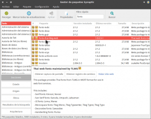](images/Búsqueda-de-fuentes-en-Synaptic.png)

###### Nota: Este apartado es válido para usuarios de la distribución Debian testing. En el caso de usar otras distros es posible que los paquetes mencionados no estén disponibles o tengan otro nombre.

### Instalar fuentes de Google

Para instalar las fuentes de Google en nuestro sistema operativo tan solo tenemos que instalar el programa **Typecatcher** ejecutando el siguiente comando en la terminal:

> ```
> sudo apt-get install typecatcher
> ```

Una vez instalado el programa lo abrimos, seleccionamos la fuente que queremos instalar y presionamos el botón **Descargar tipografía**

 [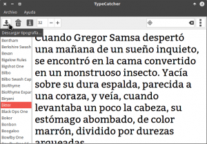](images/Instalar-fuentes-de-Google-con-Typecatcher.png)

Después de presionar el botón se descargará y se instalará la fuente de forma automática.

Si algún día queremos desinstalar la fuente que acabamos de instalar, tan solo tenemos que seleccionarla de nuevo y presionar el botón de **Desinstalar tipografía**

[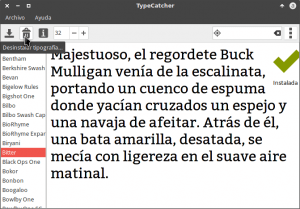](images/Desinstalar-Fuente-de-Google-con-Typecatcher.png.png)

### Instalar fuentes de forma manual para todos los usuarios de un equipo

Para instalar otros tipos de fuente de forma manual podemos usar varios métodos. Incluso existen distribuciones, como por ejemplo KDE Plasma, en las que podemos instalar una fuente simplemente haciendo doble clic sobre el archivo de la fuente.

No obstante un método de instalación que funcionará en todos los escritorios y para todos los usuarios del equipo es el siguiente:

Inicialmente podemos visitar una de las web mencionadas al inicio del post para descargar una fuente que sea de nuestro agrado. En mi caso he descargado la familia de fuentes **Alien Encounters**.

Una vez descargada la fuente, o familia de fuentes, abrimos nuestro gestor de archivos en modo root ejecutando el siguiente comando en la terminal:

> ```
> gksudo thunar
> ```

###### Nota: En vuestro caso deberéis reemplazar thunar por el nombre del gestor de archivos que uséis

Copiamos la fuente que queremos instalar.

 [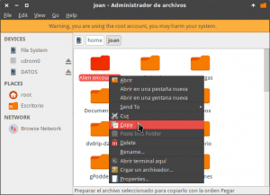](images/Copia-la-familia-de-fuentes.png)

A continuación navegamos dentro de la ubicación **/usr/share/fonts**

[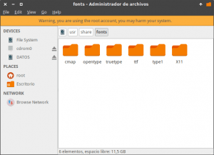](images/Contenido-de-la-carpeta-Fonts.png)

Como la fuente que quiero instalar es del tipo del tipo TrueType, accedo dentro de la carpeta TrueType y pego la familia de fuentes que había copiado inicialmente.

[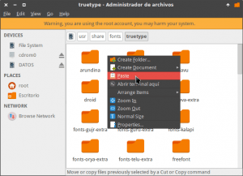](images/Pegar-la-familia-en-la-carpeta-fonts.png)

###### Nota: Si fuera una fuente del Tipo OpenType o Postcript pegaríamos la fuente o familia de fuentes dentro de su carpeta correspondiente para de este modo tener las fuentes bien clasificadas. En el caso que sea necesario, nosotros mismos podemos crear las carpetas que creamos pertinentes.

Finalmente tan solo tenemos recargar la lista de fuentes ejecutando el siguiente comando en la terminal:

> ```
> sudo fc-cache -f -v
> ```

La próxima vez que abramos un programa podremos usar la fuente instalada sin ningún tipo de problema.

[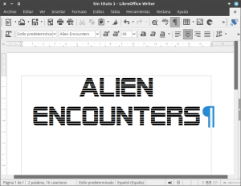](images/Muestra-de-uso-de-las-fuentes-instaladas.png)

###### Nota: Las fuentes instaladas en este apartado serán disponibles para todos los usuarios. Si queremos que únicamente estén disponibles para nuestro usuario deberemos aplicar el mismo método, pero en vez de pegar las tipografías en /usr/share/fonts las deberemos pegar en la ubicación ~/.fonts

### Instalar fuentes de Windows en Linux

El proceso para instalar fuentes de Windows en Linux es extremadamente sencillo.

Abrimos el explorador de archivos de Windows y accedemos a la ubicación **C:/Windows/fonts**

[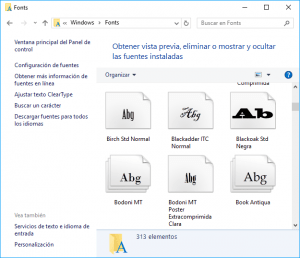](images/Contenido-del-carpeta-Fonts-en-Windows.png)

Tal y como pueden ver en la captura de pantalla, en esta carpeta hay absolutamente todas las fuentes de nuestro sistema operativo Windows.

Una vez dentro de la carpeta copiamos la totalidad de fuentes que necesitamos en un Pendrive.

[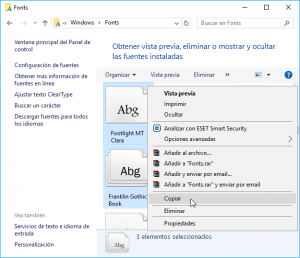](images/Copiar-fuentes-de-Windows.png)

Una vez copiadas arrancamos nuestro sistema operativo Linux y abrimos nuestro gestor de archivos en modo root ejecutando el siguiente comando en la terminal:

> ```
> gksudo thunar
> ```

A continuación navegamos dentro de la ubicación **/usr/share/fonts**

[](images/Contenido-de-la-carpeta-Fonts.png)

Como las fuentes que quiero instalar son del tipo TrueType, accedo dentro de la carpeta ttf y pego las fuentes que grabe en el pendrive.

[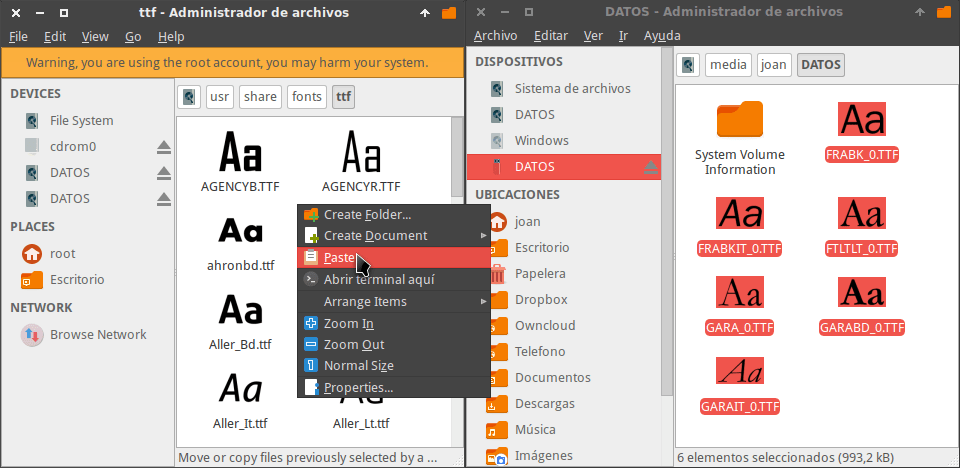](images/Instalar-fuentes-de-Windows-a-Linux.png)

Finalmente tan solo tenemos recargar la lista de fuentes ejecutando el siguiente comando en la terminal:

> ```
> sudo fc-cache -f -v
> ```

De este modo podremos usar cualquiera de las fuentes de Windows en Linux. Esto incluye letras como por ejemplo la Calibri.

###### Nota: El procedimiento a seguir para instalar fuentes de otros sistemas operativos diferentes a Windows es el mismo. Tan solo tenemos que localizar la carpeta en en la que se almacenan las fuentes, copiarlas y finalmente pegarlas dentro de la ubicación /usr/share/fonts del sistema operativo Linux.

### Instalar fuentes a partir de software de terceros

Existen varios programas que mediante una interfaz gráfica nos permitirán visualizar, gestionar, instalar y desinstalar fuentes de forma fácil e intuitiva.

Algunos de los programas que podemos usar son los siguientes:

1. font-manager
2. gnome-specimen
3. fontmatrix
4. fontypython

En este artículo solo mostraremos de forma breve el uso del programa font-manager.

#### Instalar font-manager

Para instalarlo tan solo tienen que ejecutar el siguiente comando en la terminal:

> ```
> sudo apt-get install font-manager
> ```

En el caso de ser usuarios de Ubuntu pueden instalarlo ejecutando los siguientes comandos en la terminal:

> ```
> sudo add-apt-repository ppa:font-manager/staging
> 
> sudo apt-get update
> 
> sudo apt-get install font-manager
> ```

#### Instalar fuentes con Font-Manager

Una vez finalizada la instalación abrimos el programa, clicamos encima del icono **Gestionar fuentes** y cuando aparezca el submenu clicamos en la opción **Install Fonts**.

[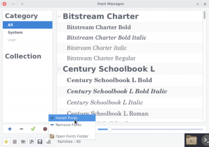](images/Instalar-fuentes-con-Font-manager.png)

Seguidamente seleccionamos las fuentes que queremos instalar y presionamos el botón **Aceptar**.

[](images/Seleccionar-las-fuentes-para-instalar.png)

Finalmente presionaremos el botón **Reload Now** para recargar el listado de fuentes.

[](images/Recargar-las-fuentes-con-Front-manager.png)

Después de realizar estos simples pasos podremos abrir el programa que queramos y usar las fuentes que acabamos de instalar.

###### Nota: Este programa únicamente instala las fuentes para un usuario en particular ya que instala las fuentes en el directorio ~/.fonts

## SACAR UN LISTADO DE LA TOTALIDAD DE FUENTES INSTALADAS EN NUESTRO EQUIPO

En el caso que precisen sacar un listado de la totalidad de fuentes instaladas, pueden ejecutar el siguiente comando en la terminal:

> ```
> fc-list
> ```

Si lo que quieren es obtener un fichero de texto con la totalidad de fuentes instaladas pueden ejecutar el siguiente comando en la terminal:

> ```
> fc-list >fuentes_instaladas.txt
> ```

## SITUACIONES EN LAS QUE PUEDE SER NECESARIO INSTALAR FUENTES

En numerosas situaciones puede ser necesario instalar fuentes adicionales en nuestro equipo. Algunas de ellas son las siguientes:

1. Si visualizamos una página web que tiene una fuente no disponible en nuestro equipo se visualizará de forma incorrecta y se verá fea.
2. En ocasiones nos enviarán presentaciones de Powerpoint o de Impress que no se podrán visualizar de forma correcta porque no tenemos la fuente correcta instalada en nuestro ordenador.
3. Si somos diseñadores gráficos tendremos más opciones para elegir la fuente adecuada en función del trabajo a realizar.
4. La típica ocasión en la que realizamos un trabajo de grupo y todos los integrantes del grupo se ponen de acuerdo para escribir el documento con el tipo de letra Calibri.

Para finalizar solo decirles que con la aplicación de los consejos mencionados en este post podremos instalar las fuentes que necesitamos para cumplir la totalidad de nuestras necesidades.
