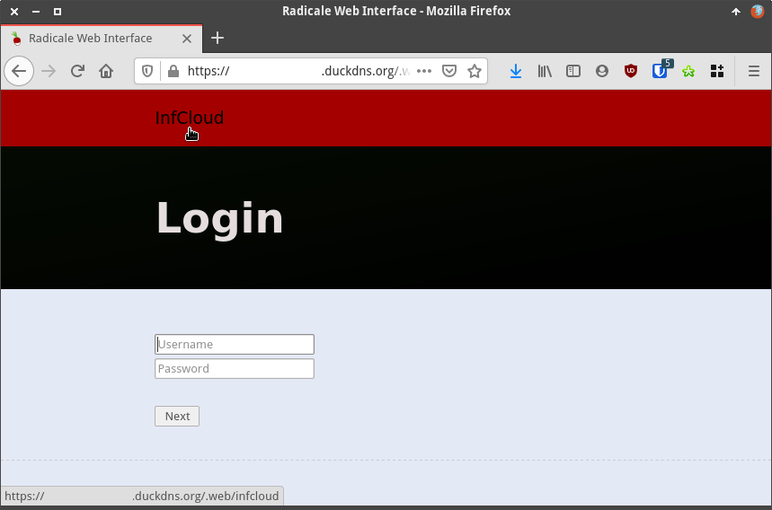
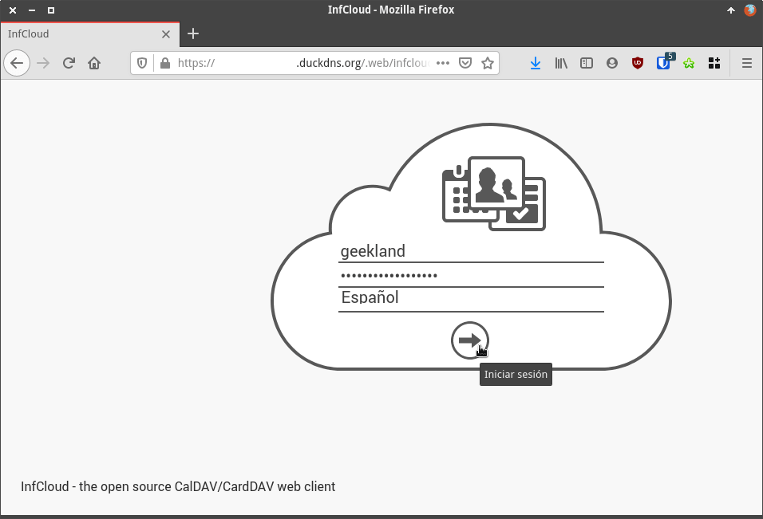
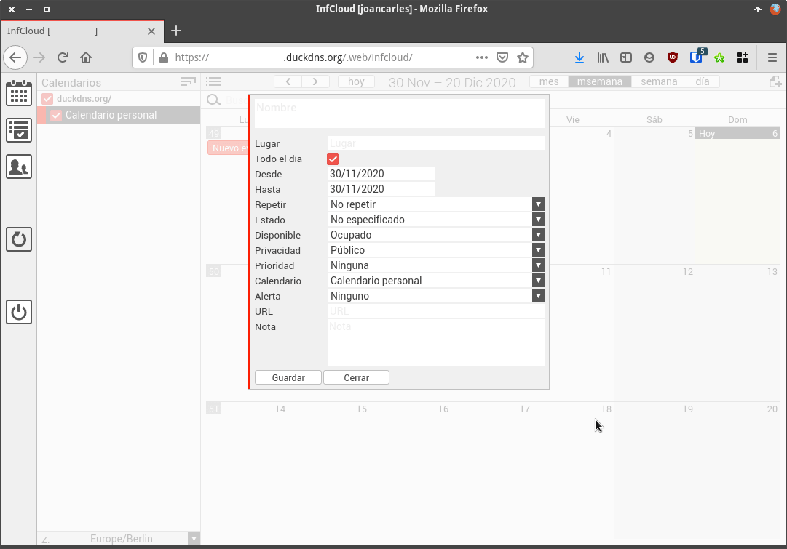

Si estamos usando Radicale y queremos gestionar nuestros calendarios, contactos y tareas vía el navegador web deberemos instalar InfCloud. Si estamos corriendo Radicale en Docker tendremos que seguir el siguiente proceso para instalar InfCloud.<!--more-->

**Nota**: Antes de seguir las instrucciones que verán a continuación es necesario instalar Radicale tal y como se muestra en el siguiente enlace:

https://geekland.eu/gestionar-contactos-calendarios-tareas-con-radicale/

## INSTALAR Y CONFIGURAR EL CLIENTE WEB INFCLOUD PARA ADMINISTRAR NUESTROS CONTACTOS, TAREAS Y CALENDARIOS VÍA NAVEGADOR WEB

El primer paso consistirá en acceder dentro del contenedor en que estamos corriendo Radicale. Para ello ejecutaremos el siguiente comando en la terminal:

> ```shell
> ubuntu@ubuntu-20-04:~$ docker exec -it radicale bash
> ```

Una vez dentro del contenedor instalaremos InfCloud ejecutando el siguiente comando:

> ```shell
> bash-5.0# python3 -m pip install git+https://github.com/Unrud/RadicaleInfCloud
> ```

### Configurar el cliente web InfCloud

Acto seguido configuraremos InfCloud. Para ello accederemos a su fichero de configuración ejecutando el siguiente comando:

> ```shell
> bash-5.0# vi ./usr/lib/python3.7/site-packages/radicale_infcloud/web/config.js
> ```

**Nota**: La ruta del fichero config.js se puede hallar fácilmente mediante la utilidad find.

Una vez dentro del fichero de configuración localizaremos las siguientes líneas:

> ```shell
> var globalInterfaceLanguage='en_US';
> var globalTimeZonesEnabled=[];
> ```

Y las reemplazamos por las siguientes:

> ```shell
> var globalInterfaceLanguage='es_ES';
> var globalTimeZonesEnabled=['Europe/Madrid'];
> ```

**Nota**: En mi caso he configurado el Español de España como idioma predeterminado.

A continuación guardamos los cambios y cerraremos el fichero. Finalmente borraremos el historial de la terminal y saldremos del contenedor ejecutando los siguientes comandos:

> ```shell
> bash-5.0# history -c
> bash-5.0# exit
> ```

### Modificar la configuración de Radicale para poder acceder a InfCloud

Seguidamente accederemos el fichero de configuración de Radicale ejecutando el siguiente comando:

> ```shell
> ubuntu@ubuntu-20-04:~$ nano services/radicale/config/config
> ```

Una vez se abra el editor de textos nano añadiremos el código `type = radicale_infcloud` dentro de la sección web.

> **`[web]  # Web interface backend # Value: none | internal #type = internal type = radicale_infcloud`**

Finalmente guardaremos los cambios, cerraremos el fichero y reiniciaremos el contenedor Docker de Radicale ejecutando el siguiente comando en la terminal:

> ```shell
> ubuntu@ubuntu-20-04:~$ docker restart radicale
> ```

## COMO ADMINISTRAR NUESTROS CONTACTOS, CONTRASEÑAS Y TAREAS CON INFCLOUD

Para administrar nuestros contactos, tareas y calendarios con InfCloud procederemos del siguiente modo.

### Acceder al panel de administración de InfCloud

Lo primero que tenemos que realizar es acceder a la pantalla de Login de Radicale. Una vez allí verán que en la parte superior de la pantalla aparece la palabra InfCloud. Para acceder a InfCloud tan solo tendremos que clicar encima de ella.

[](images/acceder-al-cliente-infcloud-via-web.png)

**Nota:** Otra opción de acceder de forma directa a la pantalla de login de InfCloud es ingresar la URL de acceso a Radicale seguido de `infcloud/`

Acto seguido podrán ver la pantalla de login de InfCloud. Cuando la vean tan solo tendrán que introducir el usuario y contraseña de Radicale y presionar encima del botón Iniciar sesión.

[](images/pantalla-de-login-de-infcloud.png)

### Gestionar contactos, calendarios y tareas de Radicale con InfCloud

Finalmente accederán al cliente InfCloud. Una vez allí podrán gestionar los calendarios, contactos y tareas de forma fácil, rápida e intuitiva.

[](images/gestionar-contactos-tareas-y-calendarios-con-infcloud.png)

#### Fuente

[https://github.com/Unrud/RadicaleInfCloud](https://github.com/Unrud/RadicaleInfCloud)

[https://www.inf-it.com/open-source/clients/infcloud/](https://www.inf-it.com/open-source/clients/infcloud/)
