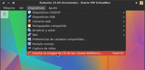
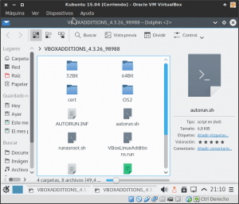
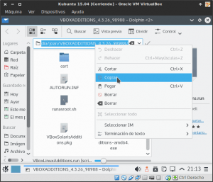
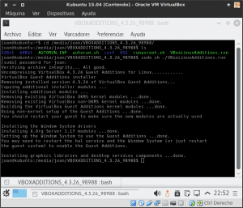

En mi caso cada vez que me dispongo a instalar las Guest Additions, busco un tutorial en Internet y voy siguiendo los pasos uno por uno. No obstante casi nunca acostumbro a encontrar un tutorial que incluya la totalidad de pasos necesarios, y por lo tanto siempre acostumbro a tener problemas para instalarlas. A raíz de esta experiencia negativa, en el siguiente post explico de forma detallada la totalidad de acciones a realizar para instalar las Guest Additions.<!--more-->

## ¿QUÉ SON LAS GUEST ADDITIONS?

Antes de empezar a explicar como instalar las Guest Additions, es interesante que sepamos lo que son y las ventajas que nos aportarán.

Las guest additions son **un software adicional que instalaremos en nuestro sistema operativo virtualizado** con el programa Virtualbox. Este software nos **aportará una mejora del rendimiento de la virtualización además de las siguientes funcionalidades adicionales**.

## FUNCIONALIDADES ADICIONALES QUE APORTAN LAS GUEST ADDITIONS

**1- Mejor soporte de vídeo:** Al instalar las Guest Additions dispondremos de la capacidad de disponer de aceleración gráfica 2D y 3D en nuestra máquina virtual. Además podremos visualizar el sistema operativo virtualizado en la resolución máxima de nuestro monitor y en pantalla completa.

###### Nota: En el caso de no tener instaladas las Guest additions no dispondremos de aceleración gráfica y la resolución de pantalla máxima disponible será de 800x600.

**2- Modos adicionales de visualización:** En el momento de instalar la guest additions, dispondremos de modos adicionales de visualización como por ejemplo el modo fluido, también conocido como modo seamless, el redimensionado automático en función del tamaño de la ventana de la máquina virtual, etc.

**3- Usar carpetas compartidas:** Al instalar las Guest Additions podremos disponer de una carpeta que sea visible tanto en el sistema operativo real como en el virtualizado. De esta forma será sumamente fácil compartir información entre el sistema operativo real y el virtualizado.

**4- Portapapeles compartido:** Al instalar las Guest Additions podremos usar la función copiar y pegar entre el sistema operativo real y el sistema operativo virtualizado.

**5- Integración del cursor del ratón:** Al instalar las Guest Additions, no será necesario presionar la tecla host para poder usar el ratón en la máquina virtual. Por lo tanto podremos mover el raton libremente entre el sistema operativo real y el sistema operativo virtualizado.

**6- Sincronización horaria:** Al instalar las Guest Additions, aseguramos que la sincronización del tiempo entre el sistema operativo real y el virtualizado es perfecta. Este hecho es importante en el caso que se utilicen por ejemplo tareas programadas.

**7- Acceso a parámetros de configuración adicionales:** Al instalar La Guest Additions podremos usar herramientas como VBoxControl y VBoxManage. Este aspecto puede ser útil para controlar, modificar y monitorizar ciertos parámetros de la máquina virtual desde el sistema operativo real.

**8- Compartición de memoria:** En el caso de usar muchos sistemas virtualizados al mismo tiempo podremos hacer uso de la función compartición de memoria. La función de compartición de memoria identificará trozos de memoria RAM idénticos entre las distintas máquinas virtuales y los solapará. Además la compartición de memoria permitirá reservar áreas de memoria de una máquina virutal y cederlos al resto de máquinas virtual ([memory balloning](https://www.virtualbox.org/manual/ch04.html#guestadd-balloon))

**9- Inicio de sesión automático:** Al instalar las Guest Additions, será posible configurar el login automático de sesiones en la máquina virtual a partir de las credenciales proporcionadas por nuestro sistema operativo real.

## PREPARAR EL SISTEMA OPERATIVO VIRTUALIZADO PARA INSTALAR LAS GUEST ADDITIONS

La primera parte del procedimiento consiste en preparar nuestro sistema operativo virtualizado para que no exista ningún problema para instalar las Guest Additions. Para ello el primer paso a realizar es **actualizar los repositorios del sistema operativo virtualizado introduciendo el siguiente comando en la terminal**:

> ```
> sudo apt-get update
> ```

Una vez actualizados los repositorios tenemos que **actualizar el sistema operativo virtualizado ejecutando el siguiente comando en la terminal**:

> ```
> sudo apt-get upgrade
> ```

Una vez actualizado el sistema operativo virtualizado, tenemos que **instalar el paquete build-essential. Para ello ejecutamos el siguiente comando en la teminal**.

> ```
> sudo apt-get install build-essential
> ```

###### Nota: El paquete build-essential es una metapaquete que contiene la totalidad de software necesario para la generación de paquetes .deb y para la programación en diversos lenguajes como por ejemplo C/C++. Es imprescindible tener instalado este metapaquete para poder instalar las Guest Additions.

Ahora tendremos que **asegurar que tengamos instaladas las cabeceras del núcleo. Para ello ejecutaremos el siguiente comando en la terminal**:

> ```
> sudo apt-get install linux-headers-$(uname -r) dkms
> ```

###### Nota: Tenemos que asegurar que las cabeceras del núcleo estén instaladas. La función de las cabeceras del núcleo es la de compilar módulos para el kernel. Por lo tanto en el caso que no tener las cabeceras instaladas tendríamos problemas a la hora de instalar las Guest Additions.

Después de instalar las cabeceras del núcleo tenemos que **reiniciar nuestra máquina virtual**. Una vez reiniciada la máquina virtual tenemos que **instalar el paquete module-assistant ejecutando el siguiente comando en la terminal**:

> ```
> sudo apt-get install module-assistant
> ```

###### Nota: El paquete module-assistant se encarga de compilar e instalar los módulos necesarios para usar un hardware no soportado por el kernel. Por lo tanto necesitamos disponer de este paquete para instalar las Guest Additions.

Después de instalar module-assistant **deberemos asegurar que el servidor de las X está instalado en nuestra máquina virtual. Para ello ejecutaremos el siguiente comando en la terminal**:

> ```
> sudo apt-get install xserver-xorg xserver-xorg-core
> ```

###### Nota: Este paso se podría omitir ya que lo más seguro es que tengamos instalado el servidor gráfico. El único caso en que en principio sería necesario realizar este paso es cuando instaláramos un servidor que no dispusiera de entorno gráfico.

**Finalmente**, tan solo falta **asegurar que tengamos la versión de las cabeceras del núcleo necesarias y el paquete build essential. Para ejecutamos el siguiente comando en la terminal**:

> ```
> sudo m-a prepare
> ```

###### Nota: En teoría este paso no es necesarios ya que en pasos anteriores hemos instalado las cabeceras del núcleo y el paquete build-essential. No obstante no perdemos nada en hacer la comprobación.

## INSTALAR LAS GUEST ADDITIONS

En estos momentos tenemos todo lo necesario para poder instalar las Guest Additions. Para ello el primer paso es introducir/montar el CD virtual de las Guest Additions en el sistema operativo virtualizado. Para realizar esto, tal y como se puede ver en la captura de pantalla, tenemos que **ir al menú** **Dispositivos** de VirtualBox y **clicar sobre la opción** I**nsertar Imagen CD de las Guest Additions**.

[](images/Insertar-imagen-de-CD-de-las-guest-additions.png)

Justo después de presionar sobre Insertar Imagen de CD de las Guest Additions, se abrirá nuestro gestor de archivos con el contenido del CD de las Guest Additions:

[](images/Contenido-del-CD-de-las-guest-Additions.png)

###### Nota: Si el gestor de archivos no se abre de forma automática, tendremos que que abrirlo nosotros de forma manual. Una vez abierto tendremos que clicar encima de la unidad de CD virtual “VBOXADDITIONS” que se encontrará en el apartado de Dispositivos de nuestro gestor de archivos.

Una vez abierto el gestor de archivos y podamos visualizar el contenido del CD de las Guest Additions, tenemos que **presionar la combinación de teclas** **Ctrl + L**. Una vez presionada la combinación de teclas Ctrl + L, tal y como se puede ver en la captura de pantalla, nos **aparecerá la dirección/ubicación de las Guest Additions**. Tal y como se puede ver en la captura de pantalla **la seleccionamos y las copiamos en el portapapeles**.

[](images/Dirección-de-montaje-de-las-guest-additions.png)

Una vez disponemos de la dirección de montaje de las guest additions copiada en el portapapeles, **abrimos una terminal y escribimos la palabra** **cd** **seguida de la** **dirección de montaje** de las Guest Additions. **En mi caso** tuve que escribir lo siguiente:

> ```
> cd /media/joan/VBOXADDTIONS_4.3.26_98988/
> ```

Finalmente tan solo nos falta introducir el comando para poder instalar las Guest Additions. Por lo tanto tan solo tenemos que **ejecutar el siguiente comando en la terminal**:

> ```
> sudo sh ./VBoxLinuxAdditions.run
> ```

Después de ejecutar este comando empezará la instalación de las Guest Addtions. Durante el proceso de instalación es importante observar que no se produzca ningún error. Si no se produce ningún error, el resultado final de la instalación de las Guest Additions deberá ser parecido al siguiente:

[](images/Guest-additions-instaladas.png)

Ahora tan solo tenemos que reiniciar la máquina virtual. En el momento de reiniciar la máquina Virtual, tendríamos que disponer de la totalidad de funcionalidades adicionales descritas en los apartados anteriores de este post. Si el procedimiento ha sido satisfactorio lo notaremos al instante ya que podremos visualizar nuestro sistema operativo virtualizado a pantalla completa sin ningún tipo de problema.
