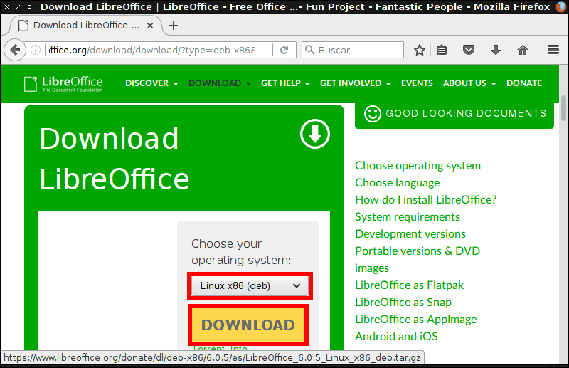
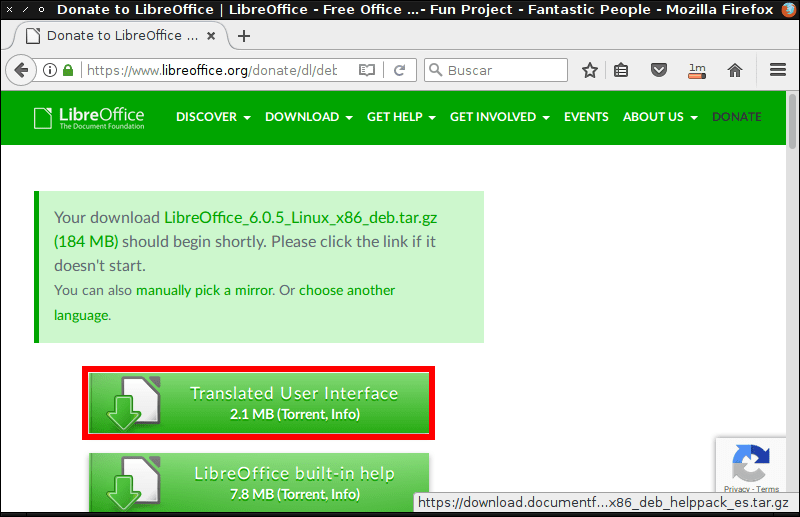
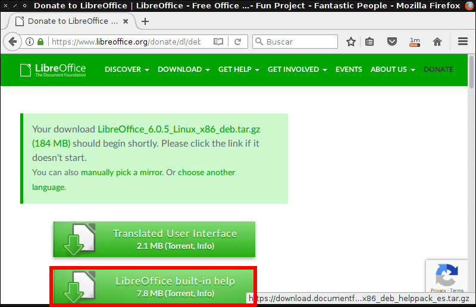
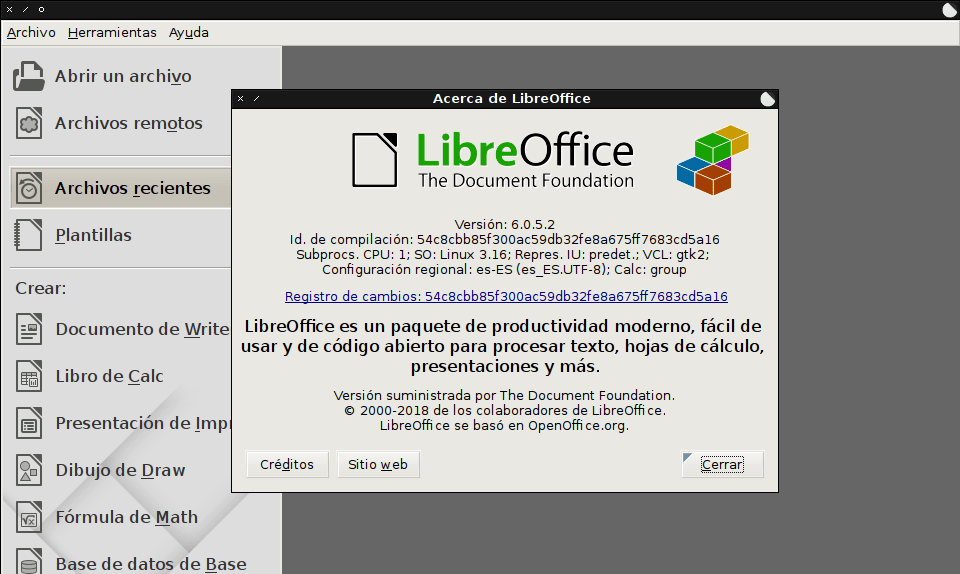

En mi caso pretendo instalar LibreOffice en un sistema operativo Debian, pero me encuentro con los siguientes problemas:

1. Los repositorios de Debian únicamente disponen de la versión 4.3.3 de LibreOffice. La versión más actual a día de hoy es la 6.0.5.
2. Si consulto el [repositorio Backports]() únicamente dispone de la versión 5.2.7. Esta sin duda no es la última versión de LibreOffice.
3. En Debian, y en la mayoría de distribuciones, no existen repositorios ppa como en Ubuntu.

<!--more-->

## INSTALAR LIBREOFFICE DE FORMA MANUAL Y SIN REPOSITORIOS

Existen diversos métodos para disponer de la última versión de LibreOffice. No obstante en mi caso he decidido aplicar la forma que considero más tradicional.

### Desinstalar versiones antiguas de LibreOffice

Es recomendable realizar una instalación limpia. Para ello desinstalaremos versiones antiguas de LibreOffice del siguiente modo:

Si usan el **gestor de paquetes apt** ejecutarán el siguiente comando en la terminal:

> ```
> sudo apt-get remove --purge libreoffice* && sudo apt-get autoremove
> ```

En caso de usar el **gestor de paquetes dnf** deberán ejecutar el siguiente comando en la terminal:

> ```
> sudo dnf remove libreoffice*
> ```

Después de ejecutar el comando se procederá a la desinstalación de Libreoffice.

### Descargar la última versión de LibreOffice

A continuación accedemos dentro de la siguiente URL para descargar la última versión de LibreOffice.

[https://es.libreoffice.org/descarga/libreoffice/](https://es.libreoffice.org/descarga/libreoffice/ "Link para descargar la última versión de LibreOffice")

Seguidamente seleccionamos el tipo de arquitectura y presionamos el botón DESCARGAR para descargar los archivos de instalación de la última versión de Libreoffice

[](images/descargar-libreoffice.png)

###### Nota: En mi caso se ha descargado el archivo LibreOffice\_6.0.5\_Linux\_x86\_deb.tar.gz

### Descargar los paquetes de idiomas de LibreOffice

Una vez descargado el programa descargaremos los paquetes necesarios para disponer de LibreOffice en nuestro propio lenguaje. Para ello clico en el botón Interfaz de usuario traducida.

[](images/descarga-idioma-español-libreoffice.png)

###### Nota: En mi caso se ha descargado el archivo LibreOffice\_6.0.5\_Linux\_x86\_deb\_langpack\_es.tar.gz

### Descargar la ayuda de Libreoffice

Finalmente, en el caso que lo consideremos necesario descargaremos los archivos de ayuda del programa. Para ello clicamos encima del botón Ayuda incorporada de LibreOffice.

[](images/descargar-ayuda-libreoffice.png)

###### Nota: El paquete descargado tiene el nombre LibreOffice\_6.0.5\_Linux\_x86\_deb\_helppack\_es

### Instalar LibreOffice en distribuciones que funcionan con paquetes .deb o .rpm

El siguiente paso consiste en acceder en ubicación donde hemos descargado los archivos de instalación de LibreOffice. En mi caso las descargas las he almacenado en la carpeta Descargas de mi partición home. Por lo tanto tendré que ejecutar el siguiente comando en la terminal:

> ```
> cd ~/Descargas
> ```

Dentro de la carpeta Descargas descomprimimos los archivos tar.gz que descargamos en el apartado anterior. Para ello ejecutamos el siguiente comando en la terminal:

> ```
> for x in *.tar.gz; do tar xfv $x; done
> ```

Acto seguido instalamos la totalidad de los binarios de LibreOffice. Para ello si usamos el **gestor de paquetes apt** ejecutaremos el siguiente comando en la terminal:

> ```
> sudo dpkg -i LibreOffice_*/DEBS/*.deb
> ```

En el caso de usar el **gestor de paquetes dnf** ejecutamos el siguiente comando en la terminal:

> ```
> sudo dnf install LibreOffice_*/RPMS/*.rpm
> ```

Realizando estos simples pasos conseguiremos disponer de la última versión de LibreOffice de forma extremadamente sencilla.

[](images/libreoffice-instalado.png)

## DESINSTALAR LIBREOFFICE

En el caso que necesiten desinstalar Libreoffice y utilicen el **gestor de paquetes apt** deberán ejecutar el siguiente comando en la terminal:

> ```
> sudo apt-get remove --purge libreoffice* && sudo apt-get autoremove
> ```

**Si en vez de apt utilizan dnf** deberán ejecutar el siguiente comando en la terminal:

> ```
> sudo dnf remove libreoffice*
> ```

De este forma tan sencilla podremos desinstalar LibreOffice sin ningún tipo de problema.

## ACTUALIZAR A FUTURAS VERSIONES DE LIBREOFFICE

LibreOffice posee un actualizador automático. No obstante su funcionalidad es prácticamente nula. Las únicas funciones del actualizador automático de LibreOffice son las siguientes:

1. Notificar si existe una actualización de LibreOffice.
2. Dirigirnos a la página web de LibreOffice para descargar la actualización.

Por lo tanto para actualizar LibreOffice recomiendo realizar los siguientes pasos:

1. En el momento de recibir una notificación de actualización desinstalen LibreOffice.
2. Una vez desinstalado descargan la última versión y la instalan de nuevo siguiendo las instrucciones de este artículo.

## OPCIONES ALTERNATIVAS DE INSTALACIÓN

El el artículo tan solo hemos visto uno de los métodos para poder disponer de la última versión de LibreOffice. Otros métodos que podríamos usar son los siguientes:

1. Instalar LibreOffice mediante la paquetería Snap, Flatpak o Appimages.
2. Instalar LibreOffice usando los repositorios de nuestra distribución.

En mi caso no me gusta usar los nuevos sistemas de paquetería de Linux. Tampoco me gusta tener distintos tipos de paquetes instalados en mi sistema operativo. Por este motivo en este artículo he mostrado la forma de instalar LibreOffice usando los paquetes .deb y .rpm.
