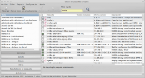
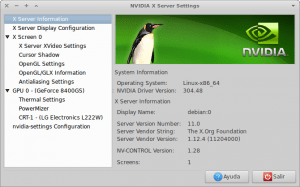

En este post veremos como instalar los drivers Nvidia privativos en Debian. Cuando instalamos Debian si nuestra targeta es NVIDIA los drivers que se instalan por defecto son los Nouveau. Los drivers Nouveau funcionan perfectamente pero en el caso que desees o necesites exprimir tu tarjeta gráfica al máximo la mejor opción sigue siendo usar los drivers privativos de NVIDIA.

Los pasos para instalar los drivers Nvidia privativos en Debian desde repositorios<!--more-->

## PASO 1. ASEGURAR QUE TENEMOS UNA TARJETA GRÁFICA NVIDIA

Para asegurarnos que nuestra tarjeta es Nvidia usamos el siguiente comando en la terminal:

> ```
> lspci | grep VGA
> ```

El resultado que obtengo en mi caso es:

02:00.0 VGA compatible controller: NVIDIA Corporation GT218 \[GeForce 8400 GS\] (rev a2)

Por lo tanto claramente dispongo de una terjeta Nvidia GeForce 8400 GS

## PASO 2. ASEGURAR QUE TENEMOS LOS REPOSITORIOS NON-FREE DE DEBIAN ACTIVADOS

Para saber si tenemos los repositorios no libre tenemos que acceder al contenido del archivo sources.list. Para ello introducimos el siguiente comando.

> ```
> sudo gedit /etc/apt/sources.list
> ```

Si estamos usando **Debian Testing** tenemos que comprobar que dentro del archivo estén disponibles las siguientes lineas:

> ```
> deb http://ftp.de.debian.org/debian/ testing main contrib non-free
> deb-src http://ftp.de.debian.org/debian/ testing main contrib non-free
> ```

Si estamos usando **Debian Sid** comprobar que las siguientes lineas están disponibles:

> ```
> deb http://ftp.it.debian.org/debian/ unstable main contrib non-free
> deb-src http://ftp.it.debian.org/debian/ unstable main contrib non-free
> ```

Si estamos usando **Debian Stable** comprobar que las siguientes lineas están disponibles:

> ```
> deb http://ftp.us.debian.org/debian/ stable main contrib non-free
> deb-src http://ftp.us.debian.org/debian/ stable main contrib non-free
> ```

Nota: En caso de no existir introducir estas lineas en el archivo introducirlas y a posteriori comentar las lineas que corresponden a los repositorios libres.

## PASO 3. ACTUALIZAR EL CONTENIDO DE LOS REPOSITORIOS

Para actualizar el contenidos de los repositorios tecleamos el siguiente comando en la terminal:

> ```
> sudo apt-get update
> ```

## PASO 4. INSTALAR LOS DRIVERS NVIDIA PRIVATIVOS

Abrimos el gestor de paquetes synaptic y hacemos un filtro rápido con la palabra Nvidia.

[](images/Gestor-de-paquetes-Synaptic-_001.png)

 

 

 

 

 

 

Instalamos los siguientes paquetes:

1. El primero paquete que tenemos que instalar es el paquete **nvidia-kernel-(tuversion de kernel).** En mi caso como se puede ver en la imagen , el paquete a instalar es **nvidia-kernel-3.2.0-4-amd64**.
2. Instalamos el paquete **nvidia-glx**
3. Instalamos el paquete **nvidia-xconfig**
4. Instalamos el paquete **nvidia-settings**

###### Nota: Para saber la versión de Kernel que estamos usando tan solo tenemos que abrir una terminal y teclear el comando uname -r

## PASO 5. CONFIGURACIÓN DE LA TARJETA GRÁFICA

Para configurar automáticamente la tarjeta gráfica podemos ejecutamos el siguiente comando en la terminal:

> ```
> sudo nvidia-xconfig
> ```

## PASO 6. EVITAR CONFLICTOS ENTRE EL DRIVER NOUVEAU Y NVIDIA

Para evitar problemas entre el driver Nouveau y Nvidia tenemos que añadir el driver Nouveau a nuestra lista negra. Para ello:

> ```
> sudo gedit /etc/modprobe.d/fbdev-blacklist.conf
> ```

###### Nota: En este paso hay que ir con cuidado. Si estáis usando una versión antigua de Debian es posible que la ubicación del archivo para poner los drivers Nouveau en la lista negra se halle en la siguiente ubicación: /etc/modprobe.d/blacklist.conf

Dentro del archivo añadir el siguiente texto y guardar:

> ```
> blacklist nouveau
> ```

## PASO 7. REINICIAR EL ENTORNO GRÁFICO

Ya solo resta reiniciar el entorno gráfico. Para ellos podemos sencillamente reiniciar el ordenador. Ahora en el caso que deseemos ajustar la configuración de nuestra tarjeta solo tenemos que ejecutar el siguiente comando en la terminal:

> ```
> nvidia-settings
> ```

 **[](images/NVIDIA-X-Server-Settings_002.png)**

Estos simples pasos nos permiten instalar los drivers Nvidia privativos en Debian de forma fácil y sencilla.
