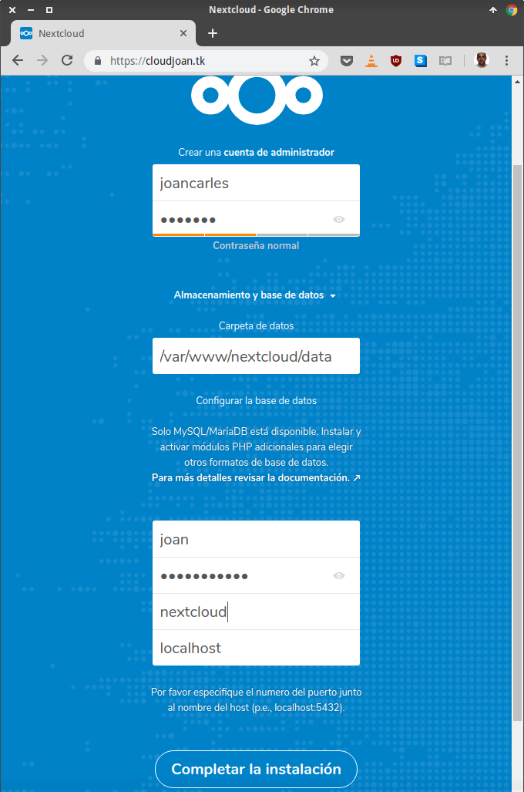
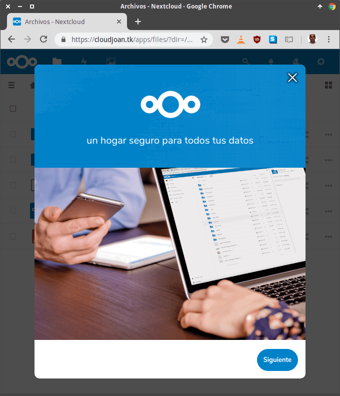

A continuación instalaremos una nube Nextcloud en Ubuntu 18.04, con el servidor web Nginx, php-fpm 7.2 y MariaDB. La nube Nextcloud que montaremos estará perfectamente optimizada para ser usada en un entorno plenamente productivo. Para ello seguiremos los siguientes pasos.<!--more-->

## INSTALAR EL SERVIDOR WEB NGINX

Una vez logueados a nuestro equipo instalaremos el servidor web Nginx. Para ello tan solo tenemos que ejecutar el siguiente comando en la terminal:

> ```
> sudo apt install nginx
> ```

Acto seguido iniciaremos el servidor web ejecutando el siguiente comando:

> ```
> sudo systemctl start nginx
> ```

Finalmente haremos que el servidor web se inicie de forma automática cada vez que arranquemos nuestro servidor. Para ello ejecutaremos el siguiente comando en la terminal:

> ```
> sudo systemctl enable nginx
> ```

## INSTALAR Y CONFIGURAR PHP 7.2 PARA USAR NEXTCLOUD EN UBUNTU

A continuación instalaremos la versión 7.2 de PHP. Para ello ejecutaremos el siguiente comando en la terminal:

> ```
> sudo apt install php7.2-fpm php7.2-curl php7.2-cli php7.2-mysql php7.2-gd php7.2-common php7.2-xsl php7.2-json php7.2-intl php-pear php-imagick php7.2-dev php7.2-common php7.2-mbstring php7.2-zip php7.2-soap php7.2-opcache
> ```

### Configuración de PHP-FPM

Accedemos al archivo de configuración php.ini ejecutando el siguiente comando en la terminal:

> ```
> sudo nano /etc/php/7.2/fpm/php.ini
> ```

Cuando se abra el editor de textos buscaremos la siguiente línea:

> ```
> ;date.timezone =
> ```

Una vez encontrada la descomentamos y añadimos la zona horaria de forma que quede del siguiente modo:

> ```
> date.timezone = Europe/Madrid
> ```

###### Nota: Si lo precisan pueden consultar las [zonas horarias que admite PHP](https://secure.php.net/manual/es/timezones.php "Consultar zonas horarias que ofrece PHP").

Acto seguido buscamos la siguiente línea:

> ```
> ;cgi.fix_pathinfo=1
> ```

Una vez encontrada la descomentaremos y le daremos el valor 0 de forma que quede del siguiente modo:

> ```
> cgi.fix_pathinfo=0
> ```

Finalmente guardamos los cambios y cerramos el fichero. El siguiente paso consistirá en repetir las mismas modificaciones que acabamos de aplicar en el fichero /etc/php/7.2/fpm/cli/php.ini. Por lo tanto ejecutamos el siguiente comando:

> ```
> sudo nano /etc/php/7.2/fpm/cli/php.ini
> ```

Cuando se abra el editor de texto fijaremos la zona horaria y desactivaremos cgi.fix\_pathinfo. Por lo tanto las variables date.timezone y cgi.fix\_pathinfo tendrán los siguientes valores:

> ```
> date.timezone = Europe/Madrid
> cgi.fix_pathinfo=0
> ```

Una vez aplicadas las modificaciones guardaremos los cambios y cerraremos el fichero.

El último paso consistirá en editar el fichero fpm/pool.d/www.conf. Para ello ejecutaremos el siguiente comando en la terminal:

> ```
> sudo nano fpm/pool.d/www.conf
> ```

Cuando se abra el editor de textos descomentamos las siguientes líneas:

> ```
> env[HOSTNAME] = $HOSTNAME
> env[PATH] = /usr/local/bin:/usr/bin:/bin
> env[TMP] = /tmp
> env[TMPDIR] = /tmp
> env[TEMP] = /tmp
> ```

Guardaremos los cambios y cerraremos el fichero. Finalmente reiniciaremos y habilitaremos php 7.2 ejecutando los siguientes comandos:

> ```
> sudo systemctl restart php7.2-fpm
> sudo systemctl enable php7.2-fpm
> ```

De esta forma tan sencilla PHP 7.2 ya estará operativo.

## INSTALAR MARIADB PARA GESTIONAR NUESTRA BASE DE DATOS

Instalaremos MariaDB para gestionar nuestra base de datos. Para ello ejecutaremos el siguiente comando en la terminal:

> ```
> sudo apt install mysql-server mysql-client
> ```

Para asegurar que el servidor está levantado y funcionando ejecutaremos el siguiente comando en la terminal:

> ```
> sudo systemctl start mysql
> ```

Para finalizar el proceso de instalación ejecutaremos el siguiente comando para asegurar que cada vez que reiniciemos nuestro servidor se inicie MariaDB.

> ```
> systemctl enable mysql
> ```

### Securizar el servidor de base de datos MariaDB

Para mejorar la seguridad de MariaDB ejecutaremos el siguiente comando en la terminal:

> ```
> mysql_secure_installation
> ```

Acto seguido se nos pedirá que introduzcamos la contraseña del usuario root. Como no hemos establecido ninguna presionamos Enter.

> ```
> Enter current password for root (enter for none):
> ```

A continuación nos preguntarán si queremos establecer una contraseña para el usuario root. En mi caso respondo que Sí y presiono Enter.

> ```
> Set root password? [Y/n]: Y
> ```

Seguidamente tendremos que introducir por duplicado la contraseña que queremos que tenga el usuario root de MariaDB:

> ```
> New password: contraseñ@rootmariadb
> 
> Re-enter new password: contraseñ@rootmariadb
> ```

Acto seguido nos preguntarán si queremos eliminar el usuario anónimo que está creado por defecto en MariaDB. Respondemos que Sí y presionar enter.

> ```
> Remove anonymous users? [Y/n]: Y
> ```

En el siguiente paso se nos preguntará si queremos revocar el acceso remoto al usuario root. En nuestro caso responderemos que Sí y presionaremos enter.

> ```
> Disallow root login remotely? [Y/n]: Y
> ```

A continuación nos preguntarán si queremos borrar la base de datos de prueba de MariaDB. Recomiendo que la borren respondiendo Sí.

> ```
> Remove test database and access to it? [Y/n]: Y
> ```

Finalmente responderemos que Sí para asegurar que la totalidad de configuraciones realizadas se apliquen correctamente.

> ```
> Reload privilege tables now? [Y/n]: Y
> ```

De está forma tan sencilla habremos incrementado la seguridad del sistema de datos MariaDB.

### Crear y configurar la base de datos de Nextcloud en Ubuntu con MariaDB

El siguiente paso consiste en crear la base de datos que usará Nextcloud en ubuntu. Para ello nos loguearemos a nuestra base de datos ejecutando el siguiente comando:

> ```
> sudo mysql -u root -p
> ```

Una vez ejecutado el comando introducimos la contraseña del usuario root que creamos en el apartado anterior y presionamos enter. Acto seguido nos loguearemos a la base de datos y ejecutaremos los siguientes comandos:

Para crear una base de datos que se llamará **nextcloud**:

> ```
> CREATE DATABASE nextcloud;
> ```

Para crear el usuario **joan** y hacer que la base de datos tenga la contraseña **contraseña\_base\_datos**:

> ```
> CREATE USER 'joan'@'localhost' IDENTIFIED BY 'contraseña_base_datos';
> ```

Para que el usuario **joan** disponga de la totalidad de permisos en la base de datos **nextcloud**:

> ```
> GRANT ALL PRIVILEGES ON nextcloud.* TO 'joan'@'localhost';
> ```

Para actualizar los privilegios que tiene el usuario joan:

> ```
> FLUSH PRIVILEGES;
> ```

Para desloguearnos de la base de datos:

> ```
> exit;
> ```

Una vez finalizada la configuración de la base de datos podemos proseguir con la instalación de un certificado SSL para Nextcloud.

## CONFIGURAR EL FIREWALL DEL SERVIDOR UBUNTU QUE ALOJA NEXTCLOUD

A estas altura ya podemos configurar el firewall de nuestro servidor Ubuntu. En nuestro caso abriremos los puertos 80, 443 y 22. Para ello ejecutaremos el siguiente comando para asegurar que ufw está instalado:

> ```
> sudo apt install ufw
> ```

Finalmente ejecutaremos los siguientes comandos para abrir los puertos:

> ```
> sudo ufw start
> sudo ufw enable
> sudo ufw allow http
> sudo ufw allow https
> sudo ufw allow ssh
> ```

Una vez ejecutados los comandos ya podemos continuar con el siguiente apartado.

## INSTALAR UN CERTIFICADO LET’S ENCRYPT

Obviamente es importante securizar nuestra nube mediante un certificado SSL. Para ello ejecutaremos el siguiente comando en la terminal:

> ```
> sudo apt install letsencrypt
> ```

Acto seguido detendremos el servidor web ejecutando el siguiente comando en la terminal:

> ```
> sudo systemctl stop nginx
> ```

Una vez parado el servidor ejecutaremos el siguiente comando para generar el certificado SSL para nuestro dominio:

> ```
> certbot certonly --standalone -d cloudjoan.tk -d www.cloudjoan.tk
> ```

###### Nota: Deberéis reemplazar cloudjoan.tk por su nombre de dominio.

Después de ejecutar el comando empezará el proceso de creación del certificado SSL. Durante el proceso de instalación tan solo tienen que ir leyendo y respondiendo las preguntas. Una vez finalizado el proceso se habrán creado los siguientes ficheros:

> ```
> /etc/letsencrypt/live/cloudjoan.tk/fullchain.pem
> /etc/letsencrypt/live/cloudjoan.tk/privkey.pem
> ```

###### Nota: Deberéis reemplazar cloudjoan.tk por su nombre de dominio.

Finalmente crearemos una clave de 2048 bits para el intercambio de claves Diffie-Hellman. Para ello ejecutaremos el siguiente comando en la terminal:

> ```
> sudo openssl dhparam -out /etc/ssl/certs/dhparam.pem 2048
> ```

De esta forma la comunicación entre el cliente y el servidor se hará de una forma más segura. A estas alturas ya podemos empezar con el proceso de instalación de Nextcloud en Ubuntu.

## DESCARGAR LA ULTIMA VERSIÓN DE NEXTCLOUD EN UBUNTU

Inicialmente instalaremos la totalidad de paquetes necesarios para instalar Nextcloud en Ubuntu. Para ello ejecutaremos el siguiente comando en la terminal:

> ```
> sudo apt install wget unzip zip -y
> ```

Acto seguido accederemos a la raíz de nuestro servidor web ejecutando el siguiente comando:

> ```
> cd /var/www
> ```

Descargaremos la última versión de Nextcloud con el siguiente comando:

> ```
> wget https://download.nextcloud.com/server/releases/latest.zip
> ```

Descomprimiremos el archivo .zip que acabamos de descargar ejecutando el siguiente comando:

> ```
> unzip latest.zip
> ```

Crearemos el directorio /var/www/nextcloud/data que almacenará los datos de nuestra nube Nextcloud. Para ello ejecutaremos el siguiente comando en la terminal:

> ```
> mkdir -p /var/www/nextcloud/data/
> ```

###### Nota: Una buena práctica de seguridad seria guardar los datos fuera de nuestro servidor web. Por lo tanto, si quieren pueden usar otra ubicación como por ejemplo /nextcloud-data.

Seguidamente ejecutaremos el siguiente comando para que la totalidad de archivos de instalación y datos almacenados en nuestra nube pertenezcan al grupo y al usuario www-data.

> ```
> sudo chown -R www-data:www-data /var/www/nextcloud/
> ```

A continuación ya podemos realizar realizar la configuración del Virtualhost para Nextcloud.

## CONFIGURAR NGINX PARA ACCEDER A NEXTCLOUD DE FORMA SEGURA

El siguiente paso consiste en configurar un VirtualHost para que nuestra nube sea accesible de forma segura. Para ello ejecutamos el siguiente comando en la terminal:

> ```
> sudo nano /etc/nginx/sites-available/nextcloud
> ```

Acto seguido pegamos el siguiente código. **Los únicos valores del código que tenéis que cambiar son los que están en color azul**. Por lo tanto tendréis que reemplazar cloudjoan.tk por vuestro dominio.

|   > ``` > upstream php-handler { >     #server 127.0.0.1:9000; >     server unix:/run/php/php7.2-fpm.sock; > } >  > server { >     listen 80; >     listen [::]:80; >     server_name cloudjoan.tk www.cloudjoan.tk; >     return 301 https://cloudjoan.tk$request_uri; > } >  > server { >     listen 443 ssl http2; >     listen [::]:443 ssl http2; >     server_name www.cloudjoan.tk; >     return 301 https://cloudjoan.tk$request_uri; >  >     ssl_certificate /etc/letsencrypt/live/cloudjoan.tk/fullchain.pem; >     ssl_certificate_key /etc/letsencrypt/live/cloudjoan.tk/privkey.pem; > } >  > server { >     listen 443 ssl http2; >     listen [::]:443 ssl http2; >     server_name cloudjoan.tk; >  >     ssl_certificate /etc/letsencrypt/live/cloudjoan.tk/fullchain.pem; >     ssl_certificate_key /etc/letsencrypt/live/cloudjoan.tk/privkey.pem; >  >     # Add headers to serve security related headers >     # Before enabling Strict-Transport-Security headers please read into this >     # topic first. >     # add_header Strict-Transport-Security "max-age=15552000; >     # includeSubDomains; preload;"; >     # >     # WARNING: Only add the preload option once you read about >     # the consequences in https://hstspreload.org/. This option >     # will add the domain to a hardcoded list that is shipped >     # in all major browsers and getting removed from this list >     # could take several months. >     add_header X-Content-Type-Options nosniff; >     add_header X-XSS-Protection "1; mode=block"; >     add_header X-Robots-Tag none; >     add_header X-Download-Options noopen; >     add_header X-Permitted-Cross-Domain-Policies none; >     add_header Strict-Transport-Security "max-age=31536000; includeSubDomains" always; >     add_header Referrer-Policy no-referrer always; >  >     # Path to the root of your installation >     root /var/www/nextcloud/; >  >     location = /robots.txt { >         allow all; >         log_not_found off; >         access_log off; >     } >  >     # The following 2 rules are only needed for the user_webfinger app. >     # Uncomment it if you're planning to use this app. >     #rewrite ^/.well-known/host-meta /public.php?service=host-meta last; >     #rewrite ^/.well-known/host-meta.json /public.php?service=host-meta-json >     # last; >  >     location = /.well-known/carddav { >         return 301 $scheme://$host/remote.php/dav; >     } >     location = /.well-known/caldav { >         return 301 $scheme://$host/remote.php/dav; >     } >  >     # set max upload size >     client_max_body_size 512M; >     fastcgi_buffers 64 4K; >  >     # Enable gzip but do not remove ETag headers >     gzip on; >     gzip_vary on; >     gzip_comp_level 4; >     gzip_min_length 256; >     gzip_proxied expired no-cache no-store private no_last_modified no_etag auth; >     gzip_types application/atom+xml application/javascript application/json application/ld+json application/manifest+json application/rss+xml application/vnd.geo+json application/vnd.ms-fontobject application/x-font-ttf application/x-web-app-manifest+json application/xhtml+xml application/xml font/opentype image/bmp image/svg+xml image/x-icon text/cache-manifest text/css text/plain text/vcard text/vnd.rim.location.xloc text/vtt text/x-component text/x-cross-domain-policy; >  >     # Uncomment if your server is built with the ngx_pagespeed module >     # This module is currently not supported. >     #pagespeed off; >  >     location / { >         rewrite ^ /index.php$uri; >     } >  >     location ~ ^/(?:build\|tests\|config\|lib\|3rdparty\|templates\|data)/ { >         deny all; >     } >     location ~ ^/(?:\.\|autotest\|occ\|issue\|indie\|db_\|console) { >         deny all; >     } >  >     location ~ ^/(?:index\|remote\|public\|cron\|core/ajax/update\|status\|ocs/v[12]\|updater/.+\|ocs-provider/.+)\.php(?:$\|/) { >         fastcgi_split_path_info ^(.+\.php)(/.*)$; >         include fastcgi_params; >         fastcgi_param SCRIPT_FILENAME $document_root$fastcgi_script_name; >         fastcgi_param PATH_INFO $fastcgi_path_info; >         fastcgi_param HTTPS on; >         #Avoid sending the security headers twice >         fastcgi_param modHeadersAvailable true; >         fastcgi_param front_controller_active true; >         fastcgi_pass php-handler; >         fastcgi_intercept_errors on; >         fastcgi_request_buffering off; >     } >  >     location ~ ^/(?:updater\|ocs-provider)(?:$\|/) { >         try_files $uri/ =404; >         index index.php; >     } >  >     # Adding the cache control header for js and css files >     # Make sure it is BELOW the PHP block >     location ~ \.(?:css\|js\|woff\|svg\|gif)$ { >         try_files $uri /index.php$uri$is_args$args; >         add_header Cache-Control "public, max-age=15778463"; >         # Add headers to serve security related headers (It is intended to >         # have those duplicated to the ones above) >         # Before enabling Strict-Transport-Security headers please read into >         # this topic first. >         # add_header Strict-Transport-Security "max-age=15768000; includeSubDomains; preload;"; >         # >         # WARNING: Only add the preload option once you read about >         # the consequences in https://hstspreload.org/. This option >         # will add the domain to a hardcoded list that is shipped >         # in all major browsers and getting removed from this list >         # could take several months. >         add_header X-Content-Type-Options nosniff; >         add_header X-XSS-Protection "1; mode=block"; >         add_header X-Robots-Tag none; >         add_header X-Download-Options noopen; >         add_header X-Permitted-Cross-Domain-Policies none; >         # Optional: Don't log access to assets >         access_log off; >     } >  >     location ~ \.(?:png\|html\|ttf\|ico\|jpg\|jpeg)$ { >         try_files $uri /index.php$uri$is_args$args; >         # Optional: Don't log access to other assets >         access_log off; >     } > } > ```   |
| :-- |

Una vez pegado el código y realizadas las modificaciones guardamos los cambios y cerramos el fichero.

A continuación habilitamos el VirtualHost mediante un enlace simbólico. Para ello ejecutamos el siguiente comando en la terminal:

> ```
> ln -s /etc/nginx/sites-available/nextcloud /etc/nginx/sites-enabled/
> ```

Finalmente iniciamos/reiniciaremos el servidor web y PHP para que se haga efectiva la configuración que hemos aplicado. Para ello ejecutaremos los siguientes comandos:

> ```
> sudo systemctl start nginx
> sudo systemctl restart php7.2-fpm
> ```

A estas alturas ya podemos iniciar la instalación de Nextcloud en Ubuntu.

## INSTALAR NEXTCLOUD EN UBUNTU 18.04

Abriremos un navegador y accederemos a nuestro dominio. En mi caso el dominio es el siguiente:

> ```
> https://cloudjoan.tk/
> ```

###### Nota: Tendréis que reemplazar cloudjoan.tk por vuestro dominio.

Acto seguido rellenaremos cada uno de los campos que veremos en el navegador web.

[](images/parametros-configuracion-nextcloud.png)

Las opciones de configuración a introducir en cada uno de los campos son las siguientes:

1. **Nombre de usuario del administrador:** Podéis poner el nombre que queráis. En mi caso he usado joancarles.
2. **Contraseña del usuario administrador:** Usad la que queráis pero asegurad que sea una contraseña segura. En mi caso he elegido 12345678910.
3. **Ubicación donde se guardaran los datos:** En mi caso quiero que los datos se guarden en /var/www/nextcloud/data. Recordad que en apartados anteriores creé la ubicación que estoy detallando en este campo.
4. **Usuario de la base de datos:** En mi caso introduzco joan porque el usuario que en apartados anteriores creé para la base de datos
5. **Contraseña de las base de datos:** Tenemos que introducir la contraseña de la base de datos que creamos y definimos en apartados anteriores. En mi caso la contraseña es contraseña\_base\_datos.
6. **Nombre de la base de datos:** Tan solo tenemos que escribir el nombre que pusimos a la base de datos de Nextcloud. El nombre que puse a la base de datos fue nextcloud.
7. **Ubicación del sistema de gestión de base de datos:** MariaDB está instalado en el mismo servidor que Nextcloud, por lo tanto tenemos que indicar localhost.

Una vez rellenados los campos clican encima del botón **Completar la instalación**. Acto seguido se iniciará la instalación de Nextcloud en nuestro VPS con Ubuntu 18.04. Una vez finalizada la instalación verán la siguiente pantalla.

[](images/nextcloud-instalado.png)

## ACTIVAR EL SISTEMA DE CACHE OPCACHE

Para optimizar el rendimiento de nuestra nube activaremos opcache. Para ello ejecutaremos el siguiente comando en la terminal:

> ```
> sudo nano /etc/php/7.2/fpm/conf.d/10-opcache.ini
> ```

Una vez se abra el editor de ficheros añadiremos el siguiente código:

> ```
> opcache.enable=1
> opcache.enable_cli=1
> opcache.interned_strings_buffer=8
> opcache.max_accelerated_files=10000
> opcache.memory_consumption=128
> opcache.save_comments=1
> opcache.revalidate_freq=1
> ```

Para finalizar el proceso guardaremos lo cambios, cerraremos el fichero y reiniciaremos Nginx y PHP ejecutando los siguientes comandos en la terminal:

> ```
> sudo systemctl restart php7.2-fpm
> sudo systemctl restart nginx
> ```

## MEJORAR EL RENDIMIENTO DE NUESTRA NUBE CON REDIS Y APCU

Usaremos un sistema de cache para mejorar el rendimiento de nuestra nube Nextcloud. Para ello instalaremos Redis y APCu ejecutando el siguiente comando en la terminal:

> ```
> sudo apt-get install redis-server php-redis php-apcu
> ```

Una vez instalados los paquetes necesarios accederemos a la configuración de Nextcloud ejecutando el siguiente comando en la terminal:

> ```
> sudo nano /var/www/nextcloud/config/config.php
> ```

Cuando se abra el editor de textos tendremos que añadir el contenido que está marcado en color rojo:

|   > ``` > <?php > $CONFIG = array ( >   'instanceid' => 'ocrevvmql3iz', >   'passwordsalt' => 'yBBm/wTtheh/qEYG++Gme8njpYoP+O', >   'secret' => 'QLufG2deWxB12/H1AntQc1fkE3p248YnuhvelVXUlMM/vow2', >   'trusted_domains' =>  >   array ( >   0 => 'cloudjoan.tk', >   ), >   'datadirectory' => '/var/www/nextcloud/data', >   'dbtype' => 'mysql', >   'version' => '15.0.2.0', >   'overwrite.cli.url' => 'https://cloudjoan.tk', >   'dbname' => 'nextcloud', >   'dbhost' => 'localhost', >   'dbport' => '', >   'dbtableprefix' => 'oc_', >   'mysql.utf8mb4' => true, >   'dbuser' => 'joan', >   'dbpassword' => 'contraseña_base_datos', >   'installed' => true, >   'filelocking.enabled' => true, >   'memcache.local' => '\\OC\\Memcache\\APCu', >   'memcache.locking' => '\\OC\\Memcache\\Redis', >   'redis' =>  >   array ( >     'host' => 'localhost', >     'port' => 6379, >     'timeout' => 0, >   ), > ); > ```   |
| :-- |

Una vez modificado el código guardamos los cambios y cerramos el fichero.

Finalmente reiniciaremos PHP y Nginx ejecutando los siguientes comandos en la terminal:

> ```
> sudo systemctl restart php7.2-fpm
> sudo systemctl restart nginx
> ```

## TRANSFORMAR LA BASE DE DATOS AL FORMATO BIGINT

En mi caso, algunas de las columnas de la base de datos no se han creado con el formato bigint. Para que todos los datos numéricos estén en formato bigint haremos lo siguiente:

Accedemos al directorio raíz de Nextcloud ejecutando el siguiente comando en la terminal:

> ```
> cd /var/www/nextcloud
> ```

A continuación ejecutamos el siguiente comando para asegurar que la totalidad de columnas de la base de datos se convierta a bigint:

> ```
> sudo -u www-data php occ db:convert-filecache-bigint
> ```

Al ejecutar el comando se nos preguntará si queremos transformar las columnas filecache.mtime y filecache.storage\_mtime. Responderemos que Sí y presionaremos Enter.

> ```
> Following columns will be updated:
> 
> * filecache.mtime
> * filecache.storage_mtime
> 
> This can take up to hours, depending on the number of files in your instance!
> Continue with the conversion (y/n)? [n] y
> ```

Finalmente reiniciaremos PHP, MariaDB y Nginx ejecutando los siguientes comandos:

> ```
> sudo systemctl restart php7.2-fpm
> sudo systemctl restart nginx
> sudo systemctl restart mysql
> ```

En estos momentos deberíamos tener nuestra nube Nextcloud instalada y perfectamente configurada.

###### ENLACES DE INTERÉS

A continuación les dejo el siguiente enlace que considero de interés. Si lo leen encontrarán opciones alternativas para la instalación y la configuración:

[https://www.c-rieger.de/nextcloud-installation-guide-ubuntu/](https://www.c-rieger.de/nextcloud-installation-guide-ubuntu/ "Enlace de interés para los usuarios de Nextcloud")
