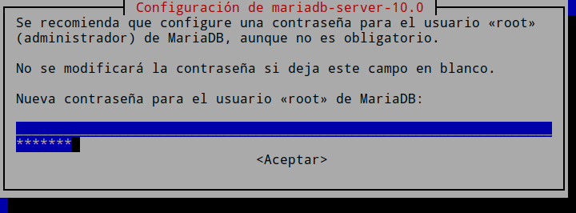
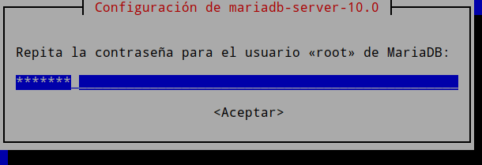
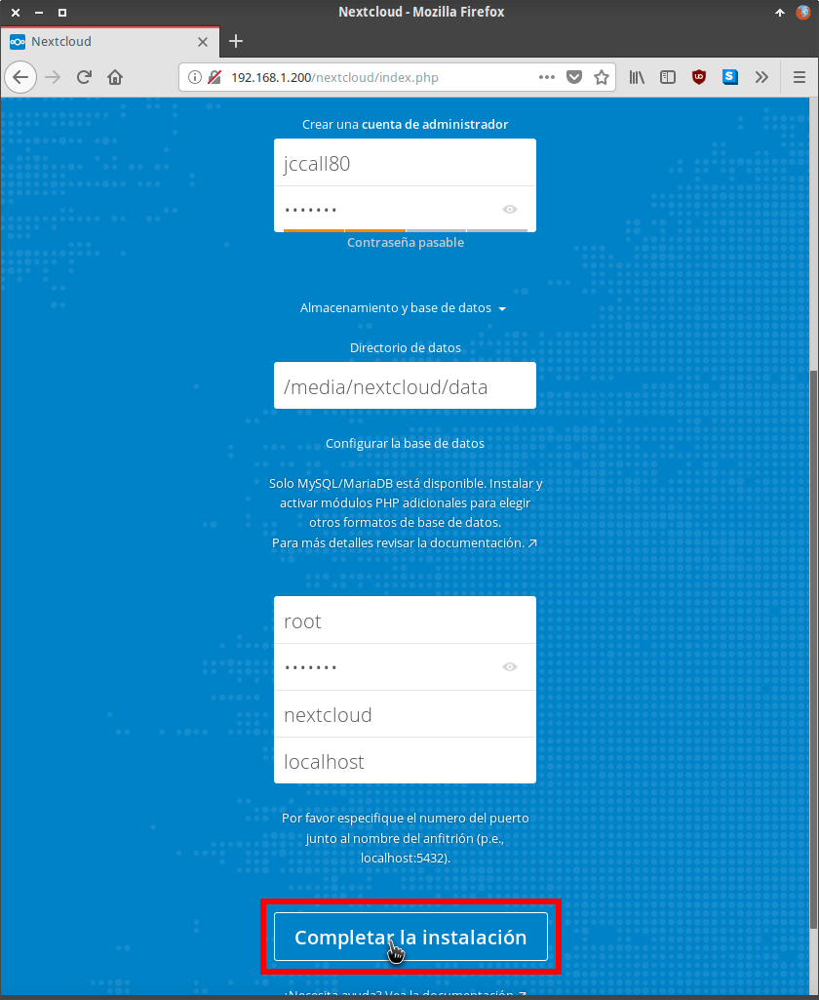
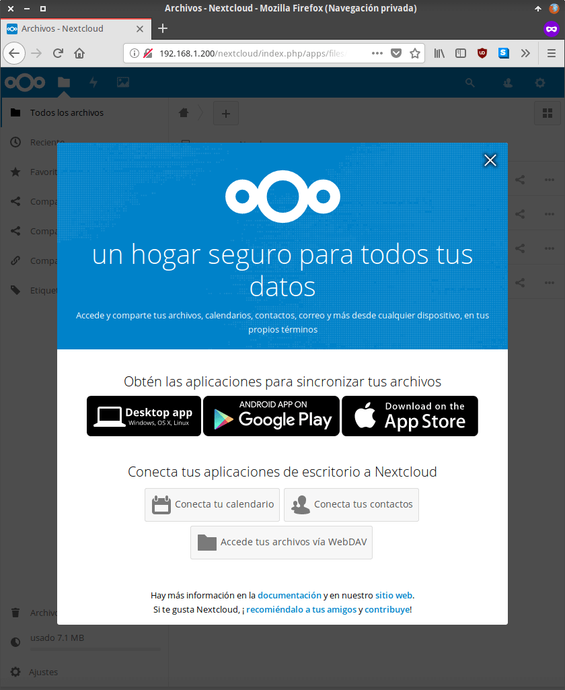

En el siguiente artículo verán los pasos a seguir para poder instalar Nextcloud en una Raspberry Pi. La base de datos que usaremos para nuestra nube Nextcloud será MariaDB, mientras que el servidor web será Lighttpd. He seleccionado estas opciones porque pienso que son las opciones que darán mejor rendimiento a nuestra Raspberry Pi.

Los pasos detallados para instalar Nextcloud se detallan a continuación.<!--more-->

## FORMATEAR EL DISPOSITIVO DE ALMACENAMIENTO QUE ALMACENARÁ LOS DATOS DE NEXTCLOUD

Para montar nuestra propia nube necesitamos disponer un dispositivo de almacenamiento con una capacidad elevada. En mi caso usaré un pendrive de 128 GB.

Una vez seleccionado el dispositivo de almacenamiento lo tenemos que formatear en el formato ext4. Para ello lo enchufamos a nuestra Raspberry Pi, abrimos una terminal y seguimos las siguientes instrucciones:

Inicialmente tenemos que averiguar el nombre con que el sistema operativo reconoce nuestro dispositivo de almacenamiento. Para ello ejecutamos el siguiente comando en la terminal:

> ```
> sudo fdisk -l
> ```

En mi caso el resultado obtenido es el siguiente:

|   Device                   Boot  Start       End           Sectors      Size      Id   Type /dev/mmcblk0p1           8192 2     474609      2466418    1,2G     e    W95 FAT16 (LBA) /dev/mmcblk0p2           2474610  31422463  28947854  13,8G   5    Extended /dev/mmcblk0p5           2482176  2547709    65534        32M     83  Linux /dev/mmcblk0p6           2547712  2682879    135168      66M     c    W95 FAT32 (LBA) /dev/mmcblk0p7           2686976  31422463  28735488  13,7G   83  Linux  Disk /dev/sda: 115,7 GiB, 15512174592 bytes, 30297216 sectors Units: sectors of 1 \* 512 = 512 bytes Sector size (logical/physical): 512 bytes / 512 bytes I/O size (minimum/optimal): 512 bytes / 512 bytes Disklabel type: dos Disk identifier: 0x21b73d15  Device       Boot  Start         End            Sectors      Size       Id   Type /dev/sda1  \*        2048         30296063  30294016   115,7G  83   Linux /dev/sda4            6703616   28518911  21815296   10,4G    0    Empty  Disk /dev/sdb: 14,5G, 124218507264 bytes, 242614272 sectors Units: sectors of 1 \* 512 = 512 bytes Sector size (logical/physical): 512 bytes / 512 bytes I/O size (minimum/optimal): 512 bytes / 512 bytes Disklabel type: dos Disk identifier: 0xfda912af  Device        Boot   Start   End              Sectors         Size    Id   Type /dev/sdb1             32       242614271   242614240  14,5G  7    HPFS/NTFS/exFAT |
| --- |

Viendo el resultado, como el tamaño de mi pendrive es de 128GB, deduzco que mi dispositivo de almacenamiento se reconoce como **/dev/sda**

Aseguramos que el dispositivo de almacenamiento a formatear esté desmontado ejecutando el siguiente comando en la terminal:

> ```
> sudo umount /dev/sda
> ```

Acto seguido formatearemos el pendrive ejecutando el siguiente comando en la terminal

> ```
> sudo mkfs.ext4 /dev/sda
> ```

###### Nota: Asegúrense que están formateando la unidad correcta. En caso contrario pueden perder información importante.

## AUTOMONTAR NUESTRO DISPOSITIVO DE ALMACENAMIENTO CUANDO SE ARRANQUE LA RASPBERRY PI

Para conseguir nuestro propósito tenemos que crear un directorio donde montar nuestro dispositivo de almacenamiento. En mi caso crearé el directorio /media/nextcloud ejecutando el siguiente comando en la terminal:

> ```
> sudo mkdir /media/nextcloud
> ```

Para que el dispositivo se automonte al iniciar nuestra Raspberry Pi tendremos que editar el archivo fstab. Para ello ejecutamos el siguiente comando en la terminal:

> ```
> sudo nano /etc/fstab
> ```

Una vez se abra el editor de textos nano pegamos el siguiente código dentro del archivo:

> ```
> /dev/sda1 /media/nextcloud ext4 auto,user,rw,exec 0 0
> ```

Guardamos los cambios y cerramos el fichero.

De este modo nuestro dispositivo de almacenamiento se montará de forma automática cada vez que arranquemos nuestro equipo.

## ASIGNAR UNA IP FIJA A NUESTRA RASPBERRY PI

A continuación es necesario asegurar que nuestra Raspberry Pi siempre tenga la misma IP interna. De este modo siempre estará localizable dentro de nuestra red local. Para ello pueden usar alguno de los métodos que se detallan en los siguientes enlaces:

[https://geekland.eu/ip-fija-servidor-dhcp-router/]()

[https://geekland.eu/instalar-configurar-servidor-torrent/]()

[https://geekland.eu/configurar-ip-fija\_o\_estatica\_ipv4/]()

En mi caso he configurado mi Raspberry Pi para que tenga la IP 192.168.1.200.

## INSTALAR Y CONFIGURAR LA BASE DE DATOS MARIADB

Para instalar la base de datos MariaDB tan solo tenemos que ejecutar el siguiente comando en la terminal:

> ```
> sudo apt install mariadb-server
> ```

Durante la instalación de mariaDB se nos pedirá que definamos la contraseña del usuario root. La escribimos y presionamos la tecla Enter.

[](images/contrasena-base-datos-mariadb.png)

Acto seguido nos pedirá que volvamos a introducir la contraseña que acabamos de introducir. Una vez introducida volvemos a presionar Enter.

[](images/confirmar-contrasena-base-datos-mariadb.png)

Una vez finalizada la instalación pasaremos a la creación y configuración de la base de datos.

### Crear y configurar una base de datos de MariaDB para Nextcloud

Una vez finalizada la instalación la securizaremos ejecutando el siguiente comando en la terminal:

> ```
> sudo mysql_secure_installation
> ```

Una vez ejecutado el comando tendremos que **introducir la contraseña del usuario root** de MariaDB.

> ```
> Enter current password for root (enter for none): ******
> ```

Tras introducir la contraseña de root nos preguntarán si queremos modificarla. En mi caso respondo que no.

> ```
> Change the root password? [Y/n] n
> ```

Seguidamente se nos preguntará si queremos **eliminar el usuario anónimo de MariaDB**. En nuestro caso responderemos que Sí. Por defecto MariaDB dispone de un usuario anónimo que permite loguearse sin tener ninguna cuenta de usuario.

> ```
> Remove anonymous users? [Y/n] y
> ```

A continuación se nos preguntará si queremos **deshabilitar el acceso remoto al usuario root**. Por cuestiones de seguridad en mi caso respondo que sí lo quiero deshabilitar.

> ```
> Disallow root login remotely? [Y/n] y
> ```

MariaDB dispone de una **base de datos de prueba** que tiene el nombre ‘test’. Si esta base está presente se nos preguntará si la queremos borrar. En mi caso respondo que sí.

> ```
> Remove test database and access to it? [Y/n] y
> ```

Finalmente en la última pregunta responderemos que sí. De este modo aseguraremos que todas las configuraciones que hemos realizado se apliquen correctamente.

> ```
> Reload privilege tables now? [Y/n] y
> ```

Una vez finalizado con el proceso de securización **crearemos los usuarios y las bases de datos** para Nextcloud. Para ello accederemos a la consola de MariaDB ejecutando el siguiente comando en la terminal:

> ```
> mysql -u root -p
> ```

Se nos preguntará la contraseña del usuario root. La introducimos y presionamos Enter.

Finalmente tenemos que crear un usuario y la base de datos. Para crear un usuario con nombre **jccall80** y una base de datos con el nombre **nextcloud** se tienen que ejecutar los siguientes comandos:

> ```
> CREATE DATABASE nextcloud;
> 
> CREATE USER 'jccall80'@'localhost' IDENTIFIED BY 'contraseña_jccall80';
> 
> GRANT ALL PRIVILEGES ON nextcloud.* TO 'jccall80'@'localhost';
> 
> FLUSH PRIVILEGES;
> 
> exit;
> 
> ```

###### nota: contraseña\_jccall80 tiene que ser reemplazado por la contraseña que queramos que tenga el usuario jccall80

Después de ejecutar los comando el proceso ha finalizado y podemos continuar con el proceso para instalar Nextcloud.

## INSTALAR EL SERVIDOR WEB LIGHTTPD

Otro de los requerimientos para instalar Nextcloud es disponer de un servidor web. Pueden instalar multitud de servidores web como por ejemplo Lighttpd, Apache, Nginx o cualquier otro servidor web. En mi caso uso Lighttpd porque es más ligero que Apache y realizará su función sin problema.

Para instalar el servidor web Lighttpd ejecuto el siguiente comando en la terminal:

> ```
> sudo apt-get install lighttpd
> ```

Para ver si Lighttpd funciona nos vamos al navegador web de un ordenador de la red local y como dirección ponemos la IP de la raspberry Pi.

###### Nota: Lighttpd no está oficialmente soportado por Nextcloud. No obstante su rendimiento y funcionamiento es más que correcto.

## INSTALAR PHP EN LA RASPBERRY PI

En este apartado podemos instalar PHP 5 o PHP 7. Recomiendo usar PHP 7 porque es más actual y su rendimiento es mejor, no obstante a continuación veremos las instrucciones para instalar tanto PHP 5 como PHP 7.

**Para instalar PHP 5** ejecutamos el siguiente comando en la terminal:

> ```
> sudo apt install php5-cli php5-json php5-curl php5-imap php5-gd php5-mysql php5-intl php5-mcrypt php5-imagick php5-cgi redis-server php5-redis php5-apcu
> ```

**En el caso que decidamos instalar PHP 7** ejecutaremos el siguiente comando en la terminal:

> ```
> sudo apt-get install php7.0 php7.0-bz2 php7.0-cli php7.0-curl php7.0-gd php7.0-fpm php7.0-intl php7.0-json php7.0-mbstring php7.0-mcrypt php-pear php7.0-imap php-memcache php7.0-pspell php7.0-recode php7.0-tidy php7.0-xmlrpc php7.0-xsl php7.0-mysql php7.0-opcache php7.0-xml php7.0-zip php-imagick php-redis libapache2-mod-php7.0
> ```

###### Nota: En el caso que el sistema operativo que uséis no sea el más actual es posible que PHP 7 no esté disponible. En tal caso pueden usar PHP 5 o buscar un método para poder instalar PHP 7.

###### Nota: Si usan versiones de Nextcloud superiores a la 14.0 deberán usar si o si la versión 7 de PHP.

Con php instalado reiniciaremos el servidor web ejecutando el siguiente comando en la terminal:

> ```
> sudo service lighttpd restart
> ```

Una vez reiniciado el servidor ejecuten el siguiente comando para asegurar que los módulos cgi y fastcgi estén activos.

> ```
> sudo lighty-enable-mod fastcgi-php fastcgi cgi
> ```

## DESCARGAR LOS ARCHIVOS PARA INSTALAR NEXTCLOUD

Tenemos que acceder al directorio raíz de nuestro servidor web que en mi caso es el /var/www/html. Para ello ejecutamos el siguiente comando en la terminal:

> ```
> cd /var/www/html
> ```

A continuación descargaremos la última versión de Nextcloud ejecutando el siguiente comando en la terminal:

> ```
> sudo wget https://download.nextcloud.com/server/releases/latest.zip
> ```

Seguidamente descomprimimos el archivo .zip que acabamos de descargar ejecutando el siguiente comando en la terminal:

> ```
> sudo unzip latest.zip
> ```

Al descomprimir el archivo se generará una carpeta con el nombre Nextcloud que contendrá los archivos para instalar Nextcloud. Una vez descomprimido el archivo .zip lo podemos borrar ejecutando el siguiente comando:

> ```
> sudo rm latest.zip
> ```

## OTORGAR LOS PERMISOS PERTINENTES PARA INSTALAR NEXTCLOUD

Finalmente otorgamos el grupo y el usuario www-data de forma recursiva a la totalidad de carpetas y archivos que están dentro de la carpeta Nextcloud. Para ello ejecutamos el siguiente comando en la terminal:

> ```
> sudo chown -R www-data:www-data /var/www/html/nextcloud
> ```

A continuación otorgamos los permisos pertinentes a los archivos y carpetas de Nextcloud ejecutando los siguientes comandos en la terminal:

> ```
> sudo find /var/www/html/nextcloud/ -type d -exec chmod 750 {} \;
> 
> sudo find /var/www/html/nextcloud/ -type f -exec chmod 640 {} \;
> ```

Ejecutando estos comandos los archivos y carpetas tendrán los siguientes permisos:

1. El usuario propietario podrá leer y escribir los archivos.
2. Los usuarios pertenecientes al grupo del usuario propietario únicamente podrán leer los archivos.
3. los usuarios que no son el propietario ni pertenecen al grupo del propietario no podrán hacer absolutamente nada con los archivos.
4. El usuario propietario dispondrá de la totalidad de permisos sobre todos los directorios de Nextcloud.
5. Los usuarios que pertenecen al grupo del propietario dispondrán de permisos de Lectura y ejecución sobre los directorios de Nextcloud.
6. Los usuarios que no son el propietario ni pertenecen al grupo del propietario no dispondrán de ningún permiso sobre los directorios.

## DEFINIR LA UBICACIÓN DE LOS DATOS Y DAR LOS PERMISOS PERTINENTES

Seguidamente accederemos al punto de montaje del dispositivo de almacenamiento al que queremos almacenar los datos. Para ello en nuestro caso ejecutamos el siguiente comando:

> ```
> cd /media/nextcloud
> ```

El siguiente paso consiste en crear la carpeta “data” que almacenará la totalidad de los datos de nuestra nube. Para ello ejecutamos el siguiente comando:

> ```
> sudo mkdir -p /media/nextcloud/data
> ```

###### Nota: Acuerdanse la de la ruta /media/nextcloud/data porque más adelante la necesitaremos para instalar Nextcloud.

A continuación asignaremos el usuario y el grupo www-data de forma recursiva a la carpeta data que acabamos de crear. Por lo tanto ejecutaremos el siguiente comando en la terminal:

> ```
> sudo chown -R www-data:www-data /media/nextcloud/data
> ```

Para finalizar otorgaremos los permisos pertinentes a la carpeta que almacenará nuestros datos. Para ello ejecutamos los siguientes comandos en la terminal:

> ```
> sudo find /media/nextcloud/data -type d -exec chmod 750 {} \;
> 
> sudo find /media/nextcloud/data -type f -exec chmod 640 {} \;
> ```

Una vez realizados todos estos pasos les recomiendo que reinicien su Raspberry Pi.

A estás alturas ya estamos en condiciones para instalar Nextcloud en nuestra raspberry Pi.

## INSTALAR NEXTCLOUD EN LA RASPBERRY PI

Accedemos al navegador web en un equipo que esté dentro de nuestra red local y accedemos dentro de la siguiente URL:

> ```
> http://192.168.1.200/nextcloud
> ```

###### Nota: En vuestro caso deberán reemplazar 192.168.1.200 por la IP fija que hayan asignado a su Raspberry Pi.

Acto seguido tendremos que rellenar cada uno de los campos que aparecen en el navegador web.

[](images/instalar-nextcloud-raspberry-pi.png)

En el campo **crear una cuenta de Administrador** introduciremos los siguientes datos:

1. El nombre que queramos que tenga nuestro administrador de Nextcloud.
2. La contraseña del usuario administrador.

###### Nota: No olviden en ningún momento el usuario y la contraseña del administrador. Son datos que necesitamos para poder administrar nuestra nube.

En el apartado **Directorio de datos** tan solo tenemos que introducir la ruta en que definimos que se almacenaran los datos. Por lo tanto en mi caso tengo que introducir la siguiente ruta:

> ```
> /media/nextcloud/data
> ```

Finalmente en el apartado de **Configurar la base de datos** tenemos que introducir la siguiente información:

1. En el primer campo seleccionamos el **usuario de la base de datos**. En mi caso selecciono el usuario root.
2. Seguidamente tenemos que escribir la **contraseña del usuario root**.
3. A continuación, en el siguiente campo escribiremos el **nombre de la base de datos** que creamos en apartado anteriores. En mi caso el nombre es nextcloud.
4. En el ultimo campo tenemos que indicar la **ubicación de nuestro servidor MariaDB**. Como está instalado en nuestra Raspberry Pi y escuchando en el puerto estándar tenemos que escribir localhost.

Finalmente tan solo tenemos que presionar en el botón **Completar instalación**. Acto seguido se instalará y podremos acceder a Nextcloud de forma local.

[](images/nextcloud-instalado.png)

## CONFIGURACIÓN Y OPTIMIZACIÓN DEL RENDIMIENTO DE NEXTCLOUD

En estos momentos acabamos de instalar Nextcloud. Será accesible y usable dentro de nuestra red local, pero aún faltará realizar bastantes tareas de configuración y optimización. Por esté motivo en futuros artículos abordaremos los siguientes aspectos:

1. [Configurar y optimizar el rendimiento de nuestra nube personal Nextcloud]().
2. [Realizar una copia de seguridad de Nextcloud]().
3. [Como actualizar Nextcloud con el asistente de actualización.]()
4. Fortalecer la seguridad de Nextcloud mediante iptables y Fail2ban.
5. [Instalar el cliente de Nextcloud en Linux]().
