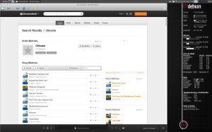
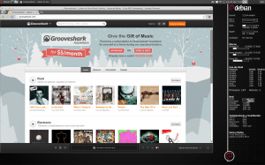
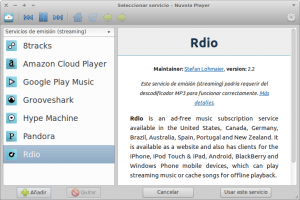

Bajo mi punto de vista Nuvola Player es el **reproductor de música en streaming por excelencia**. Lo es porqué al instalar Nuvola Player obtendrán una serie de servicios que ningún otro reproductor nos ofrece.<!--more-->

### SERVICIOS QUE OBTENEMOS AL INSTALAR NUVOLA PLAYER

1- Acceso al servicio [**Amazon Cloud Player**](https://www.amazon.es/gp/feature.html?ie=UTF8&docId=1000755423).

2- Acceso al servicio [**8tracks**](http://8tracks.com/ "8tracks").

3- Acceso al servicio de **[Google Play Music](https://play.google.com/music/listen "Google Music")**.

4- Acceso al servicio Online de **Grooveshark**.

5- Acceso al servicio online de  [**Hype Machine**](http://hypem.com/ "Hype Machine").

6- Acceso al servicio **[Pandora](http://www.pandora.com/ "Pandora")**.

7- Acceso al servicio de **Rdio**.

###### Nota: En función del país en que se encuentre puede que algunos de los servicios no estén disponibles.

### OTRAS VENTAJAS DE INSTALAR NUVOLA PLAYER

**Solución para máquinas con pocos recursos**. Como podéis ver en las 2 imágenes comparativas los recursos usando grooveshark en un navegador o en nuvola player son sensiblemente diferentes. Nuvola Player consume mucha menos RAM. Chrome se arranco en modo incógnito para que la comparación sea más equitativa.

[](images/Área-de-trabajo-1_003.png)

[](images/Área-de-trabajo-1_004.png)

**Varios servicios de reproducción online integrados en un mismo Software**. Máxima comodidad para el usuario.

[](images/Seleccionar-servicio-Nuvola-Player_006.png)

Nuvola Player dispone de un **sistema de extensiones para ampliar las funcionalidades**. Algunas de las extensiones nos permiten poder interactuar y hacer scrobbling con lastfm, ver las letras de las canciones, activar el sistema de notificaciones, etc.

[](images/Preferencias_005.png)

### INSTALAR NUVOLA PLAYER EN DEBIAN ESTABLE

El primer paso es añadir la llave pública. Para añadir la clave pública abrir una terminal y pegar el siguiente comando:

> ```
> sudo apt-key adv --keyserver keyserver.ubuntu.com --recv-keys 706C220A
> ```

El segundo paso es acceder a nuestro sources.list y agregar el repositorio. Para abrimos una terminal e introducimos el siguiente comando:

> ```
> sudo gedit /etc/apt/sources.list
> ```

Dentro de nuestro sources.list pegamos el siguiente texto justo al final del archivo:

> ```
> ##Debian Wheezy, LMDE*
> ##Stable builds only:
> deb http://ppa.fenryxo.cz/nuvola-player/ wheezy main
> deb-src http://ppa.fenryxo.cz/nuvola-player/ wheezy main
> ```

Una vez introducido el texto grabar las modificaciones y cerrar el archivo.  El paso final es abrir la terminal y ejecutar les siguientes comandos:

> ```
> sudo apt-get update sudo apt-get install nuvolaplayer
> ```

###### Nota: Se comenta como instalar la versión estable en Debian Estable. Si queréis instalar la versión Beta podéis consultar la siguiente URL: http://ppa.fenryxo.cz/nuvola-player/README.html

### INSTALAR NUVOLA PLAYER EN DEBIAN TESTING, DEBIAN INESTABLE O LMDE

El primer paso es añadir la llave pública. Para añadir la clave pública abrir una terminal y pegar el siguiente comando:

> ```
> sudo apt-key adv --keyserver keyserver.ubuntu.com --recv-keys 706C220A
> ```

El segundo paso es acceder a nuestro sources.list y agregar el repositorio. Para abrimos una terminal e introducimos el siguiente comando:

> ```
> sudo gedit /etc/apt/sources.list
> ```

Dentro de nuestro sources.list pegamos el siguiente texto justo al final del archivo:

> ```
> ##Debian Testing, LMDE, Unstable*
> ##Stable builds only:
> deb http://ppa.fenryxo.cz/nuvola-player/ sid main
> deb-src http://ppa.fenryxo.cz/nuvola-player/ sid main
> ```

Una vez introducido el texto grabar las modificaciones y cerrar el archivo.  El paso final es abrir la terminal y ejecutar les siguientes comandos:

> ```
> sudo apt-get update sudo apt-get install nuvolaplayer
> ```

###### Nota: Se comenta como instalar la versión estable en Debian Testing y Debian Inestable. Si queréis instalar la versión Beta podéis consultar la siguiente URL: [http://ppa.fenryxo.cz/nuvola-player/README.html](http://ppa.fenryxo.cz/nuvola-player/README.html "Nuvola Player")

### INSTALAR NUVOLA PLAYER EN UBUNTU

Para instalar Nuvola Player estable en Ubuntu abrir una terminal e introducir los siguientes comandos:

> ```
> sudo add-apt-repository ppa:nuvola-player-builders/stable
> sudo apt-get update
> sudo apt-get install nuvolaplayer
> ```

En conclusión. Para mi Nuvola Player es un programa imprescindible para le gente que acostumbra a escuchar música en streaming ya que es eficiente en el uso de recursos,  integra multitud de servicios streaming en tu escritorio y facilita la vida al usuario.

Para más información pueden consultar la web del desarrollador:

[http://nuvolaplayer.fenryxo.cz/](http://nuvolaplayer.fenryxo.cz/ "Web Diseñador")
