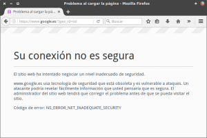
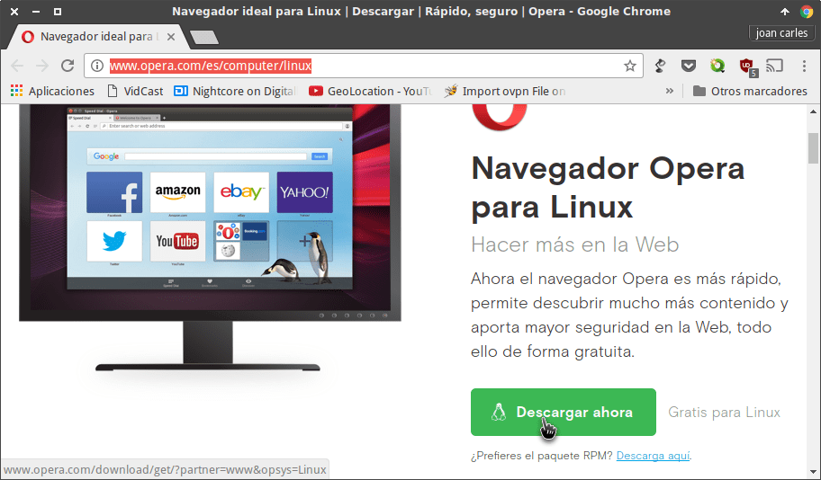
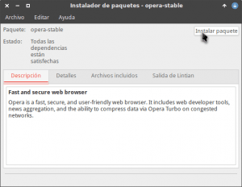
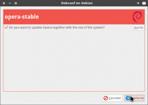

En el siguiente artículo veremos los pasos a seguir para poder instalar opera en cualquier distribución GNU Linux.<!--more-->

La principales motivaciones para escribir este post son fáciles de entender. En su día ya escribí un post quejándome del [pésimo rendimiento de Firefox]() en mi equipo.

Además desde hace varios días ni lo puedo usar por el error que podéis ver en la siguiente captura de pantalla:

[](images/Error-Firefox.png)

Vista la situación he tomado la decisión de desinstalar completamente Firefox y a partir de ahora usaré Opera como navegador secundario.

Para instalar Opera en cualquier sistema operativo Linux pueden seguir las siguientes instrucciones.

## INSTALACIÓN DE OPERA MEDIANTE UN BINARIO .DEB O .RPM

El primer paso es acceder a la siguiente página web:

[http://www.opera.com/es/computer/linux](http://www.opera.com/es/computer/linux "Web oficial para descargar los binarios de Opera")

Una vez dentro de la página web presionamos encima del botón **Descargar Ahora**.

[](images/Descargar-el-binario-de-Opera.png)

###### Nota: Si usan una distribución que utilice paquetes .rpm deberán clicar encima del link descarga aquí.

Después de presionar el botón se procederá a la descarga del paquete **.deb** o **.rpm**

Una vez descargado el paquete binario lo instalamos tal y como lo haríamos de forma habitual. En mi caso lo instalo utilizando gdebi:

[](images/Instalando-Opera-con-Gdebi.png)

###### Nota: Para instalar paquetes binarios .deb desde la terminal pueden usar el comando sudo dpkg -i nombre\_del\_paquete.deb. Si usan dpkg para instalar el binario antes deberán instalar el paquete apt-transport-https

###### Nota: Para la instalación de paquetes binarios .rpm desde la terminal podemos usar el comando sudo rpm -i nombre\_del\_paquete.rpm

Durante el proceso de instalación del paquete binario aparecerá la siguiente ventana en la que deberéis clicar la celda **Do you want to update Opera together with the rest of the system?** y seguidamente presionar el botón **Adelante**.

[](images/Añadir-los-repositorios-de-Opera.png)

Una vez realizados estos simples pasos tan solo tenemos que esperar unos segundos para que finalice el proceso de instalación.

## INSTALAR OPERA MEDIANTE LA TERMINAL

Si en vuestro caso preferís instalar Opera desde la terminal tenéis que seguir las siguientes instrucciones.

### Instar Opera en Debian, Ubuntu y distribuciones derivadas de ambas

Abrimos una terminal y añadimos el repositorio de Opera ejecutando el siguiente comando en la terminal:

> ```
> sudo add-apt-repository 'deb https://deb.opera.com/opera-stable/ stable non-free'
> ```

Seguidamente añadimos la clave del repositorio ejecutando el siguiente comando en la terminal:

> ```
> wget -qO- https://deb.opera.com/archive.key | sudo apt-key add -
> ```

A continuación actualizamos los repositorios de nuestra distro ejecutando el siguiente comando en la terminal:

> ```
> sudo apt-get update
> ```

Finalmente ejecutamos el siguiente comando para instalar Opera:

> ```
> sudo apt-get install opera-stable
> ```

###### Nota: En el caso que durante el proceso de instalación se os pregunte si queréis añadir los repositorios de Opera para recibir actualizaciones tenéis que responder que no porque ya los hemos añadido previamente.

### Instalar Opera en Opensuse

Para instalar opera en Opensuse tenemos a que añadir la clave del repositorio de Opera ejecutando el siguiente comando en la terminal:

> ```
> sudo rpm --import https://rpm.opera.com/rpmrepo.key
> ```

Seguidamente añadimos el repositorio de Opera ejecutando el siguiente comando en la terminal:

> ```
> sudo tee /etc/zypp/repos.d/opera.repo <<RPMREPO
> [opera]
> name=Opera packages
> type=rpm-md
> baseurl=https://rpm.opera.com/rpm
> gpgcheck=1
> gpgkey=https://rpm.opera.com/rpmrepo.key
> enabled=1
> autorefresh=1
> keeppackages=0
> RPMREPO
> ```

A continuación actualizamos los repositorios de la distro ejecutando el siguiente comando en la terminal:

> ```
> sudo zypper refresh
> ```

Finalmente instalamos Opera ejecutando el siguiente comando en la terminal:

> ```
> sudo zypper in opera-developer
> ```

### Instalar Opera en Fedora y en distros derivadas de Fedora

El primer paso para instalar Opera en Fedora es añadir la clave del repositorio de Opera a nuestro sistema operativo.

Para ello ejecutamos el siguiente comando en la terminal:

> ```
> sudo rpm --import https://rpm.opera.com/rpmrepo.key
> ```

Seguidamente añadimos el repositorio de Opera ejecutando el siguiente comando en la terminal:

> ```
> sudo tee /etc/yum.repos.d/opera.repo <<RPMREPO
> [opera]
> name=Opera packages
> type=rpm-md
> baseurl=https://rpm.opera.com/rpm
> gpgcheck=1
> gpgkey=https://rpm.opera.com/rpmrepo.key
> enabled=1
> RPMREPO
> ```

A continuación actualizamos los repositorios de la distro ejecutando el siguiente comando en la terminal:

> ```
> sudo dnf check-update
> ```

Finalmente instalamos Opera ejecutando el siguiente comando en la terminal:

> ```
> sudo dnf install opera-developer
> ```

### Instalar Opera en Archlinux y en distros derivadas de Archlinux

Opera está presente en los repositorios oficiales de Archlinux. Por lo tanto para instalarlo únicamente tenemos que ejecutar el siguiente comando en la terminal:

> ```
> sudo pacman -S opera
> ```

Al ejecutar el comando se procederá a la instalación de Opera.

## PRIMERAS IMPRESIONES DEL FUNCIONAMIENTO DE OPERA

Estoy más que satisfecho del rendimiento que me ofrece este navegador.

Sin haberlo usado en profundidad puedo afirmar lo siguiente:

1. Es un navegador sencillo, intuitivo y fácil de usar.
2. Es un navegador ampliamente personalizable mediante la instalación de extensiones.
3. Es rápido y liviano en comparación con otros navegadores como por ejemplo Firefox.
4. El consumo de RAM es sensiblemente inferior a Chrome y Firefox.
5. A pesar de ser un navegador multiproceso consume menos recursos que navegadores que no lo son como por ejemplo Firefox. Firefox tiene la capacidad de ser un navegador multiproceso pero actualmente casi todo el mundo tiene deshabilitada esta opción porque sus extensiones no lo soportan.
6. No he encontrado ningún problema de compatibilidad. Puedo realizar las mismas tareas que realizo con otros navegadores.
7. Trae características muy interesantes como por ejemplo un bloqueador de publicidad, un VPN integrado en el mismo navegador que me permite acceder a servicios restringidos geográficamente,  Opera Turbo para comprimir las paginas web con el fin de incrementar la velocidad de carga, etc.
8. Etc.

Si lo requieren en futuros post puedo detallar los pasos que sigo en mi caso para configurar este navegador.

###### Nota: Para los que únicamente les preocupe utilizar Software Libre tenéis que saber que Opera se trata de Software privativo.
