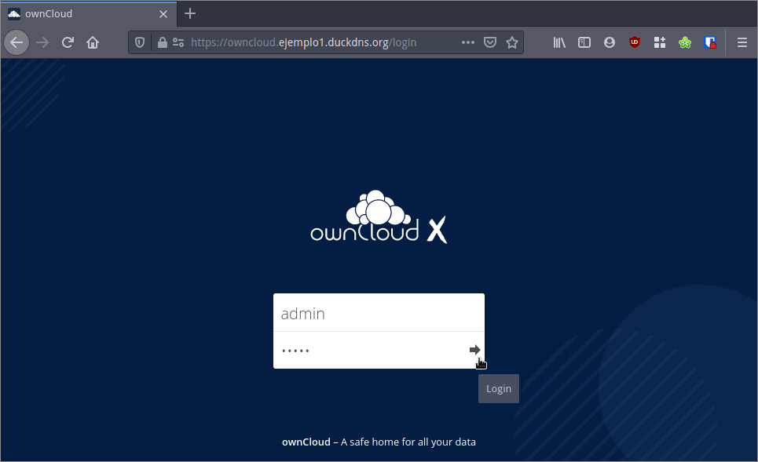
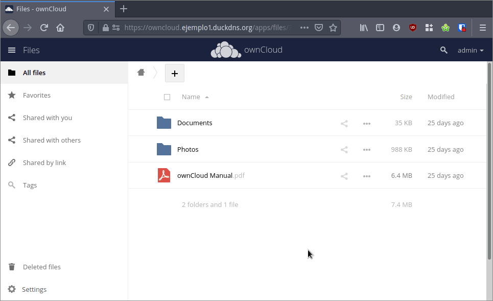

A continuación veremos como instalar la última versión de Owncloud mediante Docker y el Proxy inverso Traefik V2. El método que verán a continuación se puede aplicar en equipos con arquitectura arm y amd64. En mi caso he seguido el procedimiento que veréis a continuación en una Raspberry Pi 4.<!--more-->

## PREPARACIÓN PREVIA PARA INSTALAR OWNCLOUD MEDIANTE DOCKER Y EL PROXY INVERSO TRAEFIK v2

Para seguir las instrucciones de este tutorial tienen que tener instalado Docker, Docker-compose y el proxy inverso Traefik v2. Además tienen que disponer de un dominio para que sea posible acceder a nuestro servidor desde fuera de nuestra red local. Para cumplir los requisitos que acabo de citar tienen que seguir las siguientes instrucciones.

### Instalar Docker y Docker-compose

Para la instalación de Docker y Docker-compose deben seguir las instrucciones que dejo en el siguiente enlace:

https://geeklandlinux.github.io/posts/instalar-docker-y-docker-compose-en-linux/

### Instalar y configurar el proxy inverso Traefik v2

Necesitamos un dominio y un proxy inverso para poder instalar y usar Owncloud de forma segura. Para conseguir lo que acabo de mencionar deben seguir las instrucciones que encontrarán en el siguiente enlace:

https://geeklandlinux.github.io/posts/instalar-y-configurar-traefik-v2-para-usarlo-como-proxy-inverso/

Una vez finalizado el proceso de configuración tendremos instalado y configurado Traefik. Además dispondremos de un dominio que en mi caso es:

> ```shell
> ejemplo1.duckdns.org
> ```

### Solo en el caso de usar una Raspberry Pi con Raspbian Buster instalar el paquete libseccomp2

Los repositorios de Raspbian Buster disponen de una versión demasiado antigua del paquete lbseccomp. Por lo tanto si tienen una Raspberry Pi lo primero que tienen que hacer es descargar una versión más actual de libseccomp2 mediante el siguiente comando:

> ```shell
> wget http://ftp.br.debian.org/debian/pool/main/libs/libseccomp/libseccomp2_2.5.1-1_armhf.deb
> ```

A continuación instalaremos el paquete que acabamos de descargar ejecutando el siguiente comando:

> ```shell
> sudo dpkg -i libseccomp2_2.5.1-1_armhf.deb
> ```

### Crear los directorios donde se montarán los volúmenes de persistencia

Una vez hayamos instalado el paquete `libseccomp2` crearemos los directorios donde montaremos los volúmenes de persistencia de Owncloud. Para ello en mi caso crearé la ruta `~/services/owncloud` ejecutando los siguientes comandos en la terminal.

> **`pi@raspberrypi:~ $ mkdir ~/services`**
> 
> **`pi@raspberrypi:~ $ mkdir ~/services/owncloud`**

A continuación crearemos los directorios backup, files, mysql y redis ejecutando los siguientes comandos:

> ```shell
> pi@raspberrypi:~ $ mkdir ~/services/owncloud/backup
> pi@raspberrypi:~ $ mkdir ~/services/owncloud/files
> pi@raspberrypi:~ $ mkdir ~/services/owncloud/mysql
> pi@raspberrypi:~ $ mkdir ~/services/owncloud/redis
> ```

El contenido que almacenará cada uno de los directorios será el siguiente:

| Directorio | Contenido |
| --- | --- |
| `backup` | Las copias de seguridad de la base de datos. Para realizar una copia de seguridad de la base de datos y almacenarla en este directorio tan solo tenéis que ejecutar el comando `sudo docker-compose exec db backup` |
| `files` | Contendrá los archivos almacenados en nuestra nube. También contendrá los ficheros de configuración, ficheros de las aplicaciones instaladas, etc. Es importante realizar una copia de seguridad de este directorio/volumen de persistencia. |
| `mysql` | Contendrá la totalidad de ficheros de nuestra base de datos MySQL. |
| `redis` | Contiene las bases de datos que genera el servidor Redis. Obviamente también es interesante realizar una copia de seguridad de este directorio. |

## CREAR EL DOCKER COMPOSE PARA INSTALAR OWNCLOUD

El siguiente paso consiste en crear el docker-compose para levantar el contenedor de owncloud. Para ello crearemos un directorio que almacenará el docker-compose de Owncloud

> ```shell
> pi@raspberrypi:~ $ mkdir ~/owncloud
> ```

A continuación ejecutaremos el siguiente comando para crear el archivo el archivo `docker-compose.yml`

> ```shell
> pi@raspberrypi:~ $ touch ~/owncloud/docker-compose.yml
> ```

Seguidamente ejecutaremos el siguiente comando para editar el fichero `docker-compose.yml`

> ```shell
> pi@raspberrypi:~ $ nano ~/owncloud/docker-compose.yml
> ```

Cuando se abra el editor de textos nano pegaremos el siguiente código:

> ```shell
> version: '2.1'
> 
> volumes:
>   files:
>     driver: local
>   mysql:
>     driver: local
>   backup:
>     driver: local
>   redis:
>     driver: local
> 
> services:
>   owncloud:
>     image: owncloud/server:${OWNCLOUD_VERSION}
>     restart: unless-stopped
>     ports:
>       - ${HTTP_PORT}:8080
>     depends_on:
>       - db
>       - redis
>     links:
>       - db:db
>     environment:
>       - OWNCLOUD_DOMAIN=${OWNCLOUD_DOMAIN}
>       - OWNCLOUD_DB_TYPE=mysql
>       - OWNCLOUD_DB_NAME=owncloud
>       - OWNCLOUD_DB_USERNAME=owncloud
>       - OWNCLOUD_DB_PASSWORD=owncloud
>       - OWNCLOUD_DB_HOST=db
>       - OWNCLOUD_ADMIN_USERNAME=${ADMIN_USERNAME}
>       - OWNCLOUD_ADMIN_PASSWORD=${ADMIN_PASSWORD}
>       - OWNCLOUD_MYSQL_UTF8MB4=true
>       - OWNCLOUD_REDIS_ENABLED=true
>       - OWNCLOUD_REDIS_HOST=redis
>     healthcheck:
>       test: ["CMD", "/usr/bin/healthcheck"]
>       interval: 30s
>       timeout: 10s
>       retries: 5
>     volumes:
>       - /home/pi/services/owncloud/files:/mnt/data
>     labels:
>       - traefik.enable=true
>       - traefik.http.routers.owncloud.rule=Host(`owncloud.ejemplo1.duckdns.org`)
>       - traefik.http.routers.owncloud.tls=true
>       - traefik.http.routers.owncloud.entrypoints=websecure
>       - traefik.http.routers.owncloud.tls.certresolver=lets-encrypt
>       - traefik.http.middlewares.owncloud-headers.headers.framedeny=false
>       - traefik.http.middlewares.owncloud-headers.headers.sslredirect=true
>       - traefik.http.middlewares.owncloud-headers.headers.stsSeconds=155520011
>       - traefik.http.middlewares.owncloud-headers.headers.stsIncludeSubdomains=true
>       - traefik.http.middlewares.owncloud-headers.headers.stsPreload=true
>       - traefik.http.routers.owncloud.middlewares=owncloud-headers@docker
>       - traefik.port=8080
>     networks:
>       - internal
>       - web
> 
>   db:
>     image: webhippie/mariadb:latest
>     restart: unless-stopped
>     environment:
>       - MARIADB_ROOT_PASSWORD=owncloud
>       - MARIADB_USERNAME=owncloud
>       - MARIADB_PASSWORD=owncloud
>       - MARIADB_DATABASE=owncloud
>       - MARIADB_MAX_ALLOWED_PACKET=128M
>       - MARIADB_INNODB_LOG_FILE_SIZE=64M
>       - PUID=1000
>       - PGID=1000
>       - TZ=Europe/Madrid
>     healthcheck:
>       test: ["CMD", "/usr/bin/healthcheck"]
>       interval: 30s
>       timeout: 10s
>       retries: 5
>     volumes:
>       - /home/pi/services/owncloud/mysql:/var/lib/mysql
>       - /home/pi/services/owncloud/backup:/var/lib/backup
>     networks:
>       - internal
>     labels:
>       - traefik.enable=false
> 
>   redis:
>     image: webhippie/redis:latest
>     restart: unless-stopped
>     environment:
>       - REDIS_DATABASES=1
>     healthcheck:
>       test: ["CMD", "/usr/bin/healthcheck"]
>       interval: 30s
>       timeout: 10s
>       retries: 5
>     volumes:
>       - /home/pi/services/owncloud/redis:/var/lib/redis
>     networks:
>       - internal
>     labels:
>       - traefik.enable=false
> 
> networks:
>   web:
>     external: true
>   internal:
>     external: false
> ```

Sobre el código que acaban de pegar tienen que tener en cuenta los siguientes aspectos:

- Deberéis reemplazar la ruta de los volúmenes de persistencia por las rutas que vosotros hayáis definido.
- Tenéis que reemplazar el dominio `owncloud.ejemplo1.duckdns.org` por su dominio.
- Pueden reemplazar los nombres, los usuarios y la contraseña de la base de datos. De esta forma incrementaréis la seguridad de su nube.
- Pueden cambiar la zona horaria en la definición del contenedor de la base de datos.
- Definimos que traefik vaya a buscar el servicio que está escuchando en el puerto 8080. En el puerto 8080 estará escuchando Owncloud.

### Configurar parámetros adicionales para levantar el contenedor e instalar Owncloud

A continuación crearemos un archivo oculto en que definiremos una serie de parámetros para levantar el contenedor de owncloud. Para ello ejecutamos el siguiente comando:

> ```shell
> pi@raspberrypi:~ $ nano ~/owncloud/.env
> ```

Una vez se abra el editor de textos nano pegamos el siguiente código:

> ```shell
> OWNCLOUD_VERSION=10.6
> OWNCLOUD_DOMAIN=owncloud.ejemplo1.duckdns.org:8080
> ADMIN_USERNAME=admin
> ADMIN_PASSWORD=admin
> HTTP_PORT=8080
> ```

Mediante el siguiente código definimos los siguientes parámetros:

- La versión de owncloud que instalaremos será la 10.6. Para ver las versiones de Owncloud disponibles y asegurar que instalamos la más actual pueden visitar el siguiente [enlace](https://hub.docker.com/r/owncloud/server/tags?page=1&ordering=last_updated).
- El dominio con el que accederemos a Owncloud será `owncloud.ejemplo1.duckdns.org:8080` y owncloud estará escuchando en el puerto 8080. El puerto 8080 deberá coincidir con el que hemos usado en la etiqueta `- traefik.port=8080` del Docker-Compose. Obviamente en vuestro caso tendréis que usar vuestro dominio.
- El nombre y la contraseña del administrador de la nube Owncloud. Por temas de seguridad cambiad la opción por defecto. El usuario y la contraseña que hayáis definido será la que tendréis que usar para loguearos a Owncloud.

Una vez introducido el código guardáis los cambios y cerráis el fichero. En estos momentos ya podemos levantar el contenedor y empezar a usar Owncloud, pero antes explicaremos el procedimiento que hemos seguido para poder usar Owncloud a través del proxy inverso Traefik V2.

## EXPLICACIÓN DE LOS PARÁMETROS USADOS EN EL DOCKER-COMPOSE PARA INSTALAR OWNCLOUD CON TRAEFIK

Con el servicio Traefik v2 configurado de forma correcta tan solo tenemos que añadir las etiquetas pertinentes al Docker-Compose para configurar el servicio que levantaremos a nuestro gusto. Las etiquetas y parámetros introducidos en mi caso han sido los siguientes.

### Definir los contenedores que serán accesibles desde el exterior de la red local a través de Traefik

Lo primero que tenemos que tener claro son los contenedores que queremos exponer al exterior y los que no. En nuestro caso tenemos los contenedores `owncloud`, `db` y `redis`. El único contenedor que tiene que ser accesible fuera de nuestra red local es el de `owncloud`. Por lo tanto en las etiquetas `(labels)` de los contenedores de `redis` y `db` añadimos el siguiente código:

> **`- traefik.enable=false`**

En cambio en el contenedor de `owncloud` añadimos la etiqueta:

> ```shell
> - traefik.enable=true
> ```

### Configurar el Router para acceder a Owncloud

A continuación definiremos un router con el nombre `owncloud` para que que podamos acceder al servicio Owncloud. Para crear el router usaremos las siguientes etiquetas:

> ```shell
> - traefik.http.routers.owncloud.rule=Host(`owncloud.ejemplo1.duckdns.org`)
> - traefik.http.routers.owncloud.tls=true
> - traefik.http.routers.owncloud.entrypoints=websecure
> - traefik.http.routers.owncloud.tls.certresolver=lets-encrypt
> ```

Con el uso de las etiquetas que acabo de citar conseguiremos lo siguiente:

- El dominio para acceder a owncloud será `owncloud.ejemplo1.duckdns.org`. En vuestro caso deberéis reemplazar la parte del dominio `ejemplo1.duckdns.org` por el dominio que tengáis.
- Owncloud solo aceptará peticiones https. Las peticiones http serán ignoradas.
- Definiremos el entrypoint para el contenedor Owncloud sea `websecure`.
- Los certificados usados para cifrar el tráfico serán los de Let's Encrypt.

Para obtener información adicional acerca de los router pueden consultar el siguiente [enlace](https://doc.traefik.io/traefik/routing/routers/).

### Configurar un middleware para definir las cabeceras que tendrán las peticiones y respuestas de Owncloud

A continuación tenemos que crear un Middleware con el nombre `owncloud-headers` para añadir las cabeceras pertinentes a las peticiones y respuestas de Owncloud. Las etiquetas necesarias para añadir las cabeceras son las siguientes:

> ```shell
> - traefik.http.middlewares.owncloud-headers.headers.framedeny=false
> - traefik.http.middlewares.owncloud-headers.headers.sslredirect=true
> - traefik.http.middlewares.owncloud-headers.headers.stsSeconds=155520011
> - traefik.http.middlewares.owncloud-headers.headers.stsIncludeSubdomains=true
> - traefik.http.middlewares.owncloud-headers.headers.stsPreload=true
> ```

Con estas etiquetas Owncloud quedará configurado de forma correcta y no nos dará ninguna advertencia de seguridad. Para consultar el significado de cada una de las etiquetas añadidas pueden consultar el siguiente [enlace](https://doc.traefik.io/traefik/v2.0/middlewares/headers/).

### Interconectar el Router ownlcloud con el middleware owncloud-headers

A estas alturas tenemos un router con el nombre `owncloud` y un middleware con el nombre `owncloud-headers`. Para que Owncloud use las cabeceras correctas hay que interconectar el router con el middleware mediante la siguiente etiqueta.

> **`- traefik.http.routers.owncloud.middlewares=owncloud-headers@docker`**

Gracias a esta etiqueta todas las peticiones y respuestas de Owncloud tendrán las cabeceras correctas y no recibiremos ninguna advertencia.

### Definir el puerto en el que estará esperando peticiones Owncloud

En la última etiqueta definimos el puerto en el que Traefik irá a buscar a Owncloud. En nuestro caso definimos que sea el puerto 8080 mediante la siguiente etiqueta:

> **`- traefik.port=8080`**

**Nota**: Si tienen el puerto 8080 ocupado pueden usar otro puerto. Aunque Owncloud esté escuchando en el puerto 8080 será accesible mediante la URL que hemos definido en el router a través del puerto 80. Esta es la magia del proxy inverso.

### Definir la red en que se levantará cada uno de los contenedores

Al configurar Traefik v2 definimos que actuaria en la totalidad de contenedores levantados en la red `web`. El contenedor `owncloud` tiene que ser accesible desde fuera y dentro de nuestra red local. Por lo tanto mediante el siguiente código definimos que el contenedor `owncloud` sea accesible a través de la red `internal` y la red `web`.

>     **`networks:       - internal    - web`**

El resto de contenedores no tienen que ser accesibles des del exterior de nuestra red local. Por lo tanto tan solo tenemos que levantarlos en la red `internal` y esto lo hacemos mediante el siguiente código.

>     **`networks:     - internal`**

## INSTALAR OWNCLOUD LEVANTANDO EL CONTENEDOR DOCKER

Ahora tan solo tenemos que levantar el contenedor de Owncloud. Para ello en la ubicación donde almacenamos el fichero `docker-compose.yml` ejecutamos el siguiente comando en la terminal

> ```shell
> pi@raspberrypi:~/owncloud $ docker-compose up -d
> ```

Acto seguido esperáis unos segundos para que se levanten los contenedores y ya podréis acceder a su nube Owncloud. Para ello abran su navegador e introduzcan el dominio que hayan definido para acceder a su nube. El usuario y contraseña para poder loguearse por primera vez será la que han definido en el fichero `.env`.

[](images/Pantalla-login-owncloud.png)

Una se hayan logueado podrán empezar a configurar y usar su nube.

[](images/usando-la-nube-owncloud.png)

Por lo tanto ya ven que con un mínimo de práctica en cuestión 3 o 4 minutos podemos levantar una nube personal y además será accesible estemos donde estemos.

#### Fuentes

[https://doc.owncloud.com/server/admin\_manual/installation/docker/](https://doc.owncloud.com/server/admin_manual/installation/docker/)
