Hace unas semanas vimos como instalar un servidor LAMP en Debian. Con el fin de sacar partido a nuestro servidor LAMP, en este post citaré como instalar Owncloud.<!--more-->

## ¿QUÉ ES UN SERVIDOR OWNCLOUD?

Owncloud **es una nube personal como lo puede ser por ejemplo Dropbox, OneDrive o Google Drive**.

La gran diferencia entre los servicios que acabo de citar y Owncloud es que este último es una aplicación de software libre, y por lo tanto tiene la ventaja que nos dará el control total de nuestros datos en la nube. De este modo evitaremos los problemas de privacidad que pueden generar servicios de terceros.

## ¿USOS QUE PODEMOS DAR A OWNCLOUD?

Las opciones que nos ofrece owncloud son mucho más grandes de lo que a priori uno puede pensar. Parte de las funcionalidades que nos dará Owncloud son las siguientes:

- Almacenamiento de archivos cifrados en la nube.
- Compartición de archivos/información ubicada en la nube.
- Servidor de archivos WebDAV.
- Galería de imágenes.
- Reproductor de archivos de vídeo y sonido, etc.
- Editor de texto en linea que además permite la redacción de documentos colaborativos.
- Visor de archivos pdf, odt, archivos de imagen, etc.
- Sincronización de nuestra información en la totalidad de equipos informáticos que tengamos.
- Calendario y agenda de contactos mediante los protocolos CalDAV y CardDAV. De este modo será sumamente sencillo sincronizar nuestro calendario y agenda en nuestros dispositivos móviles y resto de equipos.

###### Nota: Aparte de las funcionalidades indicadas hay otras ya que owncloud dispone de un sistema de Extensiones que permiten incluir nuevas funcionalidades.

## INSTALAR UN SERVIDOR WEB LAMP

Para poder instalar Owncloud necesitamos un servidor Web propio con PHP, y Mysql/MariaDB. Para poder disponer de un servidor web propio tan solo hay que **seguir las instrucciones que se muestran en el siguiente enlace**:

[https://geekland.eu/instalar-un-servidor-web-lamp/]()

###### Nota: Es posible instalar Owncloud en un servidor externo que no sea de nuestra propiedad. No obstante si dependemos de un servicio de hospedaje externo, no seremos dueños de nuestros propios datos y es posible que nuestra privacidad esté comprometida.

## LOGUEARNOS COMO USUARIO ROOT

Todo el proceso de instalación y configuración del servidor owncloud se realizará siendo root. Por lo tanto el primer paso es loguearnos como usuario root. Para ello **en la terminal ejecutamos el siguiente comando:**

> ```
> su root
> ```

Al ejecutar el comando nos preguntaran la contraseña del usuario root. La introducimos y presionamos Enter.

## PREPARACIÓN PREVIA

Una vez instalada toda la infraestructura para el funcionamiento de owncloud, ahora ya lo podemos instalar.

Para que owncloud funcione adecuadamente tenemos que asegurar que una serie de paquetes estén instalados. Para ello **ejecutamos los siguientes comandos en la terminal**:

> ```
> apt-get install php5-gd php5-json php5-curl
> ```
> 
> ```
> apt-get install php5-intl php5-imagick
> ```

###### Nota: Para más información sobre los paquetes mínimos indispensables para el funcionamiento de owncloud consultar el siguiente [enlace](https://doc.owncloud.org/server/8.0/admin_manual/installation/source_installation.html).

## DESCARGAR Y DESCOMPRIMIR OWNCLOUD

El siguiente paso es descargar y descomprimir el Software Owncloud. Para ello creamos y accedemos a la carpeta donde descargaremos owncloud **ejecutando los siguientes comandos en la terminal**:

> ```
> mkdir /home/owncloud
> ```
> 
> ```
> cd /home/owncloud
> ```

Para descargar Owncloud **accedemos a la siguiente página web**:

[https://owncloud.org/install/#instructions-server](https://owncloud.org/install/#instructions-server "Web para descargar Owncloud")

Una vez dentro de la página web, tal y como se puede ver en la captura de pantalla, **posicionamos el puntero del mouse encima del link** **.tar.bz2**, **presionamos el botón derecho del mouse** y cuando se despliegue el menú **seleccionamos la opción Copiar dirección de enlace** y presionamos el botón izquierdo del mouse.

[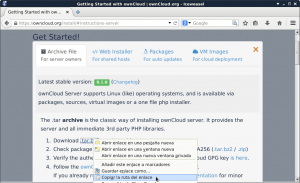](images/2-Ruta-de-descarga-de-Owncloud.png)

Seguidamente **en la terminal**, y dentro de la ubicación /home/owncloud, **tecleamos el comando wget y seguidamente pegamos la dirección de descarga de owncloud**. Por lo tanto en mi caso el comando para descargar owncloud es el siguiente:

> ```
> wget https://download.owncloud.org/community/owncloud-8.0.3.tar.bz2
> ```

Una vez descargado Owncloud lo **descomprimimos mediante el siguiente comando**:

> ```
> tar -xvf owncloud-8.0.3.tar.bz2
> ```

###### Nota: En el proceso de descarga no contemplo la explicación de como comprobar la integridad del archivo descargado ya que la comprobación no es necesaria para instalar Owncloud. La comprobación solo es necesaria para asegurar que los archivos de Owncloud descargados no hayan sido manipulados por un tercero.

## MOVER OWNCLOUD A NUESTRO SERVIDOR WEB

Una vez descargado y descomprimido Owncloud, ahora hay que mover la totalidad de archivos descomprimidos a nuestro servidor web. Para ello, dentro de la ubicación /home/owncloud, hay que **ejecutar el siguiente comando**:

> ```
> mv owncloud /var/www/html/
> ```

## PREPARAR UNA BASE DE DATOS PARA OWNCLOUD

La base de datos para Owncloud la crearemos con phpmyadmin. Por lo tanto el primer paso que tenemos que realizar es **acceder a phpmyadmin**. Para acceder a phpmyadmin lo haremos remotamente a través de un equipo que esté en la misma red local que nuestro servidor web. Por lo tanto en un ordenador diferente al que tenemos instalado el servidor web **introducimos la siguiente dirección en el navegador web**:

http://192.168.1.96/phpmyadmin

###### Nota: La dirección de acceso de phpmyadmin es posible que sea diferente en vuestro caso. La dirección depende de la ip interna del servidor web.

Una vez dentro de la pantalla de login, tal y como se puede ver en la captura de pantalla, **introducimos el usuario y la contraseña** de phpmyadmin y **presionamos le botón** **Continuar**:

[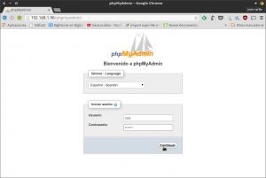](images/3-Acceder-a-phpmyadmin.png)

Seguidamente, tal y como se puede ver en la captura de pantalla, **presionamos el botón Bases de datos**

[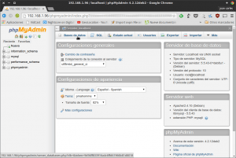](images/4-Acceder-a-base-de-Datos.png)

El siguiente paso, tal y como se puede ver en la captura de pantalla, es **poner un nombre a la base de datos**. Después de poner el nombre, que en mi caso es **owncloud**, hay que **presionar encima del botón Crear**.

[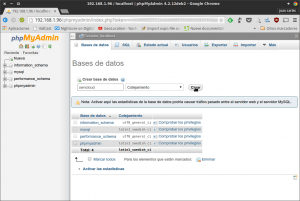](images/5-Crear-base-de-datos-para-Owncloud.png)

Ahora tenemos que acceder a la base de datos que acabamos de crear. Para ello, tal y como se puede ver en la captura de pantalla, **clicamos encima del nombre de nuestra base de datos**:

[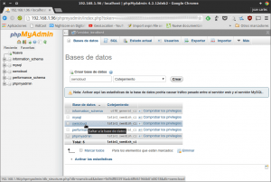](images/6-Acceder-a-la-base-de-datos.png)

Una vez dentro de nuestra base de datos, tal y como se puede ver en la captura de pantalla, **cliamos encima de la pestaña** **Privilegios**:

[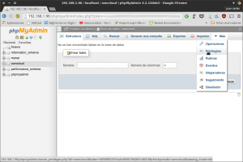](images/7-Acceder-a-privilegios.png)

Seguidamente creamos un usuario. Para ello, tal y como se puede ver en la captura de pantalla, lo primero que tenemos que hacer es **clicar encima de** **Agregar usuario**:

[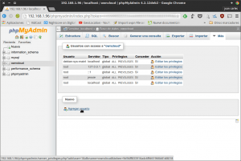](images/8-Crear-un-usuario.png)

Después de clicar encima de la pestaña agregar usuario, tal y como se puede ver en la captura de pantalla, tenemos que **seleccionar el nombre del usuario, el tipo de servidor y la contraseña del usuario**.

[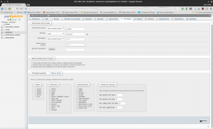](images/9-Configuración-del-usuario.png)

En el **campo Nombre de usuario** pueden elegir el nombre de usuario que deseen.

En el **campo Servidor**, tienen que indicar que se trata de un servidor local, para ello en el desplegable Servidor hay que **seleccionar la opción** **Local**.

En el **campo Contraseña** hay que indicar la contraseña de usuario que quieran mientras que **en el campo Debe volver a escribir** tendremos que repetir de nuevo la contraseña de usuario.

En el **apartado Base de datos para el usuario**, tenéis que asegurar que la opción **Otorgar todos los privilegios para la base de datos “nombre de vuestra base”** este marcada

Finalmente una vez rellenados todos los datos tan solo hay que **presionar encima del botón** **Continuar**.

## OTORGAR LOS PERMISOS NECESARIOS PARA EL FUNCIONAMIENTO

Para que el funcionamiento de owncloud sea correcto tenemos que otorgar los permisos adecuados a las carpetas donde ubicamos e instalamos owncloud.

Para ello en el servidor web cambiamos los permisos de forma recursiva de la carpeta /var/www/html/owncloud ejecutando el siguiente comando en la terminal.

> ```
> chmod 0755 /var/www/html/owncloud -R
> ```

###### Nota: Asignando los permisos 0755 aseguramos que el propietario de los archivos dispone de la totalidad de permisos, mientras que los que no son propietarios únicamente podrán visualizar y ejecutar los archivos.

Seguidamente asignamos un grupo y un usuario de forma recursiva a la carpeta donde figuran la totalidad de archivos de owncloud. Par ello ejecutamos el siguiente comando en la terminal:

> ```
> chown -R www-data:www-data /var/www/html/owncloud/
> ```

Ejecutando este comando la totalidad de archivos de instalación de owncloud perteneceran al usuario www-data y al grupo www-data.

Por motivos de seguridad quiero que la ubicación del almacenamiento de los archivos de los usuarios de Owncloud sea fuera de la ruta de instalación de Owncloud. Para ello crearemos la carpeta datosowncloud en nuestra ubicación home que es la que almacenará los datos de los distintos usuarios de la nube. Para crear la carpeta datosowncloud ejecutamos el siguiente comando en la terminal:

> ```
> mkdir /home/datosowncloud
> ```

Seguidamente otorgaremos los permisos necesarios a la carpeta datosowncloud ejecutando el siguiente comando en la terminal:

> ```
> chmod 0755 /home/datosowncloud -R
> ```

###### Nota: Asignando los permisos 0755 aseguramos que el propietario de los archivos almacenados en la nube dispone de la totalidad de permisos, mientras que los que no son propietarios únicamente podrán visualizar y ejecutar los archivos.

Finalmente asignamos un grupo y un usuario de forma recursiva a la carpeta que almacenará los datos de los clientes de nuestra nube owncloud. Para ello ejecutamos el siguiente comando en la terminal:

> ```
> chown -R www-data:www-data /home/datosowncloud/
> ```

En estos momentos ya podemos abrir el navegador y probar si nuestro servidor owncloud funciona.

## EJECUCIÓN POR PRIMERA VEZ DEL SERVIDOR OWNCLOUD

Ha llegado la hora de intentar iniciar owncloud por primera vez. Para ello en un equipo que esté conectado en la misma red local que el servidor, abrimos el navegador y tecleamos la ip del servidor seguida de una barra y la palabra owncloud:

http://192.168.1.96/owncloud

Al presionar Enter es probable que obtengan el error que se muestra en la siguiente captura de pantalla:

[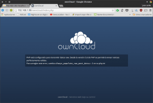](images/10-Acceder-a-Owncloud-con-error.png)

Para solucionar el error **“PHP está configurado para transmitir datos raw”**, tal y como nos indica el texto del error, tecleamos el siguiente comando en la terminal del servidor donde se halla instalado owncloud:

> ```
> nano /etc/php5/apache2/php.ini
> ```

Una vez abierto el editor de textos nano tenemos que localizar la siguiente línea:

> ```
> ;always_populate_raw_post_data a -1
> ```

Una vez localizada la cambiamos por esta:

> ```
> always_populate_raw_post_data a -1
> ```

Guardamos los cambios, cerramos el archivo y seguidamente tecleamos el siguiente comando en la terminal para reiniciar nuestro servidor web:

> ```
> service apache2 restart
> ```

Ahora si intentamos acceder de nuevo al servidor owncloud tenemos que obtener el siguiente resultado:

[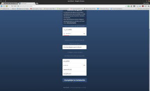](images/11-Completar-la-instalación-de-Owncloud.png)

###### Nota: En la captura de pantalla se puede ver una advertencia de seguridad. Si os aparece no es tenéis que preocupar. Este problema lo solucionaremos más adelante.

Tal y como se puede ver en la captura de pantalla, **en el apartado Crear una cuenta de administrador** hay que introducir el nombre de usuario y contraseña del que será el administrador de la nube. Obviamente podéis seleccionar el nombre de usuario y contraseña que queráis.

Seguidamente **en el apartado Directorio de datos** especificamos la ubicación de almacenamiento que queramos que tenga la información que subimos/almacenamos a owncloud. Puede ser un disco duro externo incluso o nuestro mismo disco duro. **En mi caso**, tal y como hemos visto en apartados anteriores **elegiré la ubicación /home/datosowncloud**. Por cuestiones de seguridad no es recomendable usar la ubicación de almacenamiento predeterminada.

Finalmente, **en el apartado Configurar Base de Datos** introducimos el nombre del usuario de base de datos que hemos creado antes y ponemos su contraseña. Seguidamente ponemos el nombre de la base de datos y el tipo de servidor que en nuestro caso es Localhost.

Finalmente tan solo falta **presionar el botón Completar la instalación** para finalizar el proceso de instalación y obtener el siguiente resultado:

[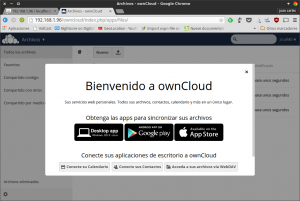](images/12-Owncloud-funcionando.png)

En estos momentos ya podemos acceder al servidor owncloud desde nuestra red local. Ahora intentaremos acceder a él conectándonos desde el exterior. Por lo tanto en mi caso abro el navegador de mi teléfono y visito la siguiente URL:

http://geekland.sytes.net/owncloud

###### Nota: La URL de acceso dependerá del dominio NO-IP que hayáis seleccionado.

En el momento de acceder lo más probable es que obtengan el error que se muestra en la captura de pantalla:

[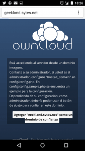](images/13-Owncloud-Dominio-inseguro.png)

**Para solucionar el error** **“Está accediendo al servidor desde un dominio inseguro”** hay que teclear el siguiente comando en la terminal del servidor donde se halla instalado Owncloud:

> ```
> nano /var/www/html/owncloud/config/config.php
> ```

Una vez abierto el fichero config.php tendremos que editarlo para añadir el dominio de confianza. Tendremos que **localizar apartado trusted\_domains**. Dentro de este apartado tendremos **añadir el siguiente comando para introducir un dominio de confianza**:

> ```
> 1 => 'geekland.sytes.net',
> ```

###### Nota: Al introducir este comando deberéis sustituir geekland.sytes.net por el dominio no-ip que estáis usando.

Después de añadir el dominio de confianza, que en mi caso es geekland.sytes.net, el fichero config.php tiene que tener un aspecto similar al siguiente:

[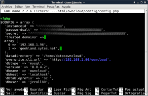](images/14-Agregar-dominio-seguros-Owncloud.png)

Si el contenido ha sido añadido correctamente guardamos los cambios y cerramos el fichero. Ahora si intentamos acceder de nuevo al servidor veremos que ya no se produce el error:

[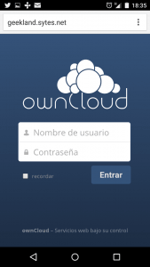](images/15-Acceder-a-Owncloud-fuera-red-local.png)

Por lo tanto a estas alturas tenemos configurado el servidor owncloud para acceder desde nuestra red local y desde el exterior de nuestra red local.

## CONFIGURAR EL SERVIDOR APACHE

En estos momentos Owncloud es funcional. No obstante si os importa la seguridad y sacar el máximo partido al servidor es indispensable implementar los siguientes pasos adicionales:

### Hacer que apache utilice el fichero .htaccess

**Las instrucciones de este apartado tan solo hay que aplicarlas en el caso que en uno de los apartados de la instalación hayan visto un mensaje que decía lo siguiente:**

“Su directorio de datos y sus archivos probablemente sean accesibles a través de internet ya que su archivo .htaccess no funciona”

Para solucionar este problema tenemos que configurar Apache para que no ignore las instrucciones contenidas en el archivo .htacces. Para ello en el servidor Owncloud tecleamos el siguiente comando en la terminal:

> ```
> nano /etc/apache2/sites-enabled/000-default.conf
> ```

Cuando se abra el editor de texto nano, hay que localizar la siguiente línea:

> ```
> DocumentRoot /var/www/html
> ```

Justo por debajo de esta linea hay que añadir el siguiente código:

> ```
> <Directory "/var/www/html">
> AllowOverride All
> </Directory>
> ```

###### Nota: La directiva AllowOverride es la que indica si se debe ignorar el código presente en el archivo .htaccess. Al atribuir el valor All el servidor apache tendrá en cuenta la totalidad de directivas incluidas en el archivo .htacess.

Una vez introducidos los cambios el fichero **000-default.conf** tendrá una aspecto parecido al siguiente:

[](images/16-htaccess-en-owncloud.png)

En estos momentos tan solo tenemos que guardar los cambios y cerrar el fichero.

### Activar los módulos rewrite y headers

El siguiente paso es activar los moulos rewrite y headers. Para activar estos 2 módulos hay que ejecutar los siguientes comandos en la terminal del servidor Owncloud:

> ```
> a2enmod rewrite
> ```
> 
> ```
> a2enmod headers
> ```

Una vez activados los módulos tan solo tenemos que reiniciar el servidor apache introduciendo el siguiente comando en la terminal:

> ```
> service apache2 restart
> ```

###### Nota: La función de módulo rewrite es hacer que las URL se puedan reescribir haciéndolas más amigables y más sencillas.

###### Nota: La función del módulo headers es modificar las cabeceras http mediante la directriz header.

### Modificar el tamaño máximo de subida de archivos en la nube

Con la configuración estándar del servidor no podremos subir ficheros de más de 2 MB. Para modificar este aspecto tenemos que modificar la configuración de PHP ejecutando el siguiente comando en la terminal:

> ```
> nano /etc/php5/apache2/php.ini
> ```

Una vez abierto el editor de textos nano localizamos la siguientes líneas:

> ```
> upload_max_filesize = 2M
> ```
> 
> ```
> post_max_size = 8M
> ```

Una vez localizadas modificamos sus valores por los siguientes:

> ```
> upload_max_filesize = 2048M
> ```
> 
> ```
> post_max_size = 2500M
> ```

###### Nota: El valor de post\_max\_size tiene que ser mayor al de upload\_max\_size. El motivo es que upload\_max\_size es el tamaño máximo permitido del fichero que vamos a subir, mientras que post\_max\_size hace referencia al tamaño máximo de la petición de subida global.

Una vez realizados los cambios tan solo hay que guardarlos y cerrar el fichero.

Seguidamente tenemos que configurar el archivo .htaccess. Para ello tecleamos el siguiente comando en la terminal:

> ```
> nano /var/www/html/owncloud/.htaccess
> ```

Una vez abierto el editor textos nano localizamos las siguientes lineas:

> ```
> php_value upload_max_filesize 513M
> ```
> 
> ```
> php_value post_max_size 513
> ```

Una vez localizadas modificamos sus valores por los siguientes:

> ```
> php_value upload_max_filesize 2048M
> ```
> 
> ```
> php_value post_max_size 2500
> ```

###### Nota: Los valores seleccionados deben ser los mismos que los indicados en el fichero /etc/php5/apache2/php.ini.

Una vez realizados los cambios tan solo hay que guardarlos y cerrar el archivo. Seguidamente tecleamos el siguiente comando en la terminal para reiniciar nuestro servidor web:

> ```
> service apache2 restart
> ```

Después de realizar estos pasos seremos capaces de subir archivos de 2 GB en nuestra nube personal Owncloud.

## CONFIGURAR SSL HTTPS EN OWNCLOUD

Si os fijáis la dirección Owncloud es del tipo http Por lo tanto el tráfico generado entre cliente y servidor no está cifrado. Si queremos añadir una capa de seguridad tan solo tenemos que seguir los siguientes pasos. Primeramente tenemos que asegurar que el paquete openssl está instalado ejecutando el siguiente comando en la terminal:

> ```
> apt-get install openssl
> ```

### Activar el módulo ssl en el servidor apache

El siguiente paso es activar el módulo ssl de apache. Para ello tecleamos el siguiente comando en la terminal:

> ```
> a2enmod ssl
> ```

### Modificar la configuración de ssl

A continuación editaremos el fichero de configuración de openssl para alargar la caducidad del certificado ssl que vamos a generar, y para cambiar la ubicación donde se guardará el certificado que generaremos. Para ello ejecutamos el siguiente comando en la terminal:

```
nano /etc/ssl/openssl.cnf
```

Una vez abierto el editor de textos nano localizamos las siguientes líneas:

> ```
>  dir = ./demoCA
>  default_days = 365
> ```

Una vez localizadas cambiamos sus valores por los siguientes:

> ```
>  dir = /root/SSLCertAuth
>  default_days = 3650
> ```

Una vez aplicados los cambios los guardamos y cerramos el fichero. En estos momentos cuando creemos el certificado se almacenará en la carpeta /root/SSLCertAuth y tendrá una vigencia de 3650 días (10 años).

### Creación de carpetas y archivos para generar el certificado ssl

Ahora creamos y configuramos los directorios donde vamos a crear los certificados. Para ello ejecutamos el siguiente comando en la terminal:

> ```
> mkdir /root/SSLCertAut
> ```

El siguiente paso es hacer que únicamente el usuario propietario, que en mi caso es root, tenga permisos de lectura, escritura y ejecución sobre la carpeta /root/SSLCertAut. Para ello ejecutamos el siguiente comando en la terminal:

> ```
> chmod 700 /root/SSLCertAuth
> ```

Accedemos dentro de la carpeta /root/SSLCertAuth ejecutando el siguiente comando en la terminal:

> ```
> cd /root/SSLCertAuth
> ```

Seguidamente tenemos que crear una serie de carpetas que son necesarias para que openssl pueda generar nuestras claves y certificados. Para ello ejecutamos el siguiente comando en la terminal:

> ```
> mkdir certs private newcerts
> ```

Una vez creadas las carpetas certs, private y newcerts, crearemos el fichero indext.txt y el fichero serial con un valor de 1000. Para ello introduciremos los siguientes comandos en la terminal:

> ```
> echo 1000 > serial
> ```
> 
> ```
> touch index.txt
> ```

###### Nota: El fichero index.txt contendrá una base de datos de los certificados generados. El fichero serial se usará para generar el número de serie del certificado que vamos a generar.

### Crear una autoridad de certificación

Es necesario crear una autoridad de certificación para generar un certificado. Para crear nuestra propia autoridad de certificación tenemos que teclear el siguiente comando en la terminal:

> ```
> openssl req -new -x509 -days 3650 -extensions v3_ca \-keyout private/cakey.pem -out cacert.pem \-config /etc/ssl/openssl.cnf
> ```

Al ejecutar el comando lo primero que se nos pregunta es una clave. Esta clave tenemos recordarla y se nos preguntará cada vez que firmemos un certificado. Seguidamente nos pedirá que reconfirmemos la clave que acabamos de elegir.

Seguidamente, tal y como se puede ver en la captura de pantalla, nos irá haciendo preguntas. Las vamos respondiendo una tras otra teniendo **especial cuidado en el campo common name que tendrá que ser el fqdn (fully qualified name). En mi caso el common name (fqdn) es geekland.sytes.net**.

[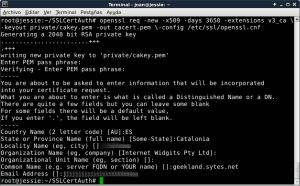](images/17-Crear-autoridad-de-certificación.png)

Una vez creada la autoridad de certificación, dentro de la ubicación /root/SSLCertAuth podrán encontrar los archivos cakey.pem y cacert.pem. Estos archivos hay conservarlos ya que serán necesarios para crear nuestros certificados.

### Crear una solicitud de firma

Ahora creamos una clave privada y la solicitud de firma del certificado (CSR). Para ello introduciremos el siguiente comando en la terminal:

> ```
> openssl req -new -nodes \-out apache-req.pem \-keyout private/apache-key.pem \-config /etc/ssl/openssl.cnf
> ```

Después de ejecutar el comando, tal y como se puede ver en la captura de pantalla, se nos irá haciendo preguntas. Las vamos respondiendo una tras otra teniendo **especial cuidado en el campo common name que tendrá que ser el fqdn (fully qualified name). En mi caso el common name (fqdn) es geekland.sytes.net**.

[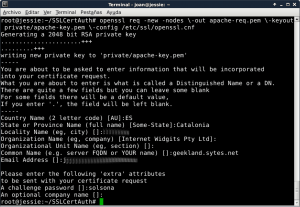](images/18-Crear-un-solicitud-de-firma.png)

En la parte final de las preguntas se nos pregunta un password. Este password será para proteger la clave privada que estamos creando. Esta clave privada será usada más adelante en el proceso de autenticación SSL.

Una vez finalizado el proceso en la ubicación /root/SSLCertAuth dispondremos de los siguientes archivos:

**apache-req.pem:** Es el archivo que contiene la solicitud de firma del certificado.

**apache-key.pem:** Es la clave privada que hemos generado. Está clave privada se usa para el proceso de autentificación SSL de los usuarios que se conectan al servidor de owncloud.

### Crear y firmar el certificado ssl

Finalmente tan solo hay que generar nuestro propio certificado autofirmado. Para ello tecleamos el siguiente comando en la terminal:

> ```
> openssl ca \-config /etc/ssl/openssl.cnf \-out apache-cert.pem \-infiles apache-req.pem
> ```

Al ejecutar el comando se nos preguntará la clave que fijamos en el apartado de crear una autoridad de certificación. La introducimos y presionamos Enter. Seguidamente se nos preguntará si queremos firmar el certificado e introducirlo en la base de datos. En ambos casos respondemos que Sí. Después de realizar estos pasos, tal y como se puede ver en la captura de pantalla, el proceso ha terminado:

[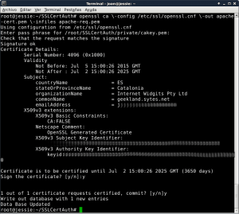](images/19-Crear-y-firmar-el-certificado-ssl.png)

Para confirmar que el proceso ha finalizado, en la ubicación /root/SSLCertAuth, tenemos que comprobar que esté presente el archivo apache-cert.pem que será el certificado SSL que hemos creado.

### Copiar las claves y certificados en las ubicaciones correspondientes

Otro de los pasos a realizar es copiar el certificado y la clave privada que acabamos de generar en una ubicación apropiada. Para ello creamos las carpetas que contendrán el certificado y la clave introduciendo los siguientes comandos en la terminal:

> ```
> mkdir /etc/ssl/crt
> ```
> 
> ```
> mkdir /etc/ssl/key
> ```

Seguidamente copiamos la clave y el certificado que hemos generado dentro de las carpetas que acabamos de crear introduciendo los siguientes comandos en la terminal:

> ```
> cp /root/SSLCertAuth/apache-cert.pem /etc/ssl/crt
> ```
> 
> ```
> cp /root/SSLCertAuth/private/apache-key.pem /etc/ssl/key
> ```

### Configurar apache para que use https

Uno de los últimos pasos es configurar apache para que pueda utilizar https. Para ello editamos el archivo default-ssl.conf ejecutando el siguiente comando en la terminal:

> ```
> nano /etc/apache2/sites-available/default-ssl.conf
> ```

Una vez abierto el editor de textos nano, tenemos que asegurar que el archivo default-ssl.conf contenga la siguiente información:

> ```
> ServerName geekland.sytes.net (usar vuestro fdqn)
> DocumentRoot /var/www/html
> ```
> 
> ```
> <Directory /var/www/html/owncloud> (usar vuestra ruta de instalación de owncloud)
> AllowOverride All
> </Directory>
> ```
> 
> ```
> <Directory /home/datosowncloud> (usar vuestra ruta de almacenamiento de datos de Owncloud)
> AllowOverride All
> </Directory>
> ```
> 
> ```
> SSLEngine on
> ```
> 
> ```
> SSLCertificateFile /etc/ssl/crt/apache-cert.pem (usar la ruta de vuestro certificado)
> SSLCertificateKeyFile /etc/ssl/key/apache-key.pem (usar la ruta de vuestra clave privada)
> ```
> 
> ```
> ErrorLog ${APACHE_LOG_DIR}/error_log (usar la ruta que queráis para almacenar los logs)
> CustomLog ${APACHE_LOG_DIR}/access.log combined (usar la ruta que queráis para almacenar los logs)
> 
> ```

 

Una vez aplicados los cambios el archivo default-ssl.conf deberá tener un aspecto parecido al siguiente:

[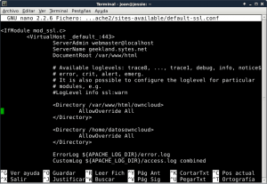](images/20-Configurar-https.png)

Si el contenido de la captura de la pantalla es similar tan solo tenemos que guardar los cambios y cerrar el fichero.

Seguidamente crearemos un enlace simbólico del archivo /etc/apache2/sites-available/default-ssl.conf en la ubicación /etc/apache2/sites-enabled/. Para ello ejecutamos el siguiente comando en la terminal:

> ```
> ln -s /etc/apache2/sites-available/default-ssl.conf /etc/apache2/sites-enabled/default-ssl.conf
> ```

Una vez creado el enlace simbólico, el servicio https está activado. Finalmente tan solo tenemos que reiniciar el servidor apache ejecutando el siguiente comando en la terminal:

> ```
> service apache2 restart
> ```

### Configurar Owncloud para que use https

En estos momentos ya podemos intentar acceder a owncloud mediante https. Para ello en un equipo perteneciente a nuestra red local, abrimos el navegador y tecleamos la siguiente url:

https://192.168.1.96/owncloud

###### Nota: La URL de acceso dependerá de la ip interna del servidor que tiene instalado Owncloud.

Después de acceder la URL indicada nos aparecerá la advertencia que la conexión no está verificada:

[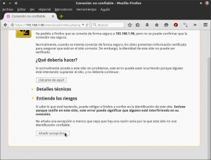](images/21-Añadir-excepciones-certificados.png)

Esta advertencia es completamente normal. El motivo de la advertencia es porqué hemos sido nosotros mismos quien ha creado y firmado el certificado ssl, y obviamente nosotros no somos una autoridad certificadora verificada/reconocida. Lo único que tenemos hacer para solucionar este problema es clicar en el apartado **Entiendo los riesgos**, y seguidamente clicar en el apartado **Añadir excepción**. Después de clicar en Añadir excepción aparecerá la siguiente ventana:

[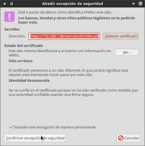](images/22-Agregar-Excepción.png)

Presionamos encima del botón **Confirmar excepción de seguridad** y ya podremos acceder a nuestro servidor Owncloud. Una vez dentro de nuestro servidor Owncloud, tal y como se puede ver en la captura de pantalla, accedemos al menú de **Administración**:

[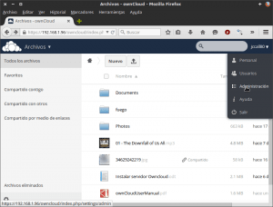](images/23-Acceso-administración.png)

Una vez dentro del menú de administración, tal y como se puede ver en la captura de pantalla, dentro del apartado de seguridad tenemos que marcar la opción **Forzar HTTPS**.

[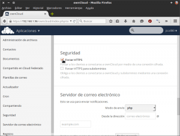](images/24-Forzar-HTTPS.png)

Después de marcar esta opción, únicamente se podrá acceder al servidor owncloud mediante https.

###### Nota: Este apartado se ha realizado usando el navegador Firefox. También se puede realizar usando Google Chrome siguiendo los pasos equivalentes que en sí son intuitivos.

## ACCEDER A OWNCLOUD A TRAVÉS DE WEBDAV

Con Webdav podemos conectarnos, editar y ver el contenido a nuestra nube personal owncloud tal y como si se tratará de un disco duro de red en nuestro gestor de archivos.

Para hacer posible lo que acabo de comentar no hay que configurar nada en especial ya que Owncloud dispone de un servidor WebDAV incorporado de serie.

Para conectarnos a nuestra nube a través de webDAV escribiré un post en las próximas semanas. En el veremos como podemos conectarnos a nuestra nube a través de Android, Linux y Windows.

## INSTALAR CLIENTES EN EL ORDENADOR Y EN LOS TELEFONOS

Existen clientes de escritorio de Owncloud para Windows, Android, iOS, Linux y MacOSX. En futuros post detallaremos como podemos instalar fácilmente el cliente de Owncloud en cada uno de los sistemas operativos citados.

## FUENTES

[https://doc.owncloud.org/server/8.0/admin\_manual/installation/source\_installation.html](https://doc.owncloud.org/server/8.0/admin_manual/installation/source_installation.html "Manual de referencia seguido para realizar el tutorial")
