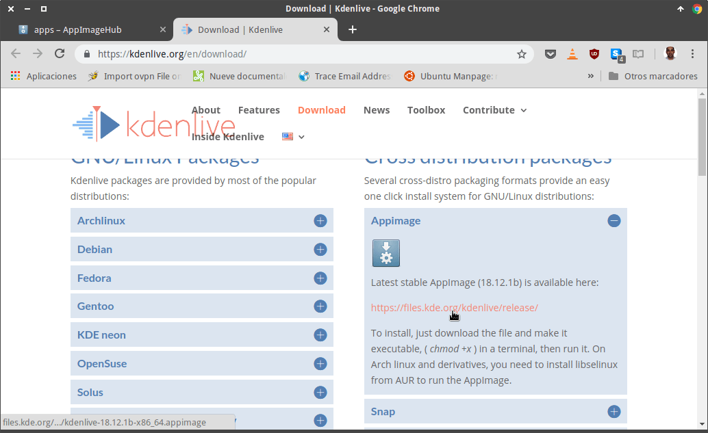
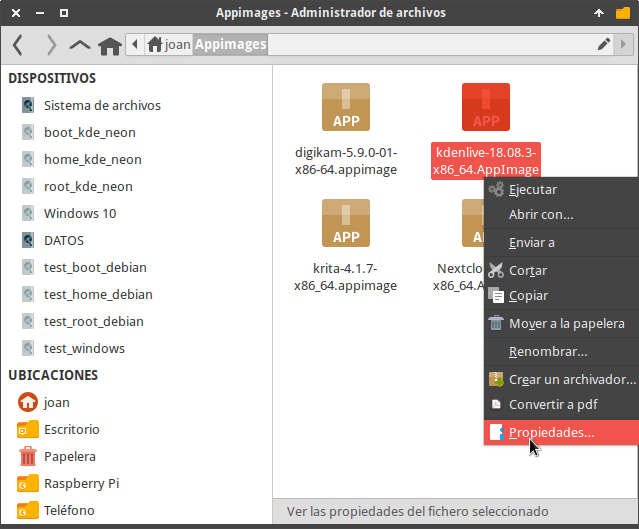
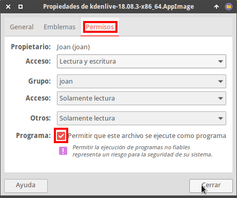
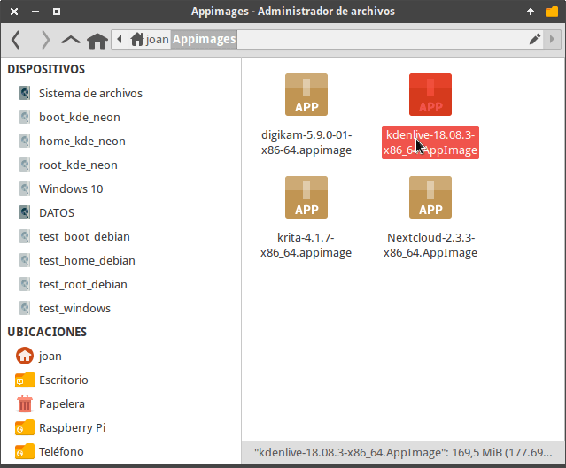
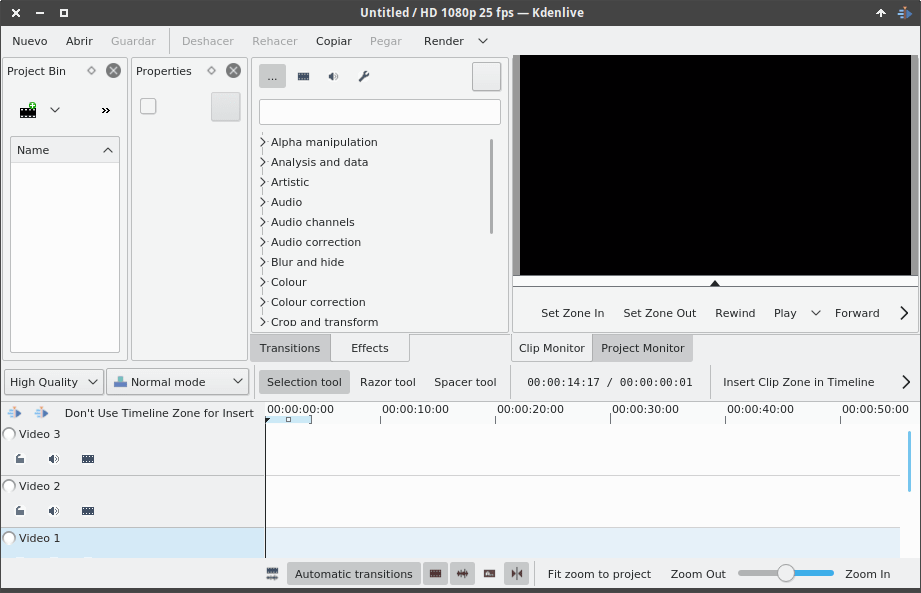
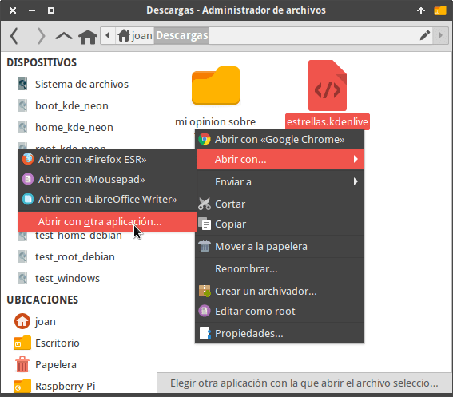
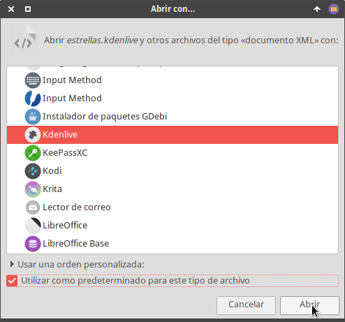

En el transcurso del artículo detallaremos la totalidad de aspectos que tenemos que conocer sobres los paquetes AppImage.<!--more-->

## ¿QUÉ SON LOS PAQUETES APPIMAGE?

Son paquetes que tienen una función similar a:

1. Las aplicaciones portables de Windows.
2. Los archivos .dmg de MacOS.

Todos y cada unos de los paquetes AppImage tienen las siguientes propiedades:

1. **Son archivos binarios**, pero en vez de tener la extensión .exe o .dmg tienen la extensión .AppImage.
2. Al ejecutarlos se automonta una imagen ISO comprimida que contiene un programa y la totalidad de librerías para que el programa funcione de forma independiente. Una vez montada la imagen se ejecutará el contenido de la imagen y por lo tanto se abrirá el programa.
3. Un archivo .AppImage **tan solo puede contener un programa**. Al hacer doble clic sobre el paquete se abrirá el programa.
4. Los programas encapsulados dentro de un paquete .AppImage **se pueden ejecutar en la totalidad de distribuciones Linux**.
5. Nos permiten instalar y usar un programa sin necesidad de otorgar permisos de administración.
6. **Contienen la totalidad de librerías para que un programa funcione de forma autónoma** y adecuada. Por lo tanto, los programas se pueden usar sin depender de las librerías que tenga nuestro distribución.

Por lo tanto los programas encapsulados en paquetes AppImage nos permitirán distribuir y usar programas en cualquier distribución Linux de forma sencilla y segura.

## FUENTES PARA DESCARGAR PAQUETES APPIMAGE

En este apartado seré claro y conciso. **Únicamente descarguen paquetes AppImage de la web del desarrollador** de la aplicación. Por razones obvias no es seguro descargar programas de fuentes desconocidas.

A continuación les dejo enlaces confiables para que podáis descargar e instalar algunas de las aplicaciones más conocidas en Linux:

1. [Nextcloud](https://nextcloud.com/install/#).
2. [Krita](https://krita.org/en/download/krita-desktop/).
3. [LibreOffice](https://www.libreoffice.org/download/appimage/).
4. [Ultimaker Cura](https://ultimaker.com/en/products/ultimaker-cura-software).
5. [Kdenlive](https://kdenlive.org/en/download/).
6. [Inkscape](https://inkscape.org/es/release/0.92.3/gnulinux/).
7. [DigiKam](https://www.digikam.org/download/).
8. [MuseScore](https://musescore.org/es/download).
9. [LMMS](https://lmms.io/download/#linux).
10. [Wechat](https://github.com/trazyn/weweChat/releases).
11. [Scribus](https://www.scribus.net/downloads/unstable-branch/).
12. Etc.

Aunque no sea la opción más recomendable, también **existe la opción de usar un repositorio central de aplicaciones**. Para visitarlo tan solo tienen que acceder la web de [AppImageHub](https://appimage.github.io/apps/).

## INSTALAR UN PROGRAMA MEDIANTE PAQUETES APPIMAGE

La forma más sencilla para poder instalar un paquete AppImage es la que veremos a continuación.

### Descargar el paquete .Appimage

En mi caso pretendo instalar el programa Kdenlive. Por lo tanto me dirijo a la web oficial de los desarrolladores y [descargo el paquete](https://kdenlive.org/en/download/) en formato AppImage.

[](images/descargar-paquete-appimage-kdenlive.png)

Una vez descargado lo guardamos en una ubicación que sea fácil de recordar y localizar. En mi caso guardo la totalidad de paquetes en la ubicación **~/Appimages**

### Dar los permisos pertinentes al paquete AppImage

A continuación vamos a la ubicación donde hemos guardado el paquete AppImage de Kdenlive. Lo seleccionamos, presionamos el botón derecho del ratón y cuando aparezca el menú contextual clicamos sobre la opción **Propiedades**.

[](images/propiedades-appimage-kdenlive.png)

A continuación, en la ventana Propiedades clicamos la pestaña **Permisos**. En la pestaña **Permisos** tildamos la opción **Permitir que este archivo se ejecute como programa**. Finalmente presionamos el botón **Cerrar**. De este modo tan sencillo ya hemos otorgado los permisos de ejecución necesarios.

[](images/permisos-ejecucion-kdenlive.png)

Si lo prefieren también pueden dar permisos de ejecución al archivo mediante la terminal. Para ello tienen que ejecutar un comando del siguiente tipo:

> ```
> chmod a+x nombre_paquete.AppImage
> ```

Por lo tanto, en mi caso tendría que utilizar el siguiente comando:

> ```
> chmod a+x kdenlive-18.08.3-x86_64.AppImage
> ```

### Ejecutar el programa Appimage

A estas alturas ya podemos ejecutar el programa Kdenlive. Para ello tan solo tenemos que hacer doble click sobre el paquete .AppImage de Kdenlive.

[](images/ejecutar-appimage-kdenlive.png)

Acto seguido podremos usar Kdenlive sin ningún tipo de problema.

[](images/usando-kdenlive.png)

###### Nota: Las imágenes contenidas en paquetes AppImage se automontan usando FUSE. Por lo tanto, antes de ejecutar el programa aseguren que tienen instalado el paquete fuse en su equipo.

### Integrar kdenlive en el menú de nuestra distribución

Existen programas que se integran en el menú de forma automática, pero también existen muchos, como por ejemplo kdenlive, que no.

Si queremos introducir un programa en el menú de nuestra distribución tan solo tenemos que seguir las instrucciones del siguiente enlace:

https://geeklandlinux.github.io/posts/editar-el-menu-linux-menulibre/

### Hacer que una extensión de archivo se abra con un programa instalado a través de un AppImage

Para conseguir que un archivo con la extensión .kdenlive se abra con el programa kdenlive tenemos que proceder del siguiente modo. Seleccionamos el archivo con extensión .kdenlive y presionamos el botón derecho del ratón. Cuando se abra el menú contextual seleccionamos la opción **Abrir con…** y acto seguido clicamos sobre la opción **Abrir con otra aplicación...**

[](images/abrir-con-otra-aplicacion.png)

A continuación seleccionamos la aplicación con que queremos abrir el archivo y tildamos la opción **Utilizar como predeterminado para este tipo de archivo**. Finalmente tan solo tenemos que presionar el botón **Abrir**.

[](images/seleccionar-programa.png)

A partir de estos momentos, todas las veces que hagamos doble click sobre un archivo con extensión .kdenlive se abrirá el archivo con el programa kdenlive.

###### Nota: El procedimiento de este apartado es válido para el escritorio XFCE. Para otros escritorio el procedimiento será similar.

### Abrir un programa dentro un entorno controlado Sandbox

Afortunadamente [Firejail]() es compatible con el formato AppImage. Por lo tanto podemos abrir programas empaquetados en paquetes AppImage dentro de un entorno controlado.

Para ello lo primero que tenemos instalar Firejail ejecutando el siguiente comando en la terminal:

> ```
> sudo apt-get install firejail
> ```

Acto seguido ya podremos abrir el programa dentro del sandbox ejecutando un comando del siguiente tipo en la terminal:

> ```
> firejail --appimage nombre_paquete.Appimage
> ```

Por lo tanto si quiero abrir kdenlive dentro de un sandbox tan solo tengo que ejecutar el siguiente comando en la terminal:

> ```
> firejail --appimage kdenlive-18.08.3-x86_64.AppImage
> ```

## ACTUALIZAR LOS PROGRAMAS EN FORMATO APPIMAGE

Existen programas que son capaces de auto-actualizarse. También existen programas como [AppImageUpdate](https://github.com/AppImage/AppImageUpdate) que pretenden facilitar la actualización de los programas.

No obstante, en mi caso ninguna de las 2 opciones funciona de forma adecuada. Ambas opciones considero que están verdes. Por esto motivo **mi recomendación es que actualicen los paquetes de forma manual**.

En el momento que exista una nueva actualización sigan los siguientes pasos:

1. Descarguen la versión actualizada del programa que precisan actualizar.
2. Otorguen los permisos necesarios al archivo AppImage que contiene el programa actualizado.
3. Reemplacen el archivo AppImage viejo por el nuevo que acaban de descargar. Tengan presente que el archivo AppImage nuevo tiene que tener el mismo nombre que el archivo AppImage viejo.

De esta forma sencilla, pero manual, podrán realizar las actualizaciones de los programas.

## INCONVENIENTES DE LOS PAQUETES APPIMAGE FRENTE A LOS REPOSITORIOS TRADICIONALES

Obviamente los paquetes AppImage tienen puntos de mejora. Algunos de los aspectos que no me gustan son los siguientes:

1. Existen actualizaciones incrementales y automáticas. También existen herramientas como [AppImageUpdate](https://github.com/AppImage/AppImageUpdate), pero desafortunadamente las opciones disponibles no me funcionan de forma correcta. Por lo tanto en mi caso realizo las actualizaciones de forma manual.
2. La **integración de las aplicaciones con el escritorio debería ser mejor**. Existen soluciones como [appimaged](https://github.com/AppImage/appimaged) que en teoría solucionan la totalidad de problemas de integración, pero en mi caso esta solución no me funciona. Por lo tanto tengo que realizar la totalidad de tareas de integración de forma manual.
3. Las **aplicaciones tardan más en arrancar**. No obstante una vez iniciadas funcionan de forma extremadamente fluida y correcta.
4. Considero que **los programas alojados en los repositorios de una distro Linux son más seguros** que los que podamos descargar de una web.
5. Aunque es un formato que usa compresión, **los programas ocupan más espacio en el disco duro**. Esto es así porque los paquetes AppImage traen la totalidad de librerías incorporadas para que el programa funcione de forma autónoma.
6. El **número de programas** encapsulados paquetes AppImage **no es muy elevado**.

Por la totalidad de motivos descritos en este apartado prefiero usar los repositorios tradicionales. No obstante hay aplicaciones como kdenlive, DigiKam o el cliente de Nextcloud que prefiero usarlos a través de paquetes Appimage.

## VENTAJAS DE LOS PAQUETES APPIMAGE FRENTE A LOS REPOSITORIOS TRADICIONALES

Los paquetes AppImage contienen la totalidad de librerías para que el programa funcione de forma autónoma y adecuada. Este hecho proporciona las siguientes ventajas:

1. Una **buena opción para instalar una aplicación que requiera de muchas dependencias** que no tenemos instaladas en nuestro ordenador. Por ejemplo podremos usar aplicaciones de KDE en Gnome sin necesidad de instalar las librerías de KDE.
2. **Usar un programa sin necesidad de instalarlo** y sin necesidad de darle permisos de usuario root. Por lo tanto podemos usar y **probar aplicaciones de forma sencilla sin comprometer la seguridad** de nuestro sistema operativo.
3. El programa empaquetado en el formato AppImage **se puede instalar y usar en la totalidad de distribuciones Linux**. Esto es una gran ventaja para los usuarios y los desarrolladores.
4. Si tenemos un dual boot podemos usar el mismo paquete AppImage en ambas distribuciones Linux.
5. Los **programas pueden funcionar de forma estable en sistemas operativos inestables** sin ningún tipo de problema.
6. **Usar programas actuales en distribuciones estables o LTS** como por ejemplo Debian estable o Ubuntu.
7. **Instalar y usar programas que no están en los repositorios** de nuestra distribución Linux.
8. Las posibilidades que un programa funcione de forma fluida y correcta son mucho más elevadas.
9. Eliminamos los problemas de dependencias.
10. **Es portable**. Por lo tanto podemos almacenar nuestros programas en un pendrive y usarlos en cualquier ordenador sin necesidad de instalar nada.

Además el proceso de instalación es similar al que seguiríamos en Windows y en MacOS. Por lo tanto este tipo de paquetes puede rebajar la curva de aprendizaje de los nuevos usuarios de Linux.
