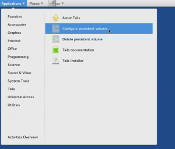
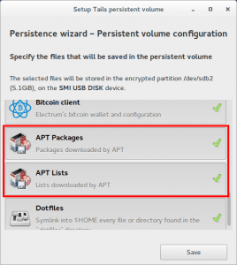
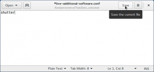

Hace tiempo escribí un detallado post de [como instalar tails]() y poder usar sus funciones de persistencia. No tenia pensado escribir más sobre esta distribución, pero hoy estaba escuchando el podcast del [cangrejo linuxero](https://www.ivoox.com/devuanita-27-tails-sistema-operativo-anonimo-audios-mp3_rf_10261743_1.html "Link para escuchar el podcast del cangrejo Linuxero") y ha dicho que esta distribución no permite instalar software con persistencia y la verdad es que esto no es del todo cierto. Si queréis instalar un software de forma permanente en tails y evitar tener que instalarlo cada vez que abrimos el ordenador lo podemos hacer de la siguiente forma.<!--more-->

## INSTALAR PROGRAMAS CON PERSISTENCIA EN TAILS

Para instalar software de forma permanente o persistente en Tails tenemos que seguir los siguientes pasos.

### Asegurar que tenemos la persistencia activada

Lo primero que tenemos que realizar es asegurar que tenemos la persistencia activada y debidamente configurada. Para ello, tal y como se puede ver en la captura de pantalla, **nos vamos al menú Applications**, dentro del menu Applications **accedemos al submenu Tails** y finalmente **clicamos en la opción Configure persistent volume**.

[](images/Acceder-a-la-configuración-de-persistencia.png)

Una vez hemos accedido dentro de la configuración de la persistencia, tal y como se puede ver en la captura de pantalla, tenemos que **asegurar que las opciones de persistencia APT packages y APT Lists están activadas**.

[](images/Opciones-de-persistencia-que-tienen-que-estar-activadas.png)

**En el caso que no estén activadas las tenemos que activar**. La función que realizan estas 2 características de la persistencia son las siguientes:

**APT Packages:** Activando esta opción, cada vez que instalamos un programa con apt-get o synaptic, se guardaran de forma persistente los paquetes binarios .deb descargados para realizar la instalación a nuestro lápiz USB. Esto es primordial porque cada vez que arranquemos Tails se usarán los paquetes .deb almacenados en el espacio de persistencia para instalar de forma automática el software que queremos.

**APT Lists:** Al activar la opción APT Lists haremos que en el espacio de persistencia se almacene la información descargada cuando usamos el comando apt-get update. Así de este modo cuando arranquemos tails la lista de paquetes que contiene cada repositorio estará actualizada.

###### Nota: En el caso que no tengan activada la persistencia les recomiendo que sigan las instrucciones que se citan en el siguiente [post]().

### Instalar el programa que queremos que sea persistente

Una vez activada la persistencia ya podemos **instalar el software que queremos que sea persistente**. **En mi caso a modo de ejemplo instalaré el software shutter**. Para instalarlo tan solo tenemos que seguir los siguientes pasos:

Para actualizar los repositorios de la distribución **ejecutamos el siguiente comando en la terminal**:

> ```
> sudo apt-get update
> ```

Finalmente para instalar el programa **ejecutamos el siguiente comando en la terminal**:

> ```
> sudo apt-get install shutter
> ```

Una vez ejecutados los comandos el programa se instalará y lo podremos usar sin mayor problema. Además en el espacio de persistencia de nuestra memoria USB quedaran almacenados la totalidad de paquetes usados para instalar Shutter. De esta forma la próxima vez que se arranque Tails se usará esta información para instalar Shutter de forma automática sin que nosotros tengamos que realizar nada.

### Hacer que el programa instalado sea persistente

Una vez activada la persistencia e instalado el software que queremos hacer persistente, **abrimos una terminal y ejecutamos el siguiente comando**:

> ```
> sudo gedit /live/persistence/TailsData_unlocked/live-additional-software.conf
> ```

Una vez ejecutado el comando se abrirá el editor de textos gedit en el que, tal y como se se puede ver en la captura de pantalla, deberemos **escribir el nombre del paquete/programa que queremos que se instale cada vez que arrancamos tails**. **En mi caso**, tal y como se puede ver en la captura de pantalla, **escribo Shutter que es el paquete que justo acabo de instalar**.

[](images/Nombre-de-los-paquetes-a-instalar-cuando-arranque-Tails.png)

Una vez escrito el nombre del programa **guardamos los cambios y cerramos el fichero**. A partir de ahora cada vez que se inicie tails se instalará shutter de forma automática sin que tenga que realizar absolutamente nada. Por lo tanto con este método no estamos instalando el programa de forma persistente, pero a efectos prácticos es como si lo estuviéramos haciendo porque al iniciar Tails se instala Shutter de forma automática sin que tenga que realizar nada.

###### Nota: Si seguimos el procedimiento detallado en este post el arranque de Tails será más lento porque el proceso de arranque incluirá la instalación de todos los programas que nosotros pongamos en la persistencia.

### Fuente

[https://tails.boum.org/doc/first\_steps/persistence/configure/index.en.html](https://tails.boum.org/doc/first_steps/persistence/configure/index.en.html)
