Existen numerosos métodos para instalar Raspbian o cualquier otro sistema operativo en la Raspberry Pi. No obstante el método más sencillo que conozco es usar Raspberry Pi Imager.<!--more-->

Raspberry Pi Imager es un software multiplataforma que de forma totalmente automática descargará e instalará la imagen de Raspbian a la tarjeta SD.

**Nota:** Raspberry Pi Imager se puede usar en Linux, Windows y MacOS.

## INSTALAR RASPBIAN USANDO RASPBERRY PI IMAGER

Para instalar Raspbian mediante el software Raspberry Pi Imager tendremos que seguir las siguientes instrucciones.

### Material mínimo necesario para instalar Raspbian

El material necesario para instalar Raspbian es el que se detalla a continuación:

1. **Una tarjeta micro SD** debidamente formateada con el sistema de archivos FAT32. Recuerden que la tarjeta micro SD tiene que tener un almacenamiento de almenos 16GB. No uséis la primera tarjeta que encontréis. Usad una tarjeta de una marca reconocida y que como mínimo sea de clase 10. Por ejemplo en mi caso uso una microSD Sandisk de clase 10 con una velocidad de escritura de 60 MB/s y una velocidad de lectura de 160 MB/s.
2. **Un adaptador de tarjetas de Micro SD a SD**. De esta forma podré conectar la tarjeta al lector de tarjetas SD de mi ordenador. Si el ordenador no dispone de lector de tarjetas SD tendréis que comprar un **lector de tarjetas SD** que se pueda conectar al ordenador mediante conexión USB

Una vez dispongamos de la totalidad de material ya podemos instalar el software Raspberry Pi Imager en nuestro ordenador.

### Instalar Raspberry Pi Imager

Podemos instalar Raspberry Pi Imager en Windows, Linux y MacOS. Para instalarlo tan solo tenemos que acceder a la siguiente [página web](https://www.raspberrypi.org/downloads/). Una vez dentro descargamos el archivo binario de instalación para nuestro sistema operativo.

[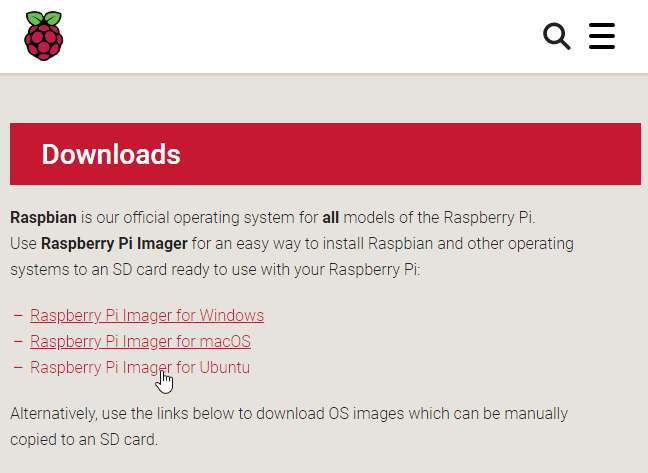](images/descargar-raspbian-pi-imager.png)

Una vez descargado el archivo binario lo instalan tal y como se tratará de un archivo .exe de Windows, .amd64 en Linux o .dmg en MacOS.

### Abrir Raspberry Pi Imager

A continuación conectaremos la tarjeta Micro SD a nuestro ordenador y abriremos el software que acabamos de instalar. Una vez abierto veremos la siguiente ventana.

[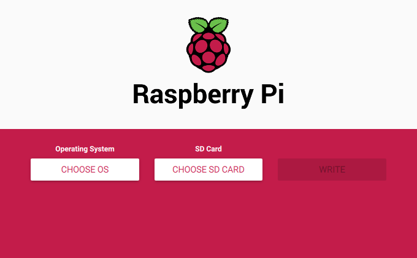](images/ventana-inicial-raspberry-pi-imager.png)

### Seleccionar el sistema operativo que queremos instalar

Seguidamente clicamos sobre el botón CHOSSE OS y seleccionamos el sistema operativo que queremos instalar. En mi caso selecciono la opción recomendada clicando sobre la opción Raspbian.

[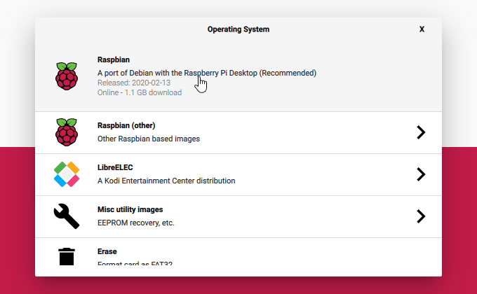](images/seleccionar-el-sistema-operativo-a-instalar.png)

Otras opciones que que podríamos haber usado son Raspbian Lite, Ubuntu o LibreELEC.

**Nota:** Hasta el momento Raspberry Pi Imager no permite instalar una gran cantidad de sistemas operativos. Es posible que en el futuro muy reciente se amplíe la oferta de instalación actual.

### Seleccionar la tarjeta Micro SD en que queremos instalar el sistema operativo

A continuación clicamos sobre el botón CHOSSE SD CARD y seleccionamos la tarjeta Micro SD en que queremos instalar Raspbian.

[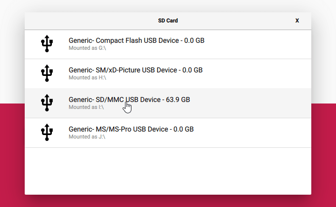](images/seleccionar-tarjeta-microsd.png)

### Instalar Raspbian en la tarjeta Micro SD

Finalmente tan solo tenemos que clicar sobre el botón WRITE.

[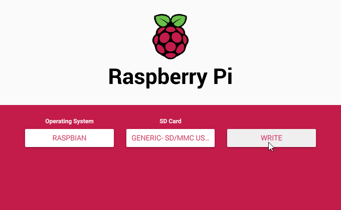](images/descargar-e-instalar-raspbian-microsd.png)

Acto seguido, de forma totalmente automática se descargará e instalará el sistema operativo seleccionado en nuestra tarjeta Micro SD. Una vez finalizado el proceso de descarga e instalación obtendremos el siguiente mensaje:

[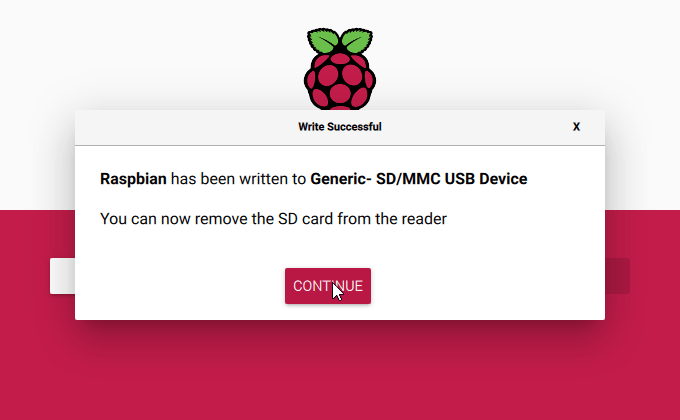](images/instalacion-raspbian-finalizada.png)

Acaban de ver que instalar el sistema operativo Raspbian es trivial. El procedimiento visto es extremadamente sencillo y creo que prácticamente todo el mundo lo puede aplicar.

## INICIAR RASPBIAN CONECTÁNDOSE A TRAVÉS DE SSH

Si únicamente pretendéis acceder a la Raspberry vía SSH sin tan siquiera usar un monitor les recomiendo que conecten la tarjeta SD en un ordenador cuyo sistema operativo sea capaz de leer las particiones ext4 de Raspbian. Una vez conectada la tarjeta SD acceden dentro de la partición **/boot** de la tarjeta SD y creen un archivo vacío.

[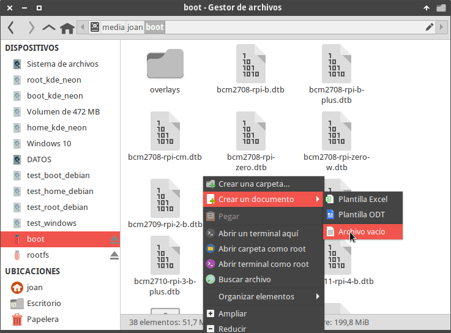](images/crear-archivo-vacio.png)

El nombre que tenemos que poner al archivo vacío tiene que ser ssh

[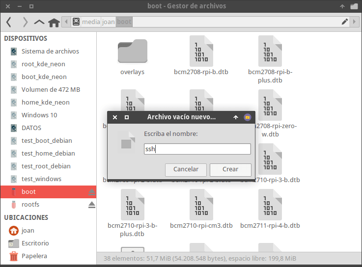](images/nombrar-archivo-vacio-ssh.png)

Una vez creado el archivo habremos habilitado la conexión a nuestra Raspberry Pi vía SSH. Si habéis realizado el proceso correctamente veréis lo siguiente:

[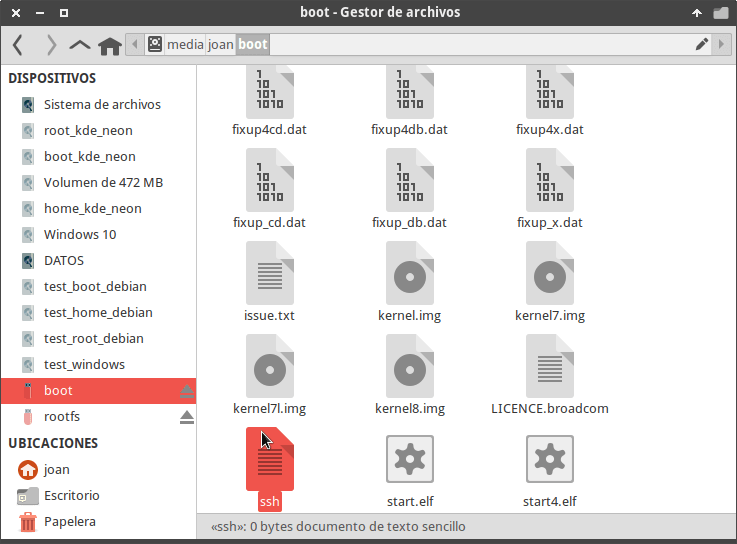](images/ssh-activado-raspberry-pi.png)

**Nota:** Lo que tenéis que ver es un archivo sin extensión que tiene el nombre ssh

A continuación ya pueden sacar la tarjeta Micro SD del ordenador y conectarla a la Raspberry Pi.

Acto seguido conectamos un cable ethernet a la Raspberry Pi y la encenderemos. Una vez esté en funcionamiento accedemos a la configuración del router para conocer la IP que nuestro router ha asignado a la Raspberry Pi. Tal y como se puede ver en la captura de pantalla tengo asignada la IP 192.168.1.45

[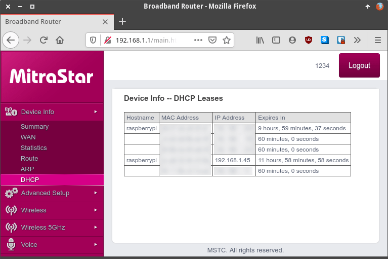](images/ip-asignada-a-la-raspberry-pi.png)

Finalmente nos vamos a nuestro ordenador y ejecutamos el comando pertinente para conectarlos a la Raspberry Pi vía SSH. Como la IP que el router ha asignado a la Raspberry Pi es la 192.168.1.45 ejecutaremos el siguiente comando:

> ```
> ssh pi@192.168.1.45
> ```

Acto seguido nos conectaremos a la Raspberry Pi vía SSH

[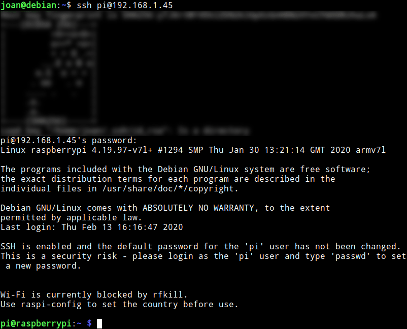](images/conectados-a-la-raspberry-pi-via-ssh.png)

**Nota:** La contraseña predeterminada de conexión a la Raspberry Pi es raspberry.

Una vez conectados a la Raspberry les recomiendo que configuren su router para [asignar siempre la misma IP a la Raspberry Pi](). Acto seguido realicen el resto de configuraciones pertinentes.

## INICIAR RASPBIAN MEDIANTE SU ENTORNO GRÁFICO

Si la primera vez que arrancan Raspbian lo quieren hacer en modo gráfico entonces necesitarán:

1. Un cabe HDMI – Micro HDMI.
2. Un cable Ethernet.
3. Un monitor, teclado y ratón.

Una vez tengan todo el material realicen las conexiones pertinentes y arranquen la Raspberry Pi. Con tan solo arrancarla nos debería aparecer el entorno gráfico para realizar el resto de configuraciones que consideremos oportunas.
