En el siguiente artículo veremos los pasos a seguir para instalar resilio en un servidor VPS de [clouding.io](https://clouding.io/). Como introducción pasaremos a ver las ventajas que nos proporciona Resilio en comparación con otras nubes como por ejemplo Dropbox<!--more-->

## VENTAJAS DE RESILIO FRENTE A OTRAS NUBES COMO DROPBOX

Las opciones que ofrece la nube Resilio son superiores a las que puede ofrece una nube como Dropbox. Algunas de las funcionalidades adicionales de Resilio son las siguientes:

1. Ofrece **sincronización selectiva de archivos y carpetas**. De este modo puedo compartir 10 carpetas con un equipo y hacer que solo se descargue el contenido de 2 de las 10 carpetas. Por lo tanto, el equipo sincronizado podrá ver el contenido de las 10 carpetas, pero únicamente se le descargará el contenido de 2 de las 10 carpetas.
2. Puede **compartir carpetas o archivos con los dispositivos que yo elija**. Si tengo 4 equipos y únicamente quiero compartir/sincronizar una carpeta o archivo con 1 de los 4 dispositivos lo puedo hacer sin problema.
3. La **sincronización de archivos y carpetas entre los equipos pertenecientes a una misma red local es directa y extremadamente rápida**. En Dropbox es todo lo contrario ya que primero tiene que subir los archivos a los servidores de Dropbox y después descargar el contenido al resto de los equipos.
4. Podemos **cifrar y compartir los archivos de una carpeta**. Esto es útil para realizar copias de seguridad de documentos sensibles. Si tengo una carpeta llena de fotos sensibles la puedo cifrar y compartir con otro equipo de forma extremadamente fácil.
5. Se pueden **asignar permisos a los archivos y/o carpetas que compartimos** con otros usuarios. Por lo tanto podemos compartir un archivo con un dispositivo y hacer que el usuario de este dispositivo pueda visualizar el archivo pero no lo pueda editar.
6. Es una **solución robusta** y apta para almacenar y compartir datos en un entorno profesional. La **sincronización de archivos es rápida y fiable**.
7. Resilio es una nube que **consume pocos recursos**. Por lo tanto si lo instalamos en un servidor externo no precisaremos de gran cantidad recursos.
8. Su funcionamiento está **basado en la tecnología P2P**. Si tenemos que sincronizar una carpeta que está presente en 40 equipos, se sincronizará usando partes de los 40 equipos. Por lo tanto la velocidad de transferencia puede ser mucho más rápida.

## ¿POR QUÉ HE SELECCIONADO UN VPS DE CLOUDING.IO?

En mi caso he decidido instalar Resilio en un VPS de clouding.io. Los motivos han sido los siguientes:

1. El **ancho de banda que me proporcionan es de 500mbps** y la latencia es baja. Por lo tanto podré sincronizar la totalidad de documentos de forma rápida en todos mis dispositivos.
2. El **servidor VPS estará activo las 24 horas**. Por lo tanto siempre tendré un dispositivo 100% sincronizado que se encargará de sincronizar el resto de mis equipos.
3. **Es más seguro almacenar datos en VPS de confianza que en nuestro ordenador**. Para poneros un ejemplo clouding.io guardará 3 replicas del contenido almacenado en nuestra nube resilio. Por lo tanto, aunque un servidor se averíe nunca perderemos nuestros datos.
4. Podemos **configurar copias de seguridad de forma extremadamente sencilla**. Además también podemos realizar snapshots que nos servirán para que en caso de problemas podamos restaurar el servidor a un estado anterior.
5. Sus **precios son económicos** y además **permiten la opción de archivar el servidor**. Si archivamos el servidor no pagaremos la CPU y RAM que hemos contratado. Únicamente pagaremos por la cantidad de disco duro SSD contratada.
6. Disponen de **servicio de asistencia técnica 24 horas** al día incluyendo sábados y domingos. Además la empresa está ubicada en España.

## CREAR UN SERVIDOR VPS EN CLOUDING.IO

Clouding.io es un servicio de pago. No obstante si te registras te dan 5 Euros para que pruebes sus servicios. Por lo tanto si os registráis en clouding.io podréis seguir sin ningún problema las indicaciones de este artículo.

[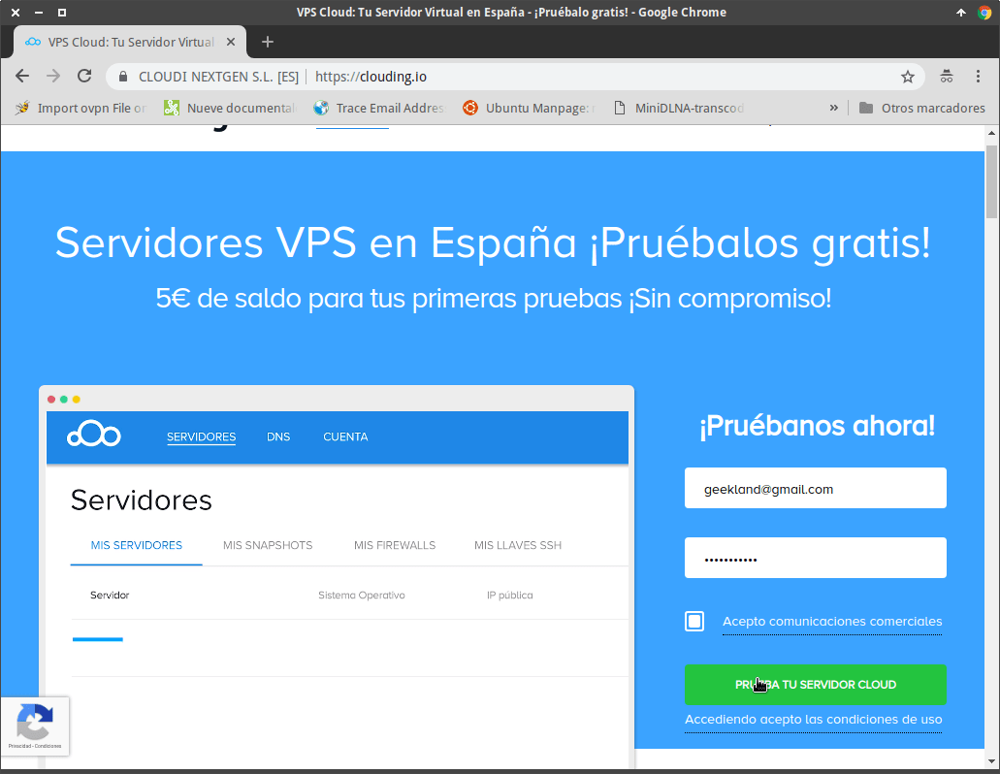](images/pagina-registro-clouding.png)

### Definir el sistema operativo de nuestro servidor VPS

Accedemos al panel de configuración de Clouding.io y presionamos sobre el botón Haz click aquí para crear tu primer servidor.

[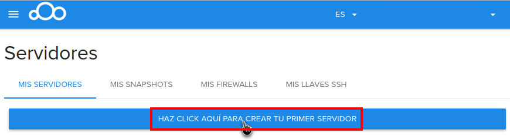](images/acceder-a-crear-un-servidor.png)

A continuación tenemos que definir el nombre del servidor, el sistema operativo que queremos usar, la capacidad de procesamiento y almacenamiento de nuestro servidor.

En mi caso he seleccionado las siguientes opciones:

1. **Nombre del servidor:** Podéis usar cualquier nombre. En mi caso he usado el nombre **Resilio\_Cloud**.
2. **Sistema operativo:** Clouding.io ofrece servidores Windows y Linux. En mi caso he seleccionado el sistema operativo **Linux Debian 9**. El motivo principal es que Linux es un sistema operativo seguro y robusto.

[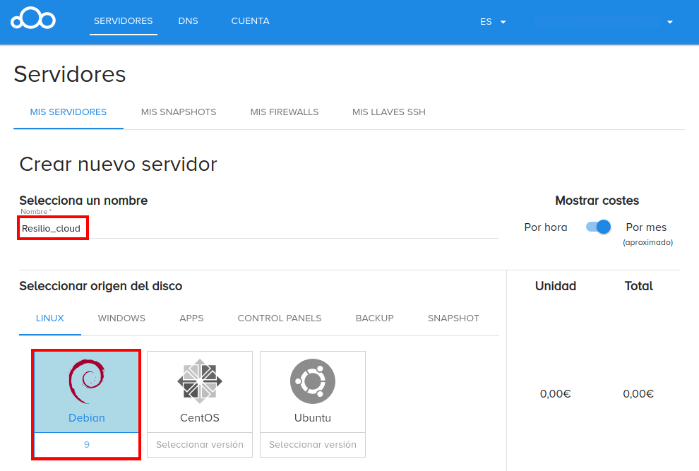](images/nombre-servidor-y-sistema-operativo.png)

###### Nota: Si quieren también pueden usar el sistema operativo Ubuntu. El procedimiento en Ubuntu es exactamente el mismo que en Debian.

### Asignar los recursos al servidor que alojará la nube Resilio

El consumo de recursos de resilio es mínimo. No es necesario asignar muchos recursos al servidor. En mi caso he asignado los siguientes:

1. **RAM:** 1GB.
2. **Cores:** 0,5 procesadores.
3. **Disco SSD:** 20GB. 20 Gigas de disco duro son suficientes para mis necesidades almacenamiento. Si queréis asignar menos capacidad no hay problema alguno ya que siempre podréis incrementar la capacidad al vuelo.

[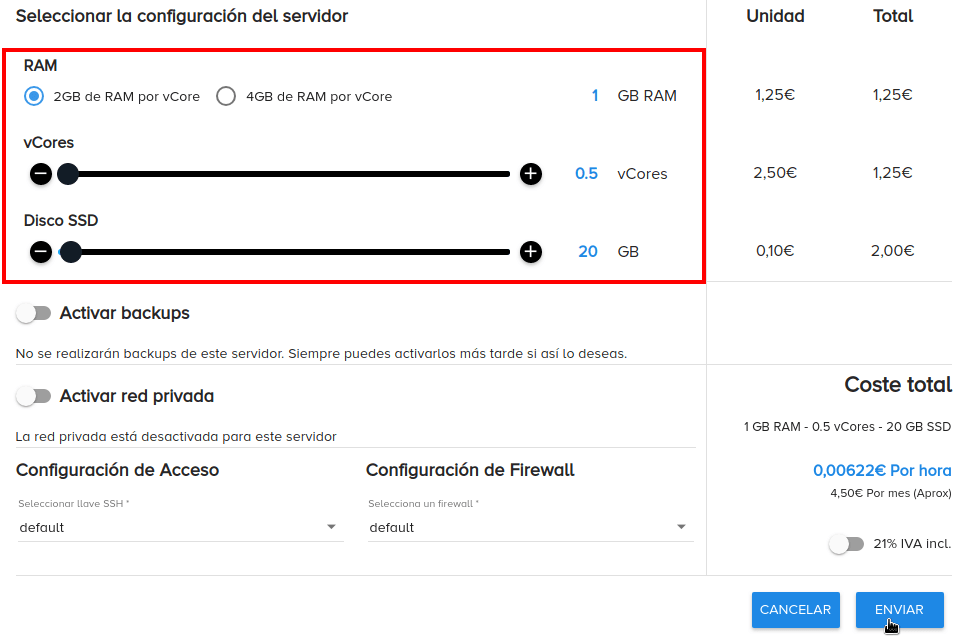](images/definir-recursos-servidor.png)

###### Nota: Los servidores de clouding.io son escalables. Por lo tanto podremos modificar los valores seleccionados en todo momento.

### Crear el sistema operativo en el VPS

Una vez definidos los parámetros de nuestro servidor VPS tan solo tenemos que presionar en el botón Enviar.

[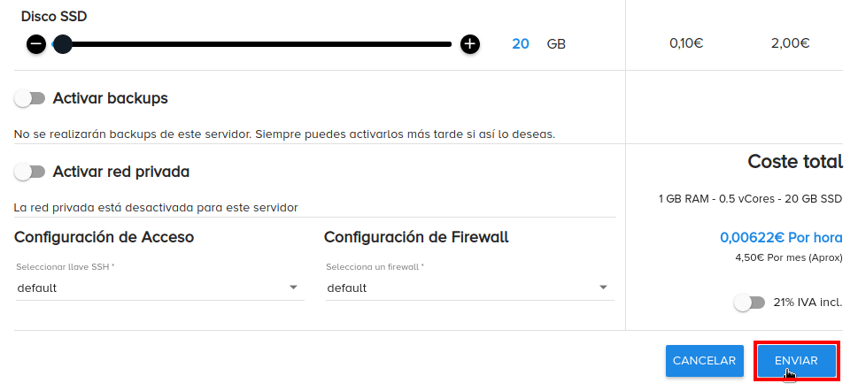](images/crear-servidor-VPS.png) Acto seguido, tal y como se puede ver en la captura de pantalla, el servidor estará activo.

[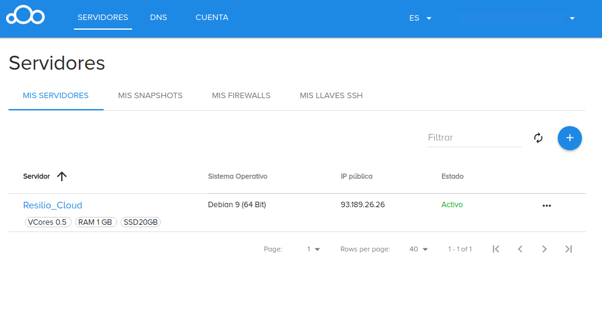](images/servidor-VPS-creado.png)

### Acceder al servidor VPS vía SSH

Para acceder al servidor vía SSH tenemos que clicar encima del servidor Resilio\_Cloud.

[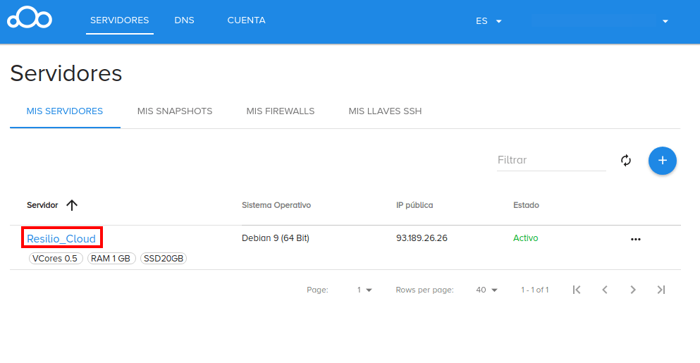](images/acceder-datos-acceso-ssh.png)

Seguidamente aparecerá la siguiente pantalla que nos mostrará la totalidad de parámetros necesarios para conectarnos a nuestro servidor vía SSH. Concretamente tenéis que tomar nota de la **IP Pública**, el **User** y la **Contraseña**.

[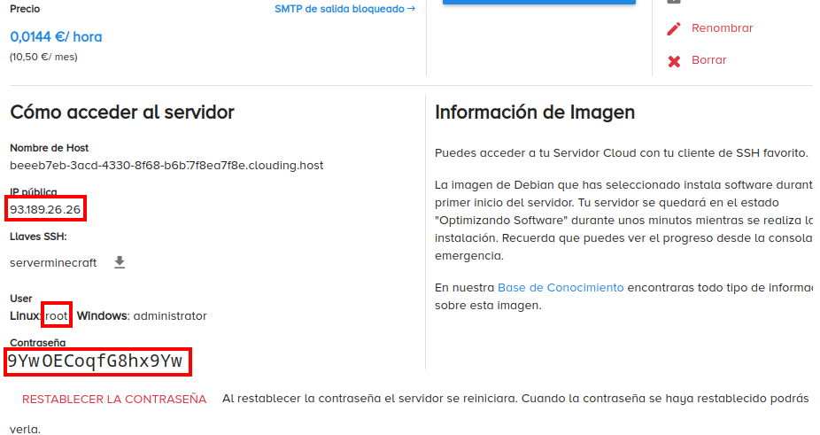](images/datos-acceso-ssh.png)

En mi caso:

- **IP pública:** 93.189.26.26
- **User:** root
- **Contraseña:** 9YwOECoqfG8hx9Yw

Seguidamente en su propio ordenador abren una terminal de Linux o una Powershell de Windows y ejecutan el siguiente comando:

> ```
> ssh root@93.189.26.26
> ```

Cada uno los parámetros del comando corresponde a:

**ssh:** programa usado para conectarnos de forma remota a nuestro servidor. **root:** Corresponde al user de nuestro servidor. **93.189.26.26:** Corresponde a la IP pública del servidor.

Una vez ejecutado el comando nos preguntarán la contraseña de conexión al servidor. La introducimos, presionamos Enter y nos loguearemos de forma inmediata al servidor.

[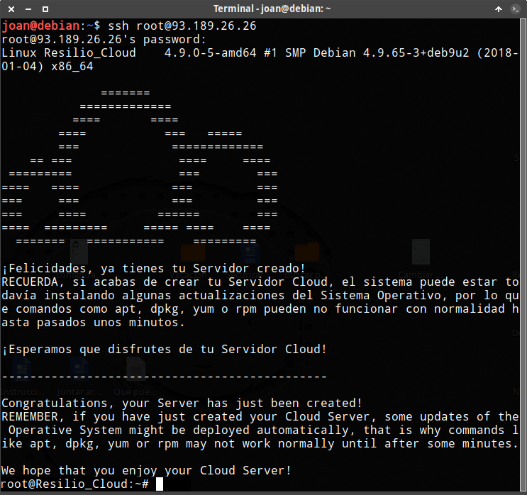](images/dentro-servidor-vps-via-ssh.png)

###### Nota: Si usan Windows deben seguir las siguientes instrucciones para [conectarse al servidor a través SSH a través de Powershell](). Si lo prefieren también pueden usar Putty.

A estas alturas ya podemos empezar a instalar Resilio.

## INSTALAR RESILIO EN UN SERVIDOR VPS

Una vez dentro del servidor ya podemos instalar resilio. Para ello procederemos del siguiente modo.

### Actualizar los paquetes de nuestro sistema operativo

Lo primero que realizaremos es actualizar los repositorios ejecutando el siguiente comando en la terminal:

> ```
> sudo apt update
> ```

Acto seguido actualizaremos el sistema operativo ejecutando el siguiente comando en la terminal:

> ```
> sudo apt upgrade
> ```

### Añadir el repositorio de Resilio

A continuación tenemos que añadir el repositorio de Resilio a nuestro sistema operativo. Para ello ejecutaremos el siguiente comando en la terminal:

> ```
> sudo echo "deb https://linux-packages.resilio.com/resilio-sync/deb resilio-sync non-free" | sudo tee /etc/apt/sources.list.d/resilio-sync.list
> ```

### Importar la clave pública del repositorio de resilio

Acto seguido descargaremos la clave pública del repositorio de Resilio ejecutando el siguiente comando:

> ```
> wget https://linux-packages.resilio.com/resilio-sync/key.asc
> ```

Finalmente importaremos la clave pública que acabamos de descargar ejecutando el siguiente comando:

> ```
> sudo apt-key add key.asc
> ```

### Instalar Resilio en nuestro servidor vps

Para poder refrescar el repositorio de Resilio tenemos que instalar el paquete apt-transport-https. Para instalarlo ejecutaremos el siguiente comando en la terminal:

> ```
> sudo apt install apt-transport-https
> ```

Acto seguido actualizamos los repositorios de Debian ejecutando el siguiente comando en la terminal:

> ```
> sudo apt update
> ```

Finalmente vamos a instalar Resilio ejecutando el siguiente comando:

> ```
> sudo apt install resilio-sync
> ```

### Hacer que Resilio arranque de forma automática al iniciar el servidor

Para asegurar que Resilio esté iniciado ejecuten el siguiente comando en la terminal:

> ```
> sudo systemctl start resilio-sync
> ```

Si además quieren que cada vez que se arranque o reinicie el servidor Resilio este activo ejecutaremos el siguiente comando en la terminal:

> ```
> sudo systemctl enable resilio-sync
> ```

A estas alturas ya ha finalizado el proceso para instalar Resilio.

## INSTALAR EL SERVIDOR WEB NGINX Y ACCEDER A RESILIO DE FORMA REMOTA

La configuración por defecto de Resilio solo permite acceder a la interfaz de administración web de forma local.

Para administrar la nube Resilio de forma remota y desde cualquier ubicación necesitamos instalar un servidor web. En mi caso instalaré el servidor web nginx ejecutando el siguiente comando en la terminal:

> ```
> sudo apt install nginx
> ```

Una vez instalado lo iniciaremos ejecutando el siguiente comando:

> ```
> sudo systemctl start nginx
> ```

Para asegurar que el servidor web esté activo cada vez que reiniciamos nuestro VPS ejecutaremos el siguiente comando:

> ```
> sudo systemctl enable nginx
> ```

### Acceder a la interfaz de configuración web de Resilio de forma remota

La interfaz de administración web de Resilio estará escuchando en el puerto 8888 y solo podremos acceder a ella de forma local. Si queremos acceder a la interfaz web de forma remota tendremos que configurar un proxy inverso. Para ello ejecutaremos el siguiente comando en la terminal:

> ```
> sudo nano /etc/nginx/conf.d/rslsync.conf
> ```

Cuando se abra el editor de textos nano pegaremos le siguiente código:

> ```
> #Bloque servidor para resolver una petición
> server {
>   listen 80;
>   server_name resiliojoan.tk www.resiliojoan.tk;
> #configuración proxy inverso
>   access_log /var/log/nginx/resiliojoan.tk.log;
>   location / {
>     proxy_pass http://127.0.0.1:8888;
>   }
> }
> ```

###### Nota: Las partes de color rojo deberán ser reemplazadas por vuestro dominio o IP Pública.

Una vez pegado el código guardamos los cambios y reiniciamos el servidor web ejecutando el siguiente comando en la terminal:

> ```
> sudo systemctl reload nginx
> ```

En estos momentos ya podemos abrir un navegador e introducir nuestro dominio o IP Pública. Si todo funciona adecuadamente verán que podemos acceder a la interfaz de administración web de Resilio:

[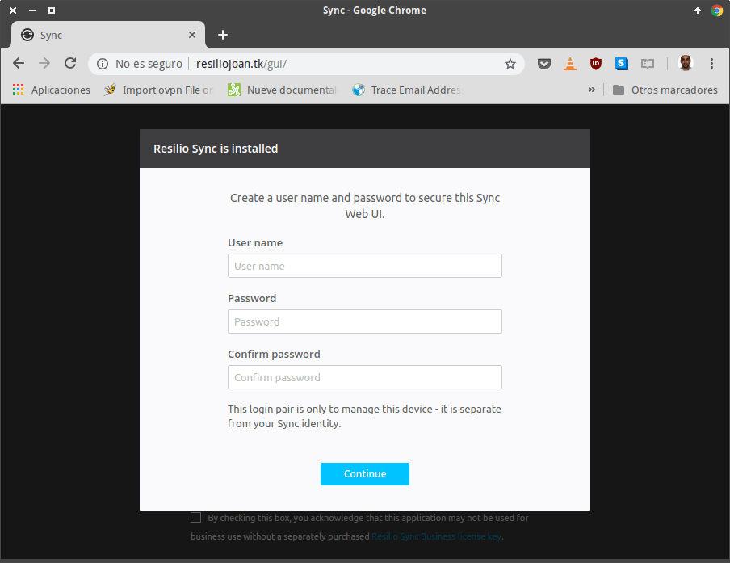](images/interfaz-administracion-resilio-http.png)

Si no pueden acceder asegúrense que el puerto 80 del servidor esté abierto. En clouding.io el puerto 80 está abierto por defecto.

### Instalar un certificado SSL para administrar Resilio de forma segura

Para disponer de un certificado SSL y administrar resilio de forma segura tenemos que instalar certbot. Para ello ejecutamos el siguiente comando en la terminal de nuestro VPS:

> ```
> sudo apt install letsencrypt
> ```

A continuación crearemos la carpeta donde se almacenará nuestro certificado SSL. Para ello ejecutamos el siguiente comando en la terminal:

> ```
> sudo mkdir /var/www/html/resiliojoan.tk/
> ```

Seguidamente asignamos el grupo y el usuario www-data de forma recursiva al directorio /var/www/html/resiliojoan.tk/

> ```
> sudo chown www-data:www-data /var/www/html/resiliojoan.tk/ -R
> ```

###### Nota: Recuerden reemplazar las partes rojas del comando por el nombre de su dominio o por su IP Pública.

El siguiente paso consiste en editar archivo rslsync.conf. Para ello ejecutaremos el siguiente comando:

> ```
> sudo nano /etc/nginx/conf.d/rslsync.conf
> ```

Una vez se abra el editor de textos añadiremos el siguiente código:

> ```
> location ~ /.well-known/acme-challenge {
>     root /var/www/html/resiliojoan.tk/;
>     allow all;
> }
> ```

De tal forma que el contenido del archivo rslsync.conf quede del siguiente modo:

> ```
> server {
>  listen 80;
>  server_name resiliojoan.tk www.resiliojoan.tk;
> 
>  access_log /var/log/nginx/resiliojoan.tk.log;
>  location / {
>    proxy_pass http://127.0.0.1:8888;
>  }
> 
>  location ~ /.well-known/acme-challenge {
>    root /var/www/html/resiliojoan.tk/;
>    allow all;
>  }
> 
> }
> ```

###### Nota: Recuerden reemplazar las partes rojas del comando por el nombre de su dominio o por su IP Pública.

Una vez introducido el código guardamos los cambios y reiniciamos el servidor ejecutando el siguiente comando:

> ```
> sudo systemctl reload nginx
> ```

De este modo, en el momento de crear o renovar el dominio certbot podrá autenticar nuestro dominio mediante el protocolo ACME.

Acto seguido ya podemos generar el certificado SSL de let’s encrypt ejecutando el siguiente comando en la terminal:

> ```
> sudo letsencrypt certonly --webroot --agree-tos --email dirección_email -d resiliojoan.tk -w /var/www/html/resiliojoan.tk/
> ```

###### Nota: Recuerden reemplazar las partes rojas del comando por su dominio y por su dirección de email.

Para finalizar configuraremos el servidor para que pueda usar el certificado que acabamos de instalar. Para ello editaremos el fichero rslsync.conf ejecutando el siguiente comando en la terminal:

> ```
> sudo nano /etc/nginx/conf.d/rslsync.conf
> ```

Cuando se abra el editor de textos dejaremos el contenido del archivo tal y como verán a continuación:

> ```
> server {
>  listen 80;
>  server_name resiliojoan.tk www.resiliojoan.tk;
>  return 301 https://$server_name$request_uri;
> }
> server {
>  listen 443 ssl http2;
>  server_name resiliojoan.tk www.resiliojoan.tk;
>  add_header Strict-Transport-Security "max-age=31536000";
> 
>  ssl_protocols TLSv1.1 TLSv1.2;
>  ssl_certificate /etc/letsencrypt/live/resiliojoan.tk/fullchain.pem;
>  ssl_certificate_key /etc/letsencrypt/live/resiliojoan.tk/privkey.pem;
> 
>  access_log /var/log/nginx/resiliojoan.tk.log;
>  location / {
>    proxy_pass http://127.0.0.1:8888;
>  }
> 
>  location ~ /.well-known/acme-challenge {
>    root /var/www/html/resiliojoan.tk/;
>    allow all;
>  }
> }
> ```

###### Nota: Recuerden reemplazar las partes rojas del código por su dominio o IP pública.

Una vez finalizada la configuración guardamos los cambios y cerramos el fichero. De esta forma:

1. La totalidad de tráfico al puerto 80 se redirigirá al puerto 443.
2. Podremos renovar nuestro certificado SSL sin ningún tipo de problema.
3. Podremos administrar nuestra nube de forma segura.

Ahora tan solo nos falta reiniciar el servidor web ejecutando el siguiente comando:

> ```
> sudo systemctl reload nginx
> ```

Si no se han producido errores verán que ahora podemos administrar resilio con la protección que nos ofrece el certificado SSL de Let’s Encrypt.

[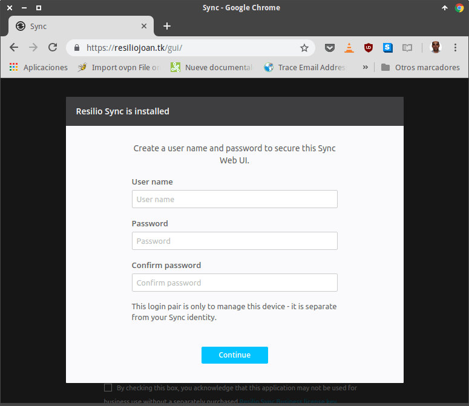](images/interfaz-administracion-resilio-https.png)

### Definir un usuario y una contraseña para acceder vía web

Como es la primera vez que accedemos al panel de administración web tenemos que definir un usuario y una contraseña. Los definimos y presionamos el botón **Continue**.

[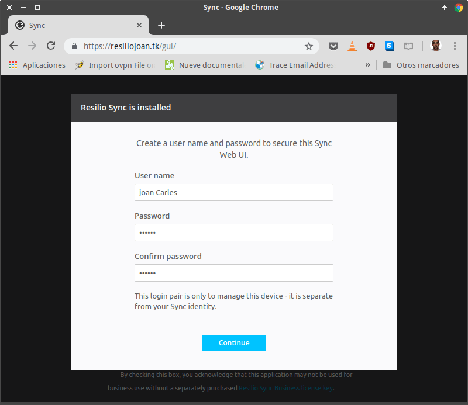](images/definir-usuario-contraseña-administracion-web.png)

A continuación:

1. Escribimos el nombre que queramos que tenga nuestro dispositivo.
2. Aceptamos los términos de la licencia.
3. Presionamos el botón **Get started**.

[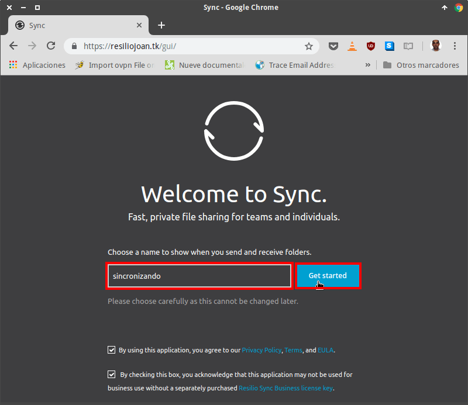](images/escribir-nombre-dispositivo.png)

Finalmente tan solo tendremos que introducir nuestro usuario y contraseña y presionar el botón de **Iniciar Sesión**.

[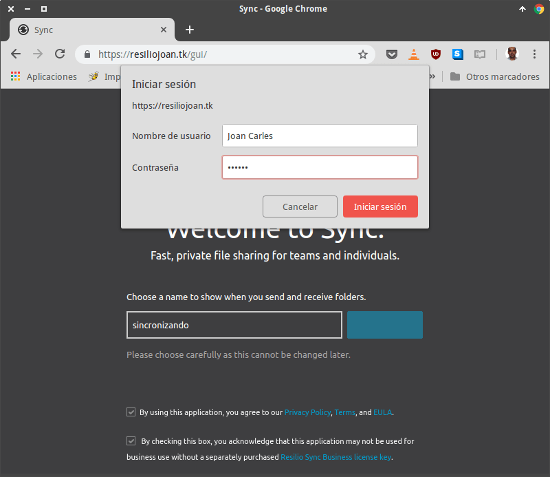](images/introducir-datos-acceso-resilio.png)

A partir de estos momentos podremos empezar a administrar nuestra nube privada Resilio.

[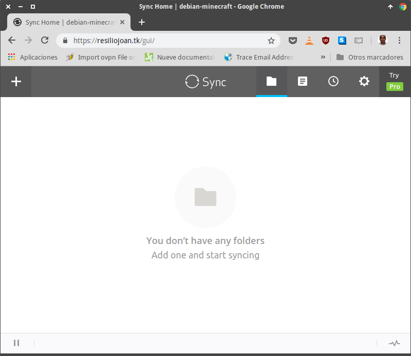](images/administrando-nube-resilio.png)

Su funcionamiento es sencillo e intuitivo. No obstante en futuros post detallaré el funcionamiento de las operaciones más básicas que podemos realizar.
