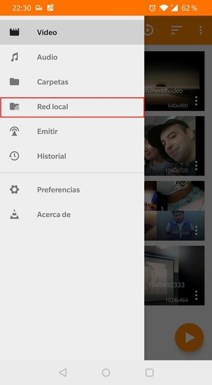
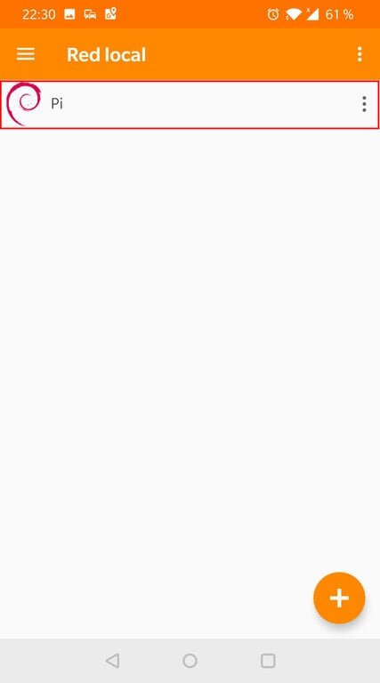
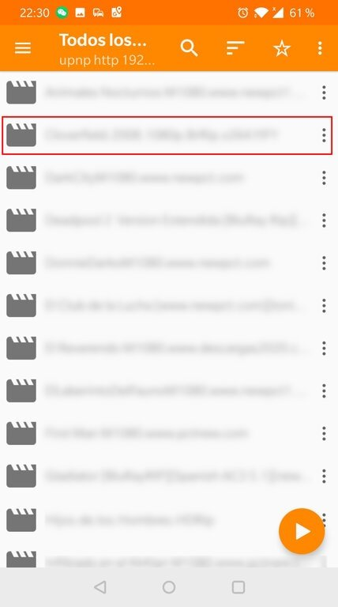
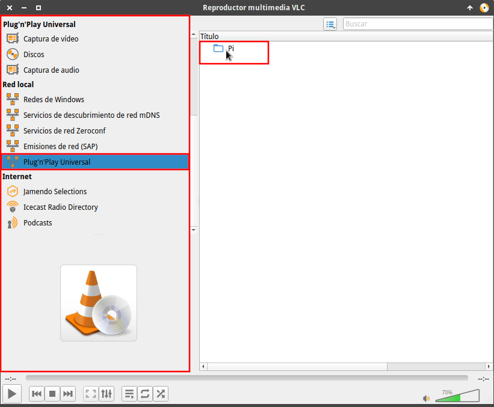
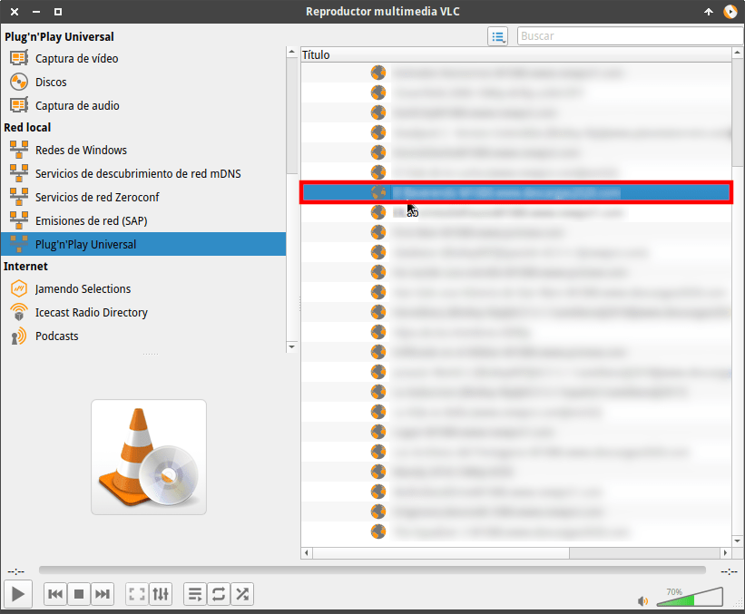
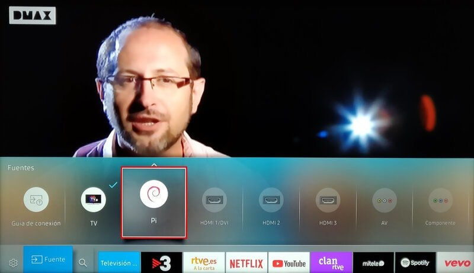
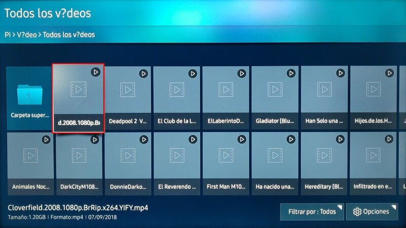
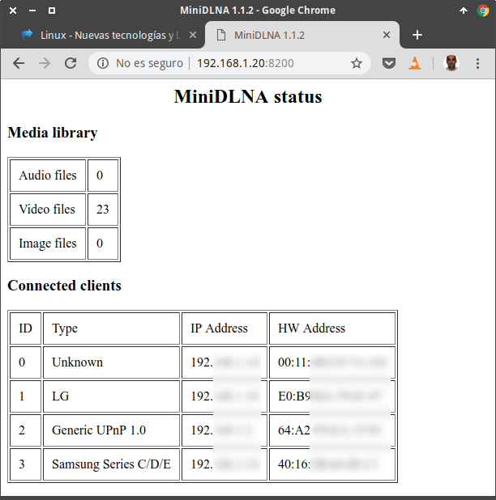

A continuación veremos la mejor opción para disponer de un servidor DLNA en una Raspberry Pi. Pero antes de iniciar la explicación es importante que sepan que es y que utilidades podemos dar a un servidor DLNA.<!--more-->

## ¿QUÉ ES UN SERVIDOR DLNA?

Un servidor DLNA (Digital Living Network Alliance) es el encargado de proporcionar contenido digital a los distintos dispositivos de consumo compatibles conectados a una red local.

En otras palabras, todo servidor DLNA tendrá audios, vídeos y fotos almacenados en un dispositivo de almacenamiento. El contenido almacenado podrá ser reproducido en cualquier televisor o dispositivo móvil que esté conectado a la misma red local que el servidor DLNA.

## UTILIDADES QUE PODEMOS DAR A UN SERVIDOR DLNA

Una vez conocemos lo que es un servidor DLNA veremos que sus principales utilidades pueden ser:

1. Hacer que nuestro televisor, consola, tablet o smartphone puedan reproducir vídeos, música o imágenes almacenados en el servidor DLNA.
2. Que nuestros altavoces DLNA reproduzcan música o archivos de audio almacenados en el servidor DLNA.
3. Imprimir fotos o documentos desde nuestro teléfono móvil. Para ello tanto el teléfono como la impresora tendrán que ser compatibles con la tecnología DLNA.
4. Que nuestro televisor reproduzca vídeos, audios o imágenes almacenados en nuestro smartphone.
5. Etc.

Para llevar a término las utilidades mencionadas necesitáis que vuestros televisores, consolas, altavoces, impresoras, discos duros de red y dispositivos móviles sean compatibles con DLNA.

###### Nota: Todos los televisores y aparatos electrónicos actuales son compatibles con la tecnología DLNA.

## SERVIDORES DLNA QUE PODEMOS INSTALAR EN UNA RASPBERRY PI O EN LINUX

Existen multitud de servidores DLNA para instalar en una Raspberry Pi. Algunos de ellos son ReadyMedia (MiniDLNA), Plex, Mediatomb, Rygel, Kodi, Serviio, etc.

De entre todos las opciones citadas he decido usar ReadyMedia, antiguamente conocido como MiniDLNA. Quizás no es la opción más popular pero la he elegido por los siguientes motivos:

1. Es un servidor muy **ligero**. Hay que tener en mente que el objetivo es instalarlo en una Raspberry Pi y que esté activado las 24 horas del día. Es importante que sea ligero porque una Raspberry Pi no es potente y aparte de servidor DLNA en mi caso también la uso bloquear la publicidad, servidor VPN, nube personal, para descargar Torrents, etc.
2. **Es una solución simple** que lo único que hace es servir contenido a mi televisión y dispositivos móviles. Hay que tener en cuenta que una Raspberry Pi no tiene potencia para transcodificar audio y vídeo. Además los clientes DLNA actuales aceptan prácticamente la totalidad de formatos de audio y video.
3. Su **instalación y configuración** es extremadamente **sencilla**. Es una opción efectiva y fácil de usar.
4. **Funciona a la perfección**. No se puede decir lo mismo de otras opciones como Rygel que a priori son mejores. Rygel es un servidor DLNA desarrollado por Gnome, tiene un desarrollo activo y cumple con las características que estoy buscando. No obstante, después de instalarlo he observado que tiene fugas de memoria importantes.

A continuación les dejo un enlace en el que podrán ver y comparar las funcionalidades que ofrecen los servidores DLNA más conocidos.

[https://en.wikipedia.org/wiki/Comparison\_of\_UPnP\_AV\_media\_servers](https://en.wikipedia.org/wiki/Comparison_of_UPnP_AV_media_servers)

## INSTALAR EL SERVIDOR DLNA READYMEDIA (MiniDLNA)

###### Nota: El tutorial que verán a continuación se puede aplicar en una Raspberry Pi y en sistemas operativos GNU-Linux

En la terminal de nuestra Raspberry Pi instalamos ReadyMedia (MiniDLNA) ejecutando el siguiente comando en la terminal:

> ```
> sudo apt-get install minidlna
> ```

Una vez instalado aseguraremos que esté levantado ejecutando el siguiente comando en la terminal:

> ```
> sudo service minidlna start
> ```

Finalmente ejecutaremos el siguiente comando para asegurar que el servidor DLNA se iniciará de forma automática cada vez que reiniciemos nuestro ordenador o Raspberry Pi:

> ```
> sudo service minidlna enable
> ```

## CONFIGURAR EL SERVIDOR READYMEDIA (MiniDLNA)

Para iniciar el proceso de configuración de ReadyMedia ejecutamos el siguiente comando en la terminal:

> ```
> sudo nano /etc/minidlna.conf
> ```

Cuando se abra el editor de texto tenéis que aplicar la siguiente configuración:

| **Configuración** | **Explicación** |
| :-- | :-- |
| media\_dir=V,/media/downloads/videos | Definimos la ubicación en que almacenamos los archivos de vídeo. Podemos definir tantas ubicaciones como queramos. En mi caso elijo la ubicación /media/downloads/videos |
| media\_dir=A,/media/downloads/musica | Fijamos la ubicación de los archivos de audio. Podemos definir tantas ubicaciones como queramos. La ubicación elegida en mi caso es /media/downloads/musica |
| media\_dir=P,/media/downloads/fotos | Especificamos la ubicación de los archivos de imagen. Podemos definir tantas ubicaciones como queramos. La ubicación elegida en mi caso es /media/downloads/fotos |
| db\_dir=/var/cache/minidlna | Directorio en que se ubica la base de datos files.db que almacena datos del servidor DLNA. |
| log\_dir=/var/log | Si queréis almacenar logs de lo que pasa en el servidor tienen que descomentar esta línea. Los logs los podréis encontrar en la ubicación /var/log/minidlna.log |
| port=8200 | Puerto en el que estará escuchando el servidor web para que podamos consultar el número de archivos del servidor y los clientes que se han conectado al servidor. |
| friendly\_name=Pi | Definimos el nombre con que los clientes DLNA detectarán nuestro servidor DLNA. Podéis poner el nombre que queráis. En mi caso he puesto Pi. |
| serial=681019810597113 | Es el número de serie que el servidor proporciona a los clientes. No toquéis este valor. Dejad el número de serie por defecto. |
| inotify=yes | Selecciono la opción yes. De este modo, cuando se borre o copie contenido del servidor se actualizará la información de la base de datos ubicada en /var/cache/minidlna/files.db |
| album\_art\_names=Cover.jpg/cover.jpg | Definimos los nombres que deben tener las caratulas de un audio o vídeo. Si queremos definir una caratula para una película podemos hacerlo guardando una imagen con el nombre cover.jpg o Cover.jpg en la carpeta que contiene la película. El tamaño recomendado es de 160x160 pixeles. ReadyMedia también es capaz de extraer caratulas contenidas en el contenedor del vídeo. |
| notify\_interval=60 | Seleccionamos la frecuencia con que nuestro servidor DLNA se anuncia a la red. En mi caso selecciono 60 segundos. De este modo estoy seguro que en menos de un minuto cualquier dispositivo será capaz de detectar y conectar con mi servidor DLNA. |

Una vez finalizada la configuración guarden los cambios y cierren el fichero. Finalmente tan solo tenemos que reiniciar el servidor ejecutando el siguiente comando en la terminal:

> ```
> service minidlna restart
> ```

### Cambiar los límites de iNotify

ReadyMedia usa la propiedad del Kernel inotify para detectar las modificaciones en cada una de las carpetas que almacena contenido. Al detectarse una modificación se actualiza el contenido de la base de datos /var/cache/minidlna/files.db.

Para que inotify pueda monitorizar las modificaciones tendremos que cambiar sus límites. Para fijar un nuevo límite ejecutaremos el siguiente comando:

> ```
> su
> ```

Acto seguido introduciremos la contraseña del usuario root. Una vez estemos logueados como usuario root ejecutamos el siguiente comando en la terminal:

> ```
> echo 65538 > /proc/sys/fs/inotify/max_user_watches
> ```

Acto seguido reiniciaremos el servidor ejecutando el siguiente comando:

> ```
> service minidlna restart
> ```

Finalmente nos desloguearemos del usuario root ejecutando el siguiente comando:

> ```
> exit
> ```

Si alguna vez precisan reconstruir la base de datos tan solo tienen que ejecutar el siguiente comando en la terminal:

> ```
> sudo service minidlna force-reload
> ```

### Configurar el firewall de la Raspberry Pi o GNU-Linux

**En el caso** que tengan activado un firewall deberán abrir los puertos 8200 TCP y 1900 UDP. Para ello ejecutad el siguiente comando en la terminal:

> ```
> sudo nano /etc/rc.local
> ```

Cuando se abra el editor de textos pegaís las siguientes reglas:

> ```
> iptables -A INPUT -i wlan0 -p tcp -s 192.168.1.0/24 -d 192.168.1.20 -j ACCEPT
> iptables -A INPUT -i wlan0 -p udp -s 192.168.1.0/24 -d 192.168.1.20 -j ACCEPT
> ```

Donde:

**wlan0:** Tendrá que ser reemplazado por la interfaz de red que usa su Raspberry Pi. **192.168.1.0/24:** Tenemos que usar los valores que definen nuestra red. **192.168.1.20:** Tendremos que remplazar este valor por la IP interna que usa nuestra Raspberry Pi.

Una vez introducidas las reglas guardamos los cambios, cerramos el editor de textos y reiniciamos el servidor. De esta forma, cualquier dispositivo conectado a nuestra red local tendrá acceso a cualquier servicio que esté corriendo en la Raspberry Pi.

## COMO REPRODUCIR EL CONTENIDO DE NUESTRO SERVIDOR DLNA

Una vez instalado y configurado el servidor detallaré como podemos empezar a sacarle partido.

### Reproducir contenido del servidor DLNA en Android e iOS

En Android y en iOS existen multitud de clientes DLNA para reproducir películas, sonido e imágines. Algunos de ellos son BubbleUPnP, VLC, AVPlayerHD, Kodi, LocalCast, etc.

No obstante en este ejemplo me centraré en una opción gratuita y multiplataforma como VLC.

Abrimos VLC en nuestra tablet o teléfono. Ponemos el dedo en la parte izquierda de la pantalla y lo deslizamos hacia la derecha. Cuando se despliegue el panel de opciones pulsamos en la opción **Red Local**.

[](images/detectar-servidor-dlna-android-ios.jpg)

Acto seguido esperamos unos instantes y aparecerá nuestro servidor DLNA. Una vez haya aparecido pulsamos sobre el servidor que se representará con el logo de Debian.

[](images/acceder-servidor-dlna-android-ios.jpg)

Finalmente navegamos por las carpetas de nuestro servidor para encontrar el archivo que queremos reproducir. Una vez encontrado pulsamos encima del vídeo o audio y empezará la reproducción.

[](images/reproducir-contenido-servidor-dlna-android-ios.jpg)

### Visionar el contenido del servidor DLNA en nuestro ordenador

Al igual que en Android e iOS tenemos multitud de opciones para reproducir los vídeos, sonidos y fotografías de nuestro servidor DLNA. Algunas de ellas son Kodi, VLC, Plex, Foobar2000, etc.

Al igual que en el caso anterior explicaré el procedimiento para VLC porque se trata de una solución multiplataforma.

Abrimos VLC. En el caso que no aparezca la lista de reproducción presionamos la combinación de teclas Ctrl+L. Cuando aparezca la lista de reproducción clicamos en la opción Plug’n’Play Universal y en unos instantes se detectará nuestro servidor DLNA. Una vez detectado clicamos sobre él:

[](images/detectar-acceder-servidor-dlna-pc.png)

Finalmente navegamos por las distintas carpetas y hacemos doble click sobre el archivo de audio o vídeo que queramos reproducir.

[](images/reproducir-video-servidor-dlna-ordenador.png)

Acto seguido empezará la reproducción.

### Reproducir contenido del servidor en nuestro televisor

Es extremadamente sencillo reproducir contenido del servidor DLNA en nuestro televisor.

Para ello abrimos nuestro televisor. Una vez abierto presionamos el botón Source de nuestro mando a distancia. Esperamos unos segundos y debería detectarse nuestro servidor DLNA. Acto seguido accedemos dentro de nuestro servidor DLNA con la ayuda del mando a distancia:

[](images/detectar-servidor-dlna-televisor.jpg)

Una vez dentro del servidor podremos navegar para encontrar el audio vídeo e imagen que queramos reproducir. Una vez encontrado tan solo tenemos seleccionarlo y presionar en el botón OK o reproducir.

[](images/seleccionar-archivo-a-reproducir.jpg)

Acto seguido empezará la reproducción.

## ACCEDER A LA INTERFAZ WEB DEL SERVIDOR DLNA

Abrimos el navegador web y accedemos a una dirección del siguiente tipo:

> ```
> http://ip_raspberry_pi:puerto_escucha_readymedia
> ```

Por lo tanto en mi caso accederé a la siguiente URL:

> ```
> http://192.168.1.20:8200
> ```

###### Nota: El archivo de configuración de ReadyMedia permite definir una URL personalizada. También permite cambiar el puerto.

La información que proporcionará la interfaz web será la siguiente:

[](images/interfaz-web-readymedia.png)

Si observan la captura de pantalla verán que la información es escasa. Tan solo podremos ver:

1. El número de archivos de audio, vídeo e imagen que tenemos indexados en la base datos.
2. El detalle de los cliente que están conectados al servidor.

La única utilidad que veo a la interfaz web es ver si la base de datos está indexando correctamente el contenido que añadimos o borramos al servidor DLNA.
