Hay mucha gente que le puede parecer extremadamente difícil disponer de un servidor OpenVPN. No obstante hoy en día las facilidades existentes para montar un servidor son enormes gracias a que existen instaladores como por ejemplo PiVPN.<!--more-->

## ¿QUÉ ES PIVPN?

PiVPN es un simple script en lenguaje Bash que nos instalará un servidor OpenVPN de forma absolutamente automática y funcional.

Las características del servidor VPN que montaremos son las siguientes:

1. El servidor VPN que montaremos es del tipo client to client. Por lo tanto los clientes conectados al servicio VPN podrán verse y comunicarse entre ellos.
2. El servidor dispondrá de autenticación TLS. Esto ayudará a evitar ataques de denegación de servicio o que un tercero realice un escaneo de puertos para evitar vulnerabilidades.
3. El servidor dispondrá de actualizaciones de seguridad de forma completamente automáticas. Esto sin duda es una características esencial.
4. Podremos conectarnos a servicios de nuestra red local desde cualquier lugar del mundo.
5. Al tratarse de un servidor OpenVPN client-to-client, el tráfico entre clientes estará gestionado íntegramente por el servidor openvpn y no habrá ninguna intervención del Kernel.

Por lo tanto se trata de una configuración que es funcional y además tiene en cuenta la seguridad y privacidad del usuario.

El proceso se puede realizar vía SSH, vía VNC o directamente en la raspberry Pi conectada en un monitor. En mi caso realizaré el proceso de configuración directamente en la Raspberry Pi.

## DISPONER DE UNA IP INTERNA FIJA

El primer paso a realizar es asignar una IP fija a nuestra Rasperry Pi. Para conseguir este propósito existen varios métodos, pero en mi caso he aplicado el siguiente:

Nos vamos al indicador de wifi del panel, presionamos el botón derecho del ratón y cuando aparezca el menú contextual clicamos encima de la opción Wireless & Wired Network Settings.

[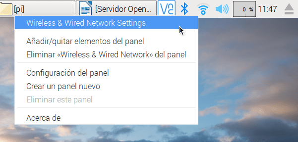](images/acceder-configuración-de-red.png)

Cuando aparezca la ventana de configuración seleccionamos la interfaz de red que usaremos para el servidor VPN. Como en mi caso me conecto a través de la red Wifi seleccionaré la interfaz wlan0.

A continuación relleno los parámetros de configuración de nuestra conexión inalámbrica de la siguiente forma:

[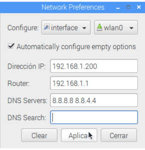](images/configurar-ip-fija-raspbian.png)

En cada uno de los campo introduzco los siguiente datos:

**Campo Dirección IP:** Escribimos la IP interna que queremos que tenga nuestro servidor VPN. En mi caso selecciono la IP 192.168.1.200. Vosotros generalmente podréis usar cualquier entre 192.168.1.2 y 192.168.1.254

**Campo Router:** Hay que introducir la puerta de entrada de vuestro Router. En mi caso y en la mayoría de casos de redes tipo C, la puerta de entrada es la 192.168.1.1

**Campo DNS Servers:** Debemos escribir la dirección de los servidores DNS que queremos usar. En mi caso uso las direcciones 8.8.8.8 y 8.8.4.4 que corresponden a los servidores DNS de Google. En vuestro caso podéis usar otros servidores sin ningún tipo de problema.

**Campo DNS Search:** En mi caso dejo este campo en blanco. Para nuestro propósito este campo no tienen ninguna utilidad.

Una vez rellenados los campos presionamos el botón Aplicar y reiniciamos la Raspberry Pi. En estos momentos ya deberían disponer de una IP interna fija. Para asegurarse de ello abren una terminal y ejecutan el siguiente comando:

> ```
> ifconfig
> ```

Seguidamente les aparecerá la siguiente pantalla y deberán comprobar que la interfaz de red que han configurado tenga la IP que hemos seleccionado. En mi caso pueden ver que la IP es 192.168.1.200. Por lo tanto puedo afirmar que dispongo de una IP estática.

[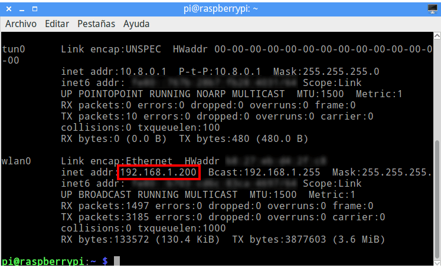](images/ip-fija.png)

## DISPONER DE UNA IP EXTERNA FIJA

Para conectarnos al servidor OpenVPN desde fuera de nuestra red local necesitamos una IP Pública fija.

En la mayoría de ocasiones este punto es un problema porque los proveedores de internet actuales acostumbran a ofrecer servicios de IP pública dinámica. Para solucionar este inconveniente podemos configurar un [servicio de DNS dinámico]() como NO-IP.

Siguiendo las instrucciones del link que acabo de dejar asociaremos nuestra IP pública a un dominio de forma permanentemente. De esta forma nuestro servidor OpenVPN siempre estará accesible desde el exterior de nuestra red local mediante un dominio del servicio NO-IP.

En mi caso mi IP Pública está asociada al dominio geekland.sytes.net.

## ABRIR LOS PUERTOS DE NUESTRO ROUTER

Seguidamente configuraremos nuestro router para que redirija las peticiones de los clientes al servidor Opevpn. Para realizar esto tenemos que abrir nuestro navegador y teclear nuestra puerta de entrada. Una vez realizado esto, tal y como se puede ver en la captura de pantalla, se abrirá una ventana que nos pedirá nuestro nombre de usuario y contraseña:

[](images/entrar-configuración-router.png)

Una vez introducida la información accederemos a la configuración de nuestro router. Seguidamente, tal y como se puede ver en la captura de pantalla, tenemos que acceder a los menús Advanced / NAT / Virtual Servers:

[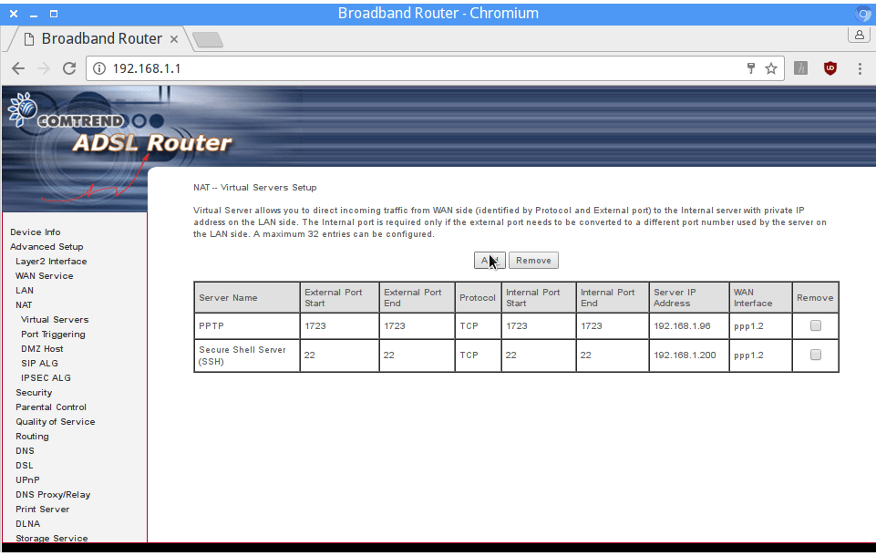](images/añadir-puerto.png)

A continuación presionamos el botón Add y nos aparecerá la siguiente pantalla:

[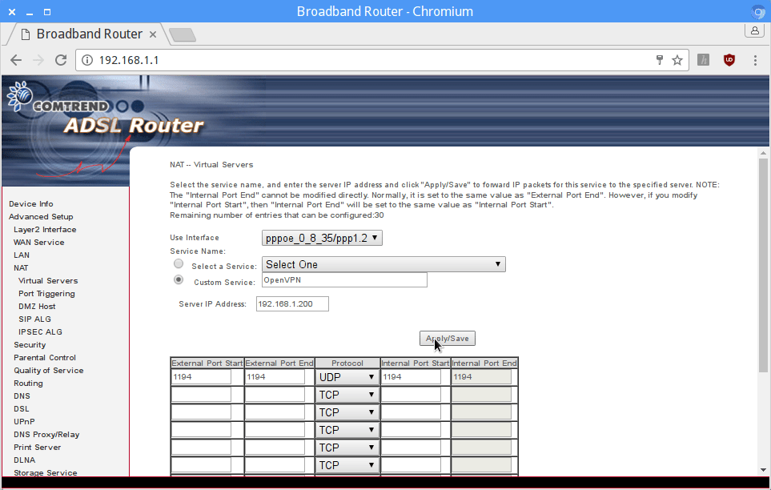](images/configuracion-para-abrir-el-puerto.png)

En en el campo **custom server** hay que escribir un nombre cualquiera. En mi caso como se puede ver en la captura de pantalla he escrito OpenVPN.

Seguidamente en el campo **Server IP Address** tenemos que escribir la IP del servidor OpenVPN. En mi caso he configurado que nuestro servidor tenga la IP estática 192.168.1.200. Por lo tanto en este campo debo escribir la IP 192.168.200.

En mi caso quiero que el servidor VPN funcione con el protocolo UPD y el puerto 1194. Por lo tanto, tal y como se puede ver en la captura de pantalla, seleccionamos el protocolo UDP y escribimos el puerto de nuestro servidor OpenVPN (1194) en los puertos internos y externos.

Presionamos el botón Apply/Save y de esta forma todas las peticiones exteriores que lleguen a nuestro router por el puerto 1194 serán redirigidas a nuestro servidor OpenVPN.

## INSTALAR Y CONFIGURAR EL SERVIDOR OPENVPN

La instalación y configuración del servidor VPN es un juego de niños. Lo único que tenemos que realizar es abrir una terminal y ejecutar el siguiente comando:

> ```
> curl -L https://install.pivpn.io | bash
> ```

El comando descargará y ejecutará el script PiVPN. Justo después de ejecutar el script empezará la instalación del servidor OpenVPN.

Durante la instalación tendréis que seleccionar una serie de parámetros. Los parámetros ha seleccionar en mi caso han sido los siguientes:

### Seleccionar la interfaz de red

Inicialmente es posible nos aparezca la siguiente ventana para seleccionar la interfaz de red que queremos usar para el servidor OpenVPN.

Siempre tengo la Raspberry Pi conectada a Internet a través de la red Wifi. Por lo tanto en mi caso seleccionaré la interfaz wlan0. En el caso conectéis a internet mediante cable deberéis seleccionar la opción eth0.

[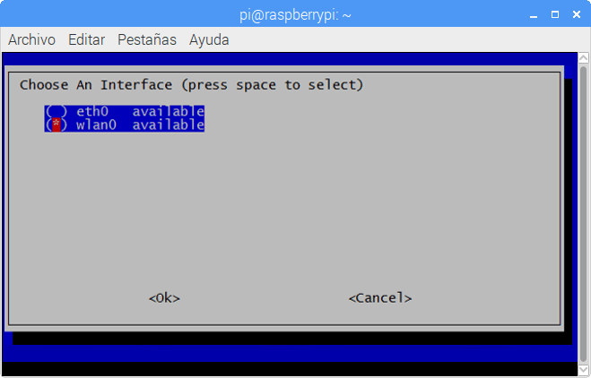](images/seleccionar-interfaz-red.png)

### Configurar una IP estática

Seguidamente nos preguntaran si queremos que la IP interna actual sea configurada como estática. A tal pregunta responderemos que Sí. Si os fijáis veréis que la IP que os ofrecerá como predeterminada es la que configuramos como estática en apartados anteriores.

[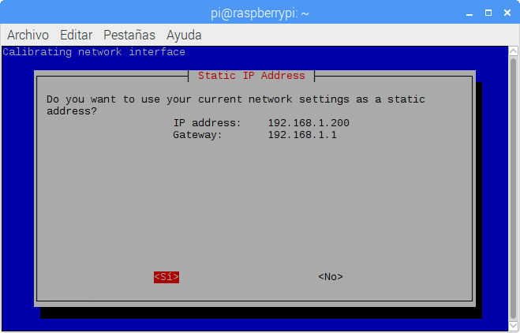](images/configurar-ip-servidor.png)

### Seleccionar el usuario del servidor OpenVPN

A continuación nos preguntará el usuario que queremos que almacene las configuraciones del servidor VPN. En mi caso solo tengo un usuario que es Pi y es el que selecciono. En caso que tengáis más de un usuario recomiendo usar el usuario en que os logueéis habitualmente.

[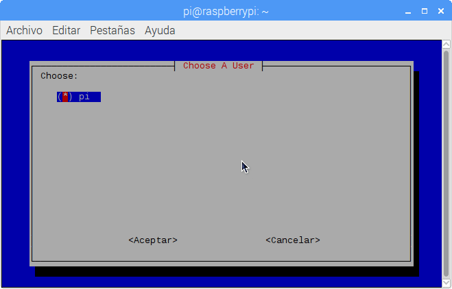](images/elegir-usuario-servidor-openvpn.png)

###### Nota: En términos de seguridad no es adecuado usar el usuario Pi. En principio seria más adecuado usar otro usuario.

### Actualizaciones de seguridad

Seguidamente se os preguntará si queréis recibir actualizaciones de seguridad en el servidor. En este apartado es recomendable responder que Sí.

[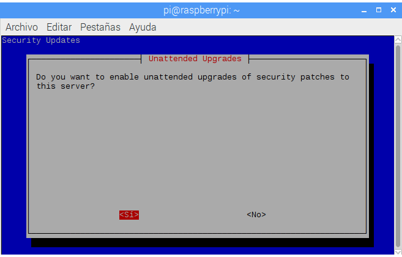](images/habilitar-actualizaciones-seguridad.png)

### Seleccionar el protocolo

El siguiente paso es seleccionar el protocolo en que queremos que trabaje el servidor VPN. Podéis elegir el protocolo que queráis, no obstante en mi caso siempre elijo el protocolo UDP.

Los motivos por los que elijo UDP son fáciles de entender. El protocolo UDP es más ligero y ofrece mayor velocidad transmisión que el protocolo TCP. Aunque el protocolo TCP asegura mejor la integridad de los datos transmitidos, puedo afirmar que en mi caso el protocolo UDP nunca me ha dado problemas.

[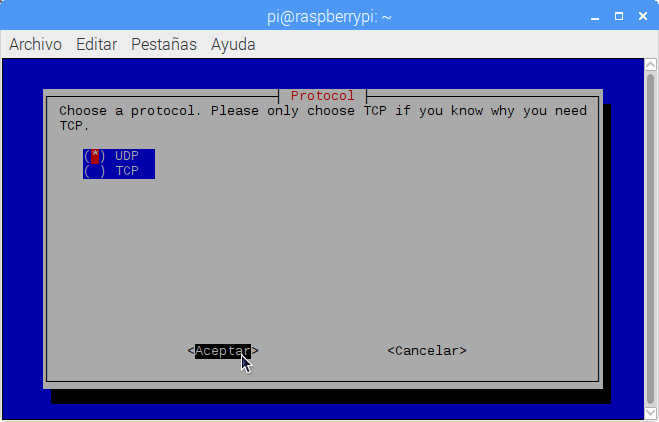](images/seleccionar-protocolo-vpn.png)

###### Nota: En el caso de elegir el protocolo TCP, recuerden que en la configuración del router deberán habilitar el protocolo TCP en el puerto que trabaja el servidor OpenVPN.

### Seleccionar el puerto del servidor OpenVPN

El siguiente punto a definir es el puerto en que trabajará el servidor OpenVPN. En apartados anteriores decidimos que queríamos que el puerto de nuestro servidor OpenVPN sea el 1194. Por lo tanto escribimos el puerto 1194 y presionamos en el botón Aceptar.

[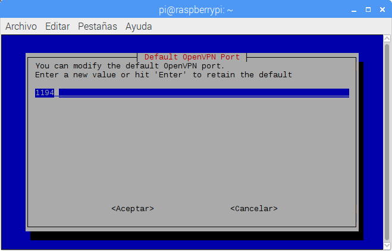](images/seleccionar-puerto-servidor.png)

Después de haber confirmado el puerto nos volverá a pedir confirmación. Responderemos que Sí.

[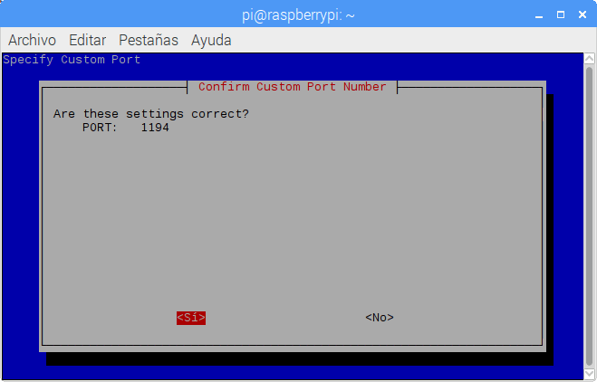](images/confirmar-puerto-servidor.png)

###### Nota: el puerto 1194 es el puerto estándar de los servicios OpenVPN. Por lo tanto en términos de seguridad seria recomendable usar otro puerto. En caso de usar otro puerto recuerden que también tendrán que abrirlo en su router.

### Elegir el nivel de cifrado del servidor

Ahora es el momento de elegir la longitud de la clave privada de nuestro servidor. Cuanto más alta sea la longitud de la clave, más tiempo y más potencia se necesitará para que un ataque de fuerza bruta tenga éxito.

En mi caso selecciono una longitud de 2048 bits. Si existen paranoicos de la seguridad pueden incluso elegir la opción de 4096 bits.

[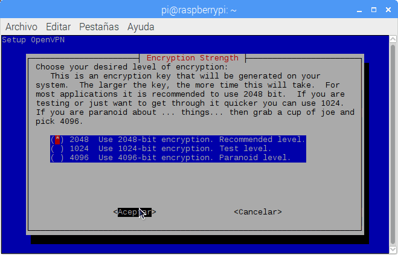](images/nivel-de-cifrado-del-servidor-openvpn.png)

### Definir la IP pública de nuestro servidor Openvpn

El siguiente paso es determinar la IP Pública de nuestro servidor. Como en mi caso uso un cliente de DNS dinámico seleccionaré la opción DNS Entry

[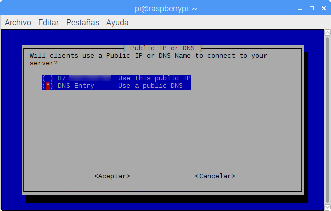](images/configurar-ip-publica.png)

A continuación introduciremos el dominio de nuestro servicio DNS dinámico y seleccionaremos la tecla OK.

En mi caso, en apartados anteriores configure una cuenta de NO-IP con el dominio geekland.sytes.net. Por lo tanto en mi caso introduzco el dominio geekland.sytes.net y presiono la tecla OK.

[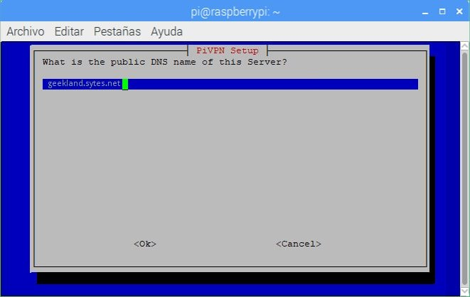](images/dominio-dns.jpg)

### Definir el servidor DNS que se usará para resolver las peticiones de los clientes

Finalmente tan solo tenemos que seleccionar el servidor DNS que queremos usar para resolver las peticiones de nuestros clientes. Podéis seleccionar cualquiera de los servidores, no obstante os recomiendo que elijáis los de Google o los de OpenDNS.

[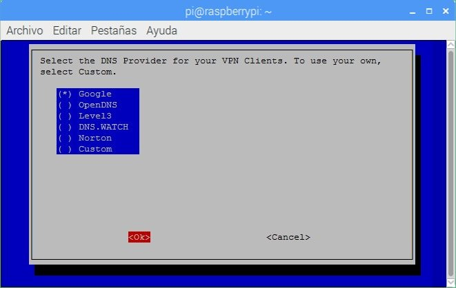](images/seleccionar-servidores-dns.jpg)

### Reiniciar el servidor o la Raspberry Pi

Cuando aparezca la siguiente pantalla tan solo deberán seleccionar la opción Sí ya la Raspberry Pi se reiniciará.

[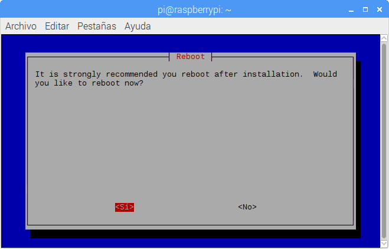](images/reiniciar-servidor.png)

Una vez reiniciada, cada vez que encendamos la Raspberry Pi se levantará un servidor OpenVPN que estará a nuestra plena disposición.

## CREAR CLIENTES PARA EL SERVIDOR OPENVPN

Una vez configurado el servidor ya podemos crear los usuarios que tendrán acceso al servidor VPN.

Para crear un usuario tan solo tenemos que abrir una terminal y ejecutar el siguiente comando:

> ```
> pivpn add
> ```

A continuación se nos preguntará el nombre que queremos que tenga el primero de nuestros usuarios. Escribimos un nombre de usuario y presionamos la tecla Enter.

Seguidamente tendremos que introducir la contraseña para que el usuario que estamos creando se pueda conectar al servidor. La introducimos una vez y presionamos Enter, seguidamente la volvemos a introducir para confirmarla. A continuación se creará el usuario y un archivo de configuración para que el usuario pueda conectarse fácilmente al servidor OpenVPN.

El archivo de configuración se creará en la ubicación ~/ovpns

[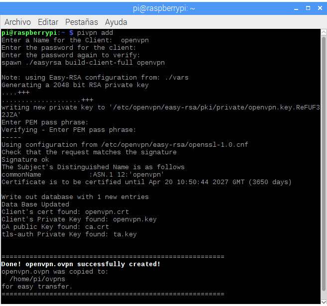](images/crear-cliente-servidor-openvpn.png)

Si quisiéramos crear un usuario sin contraseña deberíamos haber ejecutado el comando:

> ```
> pivpn add nopass
> ```

## ELIMINAR USUARIOS DEL SERVIDOR OPENVPN

Para obtener un listado de la totalidad de certificados otorgados a los clientes ejecutamos el siguiente comando:

> ```
> pivpn list
> ```

Al ejecutar el comando obtenemos un listado de la totalidad de los certificados disponibles conjuntamente con su estado.

> ```
> ::: Certificate Status List :::
>  :: Status || Name :: 
>  Valid :: server
>  Valid :: openvpn
> ```

Por lo tanto vemos que al cliente openvpn le otorgamos un certificado y además vemos que es válido. Si queremos que este cliente no se pueda conectar nunca más a nuestro servidor tan solo tenemos que revocarle el certificado ejecutando el siguiente comando en la terminal:

> ```
> pivpn revoke
> ```

Después de ejecutar el comando se nos preguntará el nombre del cliente al que queremos revocar el certificado. Lo introducimos y presionamos la tecla enter. Acto seguido el cliente ya no se podrá conectar nunca más a nuestro servidor.

## UBICACIONES QUE TENEMOS QUE CONOCER DEL SERVIDOR OPENVPN

Para el correcto mantenimiento del servidor OpenVPN es interesante que conozcáis las siguientes ubicaciones:

  
|   _**Archivo**_   |   _**Descripción**_   |   _**Ubicación**_   |
| --- | --- | --- |
|   _server.conf_   |   Archivo donde se guardan los parámetros de configuración del servidor. Si en el proceso de configuración del servidor hemos cometido algún error, tan solo tendremos que acceder a este archivo y realizar las modificaciones pertinentes.   |   /etc/openvpn   |
|   _Default.txt_   |   Fichero que se toma como referencia para generar el fichero de configuración de los clientes. En este fichero podremos cambiar parámetros como por ejemplo la IP pública del servidor.   |   /etc/openvpn/easy-rsa/pki   |
|   _cliente.conf_   |   Archivo de configuración para que el cliente pueda conectarse al servidor. Este archivo es absolutamente necesario para que los clientes puedan conectarse al servidor OpenVPN.   |   ~/ovpns  y  /etc/openvpn/easy-rsa/pki   |

Para hacerse una idea de lo que significan cada uno de los parámetros pueden consultar el siguiente post en el que se detalla como instalar y configurar un servidor [OpenVPN en Linux]().

Otras ubicaciones de interés de nuestro servidor son:

  
|   _**Archivo**_   |   _**Descripción**_   |   _**Ubicación**_   |
| --- | --- | --- |
|   _ca.key_  _server.key_  _client1.key_  _client2.key_   |   En cada uno de los archivos mencionados se guardan las claves privadas del servidor, de la entidad certificadora y de los clientes.   |   /etc/openvpn/easy-rsa/pki/private   |
|   _server.crt_  _client.crt_   |   Certificados de cada uno de los clientes y del servidor.   |   /etc/openvpn/easy-rsa/pki/issued   |
|   _dh2018.pem_  _ta.key_   |   Ubicación en que se halla el certificado raíz de la entidad certificados, los archivos que contienen los parámetros de Diffie Hellman y la clave para la autenticación TLS   |   /etc/openvpn/easy-rsa/pki   |

## VER LOS CLIENTES CONECTADOS AL SERVIDOR

Si alguna vez precisan saber los clientes que están conectados al servidor tan solo tienen que ejecutar el siguiente comando:

> ```
> pivpn clients
> ```

## DESINSTALAR EL SERVIDOR VPN

Si finalmente llega el día que quieren desinstalar el servidor OpenVPN de su Rapberry Pi tan solo tienen que ejecutar el siguiente comando en la terminal:

> ```
> pivpn uninstall
> ```

## CONECTARSE AL SERVIDOR OPENVPN

Una vez finalizada la configuración del servidor ya podemos empezara usar el servidor. En las próximas semanas detallaré el procedimiento a seguir para conectarse a nuestro servidor VPN usando los sistemas operativos más comunes en la actualidad.
