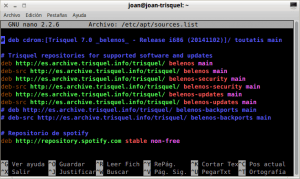
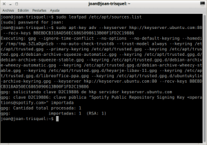

Hace ya muchos años que Spotify dispone de un cliente de escritorio para Linux y a estas alturas imagino que para la gran mayoría no supone una gran dificultad su instalación. No obstante a modo de guía para que la gente pueda instalar Spotify simplemente copiando y pegando, he decido escribir este post.<!--more-->

## ÁMBITO DE APLICACIÓN DEL TUTORIAL

**Las instrucciones mencionadas en este post son únicamente válidas para instalar spotify en Debian, en Ubuntu y en la totalidad de distribuciones que se derivan de Debian y Ubuntu** como por ejemplo, Linux Mint, Trisquel, Perppermint, Xubuntu, AntiX, etc.

## INSTRUCCIONES PARA INSTALAR SPOTIFY EN DEBIAN UBUNTU Y DERIVADOS

El primer paso de la instalación es añadir el repositorio de Spotify en nuestra distribución. Para ello **accedemos a la terminal y ejecutamos le siguiente comando:**

> ```
> sudo nano /etc/apt/sources.list
> ```

Seguidamente se abrirá el editor de textos nano. Una vez se abra el editor de textos, tal y como se puede ver en la captura de pantalla, deben **añadir la siguiente linea correspondiente al repositorio de spotify:**

> ```
> deb http://repository.spotify.com stable non-free
> ```

[](images/Añadir-repositorio-spotify.png)

###### Nota: El repositorio añadido es para disponer del cliente de escritorio estable de spotify. Si quieren usar la versión de pruebas de spotify deberán reemplazar el repositorio anterior por deb http://repository.spotify.com testing non-free

Una vez añadido el repositorio **guardamos los cambios y cerramos el fichero.**

El segundo paso de la instalación es **añadir la clave pública del repositorio de spotify mediante el uso del siguiente comando:**

> ```
> sudo apt-key adv --keyserver hkp://keyserver.ubuntu.com:80 --recv-keys 931FF8E79F0876134EDDBDCCA87FF9DF48BF1C90
> ```

Una vez ejecutado el comando e instalada la clave pública, tendremos la seguridad que los paquetes de spotify que usaremos para la instalación son seguros y su procedencia es la que tiene que ser. Los resultados obtenidos al añadir la clave pública tienen que ser similares a los siguientes:

[](images/Clave-añadida.png)

El tercer paso es tan simple como **actualizar los repositorios ejecutando el siguiente comando el terminal:**

> ```
> sudo apt-get update
> ```

Finalmente, una vez actualizados los repositorios ya podemos **instalar Spotify ejecutando el siguiente comando en la terminal:**

> ```
> sudo apt-get install spotify-client
> ```

Una vez instalado, tal y como se puede ver en la captura de pantalla, podemos utilizar spotify sin ningún tipo de problema.

[](images/Spotify-funcionando.png)
