Hoy vamos a conocer una distribución GNU Linux llamada Tails. En otros post de este blog hemos visto como usar la Red Tor para navegar anónimamente y acceder a la deep web. Concretamente me refiero al siguiente post:

[https://geekland.eu/acceder-a-la-deep-web/]()

<!--more-->Como podéis ver en el post anterior se muestra como instalar el navegador Tor Bundle y de esta forma poder navegar anónimamente a través de la red Tor. ¿Pero que pasa con el resto de conexiones salientes a internet que no vayan a través del navegador Tor?

Pues sencillamente son conexiones convencionales. Por lo tanto nuestra IP quedará al descubierto y no tendremos garantizado ni nuestro anonimato ni nuestra privacidad.

Alternativas que no requieran de grandes esfuerzos ni conocimientos para solucionar este problema hay como mínimo 2. Una de ellas es conectarse a través de un servidor VPN. Si quieren tener los detalles de como hacerlo pueden consultar el siguiente post:

[https://geekland.eu/conectarse-a-un-servidor-vpn-gratis/]()

Otra solución diferente a la que acabamos de citar es usar Tails. Seguidamente veremos que es Tails. Como lo tenemos que instalar y que beneficios podemos obtener.

###### Nota:  Tanto el uso de tails como de un VPN nos proporcionará una privacidad total en la totalidad de conexiones que se establecen en Internet.

###### Nota: Tails es un acrónimo. El significado de Tails es “The amnesic Incognito Live system”

## ¿QUÉ ES TAILS?

Tails es una distribución GNU/Linux basada en la rama de Debian Stable. La particularidad de está distribución es que está diseñada para forzar la totalidad de conexiones salientes a través de la red Tor. De está forma estamos garantizando nuestra privacidad y anonimato en la red.

Como podréis ver más adelante y como podréis experimentar en vuestras carnes Tails es una distribución pensada para ser arrancada en un Live DVD o en un Live USB. Está característica es importante ya proporciona una serie de ventajas muy interesantes.

## BENEFICIOS QUE NOS PROPORCIONA TAILS

Seguidamente paso a nombrar una serie de puntos que según mi punto de vista hacen interesante el uso de Tails:

1. La totalidad de conexiones salientes de nuestro ordenador irán a través de la red Tor. Por lo tanto a priori estamos garantizando nuestra privacidad y anonimato ya que usando estamos ocultando nuestra IP y la información saliente estará cifrada.
2. Cualquier conexión saliente que no sea anónima será bloqueada por Tails a no ser que le pidamos expresamente que no lo haga.
3. Tails no deja rastro de los sitios que hemos visitado ni de las acciones que hemos realizado cuando nos conectamos a Internet. Esto esta garantizado gracias a que Tails no hace uso de nuestro disco duro ni tampoco de nuestra memoria Swap. La totalidad de programas se almacenaran y ejecutarán en nuestra memoria RAM y como todos saben la memoria RAM es una memoria volátil. Por lo tanto en apagar nuestro ordenador la memoria se borrará borrando todo rastro de lo que hemos realizado.
4. El Live USB o Live DVD donde ejecutamos Tails no tiene persistencia. Por lo tanto todo lo que se guarde en nuestra home y cualquier programa que instalemos no estará presente la próxima vez que arranquemos Tails. Para poner un ejemplo simple instalamos suponemos que instalamos Gimp. Una vez instalado lo podemos usar sin problema pero al cerrar el ordenador Gimp desaparece. La próxima vez que arranquemos Tails tendremos que volver a instalar Gimp.
5. Tails es una distro que viene con todo lo necesario para proteger nuestros datos e información. Así por ejemplo dispone de [Luks](http://en.wikipedia.org/wiki/LUKS "Luks") para cifrar memorias USB y discos duros externos, [OpenPGP](http://gnupg.org/ "gnupg") para poder cifrar nuestros correos y documentos, [Otr](http://www.cypherpunks.ca/otr/index.php "OTR") para proteger las conversaciones de mensajería instantánea, [Nautilus Wipe](https://tails.boum.org/doc/encryption_and_privacy/secure_deletion/index.en.html#index2h2 "Nautilus Wipe") para triturar los archivos de forma fácil y segura, [Https everywhere](https://www.eff.org/https-everywhere "Https Everywhere") para cifrar prácticamente la totalidad de conexiones cuando navegamos por internet, etc.

Además con Tails podemos siempre llevar nuestro ordenador en el bolsillo. Al ser una distribución Live USB nos podremos conectar en cualquier ordenador y el contenido que veremos será el nuestro. Como podréis ver cuando hayas instalado tails viene equipado con todo lo básico para un uso habitual del ordenador. Además si perdemos el USB a priori no pasa nada ya que quien lo encuentre no podrá acceder al contenido que tenemos almacenado en nuestro USB.

###### Nota: Tails por defecto no tiene persistencia. En el caso que necesitamos almacenar datos tenemos varias soluciones. Una posible solución es usar un USB adicional para almacenar los datos. Otra es  crear una partición adicional cifrada dentro de nuestro Live USB para poder guardar datos y otro tipo de información. En el proceso de instalación se explica como realizar el proceso.

## INSTALAR TAILS

### Requisitos mínimos para instalar Tails

Antes de empezar la instalación de Tails nos tenemos que asegurar que nuestro ordenador cumple con los requisitos mínimos de instalación. Los requisitos mínimos de instalación especificados en la página web de Tails son los siguientes:

1. Aunque puede funcionar con menos se recomienda que nuestro ordenador como mínimo disponga de 1GB de memoria RAM.
2. En principio la distro tiene que arrancar con cualquier procesador que disponga de una arquitectura x86 o x64. Esta distro no es compatible para funcionar en procesadores Power PC o ARM.
3. La BIOS de nuestro ordenador tiene que permitir arrancar desde una unidad USB. Hoy en día la gran mayoría de ordenadores disponen de esta característica. En caso de que no la tengan siempre se podrá arrancar desde un Live DVD.
4. Disponer de un USB de como un mínimo de 2GB de almacenamiento para poder ejecutar tails.

### Descargar Tails

El siguiente paso será descargar la imagen ISO de tails. Para descargar la imagen ISO tenemos que visitar la siguiente página:

[https://tails.boum.org/download/index.es.html](https://tails.boum.org/download/index.en.html "Descargar Tails")

Una vez dentro de la página tenemos que seleccionar el método de descarga. Como se puede ver en la captura de pantalla en mi caso he decidido descargar por Torrent.

[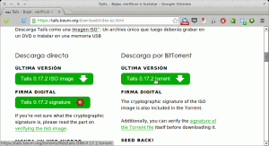](images/Descargar-Tails.png)

La descarga de la distro nos llevará unos minutos. La imagen ISO ocupa aproximadamente 900Mb. Una vez terminada la descarga veremos se habrán descargado 2 archivos. El primero es la imagen ISO y el segundo es un archivo con la extensión .key. Esté último nos será útil para comprobar la integridad de la imagen ISO que acabamos de descargar.

### Comprobar la integridad de la imagen ISO de tails

###### Nota: Es recomendable comprobar la integridad de la imagen ISO pero si no les preocupa la seguridad pueden saltarse este paso. La utilidad de este paso es asegurar que el contenido de la imagen ISO original no ha sido modificada por un tercero.

Una vez descargada la imagen ISO hay que comprobar la integrad de la imagen ISO descargada. Para comprobar la integridad de la imagen ISO tenemos que seguir lo siguientes puntos:

1- Guardamos tanto los archivos .iso y .key que acabamos de descargar en nuestra home.

2- Ahora tenemos que descargar la firma digital de Tails. La firma digital de Tails la tenemos que descargar de la siguiente página:

[https://tails.boum.org/download/index.es.html#verify](https://tails.boum.org/download/index.en.html#verify "Descargar La firma Digital de Tails")

3- Para descargar la firma digital tenemos que dar click en el botón verde (Tails signing Key) que se puede ver en la siguiente captura de pantalla:

 [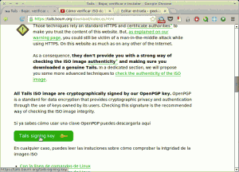](images/Descargar-Llave.png)

4- Guardamos el archivo que acabamos de descargar en nuestra home y abrimos una terminal. Tecleamos el siguiente comando para importar la llave de Tails a nuestro sistema operativo:

> ```
> cat tails-signing.key | gpg --keyid-format long --import
> ```

5- Seguidamente para iniciar la verificación criptográfica tecleamos el siguiente comando en la terminal:

> ```
> gpg --keyid-format long --verify tails-i386-0.17.2.iso.pgp tails-i386-0.17.2.iso
> ```

###### Nota: El texto de color rojo se tiene que modificar en función del nombre del archivo ISO  y de la clave criptográfica que hemos descargado.

Una vez finalizados estos pasos obtendremos un resultado similar al siguiente:

[](images/Captura-pantalla-proceso-de-validación-de-clave.png)

Como se puede ver en la captura de pantalla vemos la frase “Firma correcta de “Tails developers (signing key)”

Por lo tanto podemos estar seguros que esta imagen no ha sido modificada por una tercera persona con el fin de atacarnos. Si se continua leyendo hay una advertencia de que la clave no está certificada por una firma de confianza. En principio este mensaje es normal. Si quisiéramos que no aparezca el mensaje deberíamos firmar la clave nosotros mismos.

### Instalar Tails en la unidad USB

Para instalar tails en una unidad USB hay varios métodos. No obstante para aprovechar el 100% de funcionalidades de Tails el mejor método de instalación es el que se describe a continuación:

###### Nota: Intenté otros métodos como Unetbootin pero me daba numerosos problemas. Para empezar cuando arrancaba Tails solo me detectaba un núcleo de los 2 que tiene mi procesador. Además habían funcionalidades de Tails que no funcionaban. Durante el proceso de instalación hay que ir con sumo cuidado. Cualquier paso que hagáis mal puede generar que se elimine la totalidad de contenido de vuestro disco duro.

Para iniciar el proceso de instalación primero tenemos que asegurarnos que tenemos instalado el paquete syslinux. Para ellos abrimos la terminal y ponemos:

> ```
> sudo apt-get install syslinux
> ```

###### Nota: Seguramente vuestra distro tiene el paquete syslinux instalado de serie.

Ahora tenemos que conseguir de 2 unidades USB. Seleccionamos uno de los 2 USB y lo enchufamos en el ordenador. Ahora tenemos que averiguar el nombre que asigna linux a nuestro dispositivo USB. Para ello abrimos una terminal y tecleamos comando:

> ```
> df -h
> ```

El resultado obtenido es el siguiente:

[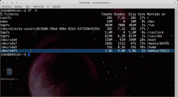](images/Dispositivo-USB.png)

Como se puede ver en la imagen hay un dispositivo con denominación /dev/sdf1 que ocupa 1.9 GB. Este es nuestro USB. Por lo tanto ya sabemos que nuestro dispositivo es reconocido con la denominación /dev/sdf.

###### Nota: como se puede ver en la captura de imagen el dispositivo leído es dev/sdf1. El 1 hay que omitirlo. Nuestro dispositivo será /dev/sdf

Una vez conocemos la denominación con la que Linux reconoce nuestro USB abrimos una terminal y tecleamos los siguientes comandos para generar el live USB:

> ```
> isohybrid '/home/joan/tails-i386-0.17.2.iso' --entry 4 --type 0x1c
> ```

y seguidamente:

> ```
> sudo cat '/home/joan/tails-i386-0.17.2.iso' > /dev/sdf && sync
> ```

###### Nota: La parte de los comandos en texto rojo es variable en función de donde habéis guardado el archivo ISO de tails que se ha descargado y en función de como linux denomina vuestro dispositivo USB.

Esperamos unos minutos y el proceso de instalación de Tails en el USB habrá terminado. Ahora ya podemos reiniciar el ordenador y hacer que arranque a través de la memoria USB para ejecutar Tails. Justo al arrancar Tails veréis la siguiente pantalla:

[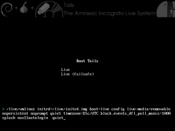](images/Tails-Boot.png)

Seleccionamos Live, apretamos Enter y esperamos unos pocos segundos, como se puede ver en la captura de pantalla Tails ya ha arrancado:

[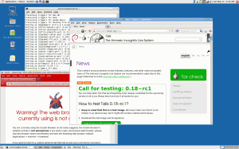](images/recien-instalado.png)

### Activar la totalidad de funcionalidades de Tails

En estos momentos Tails es plenamente operativo. Pero de la forma en que lo hemos instalado ocasiona que no estén disponibles la totalidad de características.

Así por ejemplo si queremos crear un espacio de persistencia para poder almacenar archivos, las bookmark del navegador, paquetes de programas descargados, etc no nos será posible. Para poder solucionar este problema tenemos que usar otro dispositivo USB y conectarlo a nuestro ordenador.

Una vez ya hemos conectado el USB, como se puede ver en la captura de pantalla, vamos al menú Applications/tails/Tails USB Installer

[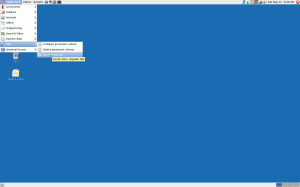](images/Instalar-en-otro-USB.png)

Una hemos hecho click encima de Tails USB Installer,  aparecerá la siguiente pantalla:

[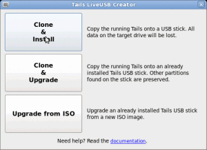](images/Instalar-Tails-en-USB.png)

Seleccionamos la opción Clone & Install. Justo después de seleccionarla aparecerá la siguiente pantalla:

[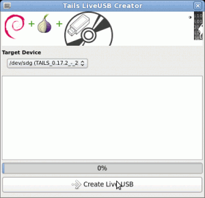](images/Paso-final-instalar-tails-otro-usb.png)

Ahora en target device tenemos que seleccionar la unidad del USB que acabamos de enchufar. Seguidamente podamos apretar en el botón Create Live USB. Ahora solamente tenemos que esperar y se creará un nuevo USB con Tails.

En el nuevo USB que se acaba de crear funcionaran el 100% de funcionalidades de Tails. Así que ahora ya no necesitamos el primer USB. Lo podemos borrar y usarlo para lo que queramos porqué a partir de ahora solo usaremos el segundo.

### Crear un espacio de persistencia dentro de nuestro USB

Como se ha comentado anteriormente Tails es una distribución pensada para no dejar rastros. Por lo tanto cada vez que apagamos el ordenador la totalidad de configuraciones, archivos descargados durante la sesión, bookmark que tenemos en el navegador, programas instalados, configuración del correo Claws, etc desaparecen. La próxima vez que arranquemos el USB el contenido que veremos es exactamente el mismo que como si acabáramos de instalar Tails.

Esto es positivo ya que borra cualquier rastro que dejamos, pero también puede llegar a molestar que cada vez que arranquemos el ordenador se tengan que realizar exactamente las mismas operaciones, instalar los mismos programas, introducir la configuración del wifi, etc.

Para solucionar este engorro podemos crear un volumen de persistencia en nuestro USB. Además disponer de un espacio de persistencia puede llegar a ser sumamente útil ya que podremos usar este USB almacenar documentos. Así por ejemplo puedo abrir openoffice y empezar a trabajar en una hoja de cálculo. Una vez terminado el trabajo lo puedo almacenar en el espacio de persistencia. Así cuando introduzca el Pen Drive en otro ordenador lo tendré de nuevo accesible.

Para crear el espacio de persistencia tenemos que seguir lo siguientes pasos:

Como se puede ver en la captura de pantalla vamos al menú Applications/Tails/Configure persistent Volume y apretamos el botón derecho del mouse.

[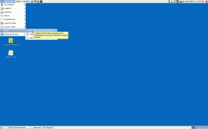](images/Crear-persistencia.png)

Justo al apretar el botón derecho del mouse aparecerá la siguiente pantalla:

[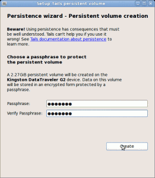](images/Crear-persistencia-Cifrado.png)

En la captura de pantalla pantalla se puede ver se han detectado 2,27 GiB que no se usan en el Pen Drive donde tenemos instalado Tails. Por defecto Tails coge la totalidad de este espacio libre para crear el volumen de persistencia.

El volumen de persistencia que se creará estará cifrado. Por lo tanto nos pedirá que introduzcamos una clave de cifrado. Introducimos una buena clave de cifrado y apretamos el botón de Create.

Esperamos un momento y nuestro espacio de persistencia ya se habrá creado. Ahora nos aparecerá la siguiente pantalla para seleccionar la información que queremos que se almacene en nuestro volumen de persistencia:

[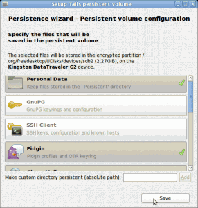](images/Configuración-persistencia.png)

Las diferentes opciones que no mostrará el menú de configuración son las siguientes:

_**Personal Data:**_ Si seleccionamos esta opción podremos almacenar archivos, documentos de trabajo, crear carpetas, etc en el volumen de persistencia.

**_GnuPG:_** Si seleccionamos esta opción las claves OpenPGP creadas o importadas se guardaran en el volumen persistente. Así siempre las tendremos disponibles.

_**SSH Client:**_ Si activamos esta opción, en el espacio de persistencia se almacenarán las claves SSH creadas o importadas, las claves de los host que nos hemos conectado y los archivos de configuración de SSH.

_**Pidgin:**_ Si activamos la opción pidgin la totalidad de archivos de configuración de está aplicación se guardaran en nuestro volumen de persistencia. Esto incluye la configuración de las cuentas, las claves de encriptación OTR y el historial de chats.

_**Claws Mail:**_ Si seleccionamos la opción Claws Mail nos permitirá guardar la configuración de nuestro correo electrónico y nuestro emails en el espacio de persistencia.

_**Gnome Keyring:**_ Si elegimos la opción Gnome Keyring la totalidad de información que contiene el anillo de llaves de gnome se almacenará en nuestro volumen de persistencia. Ejemplos del tipo de información que se guarda en el anillo de llaves son la llave WPA que nos sirve para conectarnos a internet, usuarios, etc.

_**Network Connections:**_ Si elegimos la opción Network Connections se guardará la configuración de conexión de los distintos puntos de acceso en nuestro volumen de persistencia. Por ejemplo la configuración de acceso a WLAN\_46, WLAN\_80, etc.

_**APT Packages**_: Si seleccionamos la opción APT Packages, en nuestro espacio de persistencia se guardara una copia de la totalidad de paquetes instalados con apt-get o synaptic. De esta forma cuando arrancamos el ordenador y necesitemos instalar un programa que ya habíamos instalado anteriormente se instalará mucho más rápido ya que la totalidad de paquetes estarán en el espacio de persistencia y por lo tanto no se tendrán que descargar de Internet de nuevo.

**A****PT** _**Lists:**_ Al seleccionar la opción APT lists haremos que en el espacio de persistencia se almacene la información descargada cuando usamos el comando apt-get update. Así de este modo cuando arranquemos tails la lista de paquetes que contiene cada repositorio estará actualizada.

_**Browser Bookmarks:**_ Al seleccionar la opción Browser Bookmars lo que estaremos consiguiendo es que se guarden nuestras páginas favoritas en el navegador Iceweasel arrancado en modo seguro. Así por ejemplo si ponemos como página favorita la página de The Hidden wiki, la próxima vez que reiniciaremos Tails, The Hidden Wiki aún estará en nuestras páginas favoritas.

_**DotFiles:**_ Si activamos la opción Dotfiles todas los archivos ubicados en la ruta /lib/live/mount/persistence/XXX\_unlocked/dotfiles estarán accesibles desde nuestra home.

_**Custom Directory:**_ La opción Custom directory permite seleccionar cualquier carpeta. Las carpetas que seleccionemos serán almacenadas en nuestro volumen de persistencia. Así por ejemplo si queremos hacer persistente nuestra carpeta de imágenes tan solo tenemos que seleccionar la carpeta Imágenes.

###### Nota: Cuando arranquemos Tails nos preguntará si queremos arrancar el espacio de persistencia o no. En el caso que querer arrancarlos tendremos que introducir nuestra contraseña. También existe la posibilidad de abrir nuestro espacio de persistencia en modo lectura.

Una vez hemos elegido las opciones, como se puede ver en la captura de pantalla tan solo tenemos que apretar el botón Save. En estos momentos ya se ha creado el volumen de persistencia. Para que los cambios surjan efecto se tendrá que reiniciar el ordenador.

A partir de esto momento solo hay que probar y experimentar con Tails para saber hasta donde podemos llegar.

## PROGRAMAS QUE TIENE TAILS POR DEFECTO

Una vez Instalado y configurado Tails ya estáis en disposición de ver el soft que Tails trae de serie. Si hechaÍs un vistazo rápido se puede observar lo siguiente:

Tails utiliza el entorno gráfico de [gnome classic](http://www.gnome.org/ "Gnome").

En lo que hace referencia a la área de **Redes** Tails lleva preinstalado el siguiente software:

[Tor](https://www.torproject.org/ "Tor"), [Gnome network Manager](http://projects.gnome.org/NetworkManager/ "gnome network Manager"), [Iceweasel](http://www.geticeweasel.org/ "Iceweasel"), [Pidgin](http://www.pidgin.im/ "Pidgin"), [Claws mail](http://www.claws-mail.org/ "Claws Mail"), [Liferea](http://lzone.de/liferea/ "Liferea"), [Gobby](http://gobby.0x539.de/trac/ "Gobby"), [Aircrack](http://aircrack-ng.org/ "Aircrack") e [I2P](http://www.i2p2.de/ "I2P").

En lo que ha **Ofimática** se refiere encontramos:

[OpenOffice](http://www.openoffice.org/ "OpenOffice"), [Gimp](http://www.gimp.org/ "Gimp"), [Inskape](http://inkscape.org/ "Inkscaoe"), [Scribus](http://www.scribus.net/canvas/Scribus "Scribus"), [Audacity](http://audacity.sourceforge.net/ "Audacity"), [Pitivi](http://www.pitivi.org/ "Pitivi"), [Simple Scan](https://launchpad.net/simple-scan "Simple Scan"), [Poedit](http://www.poedit.net/ "Poedit"), [Sane](http://www.sane-project.org/ "Sane"), [Brasero](http://projects.gnome.org/brasero/ "Brasero") y [Sound Juicer](https://gitlab.gnome.org/GNOME/sound-juicer "Sound Juicer").

En **Criptografia y Privacidad** encontramos las siguientes aplicaciones:

[Luks](http://en.wikipedia.org/wiki/LUKS "Luks"), [Palimpsest](https://en.wikipedia.org/wiki/Palimpsest "Palimpsest"), [GnuPG](http://gnupg.org/ "Gnupg"), [Veracrypt](https://tails.boum.org/blueprint/veracrypt/ "Truecrypt"), [PWGen](http://pwgen-win.sourceforge.net/ "PWgen"), [Shamir's Secret Sharing](http://en.wikipedia.org/wiki/Shamir%27s_Secret_Sharing "Shamir"), [Florence Virtual Keyboard](http://florence.sourceforge.net/english.html "Teclado Forense"), [MAT](https://mat.boum.org/ "MAT") y [KeepassX](http://www.keepassx.org/ "Kepass").

## LIMITACIONES DE TAILS

A pesar de los beneficios que Tails nos aporta son inmensos también tenemos que tener en cuenta que tiene limitaciones. Algunas de las limitaciones de Tails son las siguientes:

1. Tails utiliza la red Tor para la totalidad del tráfico saliente. El utilizar la red Tor implica que el trafico de salida del último nodo al servidor Web no irá cifrado. Por lo tanto alguien podría estar capturando nuestro tráfico.
2. Tails en ningún momento esconde el hecho que estas usando la red Tor. Por lo tanto el administrador de la Red o tu ISP pueden saber que te estas conectando a la Red Tor.
3. Los sitios web donde nos conectamos pueden detectar que el tráfico proviene de un nodo de salida de Tor. Para ello tan solo tienen que introducir la IP de su servidor en la siguiente página web: [https://check.torproject.org/cgi-bin/TorBulkExitList.py](https://check.torproject.org/cgi-bin/TorBulkExitList.py "Nodos de Tor salientes")
4. Aunque usemos Tails y la Red Tor podemos sufrir ataques [Man in The middle](http://es.wikipedia.org/wiki/Ataque_Man-in-the-middle "Explicación ataque man in the middle"). La red Tor tiene puntos vulnerables. La red Tor es susceptible de recibir ataques Man in the Middle en el tráfico que se genera desdel nodo de salida de la Red Tor al servidor Web al que nos queremos conectar. Incluso el mismo nodo de Salida puede actuar como un atacante Man in the Middle.
5. Tails por defecto no encripta nuestros documentos ni nuestros correos electrónicos. Tails nos proporciona las herramientas para que lo podamos hacer nosotros mismos.
6. En el caso de necesitar cambiar de identidad se aconseja cerrar Tails y volver a arrancar Tails. Usar la propiedad nueva identidad de Vidalia tiene limitaciones. Si usamos esta propiedad forzaremos a Tor a usar una red de nodos distintos para conectarnos a la página web que queremos visualizar, pero esto solo lo hará para conexiones nuevas. Además si no cerramos Tails las cookies y otros datos almacenados pueden revelar lo que hemos estado realizando.
7. Como hemos visto Tails permite crear volúmenes de persistencia. Hay que ir con cuidado con los volúmenes de persistencia ya que si perdemos nuestro USB tendría la posibilidad de acceder a archivos almacenados.
8. Hay que ir con cuidado e intentar instalar las mínimas aplicaciones posibles en Tails. Tails viene configurado para proporcionar privacidad y anonimato. El simple hecho de instalar otros paquetes en el sistema puede provocar resultados inesperados generando que nuestra privacidad y anonimato queden comprometidos.
9. Tails no hace tus contraseñas más fuertes ni mejores. La componente humana juega un papel fundamental en la seguridad.
10. Tails evoluciona constantemente. Por lo tanto es altamente recomendable instalar las actualizaciones periódicas que van llegando. Gran parte de las actualizaciones que llegan son para tapar agujeros de seguridad.

## INFORMACIÓN ADICIONAL SOBRE TAILS

En el link que pondré a continuación pueden encontrar una guía de usuario de Tails: 

[https://tails.boum.org/doc/index.es.html](https://tails.boum.org/doc/index.en.html "Documentación Sobre Tails")

En esta guía encontrareis explicaciones detalladas y ampliadas de como instalar Tails y como iniciarse en su uso. Gran parte de la información que encontrareis está en Español mientras que el resto está en Inglés.

## OTRAS DISTROS SIMILARES A TAILS

Para finalizar solo me gustaría citar ouna alternativa al software Tails que de momento no he probado.

**Discreete Linux:**

[https://www.privacy-cd.org/](https://www.privacy-cd.org/ "Ubuntu Privacy Remix")

## FUENTES

[https://tails.boum.org/](https://tails.boum.org/ "Tails official Website")

[http://es.wikipedia.org/wiki/The\_Amnesic\_Incognito\_Live\_System](http://es.wikipedia.org/wiki/The_Amnesic_Incognito_Live_System "Tails Wikipedia")
