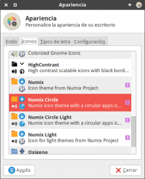
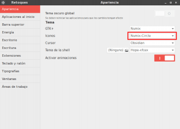
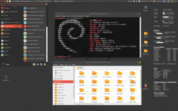

Hace unas semanas vimos los pasos a seguir para poder instalar el tema Numix GTK en cualquier distribución Linux. En este post veremos los pasos a seguir para poder instalar el tema de iconos Numix en prácticamente cualquier distribución Linux. Los pasos a seguir para la instalación de los iconos Numix y Numix Circle son los siguientes.<!--more-->

## INSTALAR EL TEMA DE ICONOS NUMIX EN LINUX

### Paso 1: Instalación del Software Git

El primer paso a realizar es instalar el software de control de versiones git para poder clonar / descargar el tema de iconos Numix de Github. Para su instalación tenemos que **ejecutar el siguiente comando en la terminal**:

> ```
> sudo apt-get install git
> ```

### Paso 2: Descargar los iconos Numix

El segundo paso consiste en descargamos / clonar el tema de iconos en nuestro ordenador ejecutando una serie de comandos en la terminal:

**Para** descargar **el tema** de iconos **Numix-Circle** **ejecutamos el siguiente comando en la terminal**:

> ```
> git clone https://github.com/numixproject/numix-icon-theme-circle.git
> ```

**Para** descargar **el tema** de iconos **Numix** **ejecutamos el siguiente comando en la terminal**:

> ```
> git clone https://github.com/numixproject/numix-icon-theme.git
> ```

Después de ejecutar estos 2 comandos habremos descargado gran parte de los temas de iconos creados por los desarrolladores de Numix en nuestro ordenador.

### Paso 3: Instalación de los iconos Numix

Finalmente el último paso consiste en la instalación del tema de iconos. Para instalar el tema de iconos tan solo **tenemos que copiar las carpetas que acabamos de descargar** en el paso 2 **en la ubicación** **/usr/share/icons**.

**Por lo tanto para instalar** el tema de iconos **Numix-Circle** **ejecutamos los siguientes comandos comandos en la terminal**:

> ```
> sudo mv numix-icon-theme-circle/Numix-Circle/ /usr/share/icons
> ```
> 
> ```
> sudo mv numix-icon-theme-circle/Numix-Circle-Light /usr/share/icons
> ```

**Para instalar** el tema **Numix** **ejecutamos los siguientes comandos en la terminal**:

> ```
> sudo mv numix-icon-theme/Numix /usr/share/icons
> ```
> 
> ```
> sudo mv numix-icon-theme/Numix-Light /usr/share/icons
> ```

A partir de estos momentos podemos afirmar que tenemos instalados los iconos Numix en nuestro sistema operativo

## INSTALAR LOS ICONOS NUMIX EN UBUNTU Y DISTRIBUCIONES DERIVADAS DE UBUNTU

En el caso de usar Ubuntu, o distribuciones derivadas de Ubuntu, podemos realizar la instalación de los iconos a través de un repositorio ppa.

El primer paso para la instalación es **agregar el repositorio de Numix en nuestro sistema operativo**. Para ello ejecutamos el siguiente comando en la terminal:

> ```
> sudo add-apt-repository ppa:numix/ppa
> ```

Seguidamente **actualizamos nuestros repositorios** ejecutando el siguiente comando en la terminal:

> ```
> sudo apt-get update
> ```

Finalmente ya podemos instalar los temas de iconos, **para instalar el tema de iconos Numix-Circle ejecutamos el siguiente comando en la terminal**:

> ```
> sudo apt-get install numix-icon-theme-circle
> ```

**Para instalar el tema de iconos Numix ejecutamos el siguiente comando en la terminal**:

> ```
> sudo apt-get install numix-icon-theme
> ```

Una vez finalizados los pasos podemos afirmar que el proceso de instalación de los iconos Numix ha finalizado.

## CREAR UN ARCHIVO DE CACHE PARA LOS ICONOS

Obviamente es interesante crear un archivo de cache para los nuevos temas de iconos que acabamos de instalar. De este modo conseguiremos mejorar la fluidez de nuestro sistema operativo.

Para crear el archivo de cache de los temas de iconos que acabamos de descargar e instalar tan solo tenemos que **ejecutar los siguientes comando en la terminal**:

> ```
> gtk-update-icon-cache /usr/share/icons/Numix-Circle/
> ```
> 
> ```
> gtk-update-icon-cache /usr/share/icons/Numix-Circle-Light/
> ```
> 
> ```
> gtk-update-icon-cache /usr/share/icons/Numix/
> ```
> 
> ```
> gtk-update-icon-cache /usr/share/icons/Numix-Light/
> ```

Con el archivo de cache realizado, cuando abramos un programa se reducirán las búsquedas y lecturas en disco lo cual incrementará la velocidad de carga de los iconos y del programa.

## ACTIVAR EL TEMA DE ICONOS NUMIX

Una vez instalado el tema de iconos lo tenemos que activar. Los pasos a seguir para activar los iconos en nuestro sistema operativo varia en función del entorno de escritorio usado. Los pasos a seguir en función del escritorio que estan usando son los siguientes.

### Activar los iconos Numix en XFCE

Para activar los iconos en XFCE tan solo tenemos que **abrir una terminal y ejecutar el siguiente comando**:

> ```
> xfce4-appearance-settings
> ```

Seguidamente aparecerá la ventana de apariencia en la que, tal y como se puede ver en la captura de pantalla, tan solo tenemos que **clicar en la pestaña Iconos y seleccionar el tema de iconos que queramos**.

[](images/Activar-Iconos-Numix-en-XFCE.png)

Tal y como se puede ver en la captura de pantalla en mi caso he seleccionado el tema Numix Circle porque es el que me gusta más. Justo después de seleccionar el tema verán que los iconos de vuestro sistema operativo cambian al instante de forma automática.

### Activar los iconos Numix en Gnome Shell

Para activar los iconos en Gnome Shell tan solo tenemos que **abrir una terminal y ejecutar el siguiente comando**:

> ```
> gnome-tweak-tool
> ```

###### Nota: En el caso que no tuvieran instalado gnome-tweak-tool lo pueden instalar ejecutando el comando sudo apt-get install gnome-tweak-tool en la terminal.

Una vez ejecutado el comando aparecerá la siguiente ventana en la que, tal y como se puede ver en la captura de pantalla, **en el apartado de iconos podemos seleccionar el tema de iconos que nosotros queramos**.

[](images/Activar-iconos-Numix-en-Gnome-Shell.png)

Tal y como se puede ver en la captura de pantalla en mi caso he seleccionado el tema Numix Circle porque es el que me gusta más. Justo después de seleccionar el tema verán que los iconos de vuestro sistema operativo cambian al instante de forma automática.

###### Nota: En el caso de usar un entorno de escritorio diferente a Gnome Shell o Xfce deberán consultar en Google como puede activar los iconos Numix

## ASPECTO FINAL DEL ESCRITORIO CON EL TEMA Y LOS ICONOS NUMIX

[](images/Escritorio-con-Numix.png)

Tal y como puede ver en la captura de pantalla, tanto el tema Numix como los iconos Numix son coloridos y elegantes. Durante los últimos años Numix ha marcado la tendencia dentro del mundo Linux y además es un hecho que sus desarrolladores se preocupan por la opinión y sugerencias de los usuarios del tema. Además los desarrolladores se preocupen por corregir errores y publican actualizaciones de forma frecuente.

Para finalizar les dejo el siguiente enlace en el que podrán ver la totalidad de proyectos abiertos y en los que estan trabajando el equipo de Numix.

[https://github.com/numixproject/](https://github.com/numixproject/ "Enlace a la plataforma Github de Numix")
