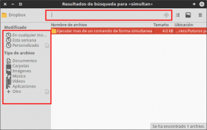
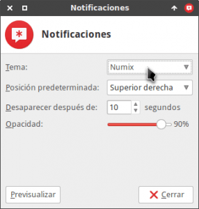

Recientemente se han actualizado las librerías gtk de mi sistema operativo a la versión 3.20 y esto ha ocasionado que se rompa el tema Numix que vengo usando desde hace ya bastante tiempo.<!--more-->

\[caption id="attachment\_6987" align="alignnone" width="321"\][](images/Problemas-con-el-tema-Numix.png) Muestra de los problemas ocasionados por la actualización de las librerías gtk\[/caption\]

La solución al problema ha sido fácil ya que simplemente he tenido que instalar de nuevo la última versión del tema.

El procedimiento para instalar el tema Numix es bastante sencillo, no obstante he creído conveniente escribir un tutorial por los siguientes motivos:

1. La mayoría de tutoriales existentes solamente son útiles para Ubuntu.
2. La gran mayoría de tutoriales existentes se limitan a decir que lo único que hay que realizar es copiar el tema Numix en la ubicación **usr/share/themes**. En mi caso este método no me ha funcionado y el tema se visualizaba de forma incorrecta.

###### Nota: El método mostrado para la instalación del tema es el recomendado por numix en la [plataforma de desarrollo de Github](https://github.com/numixproject/numix-gtk-theme "Fuente de descarga del tema Numix").

## INSTALAR EL TEMA NUMIX EN CUALQUIER DISTRIBUCIÓN LINUX

El primer paso a realizar es asegurar que tenemos instalado el software básico para poder compilar programas. Para ello **abrimos una terminal y ejecutamos el siguiente comando**:

> ```
> sudo apt-get install linux-headers-$(uname -r) build-essential checkinstall make automake autoconf git
> ```

El siguiente paso es asegurar que tenemos instaladas la totalidad de dependencias necesarias para poder compilar y usar el tema Numix, para ello **en la terminal ejecutamos el siguiente comando**:

> ```
> sudo apt-get install git ruby libxml2-utils libgdk-pixbuf2.0-dev libgdk-pixbuf2.0-0 libgdk-pixbuf2.0-dev libglib2.0-dev gtk2-engines-murrine
> ```

Como tercer paso tenemos que **instalar el compilador sass ejecutando el siguiente comando en la terminal**:

> ```
> gem install sass
> ```

Seguidamente descargamos / **clonamos el tema Numix en nuestro ordenador ejecutando el siguiente comando en la terminal**:

> ```
> git clone https://github.com/numixproject/numix-gtk-theme.git
> ```

Una vez descargado el tema, **accedemos a la carpeta que contiene el tema ejecutando el siguiente comando en la terminal**:

> ```
> cd numix-gtk-theme
> ```

El sexto paso será **compilar el tema Numix ejecutando el siguiente comando en la terminal**:

> ```
> sudo make
> ```

**Una vez compilado el tema tan solo tenemos que instalarlo**. Para ello en la terminal **ejecutamos el siguiente comando**:

> ```
> sudo make install
> ```

Una vez ejecutado el comando tan solo tenemos que esperar unos segundos para que finalice el proceso de instalación.

Si todos los pasos se han realizado con éxito habrán obtenido unos resultados similares a los que se muestran en la siguiente captura de pantalla:

[](images/Resumen-de-la-instalación-del-tema-Numix.png)

## ACTIVAR EL TEMA NUMIX QUE ACABAMOS DE INSTALAR

Una vez instalado el tema tan solo que tenemos activarlo. La activación del tema dependerá del entorno de escritorio que estemos usando.

### Activar el tema Numix en el entorno de escritorio XFCE

**En el caso de usar** el entorno de escritorio **xfce**, tan solo tenemos que **abrir una terminal y ejecutar los siguientes comandos**:

> ```
> xfconf-query -c xsettings -p /Net/ThemeName -s "Numix"
> ```
> 
> ```
> xfconf-query -c xfwm4 -p /general/theme -s "Numix"
> ```

Después de ejecutar estos dos comandos observaran que se activa el tema y la visualización de las ventanas y del entorno de escritorio cambia completamente.

### Activar el tema Numix en el entorno de escritorio Gnome Shell

**En el caso de usar** el entorno de escritorio **Gnome Shell** tenemos que **abrir una terminal y ejecutar los siguientes comandos**:

> ```
> gsettings set org.gnome.desktop.interface gtk-theme "Numix"
> ```
> 
> ```
> gsettings set org.gnome.desktop.wm.preferences theme "Numix"
> ```

Después de ejecutar estos dos comandos observaran que se activa el tema y la visualización de las ventanas y del entorno de escritorio cambia completamente.

###### Nota: En este post se muestra la activación del nuevo tema mediante la ejecución de comandos en la terminal. En el caso que no les guste la terminal también también pueden activar el nuevo tema mediante el panel de configuración que acostumbran a tener todos los entornos de escritorio.

## MODIFICAR EL TEMA NUMIX PARA DEJARLO A NUESTRO GUSTO

###### Nota: Este apartado es opcional, no obstante en mi caso lo considero imprescindible para al menos la totalidad de usuario del escritorio Xfce.

Justo en el momento de instalar el tema observaran que **algunos programas que funcionan con librerías gtk3 presentan unas barras de título desproporcionadamente grandes en comparación con los programas que usan librerías gtk2**.

[](images/Comparación-de-barras.png)

**Para solucionar este asunto** usaremos el lenguaje de programación CSS para modificar la visualización de las aplicaciones que funcionan con librerías gtk3. Para ello **abrimos una terminal y ejecutamos el siguiente comando**:

> ```
> nano mousepad ~/.config/gtk-3.0/gtk.css
> ```

Una vez abierto el editor de textos nano **pegaremos el siguiente código en el documento**:

> ```
> /* shrink headebars */
> headerbar {
>  min-height: 0;
>  padding-left: 2px; /* same as childrens vertical margins for nicer proportions */
>  padding-right: 2px;
>  padding-top: 1px;
>  padding-bottom: 1px;
> }
> 
> headerbar entry,
> headerbar spinbutton,
> headerbar button,
> headerbar separator {
>  margin-top: 1px; /* same as headerbar side padding for nicer proportions */
>  margin-bottom: 1px;
> }
> 
> /* shrink ssd titlebars */
> .default-decoration {
>  min-height: 0; /* let the entry and button drive the titlebar size */ 
>  padding-left: 2px; /* same as childrens vertical margins for nicer proportions */
>  padding-right: 2px;
>  padding-top: 1px;
>  padding-bottom: 1px;
> }
> 
> .default-decoration .titlebutton {
>  min-height: 5px; /* tweak these two props to reduce button size */
>  min-width: 5px;
> }
> 
> /* reduce the padding size of buttons */
> button, entry {
>  min-height: 0;
>  min-width: 0;
>  padding: 2px;
> }
> 
> /* reduce the padding of tabs */
> notebook tab {
>  min-height: 0;
>  padding-top: 3px;
>  padding-bottom: 3px;
> }
> 
> /* reduce the padding of buttons */
> notebook tab button {
>  min-height: 0;
>  min-width: 0;
>  padding: 2px;
>  margin-top: 2px;
>  margin-bottom: 2px;
> }
> 
> notebook button {
>  min-height: 0;
>  min-width: 0;
>  padding: 2px;
> }
> 
> /* add padding for Vte-terminal */
> widget {
>  padding: 4px;
> }
> ```

[Fuente del código CSS](http://experimentswithlinuxrelatedtech.blogspot.com.es/2016/04/upgrading-to-gnome-320-from-318.html "Fuente del script para modificar el aspecto de Numix")

Una vez pegado el código **guardamos el fichero y lo cerramos**. A continuación **si volvemos a realizar la misma comparación** que en el caso anterior veremos que **los resultados obtenidos son muy distintos**:

[](images/Barras-redimensionadas.png)

Tal y como se puede ver en la captura de pantalla, la barra de título y los iconos que aparecen dentro de ella son mucho más pequeños integrándose de forma adecuada con las aplicaciones que usan librerías gtk2.

En el caso que en vuestro caso no consigáis unos resultados como los míos tan solo tenéis que ajustar y jugar con los valores del fichero gtk.css.

De esta forma tan simple y tan rápida podréis disfrutar del que ha sido y es uno de los mejores temas de escritorio para Linux.

## ACTIVAR EL TEMA NUMIX EN LAS NOTIFICACIONES DEL SISTEMA

En estos momentos el tema Numix está configurado y funcionando de forma adecuada, pero es posible que el look de las notificaciones del sistema no se integren bien con el tema Numix. Para solucionar este problema tan solo tenemos que seguir los siguiente pasos:

**En el caso de usar** el entorno de escritorio **xfce**, tenemos que **abrir una terminal y ejecutar el siguiente comando**:

> ```
> xfce4-notifyd-config
> ```

Después de ejecutar el comando **aparecerá la siguiente ventana** en la que, tal y como se puede ver en la captura de pantalla, **entre otros parámetros podemos seleccionar el tema que queremos que se aplique en nuestra notificaciones**.

[](images/Tema-Numix-en-las-notificaciones.png)

**Una vez seleccionado el tema presionamos el botón **Cerrar**** y en estos momentos las notificaciones de nuestro sistema operativo se integrarán a la perfección con el tema de nuestro escritorio.

## ACTIVAR EL TEMA NUMIX EN NUESTRO GESTOR DE DE SESIONES

### Activar el tema Numix en el gestor de sesiones LightDM

**En el caso de ser usuarios** del gestor **de** sesiones **Lightdm** es posible que el tema usado en el gestor de sesiones no se integre con el tema Numix. Si queremos solucionar este problema tan solo tenemos que **abrir una terminal y ejecutar el siguiente comando**:

> ```
> sudo nano /etc/lightdm/lightdm-gtk-greeter.conf
> ```

Una vez vez abierto el editor de texto, tal y como se puede ver en la captura de pantalla, **localizamos la línea que empieza por las palabras ****theme-name**** y la modificamos de modo que quede de la siguiente forma**:

> ```
> theme-name=Numix
> ```

Finalmente **guardamos las modificaciones y cerramos el fichero**. La próxima vez que visualicemos nuestro gestor de sesiones su imagen se integrará a la perfección con el tema Numix.

### Activar el tema Numix en el gestor de sesiones GDM

**En el caso de ser usuarios** del gestor **de** sesiones **gdm** es posible que el tema usado en el gestor de sesiones no se integre con el tema Numix. Si queremos solucionar este problema tan solo tenemos que **abrir una terminal y teclear el siguiente comando**:

> ```
> sudo nano /etc/gdm3/greeter.dconf-defaults
> ```

Una vez abierto el editor de textos **localizamos la siguiente línea**:

> ```
> # gtk-theme='Adwaita'
> ```

y **la reemplazamos por la siguiente**:

> ```
> gtk-theme='Numix'
> ```

Una vez realizadas las modificaciones **guardamos los cambios y cerramos el fichero**. Finalmente para que se apliquen los cambios en el próximo arranque tenemos que **abrir una terminal y ejecutar el siguiente comando:**

> ```
> dpkg-reconfigure gdm3
> ```

De esta forma la próxima vez que visualicemos nuestro gestor de sesiones gdm podemos estar seguros se integrará a la perfección con el tema Numix.
