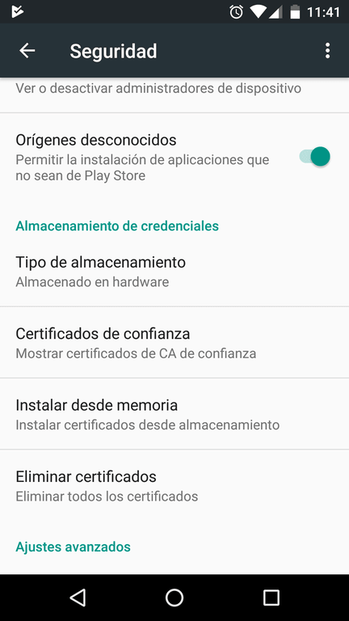
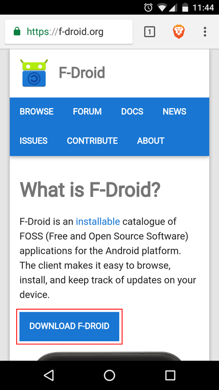
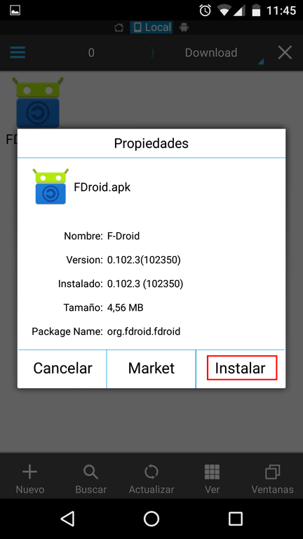
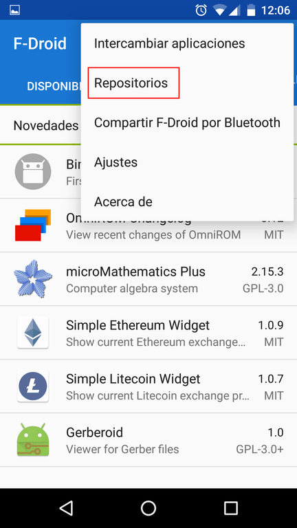
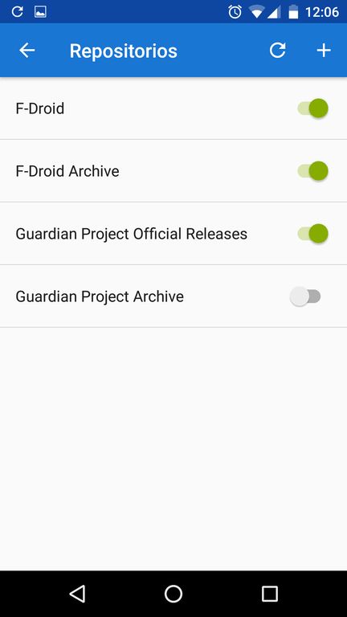
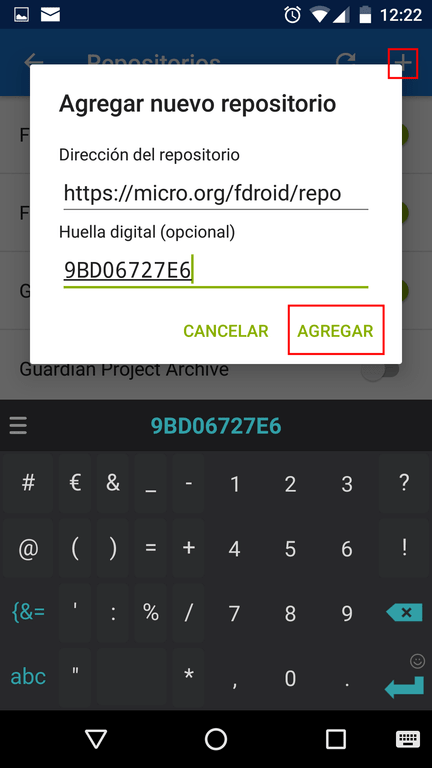
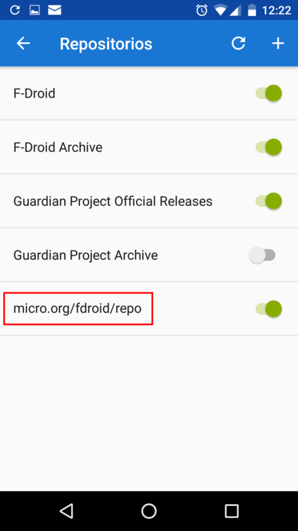

Hace unos días escribí un post en el que recomendé que solo se instalarán apps de 3 tiendas. Una de las tiendas que recomendé es F-droid.<!--more-->

## ¿QUÉ TIENE DE ESPECIAL LA TIENDA DE APLICACIONES F-DROID?

F-droid es diferente al resto de tiendas porque todas las aplicaciones que contiene son de Software Libre u Open Source. En el pasado ya comenté amplia y detenidamente las [ventajas que aporta el software libre]() respecto al software privativo.

Dentro de la tienda podremos encontrar el siguiente contenido:

1. El archivo binario para instalar la aplicación que necesitemos.
2. El código fuente de la aplicación para que lo podamos consultar.
3. Incidencias que los usuarios han reportado al creador de la App.
4. Historial de cambios de la aplicación.
5. Información para poder contactar con el desarrollador la aplicación.
6. Los permisos que otorgamos a las aplicaciones.
7. Etc.

## ¿POR QUÉ ES INTERESANTE USAR LA TIENDA DE APLICACIONES DE F-DROID?

Obviamente los grandes atractivos de esta tienda son los siguientes:

1. Podemos consultar el código fuente de todas las aplicaciones. Esto que yo sepa no se puede hacer en otras tiendas como Google Play o la Amazon Store.
2. Tenemos la capacidad de ver todas las incidencias y bugs que los usuarios han reportado al desarrollador.
3. Podemos contactar fácilmente con los desarrolladores para reportar las incidencias que queramos.
4. Podremos encontrar aplicaciones que no están disponibles en tiendas como la Google Play Store. Algunos ejemplos de lo que digo son AdAway, NewPipe, etc.

Todo este conjunto de características hace que las aplicaciones de esta tienda sean seguras, respetuosas con la privacidad y libres de malware.

## COMO INSTALAR F-DROID EN NUESTRO ANDROID

Los pasos a seguir para instalar la tienda F-droid son los siguientes:

### Activar la instalación de aplicaciones de orígenes desconocidos

El primer paso consiste en asegurar que tenemos activada la opción para poder instalar aplicaciones fuera de la Google Play Store.

Para ello nos dirigimos al apartado Ajustes>Seguridad. Una vez dentro del menú Seguridad tildamos la opción Orígenes desconocidos.

### Instalar la tienda F-droid

Para su instalación accederemos la siguiente [URL](https://f-droid.org/ "Enlace para descargar la tienda F-droid"):

Seguidamente presionamos encima del botón Download F-Droid para que se inicie la descarga del fichero de instalación.

Finalmente nos dirigimos a la ubicación donde descargamos el fichero de instalación y procedemos a instalar la tienda F-droid.

## CONFIGURAR LA TIENDA Y ACTIVAR REPOSITORIOS ADICIONALES

Después de instalar la tienda F-droid la podemos abrir sin problema. Una vez abierta, lo primero que deberemos hacer es activar los repositorios de aplicaciones.

Para ello clicamos el botón de la parte superior derecha que contiene 3 puntos. Al abrirse el menú pulsamos encima de la opción Repositorios.

A continuación tildamos los repositorios que queremos activar y usar. En mi caso activo y uso los siguientes:

El contenido que incluye cada uno de los repositorios es el siguiente:

 
|   **Repositorio**   |   **Descripción**   |
| --- | --- |
|   F-Droid   |   Repositorio principal y oficial de F-Droid.   |
|   F-Droid Archive   |   Almacena las versiones antiguas de las aplicaciones del repositorio F-Droid   |
|   Guardian Project Official Releases   |   Incluye aplicaciones relacionadas con la privacidad del proyecto Guardian Project   |
|   Guardian Project Archive   |   Repositorio donde se almacenan las versiones antiguas de las aplicaciones del repositorio Guardian Project   |

Una vez activados los repositorios ya podrán buscar e instalar aplicaciones de forma totalmente intuitiva.

### Añadir repositorios adicionales a F-droid

Hemos visto que la aplicación dispone de 4 repositorios. Si queremos podemos añadir más repositorios. Pueden consultar el siguiente enlace para ver repositorios adicionales que podemos usar:

[Repositorios adicionales que podemos usar](https://f-droid.org/wiki/page/Known_Repositories "Repositorios adicionales de F-Droid")

Para añadir un repositorio adicional, dentro del apartado de repositorios deberán presionar sobre el botón +. Seguidamente deberán rellenar la URL y la huella digital que encontrarán en el enlace que les he dejado. Finalmente deberán presionar sobre la opción Agregar para que se añada el repositorio.

Finalmente pueden ver que se ha añadido el repositorio sin ningún tipo de problema. Por lo tanto en estos momentos tendremos más aplicaciones disponibles para poder instalar.

