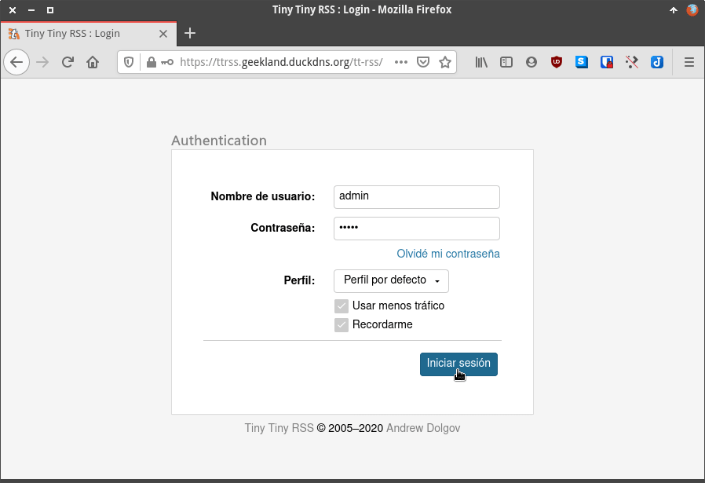

En el pasado vimos como instalar Tiny Tiny RSS de forma manual en un servidor con Ubuntu. Quien prefiera utilizar Docker sabrá que en Docker hub no hay ningún contenedor fácil de instalar ni con una instrucciones de instalación fáciles de seguir. Por esté motivo y animado por Ángel de uGeek les detallaré paso a paso como instalar el Docker oficial de Tiny Tiny RSS.<!--more-->

## CARACTERÍSTICAS DEL CONTENEDOR DOCKER OFICIAL DE TINY TINY RSS

El contenedor que instalaremos a continuación tiene una serie de características que lo hacen muy interesante. Las características son las siguientes:

1. El contenedor **ha sido creado por los desarrolladores de Tiny Tiny RSS**. Por lo tanto es el contenedor oficial y su configuración de serie es la adecuada para obtener el máximo rendimiento de este lector de feeds.
2. **La base de datos que instalaremos es PostgreSQL**. Está base de datos es la que mejor se adapta a Tiny Tiny RSS. Por lo tanto el rendimiento que obtendremos será mucho mayor que si lo instalamos en una base MariaDB o Sqlite.
3. Con este contenedor **siempre estaremos usando la última versión** de Tiny Tiny RSS. Cada vez que paramos e iniciamos el contenedor de TTRSS se comprueba si estamos usando la última versión del lector de feeds. En el caso que exista una versión más actual se actualizará al vuelo.
4. **La instalación que veremos estará detrás del proxy inverso Traefik**. De este modo podremos acceder a nuestro servicio desde cualquier ubicación de forma segura. La actualización de los certificados se hará de forma automática y nosotros ni nos enteraremos.

Una vez vistos los puntos más importantes pasaremos a detallar las instrucciones a seguir para la instalación de Tiny Tiny rss con Docker.

**Nota:** La configuración estándar es para funcionar sobre un servidor web Caddy. Desafortunadamente la configuración estándar no funciona en las Raspberry Pi. Por lo tanto cambiaremos Caddy por Nginx. Cambiando Caddy por Nginx hará que podemos aplicar el siguiente tutorial en prácticamente todos los equipos y arquitecturas existentes.

## PASOS A SEGUIR PARA INSTALAR TINY TINY RSS CON EL DOCKER OFICIAL

Si siguen con detenimiento los pasos que verán a continuación podrán instalar de forma sencilla Tiny Tiny RSS. Les recomiendo que primero lean detenidamente el proceso y después lo vayan aplicando punto por punto.

### Instalar Docker y Docker Compose

Obviamente tenemos que tener instalar Docker y Docker Compose en nuestro servidor. En el caso que no los tengáis instalados les recomiendo que lo hagan siguiendo las instrucciones del siguiente enlace:

https://geekland.eu/instalar-docker-y-docker-compose-en-linux/

### Abrir los puertos 80 y 443 en el firewall de su servidor y en el router

Para poder acceder a Tiny Tiny RSS tenemos que abrir los puertos 80 y 443 en el firewall del servidor. Para abrir los puertos lo podemos hacer de forma sencilla con ufw. Para ello primero instalen ufw ejecutando el siguiente comando en la terminal:

> `sudo apt install ufw`

Una vez instalado el servicio lo habilitan mediante el siguiente comando:

> ```shell
> sudo ufw enable
> ```

Para iniciar el firewall ejecutaremos el siguiente comando en la terminal:

> ```shell
> sudo service ufw start
> ```

Finalmente abriremos los puertos 80 y 443 del firewall ejecutando los siguientes comandos en la terminal:

> ```shell
> sudo ufw allow http
> ```
> 
> ```shell
> sudo ufw allow https
> ```

En el caso que estén detrás de un Router recuerden que también tienen que abrir los puertos 80 y 443 en el router. Además las peticiones entrantes a los puertos 80 y 443 se deberán redirigir a la IP del equipo en que instalaremos Tiny Tiny RSS.

### Instalar el Proxy inverso Traefik y disponer de un dominio

Tal y como hemos detallado en el inicio del artículo usaremos el proxy inverso Traefik. Para obtener un dominio e instalar el proxy inverso seguiremos las instrucciones del siguiente enlace:

https://geekland.eu/instalar-y-configurar-el-proxy-inverso-traefik-en-docker/

Después de finalizar los pasos detallados en el enlace que acabo de dejar deberán disponer de un dominio y un proxy inverso configurado. En mi caso el dominio que tengo disponible es:

> ```shell
> geekland.duckdns.org
> ```

Además durante el proceso de configuración de Traefik habrán configurado una red adicional que se llamará **`web`**.

### Descargar los ficheros necesarios para instalar Tiny Tiny RSS mediante Docker y Traefik

Seguidamente descargaremos los ficheros para instalar TTRSS. Para ello ejecutamos el siguiente comando en la terminal:

> ```shell
> git clone https://git.tt-rss.org/fox/ttrss-docker-compose.git ttrss-docker && cd ttrss-docker
> ```

### Establecer los parámetros de configuración para poder levantar el contenedor

A continuación ejecutaremos el siguiente comando para copiar el archivo `.env-dist` y renombrarlo a `.env`:

> ```shell
> cp .env-dist .env
> ```

A continuación editaremos el fichero `.env` para fijar algunos de los parámetros necesarios para la instalación de TTRSS. Para ello ejecutaremos el siguiente comando en la terminal:

> ```shell
> nano .env
> ```

Cuando se abra el editor de textos verán el siguiente código:

```shell
# Copy this file to .env before building the container.
# Put any local modifications here.

TTRSS_DB_USER=postgres
TTRSS_DB_NAME=postgres
TTRSS_DB_PASS=password

# This is only used by web-ssl container.
#HTTP_HOST=localhost

# You will likely need to set this to the correct value, see README.md
# for more information.
TTRSS_SELF_URL_PATH=http://localhost:8280/tt-rss

# bind exposed port to 127.0.0.1 by default in case reverse proxy is used.
# if you plan to run the container standalone and need origin port exposed
# use next HTTP_PORT definition (or remove "127.0.0.1:").
HTTP_PORT=127.0.0.1:8280
#HTTP_PORT=8280
```

En mi caso los parámetros que he modificado son los siguientes:

1. `TTRSS_DB_USER`
2. `TTRSS_DB_NAME`
3. `TTRSS_DB_PASS`
4. `TTRSS_SELF_URL_PATH`
5. `HTTP_PORT`

Después de modificarlos han quedado de la siguiente forma:

```shell
# Copy this file to .env before building the container.
# Put any local modifications here.

TTRSS_DB_USER=postgresttrss
TTRSS_DB_NAME=ttrss
TTRSS_DB_PASS=mi_contraseña

# This is only used by web-ssl container.
#HTTP_HOST=localhost

# You will likely need to set this to the correct value, see README.md
# for more information.
TTRSS_SELF_URL_PATH=https://ttrss.geekland.duckdns.org/tt-rss/

# bind exposed port to 127.0.0.1 by default in case reverse proxy is used.
# if you plan to run the container standalone and need origin port exposed
# use next HTTP_PORT definition (or remove "127.0.0.1:").
HTTP_PORT=10.0.0.11:8280
#HTTP_PORT=8280
```

El significado de cada uno de los parámetros modificados es el siguiente:

- En ``**`TTRSS_DB_USER`**`` podemos poner un nombre cualquiera. Este será el nombre del usuario de la base de datos de Tiny Tiny RSS.
- En ``**`TTRSS_DB_NAME`**`` podemos poner un nombre cualquiera. Este será el nombre de la base de datos de Tiny Tiny RSS
- El parámetro ``**`TTRSS_DB_PASS`**`` sirve para establecer la contraseña de nuestra base de datos. Podemos usar una contraseña cualquiera y a poder ser que sea segura.
- En `**SELF_URL_PATH**`tenemos que poner la URL que queremos usar para acceder a nuestro servidor. La URL tiene que ser el dominio que hemos creado en apartados anteriores más un prefijo cualquiera relacionado con el servicio que estamos instalando. En mi caso el prefijo elegido es ttrss y el dominio que creamos es geekland.duckdns.org. Por lo tanto en este parámetro escribo https://ttrss.geekland.duckdns.org
- Finalmente en `**HTTPS_port**` introduzcan la IP interna del servidor que alojará TTRSS. Si no saben la IP la pueden hallar ejecutando el comando `ifconfig` en la terminal del servidor que alojará TTRSS.

Una vez definidos todos los parámetros guardan los cambios y cierran el fichero.

### Modificar los parámetros de docker-compose.yml para levantar los contenedores de Tiny Tiny RSS con Traefik

A continuación editaremos el fichero docker-compose.yml ejecutando el siguiente comando en la terminal:

> ```shell
> nano docker-compose.yml
> ```

Cuando se abra el editor de textos borraremos la totalidad de su contenido y pegaremos el siguiente código:

```shell
version: '3'

# set database password in .env
# please don't use quote (') or (") symbols in variables

services:
  db:
    image: postgres:12-alpine
    restart: unless-stopped
    volumes:
      - db:/var/lib/postgresql/data
    environment:
      - POSTGRES_PASSWORD=${TTRSS_DB_PASS}
      - POSTGRES_USER=${TTRSS_DB_USER}
      - POSTGRES_DB=${TTRSS_DB_NAME}
    networks:
      - web

    labels:
      - traefik.enable=false

  app:
    build:
      context:
        ./app
    restart: unless-stopped
    env_file:
      - .env
    volumes:
      - app:/var/www/html
      - config.d:/opt/tt-rss/config.d:ro
    depends_on:
      - db

    networks:
      - web

    labels:
      - traefik.enable=false

  backups:
    build:
      context:
        ./app
    restart: unless-stopped
    env_file:
      - .env
    volumes:
      - backups:/backups
      - app:/var/www/html
    depends_on:
      - db
    command: /opt/tt-rss/dcron.sh -f

    networks:
      - web

    labels:
      - traefik.enable=false

  updater:
    build:
      context:
        ./app
    restart: unless-stopped
    env_file:
      - .env
    volumes:
      - app:/var/www/html
      - config.d:/opt/tt-rss/config.d:ro
    depends_on:
      - app
    command: /opt/tt-rss/updater.sh

    networks:
      - web

    labels:
      - traefik.enable=false

  web-nginx:
    build: ./web-nginx
    restart: unless-stopped
#    ports:
#      - ${HTTP_PORT}:80
    volumes:
      - app:/var/www/html:ro
    depends_on:
      - app

    networks:
      - web

    labels:
      - traefik.backend=web-nginx
      - traefik.frontend.rule=Host:ttrss.geekland.duckdns.org
      - traefik.docker.network=web
      - traefik.port=80
      - traefik.enable=true

volumes:
  db:
  app:
  certs:
  backups:

networks:
  web:
    external: true
```

Si han seguido las instrucciones correctamente y no han elegido opciones diferentes a las de este artículo, tan solo tendrán que localizar y modificar la siguiente línea:

```shell
      - traefik.frontend.rule=Host:ttrss.geekland.duckdns.org
```

Una vez localizada tienen que reemplazar `ttrss.geekland.duckdns.org` por la URL completa que han definido en apartados anteriores para acceder a Tiny Tiny RSS. Una vez realizadas las modificaciones guardamos los cambios y cerramos el fichero.

### Crear y levantar los contenedores para empezar a usar Tiny Tiny RSS

A estas alturas ya podemos crear y levantar los contenedores. Para ello ejecutaremos el siguiente comando en la terminal:

> ```shell
> docker-compose up --build
> ```

Una vez ejecutado el comando y levantados todos los contenedores ya podemos acceder a Tiny Tiny RSS. Para ello tan solo tenemos abrir un navegador e introducir la URL para acceder al lector de feeds. A continuación introducen su usuario y contraseña y presionan sobre el botón Iniciar sesión.

[](images/acceder-a-tiny-tiny-rss-montado-en-docker.png)

**Nota:** El usuario y contraseña que deben usar para loguearse a Tiny Tiny RSS son `**admin**` y `**password**`

Una vez vez logueados a TTRSS tendrán que cambiar la contraseña por defecto del administrador. Acto seguido podrán configurarlo a su gusto e introducir/importar las fuentes que quieran seguir.

## DETALLE DE LOS CONTENEDORES QUE SE HAN INSTALADO

Si ejecutamos el comando docker-ps verán que hemos construido y levantado 4 contenedores más el contenedor del proxy inverso:

```shell
ubuntu@ubuntu-20-04:~$ docker ps
CONTAINER ID        IMAGE                    COMMAND                  CREATED             STATUS              PORTS                                      NAMES
b9414762379f        ttrss-docker_web-nginx   "/docker-entrypoint.…"   3 hours ago         Up 3 hours          80/tcp                                     ttrss-docker_web-nginx_1
adf63866d860        ttrss-docker_updater     "/updater.sh"            3 hours ago         Up 3 hours          9000/tcp                                   ttrss-docker_updater_1
ac8e1282eaae        ttrss-docker_app         "/bin/sh -c /startup…"   3 hours ago         Up 3 hours          9000/tcp                                   ttrss-docker_app_1
2fcc086f8653        postgres:12-alpine       "docker-entrypoint.s…"   3 hours ago         Up 3 hours          5432/tcp                                   ttrss-docker_db_1
```

La función de cada uno de estos 4 contenedores es la siguiente:

- **ttrss-docker\_web-ngnix:** Contenedor en el que hay el servidor web sobre el que corre Tiny Tiny RSS.
- **ttrss-docker\_updater:** Se encarga de actualizar las fuentes que tenemos en nuestro lector de feeds.
- **ttrss-docker\_app:** Contiene la instalación de PHP7.
- **postgres:12-alpine:** Contenedor que aloja la base de datos de Tiny Tiny RSS.

## ACTUALIZAR TINY TINY RSS

Como hemos dicho en apartados anteriores, Tiny Tiny RSS se actualiza de forma automática cada vez que apagamos y levantamos el contenedor ttrss-docker\_web-nginx. Por lo tanto, ejecutando estos simples comandos aseguraremos que estamos usando la última versión de Tiny Tiny RSS:

> ```shell
> docker stop ttrss-docker_db_1 ttrss-docker_app_1 ttrss-docker_web-nginx_1 ttrss-docker_updater_1
> ```
> 
> ```shell
> docker start ttrss-docker_db_1 ttrss-docker_app_1 ttrss-docker_web-nginx_1 ttrss-docker_updater_1
> ```

Con el paso del tiempo es posible que los ficheros que hemos usado para crear los contenedores varíen incorporando versiones nuevas de PHP, Nginx, etc. Por lo tanto cada cierto podemos actualizar los ficheros que usamos para instalar TTRRS ejecutando el siguiente comando:

> ```shell
> git pull origin master
> ```

O si lo prefieren pueden borrar los contenedores, borrar los archivos usados para levantar el contenedor y empezar una instalación de cero. Recuerden que aunque borren los contenedores y hagan una instalación limpia no perderán su información ya que los volúmenes de persistencia se hallarán en `/var/lib/docker/volumes`.

## ALTERNATIVAS A TINY TINY RSS Y QUE SE PUEDAN AUTOALOJAR

Otra alternativa igual o incluso mejor a Tiny Tiny RSS es Freshrss. Mi experiencia con Freshrss es igual de buena que con Tiny Tiny RSS. Tiny Tiny RSS no tiene una interfaz web tan cuidada como FreshRSS y es más lento. No obstante de momento aun estoy usando Tiny Tiny RSS porque entre otras cosas es capaz de mostrar el texto completo de los artículos que solo se muestran de forma parcial dentro del feed.

Si visitan el blog de uGeek encontrarán abundante información sobre FreshRSS y otros lectores de Feed. Les recomiendo que escuchen el siguiente podcast y además que naveguen en su blog.

[https://ugeek.github.io/post/2020-05-27-disfrutando-mas-que-nunca-de-mis-suscripciones-rss-con-freshrss-shaarli-wallabag-y-feedme.html](https://ugeek.github.io/post/2020-05-27-disfrutando-mas-que-nunca-de-mis-suscripciones-rss-con-freshrss-shaarli-wallabag-y-feedme.html "Opinión de Ángel de uGeek")

Si no les convence ninguna de las 2 opciones pueden visitar el siguiente enlace en el que encontrarán más de 20 alternativas a Tiny Tiny RSS.

[https://github.com/awesome-selfhosted/awesome-selfhosted](https://github.com/awesome-selfhosted/awesome-selfhosted "Consultar alternativas a FreshRSS y Tiny Tiny RSS")

#### Fuentes

[https://git.tt-rss.org/fox/ttrss-docker-compose](https://git.tt-rss.org/fox/ttrss-docker-compose)
