Recientemente publique un artículo en el que se detallaba las [características y funcionalidades del lector de feeds Tiny Tiny RSS](). A continuación veremos los pasos que todo el mundo puede seguir para instalar Tiny Tiny RSS en un servidor con el sistema operativo Ubuntu 18.04. Los pasos a seguir se detallan a continuación.<!--more-->

## INSTALAR EL SERVIDOR WEB

Instalaremos el servidor web Apache. Para ello tan solo tenemos que ejecutar el siguiente comando en la terminal:

> ```
> sudo apt install apache2
> ```

## ABRIR LOS PUERTOS PARA PODER ACCEDER AL SERVIDOR WEB

Tenemos que configurar el firewall de nuestro servidor para poder acceder al servidor web e instalar Tiny Tiny RSS. Para ello la opción más sencilla es usar ufw.

Inicialmente aseguramos que ufw está instalado ejecutando el siguiente comando en la terminal:

> ```
> sudo apt install ufw
> ```

Acto seguido iniciamos y habilitamos ufw mediante los siguientes comandos:

> ```
> sudo ufw start
> sudo ufw enable
> ```

A continuación abrimos los puertos 80 (https) y 443 (https) ejecutando los siguientes comandos:

> ```
> sudo ufw allow http
> sudo ufw allow https
> ```

En nuestro teléfono móvil o en un ordenador cualquiera abrimos un navegador web. A continuación accedemos a la siguiente URL.

> ```
> http://ip_server/
> ```

###### Nota: ip\_server deberá sustituirse por la dirección IP de su servidor Web.

Si todo funciona correctamente obtendrán un resultado similar al siguiente.

[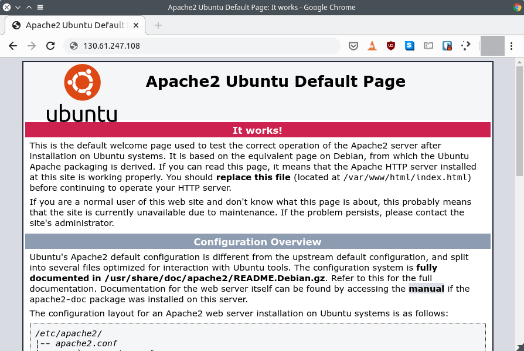](images/acceder-servidor-web.png)

### Abrir los puertos con iptables en el caso que no queramos usar UFW

En el caso que no quieran usar UFW pueden usar iptables. Las reglas de iptables que he utilizado en mi caso son las siguientes:

> ```
> sudo iptables -I INPUT 1 -i ens3 -p tcp --dport 80 -m state --state NEW,ESTABLISHED -j ACCEPT
> 
> sudo iptables -I INPUT 2 -i ens3 -p tcp --dport 443 -m state --state NEW,ESTABLISHED -j ACCEPT
> ```

###### Nota: Deberán reemplazar ens3 por el nombre de su interfaz de red. El nombre de su interfaz de red lo pueden averiguar fácilmente con el comando ifconfig

Tal y como hicimos anteriormente intentamos acceder al servidor web desde nuestro navegador. Si podemos acceder tendremos que hacer persistentes las reglas ejecutando los siguientes comandos en la terminal:

> ```
> sudo apt-get install iptables-persistent
> 
> sudo iptables-save > /etc/iptables/rules.v4
> ```

## INSTALAR LOS MÓDULOS PHP PARA INSTALAR TINY TINY RSS

El siguiente paso consistirá en instalar la totalidad de librerías PHP para poder instalar Tiny Tiny RSS. Para ello ejecutaremos el siguiente comando en la terminal:

> ```
> sudo apt install php libapache2-mod-php php-mysql php-pgsql php-mbstring php-fdomdocument php-intl php-curl php-common php-gd php-xml php-cli
> ```

Para comprobar que PHP está funcionando de forma adecuada ejecutaremos el siguiente comando en la terminal:

> ```
> sudo nano /var/www/html/info.php
> ```

Cuando se abra el editor de textos nano pegaremos el siguiente código y guardaremos los cambios:

> ```
> <?php
> phpinfo();
> ?>
> ```

Acto seguido abriremos un navegador web cualquiera e ingresaremos la siguiente dirección:

> ```
> http://ip_server/info.php
> ```

###### Nota: ip\_server se deberá sustituir por la dirección IP de nuestro servidor Web.

Si PHP está funcionando de forma adecuada, el navegador mostrará un contenido similar al siguiente:

[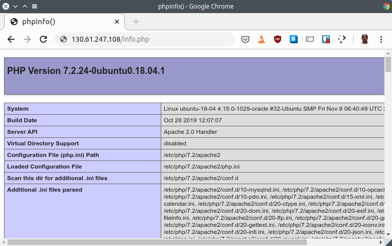](images/comprobar-funcionamiento-php.png)

## INSTALAR Y CONFIGURAR UNA BASE DE DATOS PostgreSQL

Para que Tiny Tiny RSS funcione necesitamos una base de datos. Podemos usar PostgreSQL o Mysql. En mi caso [uso PostgreSQL](https://git.tt-rss.org/fox/tt-rss/wiki/FAQ) porque así lo recomiendan los desarrolladores de Tiny Tiny RSS.

###### Nota: El funcionamiento con Mysql no es el adecuado debido a que InnoDB es lento. Además puede que hayan funcionalidades que no funcionen con Mysql.

Para instalar la base de datos PostgreSQL en Ubuntu ejecutaremos el siguiente comando en la terminal:

> ```
> sudo apt install postgresql postgresql-contrib
> ```

Acto seguido iniciaremos y habilitaremos PosrgreSQL mediante los siguientes comandos:

> ```
> sudo systemctl start postgresql.service
> sudo systemctl enable postgresql.service
> ```

### Crear y configurar una base de datos para Tiny Tiny RSS

A continuación nos loguearemos a la base de datos de PostgreSQL ejecutando el siguiente comando en la terminal:

> ```
> sudo -u postgres psql
> ```

Acto seguido ejecutaremos el siguiente comando para crear un usuario con su correspondiente contraseña para la base de datos:

> ```
> postgres=# CREATE USER "userttrss" WITH PASSWORD 'contraseñattrss';
> CREATE ROLE
> ```

###### Nota: El usuario creado es userttrss. La contraseña asignada al usuario es contraseñattrss.

Seguidamente crearemos una base de datos con nombre dbttrss y como usuario propietario le asignaremos el usuario que acabamos de crear. Para ello ejecutaremos el siguiente comando en la consola de PostgreSQL:

> ```
> postgres=# CREATE DATABASE dbttrss WITH OWNER "userttrss";
> CREATE DATABASE
> ```

Finalmente salimos de la consola de PostgreSQL ejecutando el siguiente comando:

> ```
> postgres=# \quit
> ```

### Cambiar el método de autenticación de PostgreeSQL

Para que TTRSS pueda funcionar tenemos que cambiar el método de autenticación de PostgreSQL. Para ello editaremos el fichero pg\_hba.conf ejecutando el siguiente comando:

> ```
> sudo nano /etc/postgresql/10/main/pg_hba.conf
> ```

###### Nota: La ubicación del fichero pg\_hba.conf puede variar en función de la distribución que usen.

Cuando se abra el editor nano verán un código similar al siguiente:

[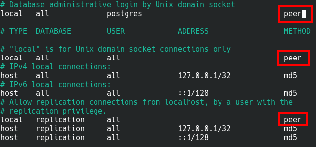](images/autenticacion-postgresql-predeterminada.png)

Todos los métodos de autenticación establecidos como peer o ident los deberán modificar a md5 quedando el código la siguiente forma:

[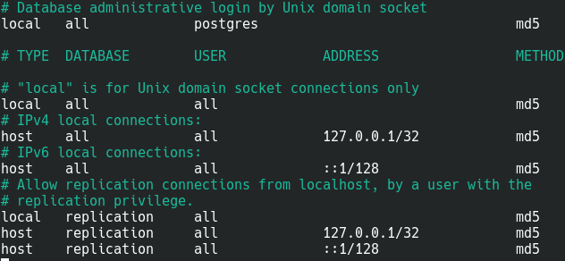](images/autenticacion-postgresql-modificada.png)

Una vez realizados las modificaciones guardan los cambios y reinician PostgreSQL y Apache ejecutando los siguientes comandos en la terminal:

> ```
> sudo systemctl restart postgresql.service
> sudo systemctl restart apache2
> ```

## INSTALAR TINY TINY RSS EN NUESTRO SERVIDOR

Accederemos al directorio raíz de nuestro servidor web ejecutando el siguiente comando en la terminal:

> ```
> cd /var/www/html
> ```

A continuación instalamos git ejecutando el siguiente comando en la terminal:

> ```
> sudo apt install git
> ```

Una vez tengamos instalado git podremos descargar la última versión de Tiny Tiny RSS ejecutando el siguiente comando en la terminal:

> ```
> sudo git clone https://tt-rss.org/git/tt-rss.git tt-rss
> ```

Accedemos dentro de la carpeta donde está ubicado el programa mediante el siguiente comando:

> ```
> cd ./tt-rss
> ```

Finalmente modificaremos los permisos de algunas de las carpetas y archivos del programa TTRSS. Para ello ejecutaremos los siguientes comandos en la terminal:

> ```
> sudo chmod -R 777 cache/images
> sudo chmod -R 777 cache/upload
> sudo chmod -R 777 cache/export
> sudo chmod -R 777 feed-icons
> sudo chmod -R 777 lock
> ```

### Conectar Tiny Tiny RSS con la base de datos

A continuación abriremos el navegador e ingresaremos la siguiente URL:

> ```
> http://ip_server/tt-rss/install/
> ```

###### Nota: ip\_server se deberá sustituir por la dirección IP de nuestro servidor Web.

Acto seguido aparecerá el menú de instalación de TTRSS. Las opciones a rellenar en cada uno de los campos son las siguientes:

[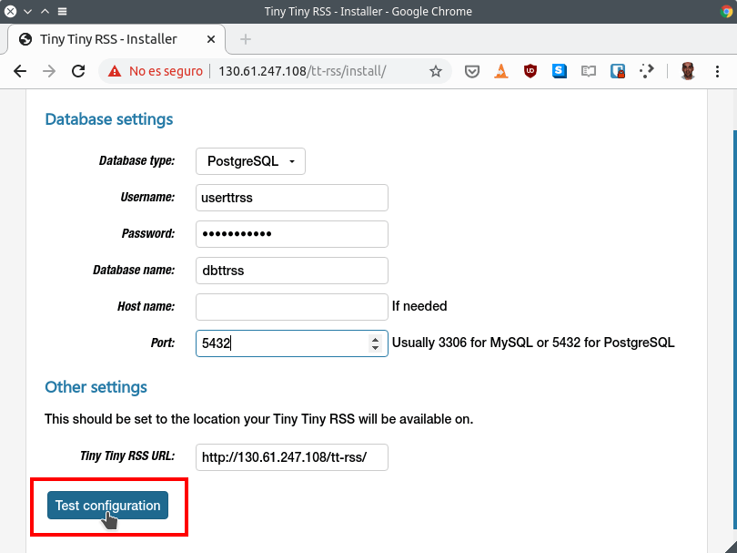](images/parametros-para-instalar-tiny-tiny-rss.png)

- **Database type:** En nuestro caso tenemos que seleccionar **PostgreSQL**.
- **Username:** Introducimos el nombre del usuario que hemos creado para nuestra base de datos. Por lo tanto en mi caso tendré que introducir **userttrss**.
- **Password:** Escribimos la contraseña para que el usuario ttrss pueda acceder a la base de datos. La contraseña que he definido en apartados anteriores es **contraseñattrss**.
- **Database name:** Escribimos el nombre de la base de datos que hemos creado para almacenar el contenido de Tiny Tiny RSS. En mi caso el nombre es **dbttrss**.
- **Host name:** Dejamos el campo en blanco. Este campo se puede rellenar más tarde de forma manual.
- **Port:** Introducimos el puerto estándar de PostgreSQL que es el **5432**.
- **Tiny Tiny RSS URL:** En mi caso dejo el valor por defecto que es la URL para acceder a al lector de feeds.

Una vez rellenadas la totalidad de las opciones clicaremos en el botón **Test configuration**.

Si la configuración es correcta obtendrán los resultados mostrados en la siguiente captura de pantalla. Si los resultados son satisfactorios tendrán que clicar sobre el botón **Initialize database**.

[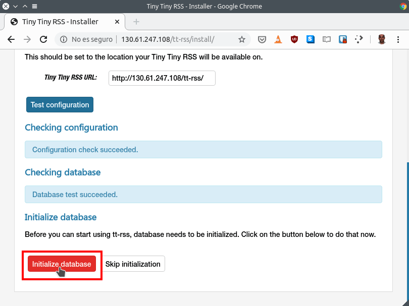](images/inicializar-base-de-datos.png)

Acto seguido aparecerá el código que tenemos que copiar y pegar al fichero de configuración de Tiny Tiny RSS. Por lo tanto seleccionamos el código y lo copiamos.

[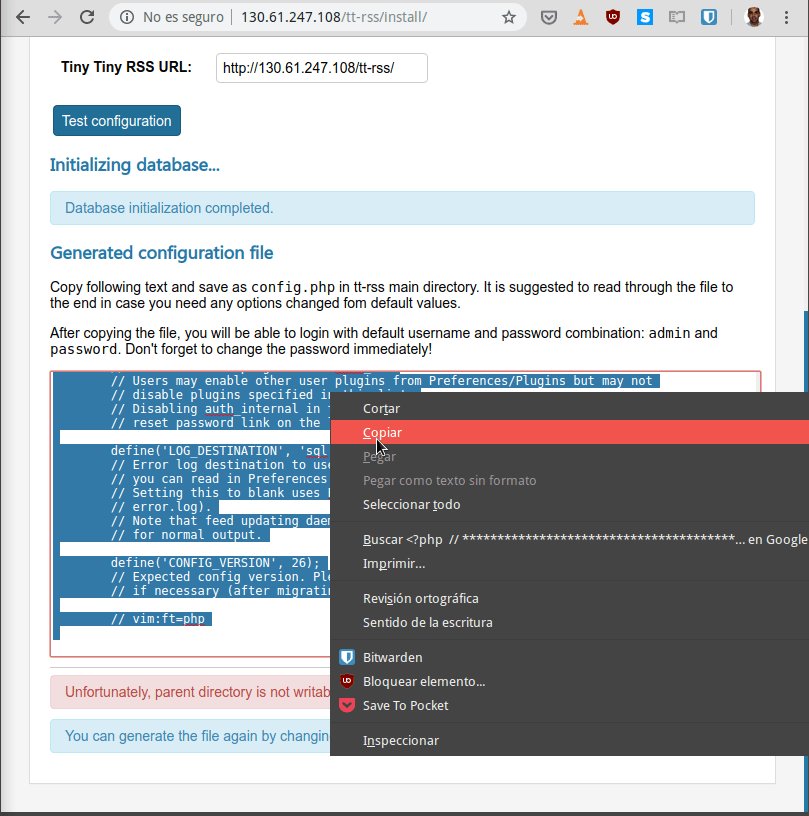](images/copiar-configuracion-tiny-tiny-rss.png)

### Crear el fichero de configuración de Tiny Tiny RSS

A continuación crearemos el fichero de configuración ejecutando el siguiente comando en la terminal:

> ```
> sudo nano /var/www/html/tt-rss/config.php
> ```

Una vez se abra el editor de textos nano pegaremos el código de configuración de Tiny Tiny RSS y guardaremos los cambios:

[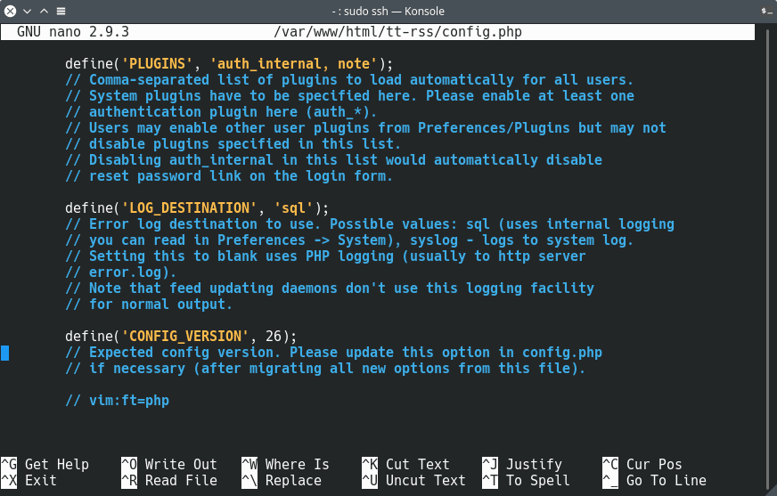](images/pegar-configuracion-ttrss.png)

**En el hipotético caso** que quisiéramos acceder a Tiny Tiny RSS mediante un dominio deberíamos realizar las siguientes modificaciones en el fichero de configuración.

Tendríamos que buscar la siguiente línea:

> ```
> define('SELF_URL_PATH', 'http://ip_server/tt-rss/');
> ```

Una vez encontrada tendríamos que reemplazarla por la siguiente:

> ```
> define('SELF_URL_PATH', 'http://dominio.com/tt-rss/');
> ```

Además, al final del archivo de configuración deberíamos añadir el siguiente código:

> ```
> define('_SKIP_SELF_URL_PATH_CHECKS', true);
> ```

### Ingresar a TTRSS por primera vez y cambiar el password por defecto

A continuación abriremos el navegador e ingresaremos la URL para abrir TTRSS por primera vez. La dirección a introducir en el navegador será del siguiente tipo:

> ```
> http://ip_server/tt-rss/
> ```

###### Nota: ip\_server se deberá sustituir por la dirección IP de nuestro servidor Web.

En la pantalla de login introduciremos admin en el campo **Nombre de usuario** y password en el campo **Contraseña**. Acto seguido presionaremos el botón Iniciar sesión.

[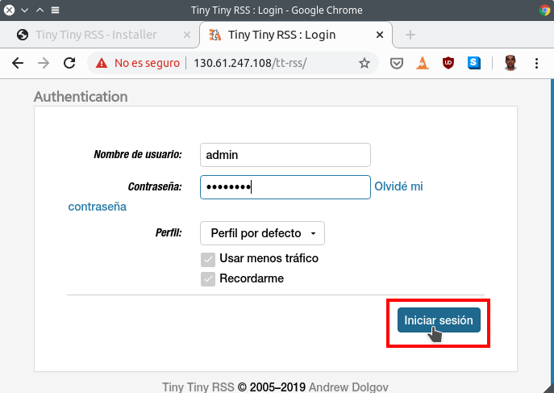](images/iniciar-ttrss.png)

A continuación clicamos en el botón Abrir Preferencias.

[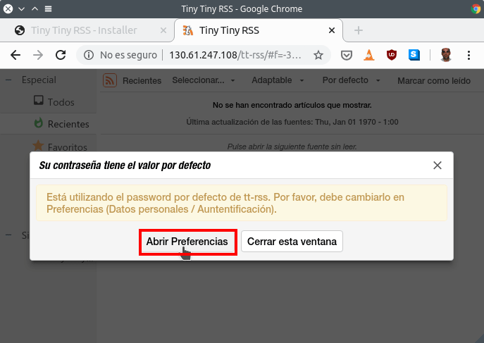](images/preferencias-para-cambiar-password.png)

Acto seguido, en la **pestaña** usuarios clicamos encima del usuario admin.

[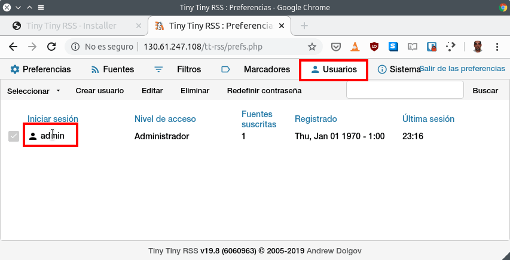](images/clicar-usuario-admin.png)

Seguidamente, en el campo **Nueva contraseña** definiremos una nueva contraseña para el usuario admin. Finalmente introduciremos nuestro correo en el campo **Correo electrónico** y presionaremos el botón Guardar.

[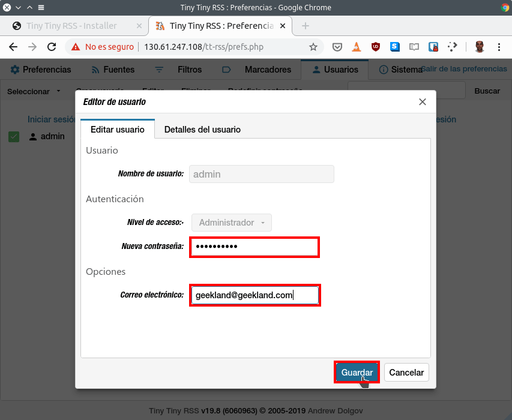](images/definir-password-usuario-admin.png)

Una vez realizados los cambios accedan de nuevo a TTRSS. Para acceder tendrán que usar el usuario admin y la contraseña que justo acabamos de definir.

###### Nota: El email que pongáis es el que se usará para recuperar la contraseña en caso que la olvidemos.

### Configurar la actualización automática de los Feeds de TTRSS

Para que los feeds de Tiny Tiny RSS se actualicen de forma automática hay que crear un servicio de systemd. Para ello ejecutaremos el siguiente comando en la terminal:

> ```
> sudo nano /etc/systemd/system/tt-rss.service
> ```

Cuando se abra el editor de textos nano pegaremos el siguiente código y guardaremos los cambios:

> ```
> [Unit]
> Description=ttrss_backend
> After=network.target mysql.service postgresql.service
> 
> [Service]
> User=www-data
> ExecStart=/var/www/html/tt-rss/update_daemon2.php
> 
> [Install]
> WantedBy=multi-user.target
> ```

A continuación iniciaremos y habilitaremos el servicio que acabamos de crear ejecutando los siguientes comandos en la terminal:

> ```
> sudo systemctl start tt-rss
> sudo systemctl enable tt-rss
> ```

###### Nota: La frecuencia de actualización estándar de los feeds es cada 30 minutos. Se puede modificar la frecuencia dentro de las preferencias de la interfaz web de TTRSS.

**En el caso que no les guste systemd** o su proveedor de hosting no les deje ejecutar procesos en segundo plano pueden actualizar los feeds mediante un cronjob. Para ello ejecutan el siguiente comando en la terminal:

> ```
> sudo crontab -e
> ```

Cuando se abra el editor de texto pegan el siguiente código:

> ```
> */30 * * * * /usr/bin/php /var/www/html/tt-rss/update.php --feeds --quiet
> ```

Una vez pegado guardan los cambios y ya pueden salir del archivo. El código que hemos introducido actualizará los feeds cada 30 minutos.

## USAR TINY TINY RSS

Para aprender el funcionamiento básico de Tiny Tiny RSS les dejo los siguientes vídeos creados por Javier Leiva siguiente vídeo:

### Añadir fuentes y clasificar el contenido por carpetas en Tiny Tiny RSS

https://www.youtube.com/watch?v=zT4DEokxTDk

### Crear filtros en Tiny Tiny RSS

https://www.youtube.com/watch?v=fgOoJONR-s4

### Exportar los feeds de TTRRS a un servicio alternativo

https://www.youtube.com/watch?v=mT2VtXbApTM&t

También les dejo el siguiente enlace en que podrán ver como realizar algunas de las tareas más comunes en TTRSS:

https://geekland.eu/caracteristicas-lector-de-feeds-tiny-tiny-rss/

## CONFIGURAR Y SECURIZAR TTRSS

En las próximas semanas publicaré un nuevo artículo en el que detallaré como configurar y securizar el lector de feeds Tiny Tiny RSS.
