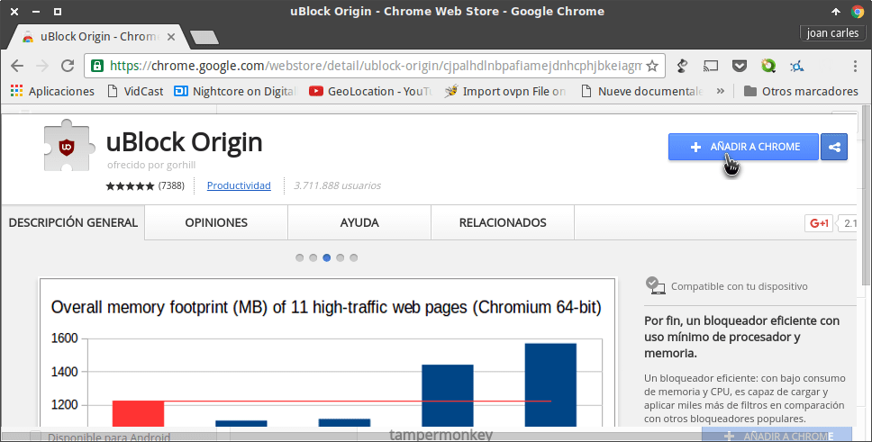
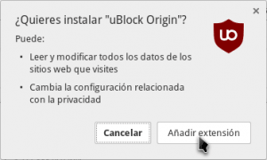
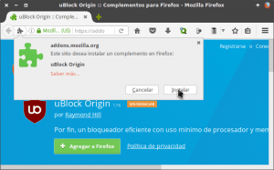

Con el fin de que todo el mundo pueda bloquear la publicidad en internet sin problemas, en este post veremos los pasos a seguir para instalar uBlock Origin en las versiones de escritorio de los navegadores Google Chrome y Firefox.<!--more-->

Pero antes de ver el proceso de instalación veremos que es y que hace el bloqueador de publicidad uBlock Origin.

## ¿QUÉ ES Y QUE FUNCIÓN REALIZA UBLOCK ORIGIN?

uBlock origin es una simple extensión de nuestro navegador que lo único que hace es bloquear los anuncios publicitarios cuando navegamos por internet.

Como una imagen vale mas que mil palabras a continuación pueden ver una captura de pantalla de una página web sin usar uBlock Origin:

En el momento que activemos el bloqueador de publicidad, el aspecto de la web cambiará radicalmente ya que no mostrará ningún tipo de anuncio.

## INSTALAR UBLOCK ORIGIN EN GOOGLE CHROME

Para instalar uBlock origin en Google Chrome tenéis que acceder a la siguiente URL:

[https://chrome.google.com/webstore/detail/ublock-origin/cjpalhdlnbpafiamejdnhcphjbkeiagm?hl=es](https://chrome.google.com/webstore/detail/ublock-origin/cjpalhdlnbpafiamejdnhcphjbkeiagm?hl=es "Link para la instalación de ublock origin en Chrome")

Una vez dentro de la URL, tal y como se puede ver en la captura de pantalla, clicamos encima del botón **Añadir a Chrome**.

Seguidamente aparecerá la siguiente ventana en la que deberemos clicar encima del botón **Añadir extensión**.

Después de seguir estos simples pasos ya tenemos instalado ublock Origin en nuestro navegador.

A partir de estos momentos cuando naveguemos por internet se bloqueará de forma automática la totalidad de publicidad existente en la web.

## INSTALAR UBLOCK ORIGIN EN FIREFOX

Para instalar uBlock origin en Firefox tenéis que acceder a la siguiente URL:

[https://addons.mozilla.org/es/firefox/addon/ublock-origin/?src=api](https://addons.mozilla.org/es/firefox/addon/ublock-origin/?src=api "Link para la instalación de ublock origin en Firefox")

Una vez dentro de la URL clicamos encima del botón **Agregar a Firefox**.

Seguidamente aparecerá la siguiente ventana en la que deberemos clicar encima del botón del botón **Instalar**.

Después de seguir estos simples pasos ya tenemos instalado ublock Origin en nuestro navegador.

A partir de estos momentos cuando naveguemos por internet se bloqueará de forma automática la totalidad de publicidad existente en la web.

## MOTIVOS PARA USAR UBLOCK ORIGIN FRENTE A OTROS BLOQUEADORES

Existen bloqueadores de publicidad alternativos a uBlock Origin. No obstante en mi caso les recomiendo instalar uBlock Origin por los siguientes motivos:

1. Funciona a la perfección. Bloquea prácticamente la totalidad de anuncios existentes en la web.
2. Es una alternativa liviana que consume menos RAM y menos CPU que sus competidores.
3. uBlock Origin dispone de más funcionalidades y más flexibilidad que sus competidores.
4. uBlock Origin se distribuye bajo la licencia GPLv3 y es software libre. Si alguien quiere conocer más acerca de las ventajas que proporciona el software libre puede leer el siguiente [artículo]().
5. Dispone de más filtros que el resto de sus competidores.
6. uBlock dispone de filtros que evitan que la página web que visitamos detecte que estamos usando un bloqueador de publicidad.
7. ublock origin es un fork de ublock. Aunque uBlock lo desmienta se rumorea que  uno de los motivos del fork fue que los actuales desarrolladores de uBlock origin no querían tener como fin principal monetizar su bloqueador. Por lo tanto a priori uBlock origin es más de fiar que uBlock.
8. ublock Origin es un proyecto activo que intenta mejorar día a día.
9. uBlock Origin no acepta pagos de la indústria publicitaria. Existen bloqueadores de publicidad, como adBlock Plus, que aceptan pagos de anunciantes a cambio de no bloquear su publicidad.

###### Nota: Si quieren usar un bloqueador de publicidad para su teléfono móvil Android pueden seguir las instrucciones del siguiente [link]()
