Ya sea por curiosidad o porque por ejemplo necesitan crear un entorno de desarrollo, a continuación les mostraré el procedimiento para para instalar una [máquina virtual]() con el sistema operativo Ubuntu 22.04 en cualquier ordenador Mac que use un procesador Apple Silicon. Hoy en día la mejor forma de instalar y [usar Ubuntu en un ordenador Mac](https://iboysoft.com/howto/how-to-use-linux-on-mac.html?utm_source=geekland&utm_medium=guest-post&utm_campaign=linux-on-mac) que use un procesador Apple Silicon es mediante la virtualización. Si siguen los pasos que se indican en el siguiente artículo verán que el rendimiento obtenido es sorprendentemente bueno y por ejemplo dispondrán de aceleración gráfica por Hardware.<!--more-->

## ¿POR QUÉ RECOMIENDO LA VIRTUALIZACIÓN A LA INSTALACIÓN NATIVA EN EL EQUIPO?

Los procesadores Apple Silicon han sido una revolución, pero tienen el inconveniente que el kernel de Linux aún no está preparado para sacar partido a este hardware. A día de hoy ya es posible instalar Ubuntu de forma nativa en un Mac con procesador Apple Silicon pero tendremos los siguientes inconvenientes:

1. El procedimiento no es sencillo.
2. El rendimiento no será el esperado porque el Kernel de Linux aún no está optimizado para sacar el máximo rendimiento del hardware.
3. Es posible que al finalizar la instalación hayan cosas que no funcionen como por ejemplo la aceleración gráfica por hardware, la Webcam, algunos de los puertos del equipo, etc.

Por estos motivos y a estas alturas la virtualización es una buena opción.

## RECOMENDACIONES PREVIAS PARA INSTALAR UBUNTU EN UN ORDENADOR MAC

Antes de iniciar la instalación les recomiendo lo siguiente:

1. El dispositivo de almacenamiento de nuestro Mac tiene que tener al menos 50GB libres.
2. Para obtener un rendimiento casi nativo es preciso que su equipo esté usando un procesador Apple Silicon. Además la imagen ISO del sistema operativo Linux que descargarán tiene que ser ARM.

## DESCARGAR LA ISO DE UBUNTU 22.04 VERSION ARM64

Lo primero que tenemos que realizar es descargar la **versión ARM64 de la ISO de ubuntu 22.04**. Para ello accederemos a la siguiente página web:

[https://cdimage.ubuntu.com/jammy/daily-live/current/](https://cdimage.ubuntu.com/jammy/daily-live/current/)

Una vez dentro clicaremos encima del enlace `64-bit ARM (ARMv8/AArch64) desktop image`. Acto seguido empezará a descargarse la imagen ISO de Ubuntu 22.04.

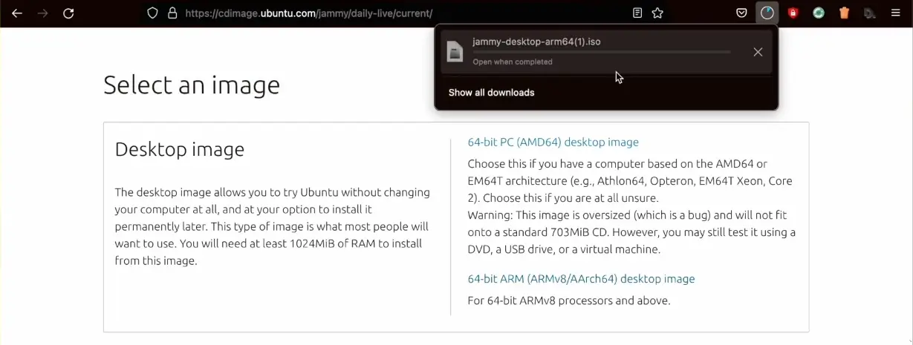

## DESCARGAR E INSTALAR EL SOFTWARE DE VIRTUALIZACIÓN UTM

El software que usaremos para virtualizar el sistema operativo Ubuntu 22.04 es UTM. Este software no es más que un hipervisor y emulador basado en QEMU. Mediante el uso de este software verán que una vez finalizada la instalación tendrán un rendimiento excelente.

Para descargar el software les aconsejo acceder a la siguiente URL:

[https://mac.getutm.app/](https://mac.getutm.app/)

Acto seguido tan solo tendrán que presionar encima del botón `Download` para iniciar la descarga. Una vez finalizada la descarga hacen doble click sobre la imagen ISO.


Cuando aparezca la siguiente ventana arrastran el icono de UTM dentro de la carpeta de aplicaciones para instalar UTM en su equipo.

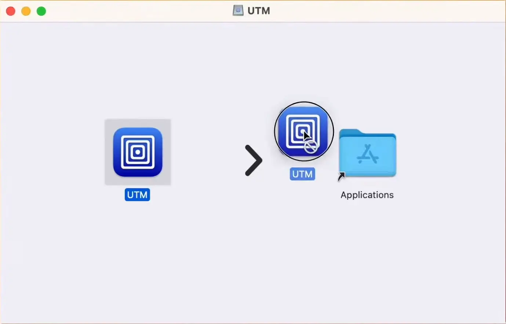

## CONFIGURAR LA MÁQUINA VIRTUAL UTM PARA INSTALAR UBUNTU EN UN MAC

Una vez finalizada la instalación tendremos que configurar la máquina virtual UTM. Para ello abriremos el programa UTM. Acto seguido seguiremos los siguientes pasos.

### Crear una nueva máquina virtual

En la pantalla de bienvenida clicaremos encima del botón **Crear una nueva máquina virtual**.

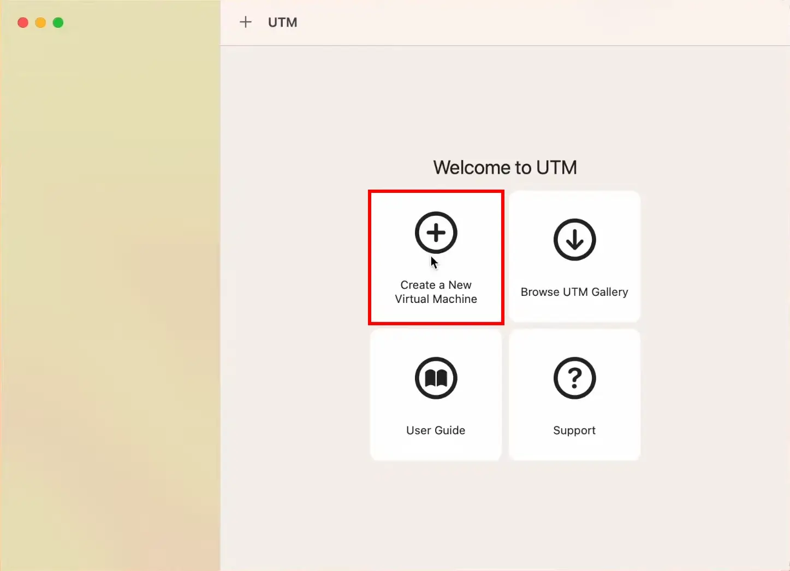

### Seleccionar el tipo de virtualización a realizar

Seguidamente tendremos que seleccionar el tipo de virtualización. En el caso que uséis un procesador Apple Silicon y hayáis descargado la imagen ISO ARM tendréis que seleccionar la opción `Virtualizar`. De este modo el rendimiento será muchísimo mejor y tendréis la sensación de estar usando Ubuntu en un equipo real.

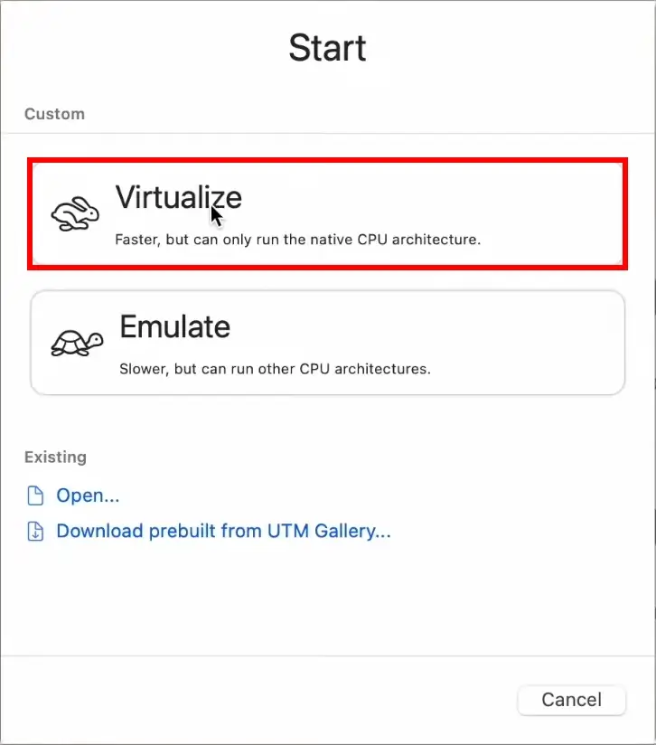

**Nota:** En el caso que estuvieran usando un Mac con procesador Intel deberían usar la opción `Emulate`

### Seleccionar el sistema operativo que queremos virtualizar

A continuación seleccionaremos el sistema operativo que queremos virtualizar. Por lo tanto en nuestro caso seleccionaremos la opción `Linux`.

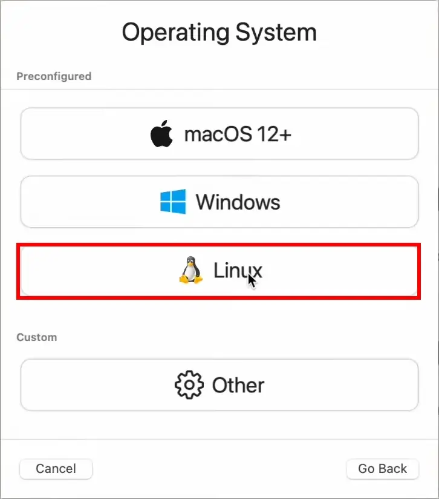

### Seleccionar la imagen ISO de ubuntu 22.04 ARM

El siguiente paso consistirá en seleccionar la imagen ISO de Ubuntu 22.04 que descargamos en apartados anteriores. Para ello hay que clicar encima del botón `Browse...`. Acto seguido se abrirá el gestor de archivos y tan solo tendrán que navegar en la ubicación donde almacenaron  la imagen ISO. A continuación hacen doble clic encima de la imagen ISO de Ubuntu. Finalmente tienen que presionar encima del botón `Continue`.

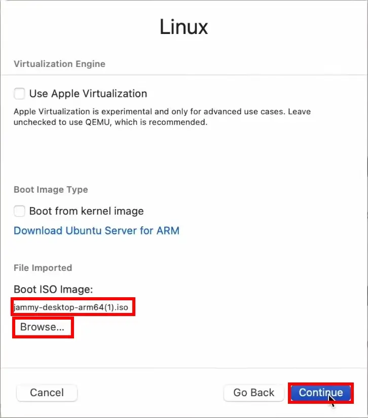

### Seleccionar la memoria RAM, el número de procesadores y la aceleración por hardware

Seguidamente seleccionaremos los siguientes parámetros:

1. **Memoria RAM que queremos asignar a la máquina virtual:** En mi caso asigno **4096MB** o más
2. **Número de procesadores que queremos asignar a la máquina virtual: 4** o más

A continuación tildaremos la opción `Enable hardware OpenGL acceleration (experimental)` y para finalizar presionaremos en el botón `Continue`

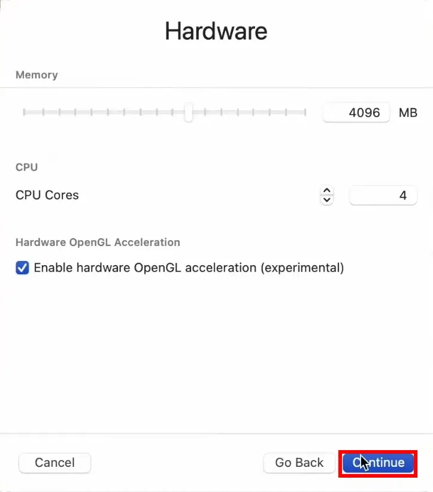

### Definir el espacio de almacenamiento que tendrá nuestra máquina virtual con Ubuntu

Ahora tenemos que seleccionar el espacio de almacenamiento que queremos asignar a la máquina virtual. Recomendé tener 50GB libres antes de iniciar el proceso. De este modo ahora podré asignar 40GB al nuevo sistema operativo.


### Definir un directorio compartido entre el equipo que actúa como anfitrión y el que actúa como invitado

A continuación definiremos un directorio que sea común entre el sistema operativo MacOS y el sistema operativo virtualizado Ubuntu. Para ello presionaremos el botón `Browse`. Cuando se abra el gestor de archivos tendremos que seleccionar el directorio que queremos compartir que en mi caso será la carpeta `Downloads`. Acto seguido presionaremos encima del botón `Continue`

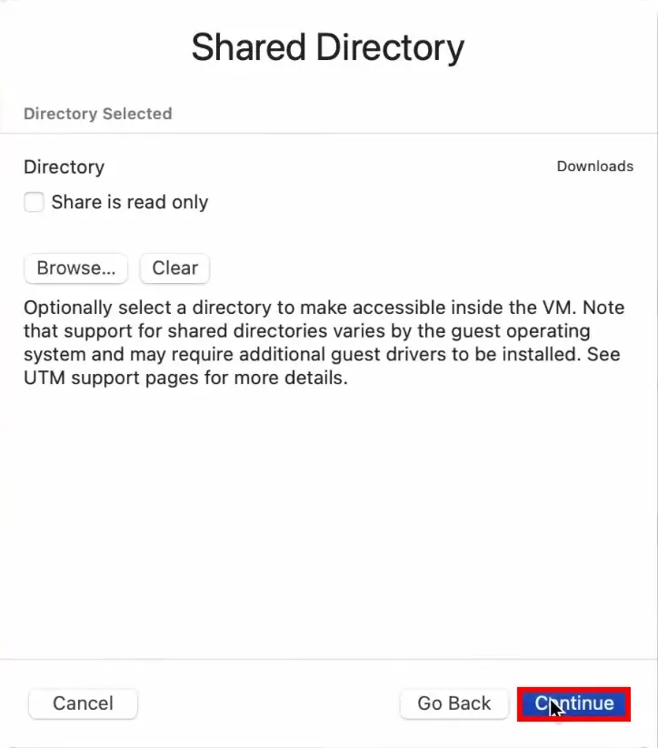

De esta forma cuando estemos usando Ubuntu podremos acceder al contenido almacenado en el directorio `Downloads`. Para ello podremos usar el navegador web.

### Dar un nombre a la máquina virtual y confirmar las características

El siguiente paso consistirá en dar nombre a la máquina virtual. En mi caso el nombre seleccionado es `Ubuntu 22.04 Jammy Jelly Fish`. Aparte también podrán ver la configuración que han aplicado a la máquina virtual. En el caso de estar conformes tan solo tendréis que presionar encima del botón `Save`

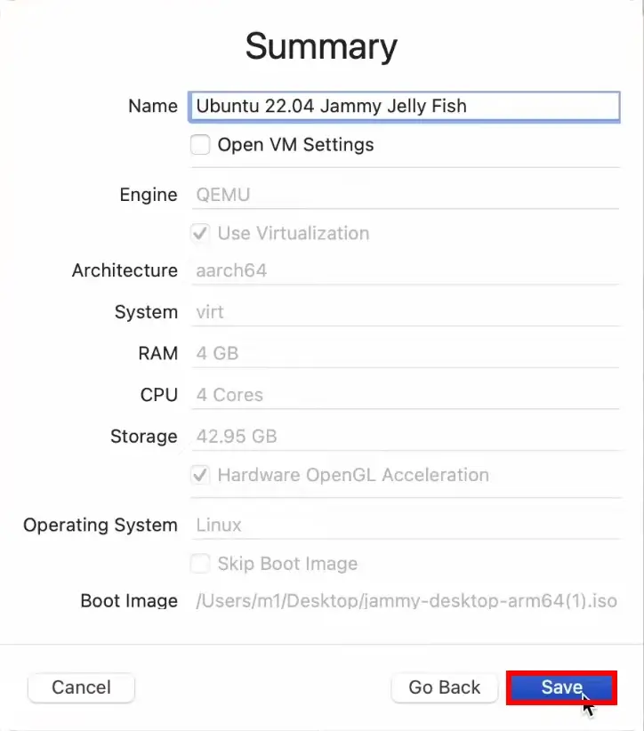

### Activar el modo retina en la configuración de la máquina virtual

Ahora clicaremos encima del icono del menú de configuración de UTM.


Acto seguido clicaremos en la opción `Display` y a continuación tildaremos la opción `Retina Mode`. De este modo el renderizado de imágenes y de fuentes será mucho mejor. Finalmente para terminar el proceso de configuración de la máquina virtual presionaremos el botón `Save`

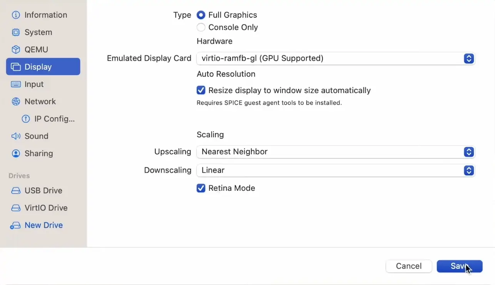

Una vez finalizado el proceso de configuración de la máquina virtual ya podemos instalar Ubuntu.

## INSTALAR UBUNTU EN LA MÁQUINA VIRTUAL UTM

Una vez finalizada la configuración de la máquina virtual ya podemos iniciar la instalación del sistema operativo que en nuestro caso será Ubuntu. Para ello seleccionamos la máquina virtual que acabamos de crear y clicaremos encima del botón grande de **Play**.

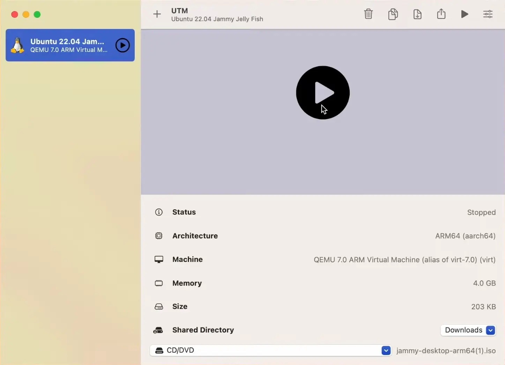

Acto seguido se iniciará la máquina virtual. Una vez se inicie les aparecerá el grub y tendrán que seleccionar la opción `Try or Install Ubuntu`

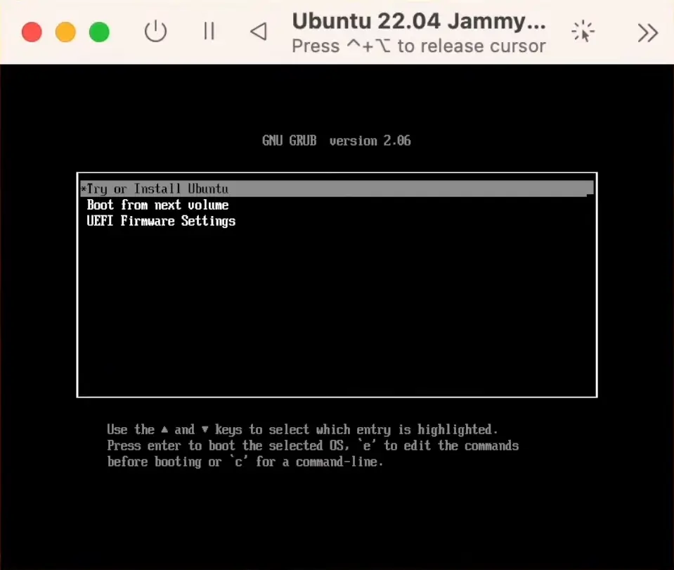

Cuando aparezca la pantalla para loguearse introducen el usuario `Ubuntu` y presionan la tecla Enter.

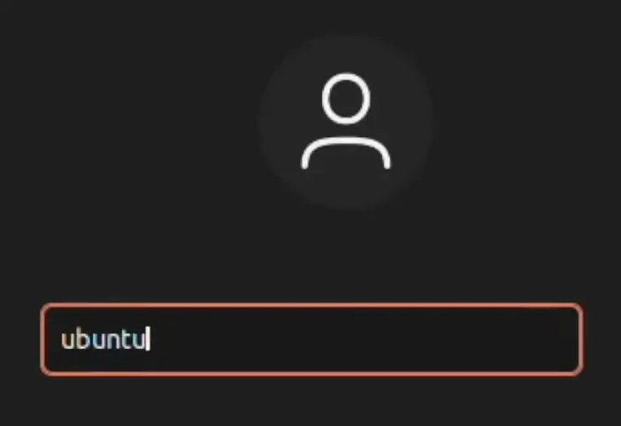

Acto seguido les aparecerá el escritorio de Ubuntu. Una vez les aparezca hacen doble click encima del icono de `Install Ubuntu 22.04.1 LTS`

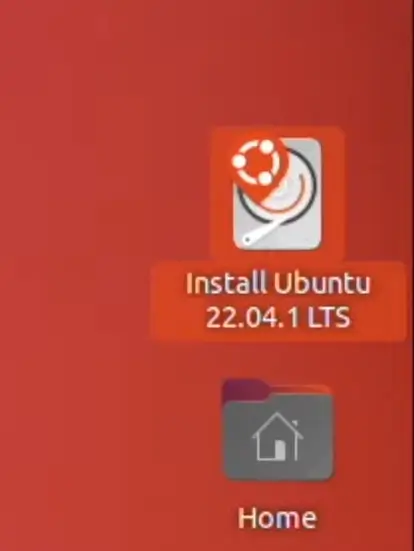

### Seleccionar el idioma y la distribución de teclado

A continuación se iniciará la instalación de Ubuntu en nuestra máquina virtual. Lo primero que tendremos que realizar es definir el idioma. En mi caso he seleccionado `English` y he presionado en el botón `Continue`

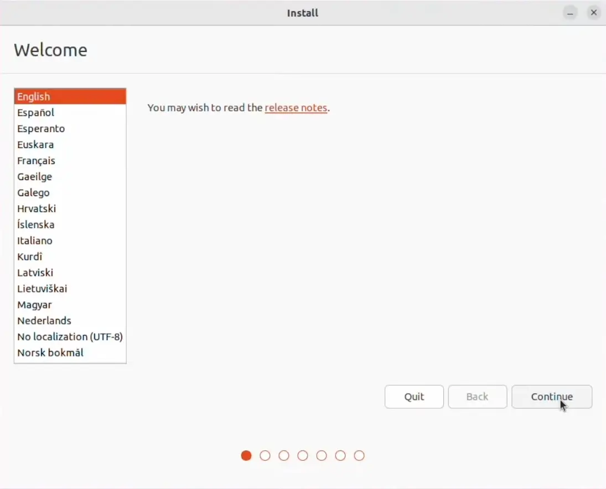

Acto seguido introduciremos la distribución de teclado. Como estoy usando un teclado Inglés de Estados Unidos seleccionaré las opciones `English(US)` y presionaré el botón `Continue`

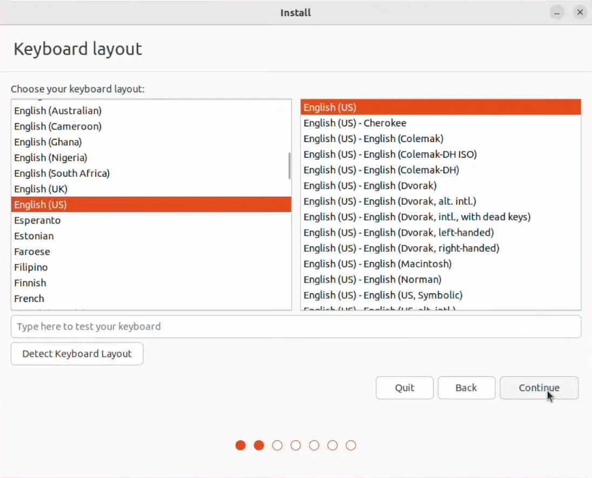

### Definir el tipo de instalación y decidir si queremos instalar las últimas actualizaciones de software y drivers propietarios durante la instalación

En mi caso quiero realizar una instalación normal que disponga de la totalidad de actualizaciones y considerando los drivers propietarios para obtener el mejor rendimiento posible. Por lo tanto selecciono las siguientes opciones y clico encima del botón `Continue`

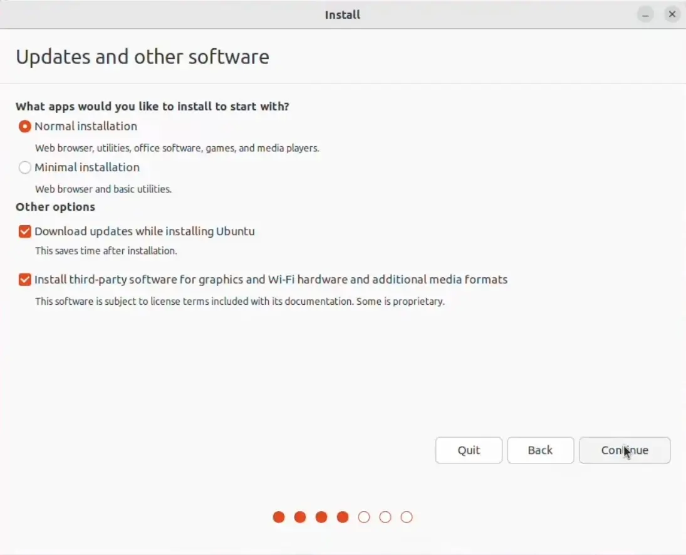

### Configurar las particiones para la instalar Ubuntu

A la hora de realizar las particiones no me he complicado la vida. Simplemente he seleccionado la opción `Borrar todo el disco e instalar Ubuntu` y he clicado encima del botón `Install Now`. De este modo Ubuntu realizará las particiones de forma completamente automática.

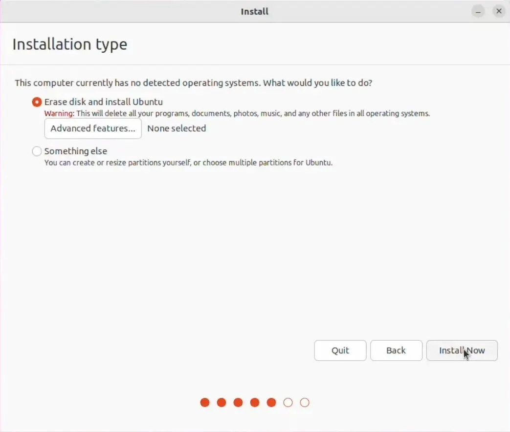

### Definir el nombre de usuario, el nombre del equipo y la contraseña del usuario

El último paso consistirá en definir los siguientes parámetros:

1. Nombre de usuario: En mi caso es `geekland`
2. Nombre del equipo: En mi caso será `UbuntuM1`
3. Contraseña: He usado `1234`, pero vosotros debéis usar una que sea robusta.

Una vez definidos los parámetros que acabo de citar tan solo tendrán que clicar sobre el botón `Continue`

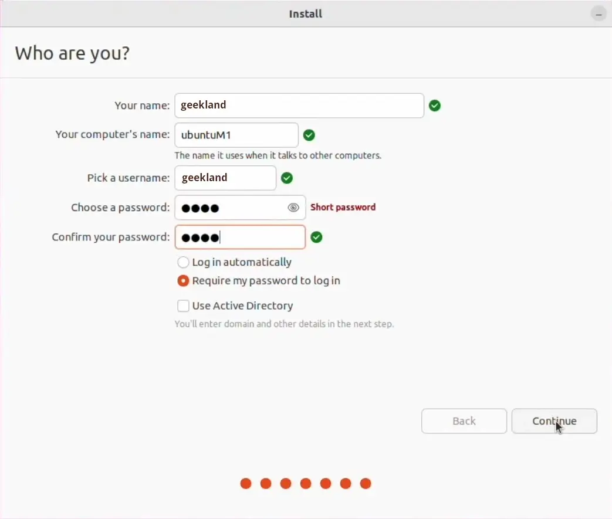

Acto seguido tendremos que esperar unos minutos para que el proceso de instalación finalice. Una vez terminada la instalación tendrán que apagar la máquina virtual clicando encima la opción de apagar `Power Off / Log Out.`

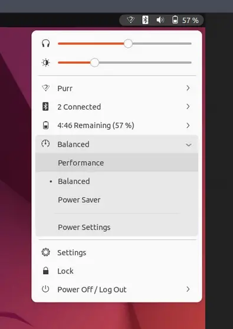

Finalmente tan solo hay que desmontar la imagen ISO de la máquina virtual. Para ello clicaremos en el icono de `Drive image options`. Cuando se despliegue el menú seleccionaremos la imagen ISO que hemos usado para la instalación y seguidamente cuando aparezca el submenu clicaremos encima de la opción `Eject`.

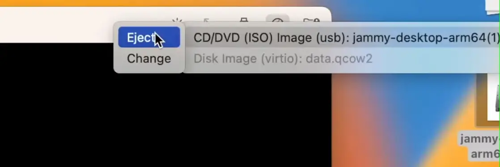

## INICIAR Y COMPROBAR QUE UBUNTU 22.04 FUNCIONA CORRECTAMENTE EN UN MAC CON PROCESADOR APPLE SILICON

Una vez finalizado todo el proceso ya podemos iniciar la máquina virtual. Para ello clicaremos encima del botón de `Play`

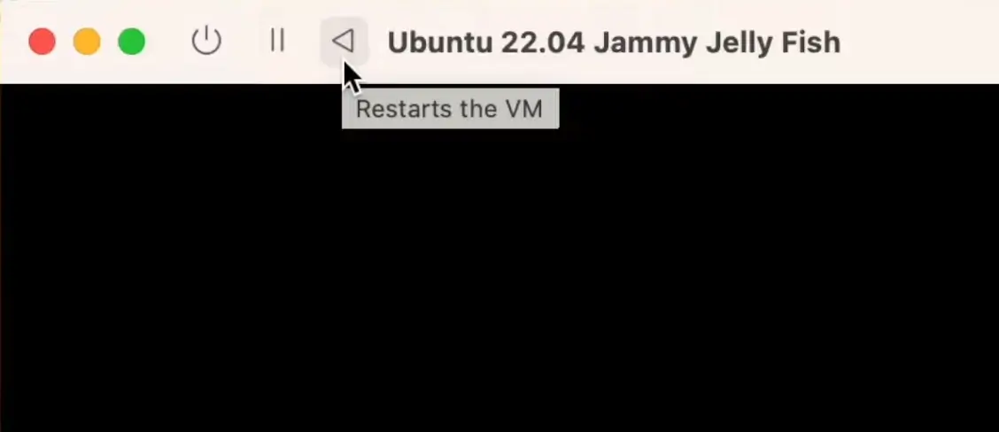

Esperamos unos momentos y veremos que efectivamente se iniciará la máquina virtual. En el momento de introducir el usuario y contraseña se tienen que dirigir a la parte inferior derecha y clicar sobre la rueda de configuración. Acto seguido se desplegará el menú y deberán clicar encima de la opción `Ubuntu en Xorg`

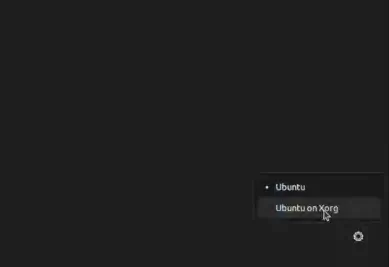

Acto seguido introducen la contraseña de usuario y presionan la tecla Enter.


Finalmente estarán logueados y podrán usar Ubuntu sin ningún tipo de problema. Además verán que el desempeño será mucho más fluido de lo uno podría esperar. De hecho tendrán la sensación que están usando Ubuntu en una máquina real.

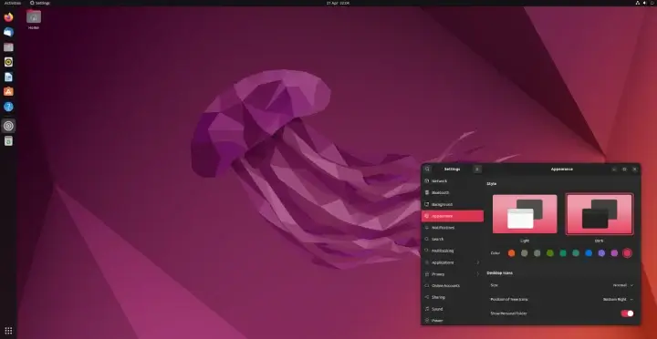

### Configuración adicional de Ubuntu para poder compartir ficheros en MacOS y la máquina virtual de Ubuntu

En la configuración de la máquina virtual definimos que la carpeta `Downloads` seria compartida entre MacOS y la máquina virtual de Ubuntu. Para que la compartición funcione deberán instalar los paquetes `spice-vdagent` y `spice-webdavd`. Para ello abriremos una terminal de Linux y ejecutaremos el siguiente comando para actualizar los repositorios de Ubuntu:

```shell
sudo apt update
```

Acto seguido instalaremos `spice-vdagent` y `spice-webdavd` ejecutando el siguiente comando en la terminal:

```shell
sudo apt install spice-vdagent spice-webdavd
```

De esta forma después de reiniciar el equipo podrán tener una carpeta compartida entre la máquina virtual y el sistema operativo MacOS. Además entre otras cosas podrán copiar y pegar contenido de MacOS a Ubuntu y viceversa.

Para compartir el contenido entre ambos sistemas operativos mediante la carpeta compartida deberán abrir el navegador web, ir a la barra de direcciones, introducir el texto `localhost:9843` y presionar la tecla enter. Acto seguido podrán ver y obtener el contenido de la carpeta compartida.

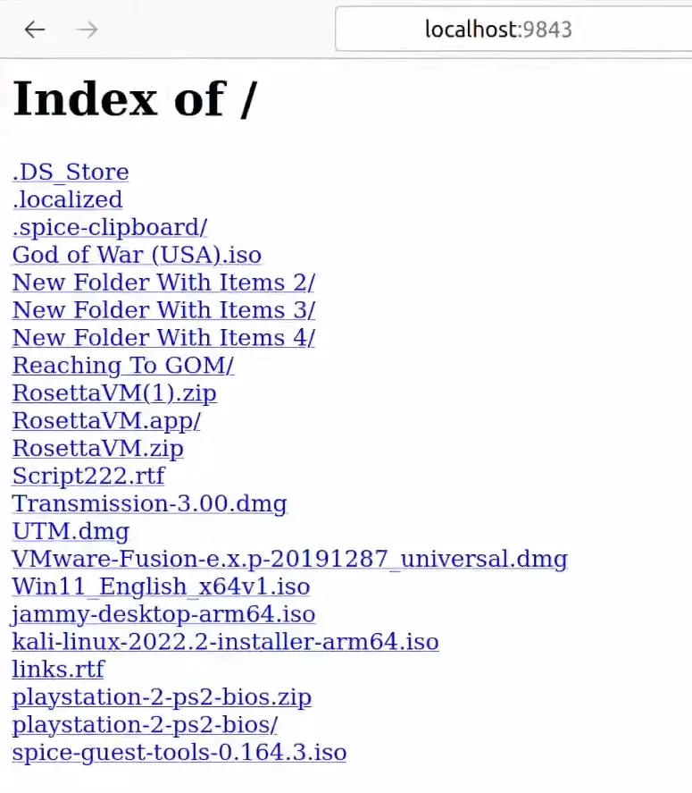
