En el siguiente artículo veremos como instalar un servidor web LAMP en linux y más concretamente en Debian 8 (Jessie). Es de esperar que el procedimiento seguido para instalar el servidor web LAMP en Debian 8, sea también válido para prácticamente la totalidad de distribuciones derivadas de Debian.<!--more-->

###### Nota: En este artículo únicamente hacemos mención a la instalación de la infraestructura mínima funcional de un servidor web. En ningún caso se pretende profundizar en otros aspectos como por ejemplo fortificar la seguridad del servidor web, instalar un CMS wordpress, instalar un servidor owncloud, etc. Para estos menesteres escribiré otros post en el futuro.

###### Nota: El servidor web que instalaremos será accesible de forma local y de forma remota.

## ¿QUÉ ES UN SERVIDOR WEB LAMP?

**LAMP es** un acrónimo que representa **un conjunto de herramientas que proporcionan las funcionalidades necesarias para construir nuestro propio servidor web**. Estas herramientas que forman LAMP son las siguientes:

**L de Linux:** Por lo tanto nuestro servidor web se usará sobre un sistema operativo Linux. **A de Apache:** Por lo tanto el servidor que usaremos es el archiconocido Apache. **M de MySQL/MariaDB:** Por lo tanto el servidor web Apache se alimentará de un sistema de base de datos relacional como MySQL o MariaDB. **P de Php, Perl o Phyton:** Por lo tanto el servidor web dispondrá de los módulos PHP, Perl o Phyton para poder procesar alguno de estos lenguajes de programación.

Si precisan de más información acerca de los servidores LAMP pueden consultar el siguiente [enlace](https://es.wikipedia.org/wiki/LAMP).

## ASIGNAR UNA IP ESTÁTICA A NUESTRO SERVIDOR

El primero paso a resolver para disponer de nuestro propio servidor web, es hacer que el equipo que actúe como servidor tenga una IP interna estática. De este modo nuestro servidor siempre será localizable dentro de nuestra red local.

**Para conseguir disponer de un servidor con ip interna fija tan solo hay que seguir los pasos que se detallan en el siguiente enlace**:

[https://geeklandlinux.github.io/posts/configurar-ip-fija\_o\_estatica\_ipv4/]()

###### Nota: El método descrito en el enlace es válido en el caso que estéis usando un servidor sin entorno gráfico. En el caso que el servidor que uséis disponga de entorno gráfico, tendréis que configurar este aspecto a través de la interfaz visual de vuestro gestor de red que probablemente será network manager o wicd.

**Una vez terminados la totalidad de pasos, el servidor tendrá una IP fija que en mi caso será la 192.168.1.188**. Esta IP es la que deberemos usar para localizar y conectar con nuestro servidor web de forma local. Esta IP también será la que tendremos que usar para que nuestro Router redireccione las peticiones de los clientes remotos que quieran conectarse a nuestro servidor Web.

## HACER QUE NUESTRO SERVIDOR SEA ACCESIBLE DESDE EL EXTERIOR

Cuando tengamos nuestro servidor web funcionando, es probable que tengamos clientes remotos que quieran conectarse a él, o que simplemente seamos nosotros mismos quien lo precisemos hacer porqué por ejemplo tengamos un servidor Owncloud alojado en nuestro servidor web.

Para que los clientes remotos puedan conectarse a nuestro servidor web necesitaran nuestra IP Pública. Desafortunadamente en la gran mayoría de casos la IP que tenemos es dinámica. Por lo tanto se puede dar perfectamente el caso que en el momento de conectarnos no sepamos la IP Pública de nuestro servidor.

**Para** solucionar este problema tenemos que **asociar la IP Pública de nuestro servidor a un dominio**. Para poder realizar este paso tan solo **tienen que seguir las indicaciones del siguiente enlace**:

[https://geeklandlinux.github.io/posts/encontrar-servidor-con-dns-dinamico/]()

Una vez realizados estos pasos tendréis vuestra IP Pública asociada a un dominio. En mi caso mi IP Pública está asociada al dominio geekland.sytes.net

## REDIRECCIONAR PETICIONES DE LOS CLIENTES EN EL ROUTER

En estos momentos tenemos que configurar nuestro router para que sea capaz de redireccionar las peticiones de los clientes remotos al servidor web. Para ello lo primero que se necesita es saber la IP interna del servidor web. En mi caso, tal y como hemos visto en el apartado “Asignar una IP estática a nuestro servidor web” tenemos la IP 192.168.1.188. En caso de tener dudas tan solo tenemos que **abrir una terminal y ejecutar el siguiente comando**:

> ```
> sudo ifconfig
> ```

Justo después de ejecutar el comando **obtendremos la siguiente captura de pantalla**:

[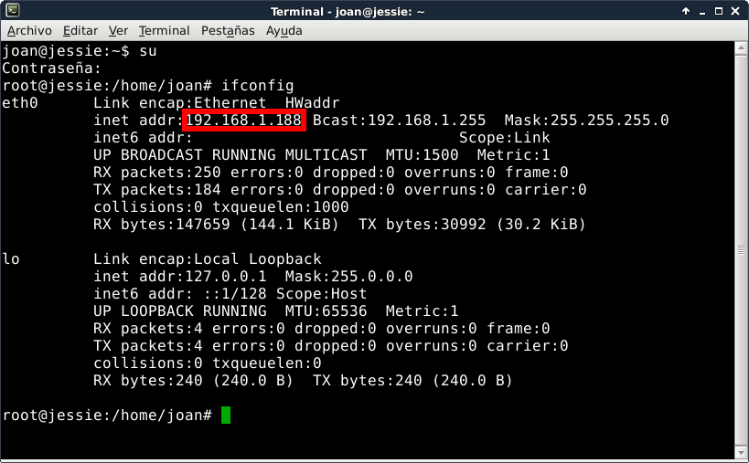](images/Consultar-ip-interna.png)

Como se puede ver en la captura de pantalla, l**a IP interna del que será el futuro servidor web es la 192.168.1.188**

Una vez conocemos la IP interna del futuro servidor web, **accedemos a la configuración del Router abriendo el navegador e introduciendo nuestra puerta de entrada**. Una vez introducida la puerta de entrada, que acostumbra a ser 192.168.1.1, tal y como podemos ver en la captura de pantalla tendremos que **introducir nuestro nombre de usuario y contraseña y presionar el botón Aceptar**:

[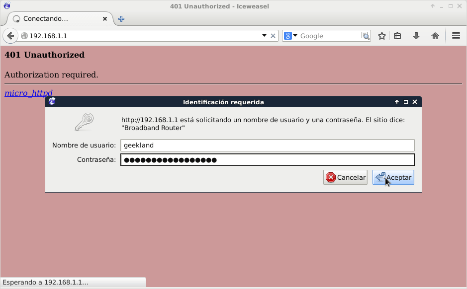](images/acceder-configuracion-Router.png)

Una vez hemos accedido a la configuración del Router, **buscamos el apartado Virtual Servers en el menú de configuración**. **En mi router**, como se puede ver en la captura de pantalla, **se halla en Advanced Setup / NAT / Virtual Servers**:

[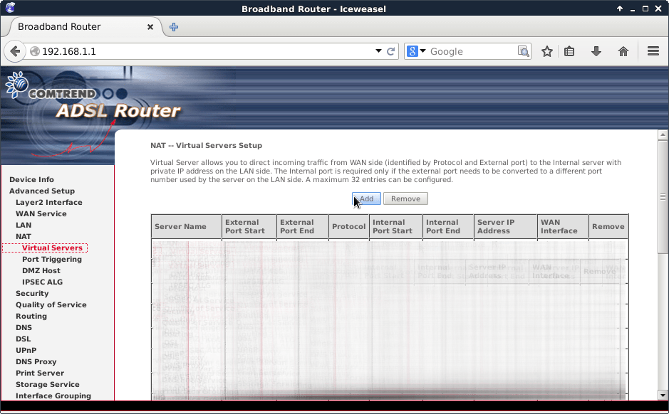](images/Acceder-a-Virtual-servers.png)

Una vez dentro de Virtual Servers **presionamos el botón Add** para añadir nuestro servidor web. Una vez presionado el botón Add aparecerá la siguiente pantalla:

[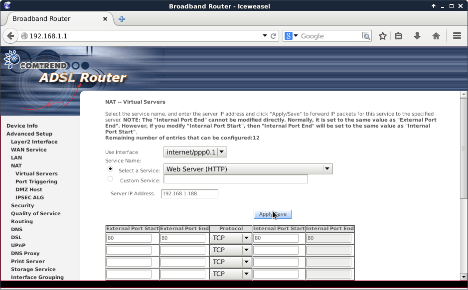](images/Abrir-puerto-http.png)

Como se puede ver en la captura de pantalla **en Server IP Address tendremos que indicar la IP interna de nuestro servidor web que será la 192.168.1.188**

**En seleccionar servicio elegimos la opción Web Server (HTTP)**. Al seleccionar esta opción la configuración de los protocoles y puertos se realizará automáticamente. Como se puede ver en la captura de pantalla el servicio HTTP funciona mediante el protocolo TCP y el puerto 80.

Una vez realizados los pasos tan solo tenemos que **apretar el botón Save/Apply**.

**Si** además **tenemos previsto que nuestro servidor web funcione con https, también tendremos que abrir el puerto 443**. **Para abrir el puerto 443**, tal y como se puede ver en la captura de pantalla, **hay que seguir los mismos pasos que para abrir el puerto 80**:

[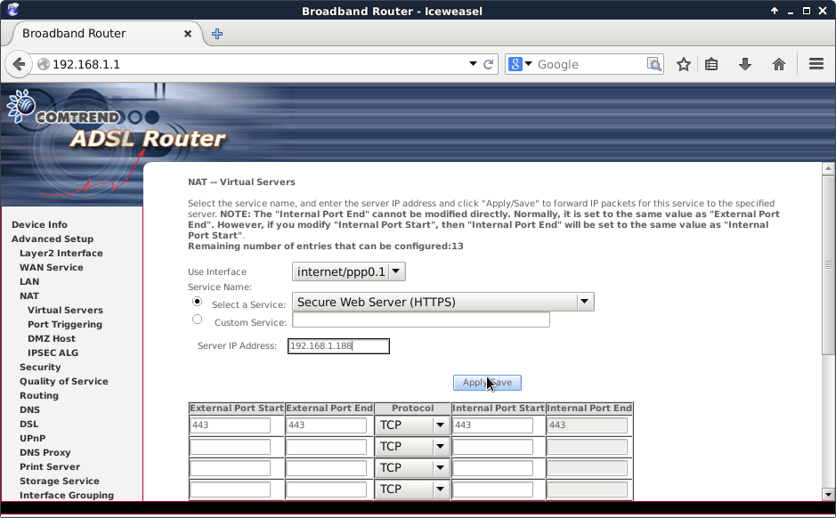](images/Abrir-puerto-https.png)

**La única diferencia es que en vez de seleccionar el servicio Web Server (HTTP), en este caso tendremos que seleccionar Secure Web Server (HTTPS)**. Una vez seleccionada la IP del servidor, y el tipo de servicio tan solo tendremos que volver a presionar el botón Apply/Save.

Una vez nuestro ordenador está accesible desde fuera de nuestra red local ya podemos iniciar la instalación del servidor web LAMP.

## LOGUEARNOS COMO USUARIO ROOT

Todo el proceso de instalación y configuración del servidor se realizará siendo root. Por lo tanto el primer paso es loguearnos como usuario root. Para ello **en la terminal ejecutamos el siguiente comando**:

> ```
> su root
> ```

Al ejecutar el comando nos preguntaran la contraseña del usuario root. La introducimos y **presionamos Enter**.

## ACTUALIZAR EL SOFTWARE DE NUESTRO SISTEMA OPERATIVO

El primer paso para actualizar el software del sistema operativo donde instalaremos el servidor web, es actualizar los repositorios del sistema. Para ello **ejecutaremos el siguiente comando en la terminal**:

> ```
> apt-get update
> ```

Seguidamente actualizamos los paquetes de nuestro sistema operativo **ejecutando el siguiente comando en la terminal**:

> ```
> apt-get upgrade
> ```

## INSTALACIÓN DEL SERVIDOR WEB APACHE

Instalar un servidor web apache es muy sencillo. Tan solo tenemos que **teclear el siguiente comando en la terminal**:

> ```
> apt-get install apache2
> ```

Una vez tecleado **presionamos Enter**. Justo después empezará el proceso de instalación. Durante el proceso de instalación, recomiendo que analicen los mensajes que aparecen para asegurarnos que no se produce ningún error.

Si durante el proceso de instalación del servidor Apache nos aparece el siguiente mensaje:

```
apache2: Could not determine the server's fully qualified domain name,
using 127.0.0.1 for ServerName
```

Entonces deberemos editar el fichero /etc/apache2/httpd.conf. Para ello tenemos que teclear el siguiente comando en la terminal:

> ```
> nano /etc/apache2/httpd.conf
> ```

Una vez abierto el fichero httpd.conf con el editor de textos nano, tenemos que ir al final del archivo de configuración y añadir el siguiente texto:

> ```
> ServerName localhost
> ```

Una vez introducida esta línea guardamos los cambios y cerramos el editor de texto. Ahora al reiniciar el servidor apache no debería aparecer el error ya que ahora hemos definido que el nombre de nuestro servidor sea localhost.

En estos momentos el proceso de instalación del servidor Web ha finalizado.

## INSTALACIÓN DE LAS LIBRERIAS DE SOPORTE PHP5

Una vez instalado el servidor web Apache, instalaremos las librerías de soporte PHP conjuntamente con sus dependencias. Para ello **ejecutamos el siguiente comando en la terminal**:

> ```
> apt-get install php5 libapache2-mod-php5 php5-mcrypt
> ```

Después de instalar los paquetes el proceso de instalación de las librerías PHP ha finalizado.

## INSTALACIÓN DEL SERVIDOR DE BASE DE DATOS MYSQL

El siguiente paso es instalar el servidor de base de datos MySQL. Para ello **ejecutaremos el siguiente comando en la terminal**:

> ```
> apt-get install mysql-server php5-mysql
> ```

Durante la instalación del servidor de la base datos, tal y como se puede ver en la captura de pantalla, se nos pedirá **introducir la contraseña del usuario root que administrará la base de datos**.

[](images/Contraseña-usuario-root-mysql.png)

Tal y como se puede ver en la captura de pantalla, introducimos la contraseña y **presionamos Enter**. Justo después de presionar Enter, tal y como se puede ver en la captura de pantalla, **se nos volverá a pedir que repitamos la contraseña que acabamos de introducir**:

[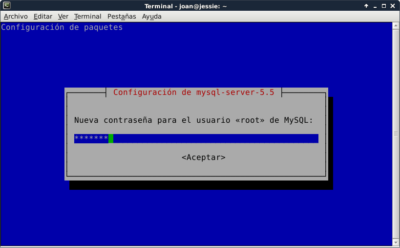](images/Confirmación-contraseña-usuario-root-mysql.png)

**Introducimos la contraseña de nuevo y presionamos Enter**. Ahora tan solo tenemos que esperar unos segundos a que concluya el proceso de instalación de MySQL.

###### Nota: Durante el proceso de instalación de MySQL, hay que asegurar que no se produzcan errores. En caso de producirse errores deberemos buscar una solución.

## INSTALACIÓN DE PHPMYADMIN PARA GESTIONAR EL SERVIDOR MYSQL

Phpmyadmin es un administrador gráfico web para bases de datos MySQL. Por lo tanto Phpmyadmin nos servirá para poder administrar de una forma gráfica y más sencilla nuestras bases de datos. Para instalar Phpmyadmin tenemos que **ejecutar el siguiente comando en la terminal**:

> ```
> apt-get install phpmyadmin
> ```

Durante la instalación de Phpmyadmin se nos preguntará el servidor web en el que queremos ejecutar Phpmyadmin. Tal y como se puede ver en la captura de pantalla, **seleccionamos el servidor apache2 que acabamos de instalar y presionamos Enter**.

[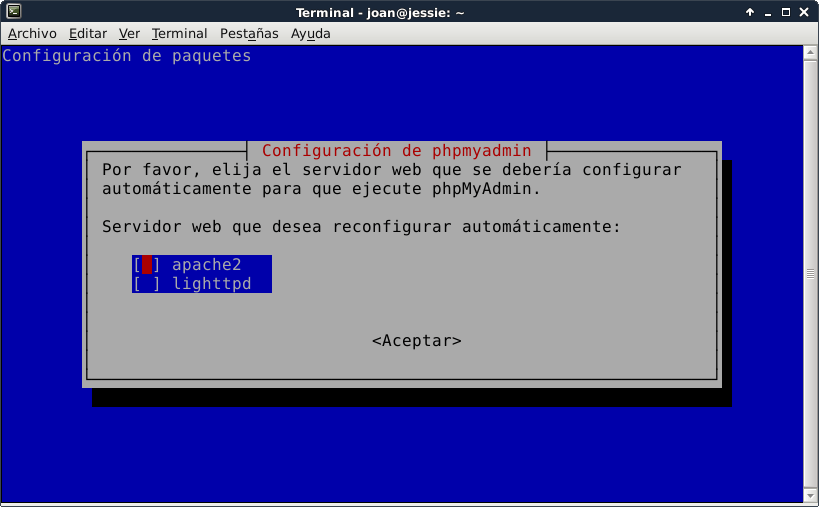](images/Servidor-en-que-se-usará-phpmyadmin.png)

Seguidamente nos aparecerá un mensaje en el que se nos advierte que es necesario disponer de una base de datos instalada y configurada para poder utilizar phpmyadmin. Se nos pregunta si queremos que la creación y configuración de esta base de datos se haga de forma automática. Nosotros, tal y como se puede ver en la captura de pantalla, **seleccionaremos la opción Sí y presionaremos Enter**.

[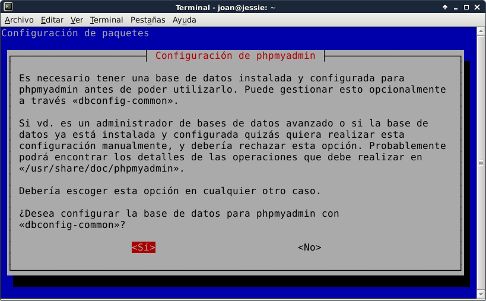](images/Creación-y-configuración-de-una-base-de-datos.png)

Después de presionar Enter continuará el proceso de instalación. En breves momentos **aparecerá otra ventana en la que se nos pedirá que introduzcamos la contraseña de administrador root de Mysql** para que phpmyadmin pueda acceder al servidor de base de datos Mysql y crear la base de datos. Tal y como se puede ver en la captura de pantalla, **introducimos la contraseña** que definimos previamente y **presionamos Enter**:

[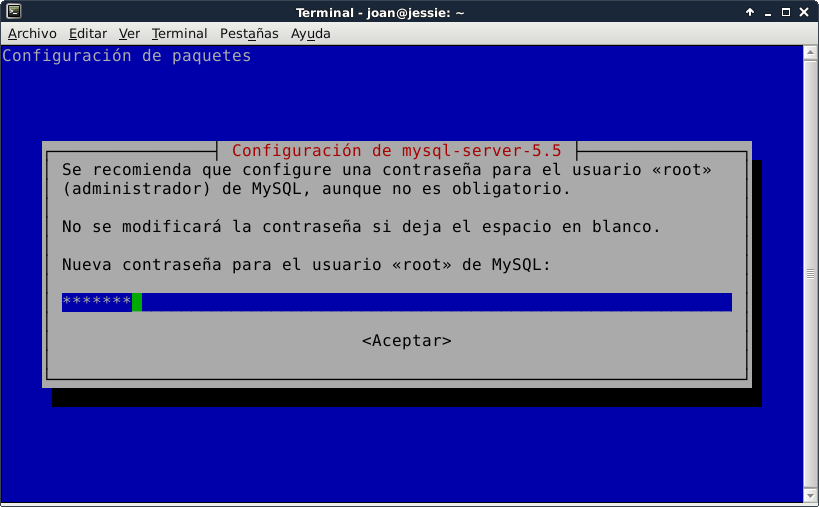](images/Contraseña-usuario-root-mysql1.png)

Después de presionar Enter continuará el proceso de instalación. En breves momentos **aparecerá otra ventana en la que nos pedirá que introduzcamos la contraseña que queremos usar para loguearnos a phpmyadmin**. Tal y como se puede ver en la captura de pantalla **introducimos la contraseña y presionamos la tecla Enter**.

[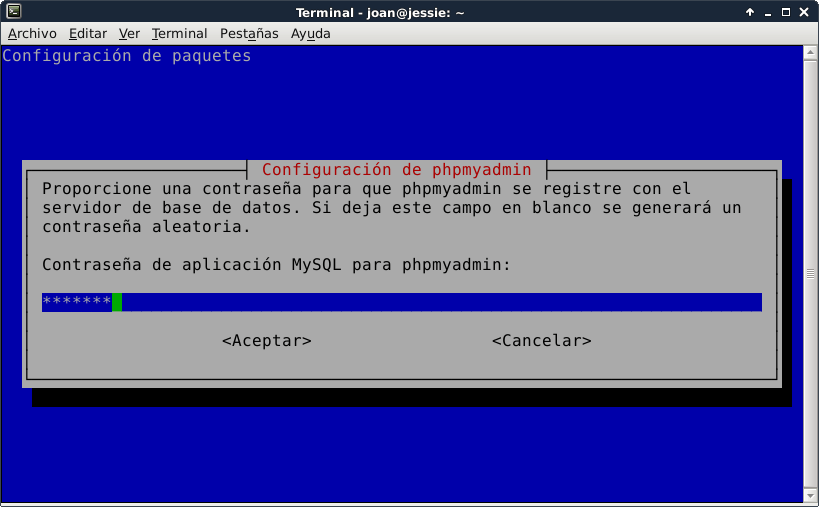](images/Contraseña-de-phpmyadmin.png)

Al presionar Enter nos a**parecerá otra pantalla en la que se nos pedirá que reconfirmemos las contraseña que acabamos de introducir**. Por lo tanto **volvemos a teclear la contraseña y presionamos Enter**. En estos momentos el proceso ha finalizado.

Finalmente tan solo nos falta incluir phpmyadmin dentro de la configuración de apache. Para ello **ejecutamos el siguiente comando en la terminal**:

> ```
> nano /etc/apache2/apache2.conf
> ```

Una vez abierto el fichero de configuración de Apache, **nos vamos al final e introducimos el siguiente texto**:

> ```
> # phpMyAdmin Configuración
> Include /etc/phpmyadmin/apache.conf
> ```

Una vez introducido el texto **guardamos los cambios y cerramos el fichero**. Finalmente **reiniciamos el servidor Apache** para los cambios surjan efecto **introduciendo el siguiente comando en la terminal**:

> ```
> service apache2 restart
> ```

Después de realizar estos paso, el proceso de instalación de un servidor Web LAMP ha finalizado. Ahora tan solo nos falta comprobar que sea operativo.

## COMPROBACIÓN DEL FUNCIONAMIENTO DEL SERVIDOR WEB

Para comprobar que el servidor web está funcionando, tan solo tenemos que **abrir el navegador web y teclear la dirección de nuestro dominio no-ip fuera de nuestra red local**. En mi caso tecleo la siguiente dirección:

> ```
> http://geekland.sytes.net
> ```

Una vez tecleada la dirección, si todo funciona adecuadamente obtendréis un resultado parecido al siguiente:

[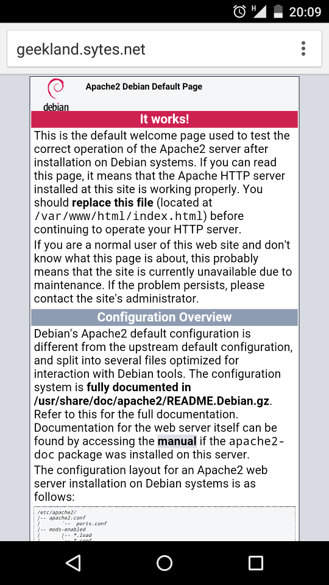](images/Comprobar-funcionamiento-Apache.png)

###### Nota: Si la prueba se realiza dentro de nuestra red local, se debe sustituir la dirección del dominio no-ip por la dirección ip estática de nuestro servidor web. En mi caso la dirección ip estática es 192.168.1.188

## COMPROBACIÓN DEL FUNCIONAMIENTO DE PHP

Para comprobar que el funcionamiento de php es correcto tenemos que crear un pequeño script. Para crearlo **ejecutamos el siguiente comando en la terminal**:

> ```
> nano /var/www/html/info.php
> ```

**Una vez abierto el editor de texto nano tecleamos el siguiente código**:

> ```
> <?php
> phpinfo();
> ?>
> ```

Una vez tecleado el código, **guardamos los cambios y cerramos el archivo**.

Una vez generado el script ya podemos realizar la comprobación. Para realizar la comprobación, tan solo tenemos que **abrir el navegador web con un dispositivo que esté fuera de nuestra red local y teclear la dirección de nuestro dominio no-ip seguida de una contrabarra y el nombre del script que acabamos de generar**. Por lo tanto en mi caso tengo que teclear la siguiente dirección:

> ```
> http://geekland.sytes.net/info.php
> ```

Una vez tecleada la dirección, si todo funciona adecuadamente, obtendréis un resultado parecido al siguiente:

[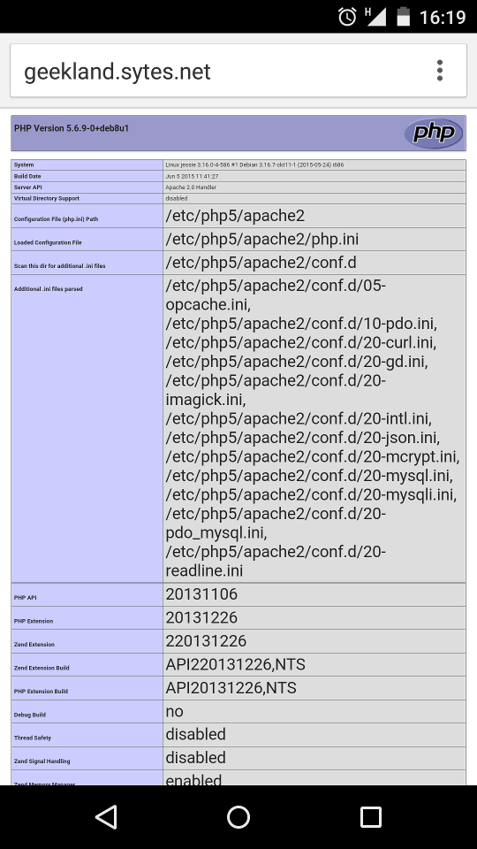](images/Comprobar-funcionamiento-PHP.png)

###### Nota: Si la prueba se realiza dentro de nuestra red local, se debe sustituir la dirección del dominio no-ip por la dirección ip estática de nuestro servidor web que en mi caso es 192.168.1.188.

## COMPROBACIÓN DEL FUNCIONAMIENTO DE MYSQL Y PHPMYADMIN

Para comprobar que MySQL y Phpmyadmin están funcionando, tan solo tenemos que **abrir el navegador web con un dispositivo que esté fuera de nuestra red local y teclear la dirección de nuestro dominio no-ip seguida de una contrabarra y el nombre phpmyadmin**. Por lo tanto en mi caso tengo que teclear la siguiente dirección:

> ```
> http://geekland.sytes.net/phpmyadmin
> ```

###### Nota: Si la prueba se realiza dentro de nuestra red local, se debe sustituir la dirección del dominio no-ip por la dirección ip estática de nuestro servidor web.

Una vez tecleada la dirección, si todo funciona adecuadamente obtendréis un resultado parecido al siguiente:

[](images/Pantalla-Login-phpmyadmin.png)

Ahora tan solo hay que **introducir la contraseña que definimos en etapas anteriores y presionar el botón continuar**. Si todo funciona correctamente obtendremos un resultado similar al siguiente:

[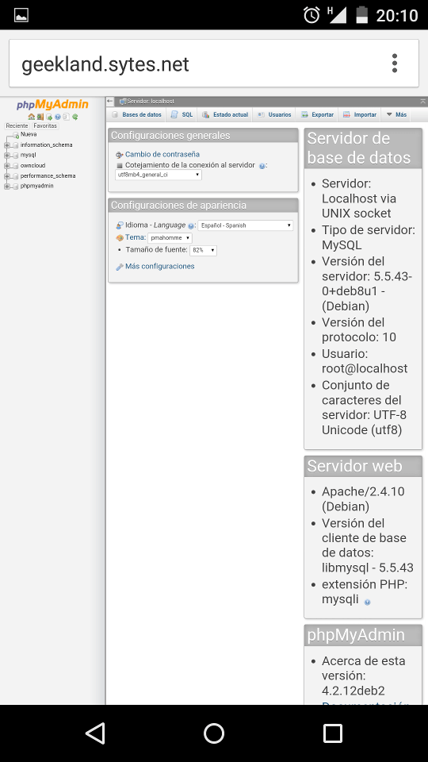](images/Comprobar-funcionamiento-Phpmyadmin.png)

Si todas las comprobaciones realizadas son satisfactorias podemos afirmar que disponemos de un servidor web LAMP instalado y funcional. En futuros post veremos como podemos dar uso al servidor web LAMP que acabamos de instalar.
