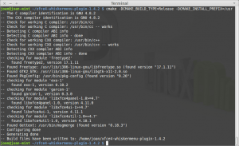
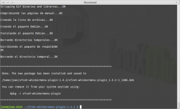
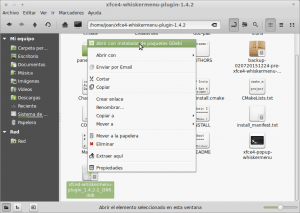
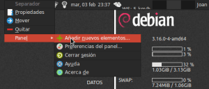
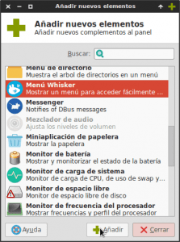
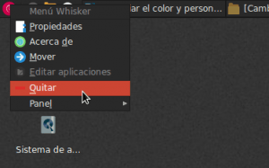
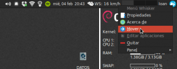
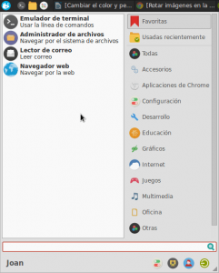

Durante bastantes años he estado usando XFCE en Debian. Empecé por la versión 4.8 y actualmente estoy usando la versión 4.10. Hasta hace pocos meses siempre había usado el menú tradicional de XFCE, pero a día de hoy estoy utilizando un menú alternativo llamado Whisker Menu. Seguramente muchísimos de vosotros conocerá este menú alternativo ya que algunas distribuciones, como por ejemplo Xubuntu, o Linux Mint, están usando whisker menú por defecto en sus versiones de escritorio XFCE.<!--more-->

###### Nota: La totalidad de acciones que se proponen realizar en este post únicamente son válidas para usuarios que usen el escritorio XFCE. Si usan otro entorno de escritorio no podrán utilizar Whisker menu.

## ¿QUÉ ES EL WHISKER MENU?

Como acabo de comentar en el apartado anterior, Whisker menu **es un menú alternativo para el entorno de escritorio XFCE**. Este menú alternativo tiene la particularidad que ha sido desarrollado por la comunidad y **añade funcionalidades adicionales al menú tradicional de XFCE**. Algunas de las funcionalidades añadidas por Whisker Menu, y los motivos para usarlo se describen en el siguiente apartado.

## ¿POR QUÉ USAR WHISKER MENU?

Los motivos para usar Whisker menu son varios. Algunos de ellos son los que cito a continuación:

1. **Podemos utilizar whisker menú como un lanzador de aplicaciones** tipo Kupfer, Synapse, etc. Aunque su función como lanzador es más limitada que kupfer o synapse, para mi es más que suficiente.
2. **Estéticamente es mucho mejor que el menú tradicional de XFCE**. Aunque en este punto también hay que decir que lo del tema estético es muy personal.
3. **Mantiene un listado de las 10 aplicaciones que hemos usado**. De este modo si queremos abrir una de estas aplicaciones nos será mucho más fácil y rápido.
4. **En el menú tenemos un apartado de favoritos**. En este apartado podemos añadir fácilmente las aplicaciones que queramos. De este modo nos será mucho más fácil y rápido arrancar las aplicaciones que utilizamos habitualmente
5. **Incluye un buscador de aplicaciones**. Con solo acceder al menú podemos empezar a teclear las iniciales de la aplicación que queremos ejecutar, y la búsqueda se realizará de forma instantánea. Gracias a esta particularidad podremos usar este menú como un lanzador de aplicaciones al estilo de Synpase o Kupfer.
6. **Incluye iconos para poder acceder de forma rápida a la configuración del escritorio de XFCE, bloquear la pantalla, Cerrar la sesión, cambiar el usuario**, etc.
7. **Nos permitirá configurar y crear acciones de búsqueda rápida**. De esta forma sin necesidad de abrir nuestro navegador podremos buscar un vídeo en Youtube, buscar un termino en la wikipedia, abrir una terminal, hacer una búsqueda web con el buscador de Google o el buscador de DuckDuckgo, etc.

## COMO INSTALAR WHISKER MENU

Es posible que vuestra distribución XFCE ya disponga del whisker menu instalado de serie. Si es así en este apartado no hay que realizar absolutamente nada. En el caso que que no lo tengáis instalado tenemos varias opciones para instalar Whisker Menu.

### Instalar Whisker menu mediante los repositorios de vuestra distro

Es muy posible que los repositorios de vuestra distro dispongan de la paquetería necesaria para instalar whisker menu. Si es este el caso la instalación es sumamente fácil.

**En el caso de ser usuarios de Debian**, o de cualquiera de las distribuciones derivadas de Debian, tan solo hay que **abrir una terminal y teclear el siguiente comando:**

> ```
> sudo apt-get install xfce4-whiskermenu-plugin
> 
> ```

**En el caso de ser usuarios de Fedora**, o de cualquiera de las distribuciones derivadas de Fedora/Red Hat, tan solo hay que **abrir una terminal y teclear el siguiente comando:**

> ```
> sudo yum install xfce4-whiskermenu-plugin
> 
> ```

**En el caso de ser usuarios de Archlinux**, o de cualquiera de las distribuciones derivadas de Archlinux, **deberemos instalar whisker menu a través del repositorio de AUR**. Por lo tanto **con el repositorio de AUR añadido, tan solo hay que abrir una terminal y teclear el siguiente comando:**

> ```
> yaourt -S xfce4-whiskermenu-plugin
> ```

### Instalar Whisker menu a partir de paquetes binarios

En el caso que quieran asegurarse de usar la versión más actual de Whisker menu, una buena solución es realizar la instalación a través de la web de los desarrolladores. Para ello **acceden al siguiente** [enlace](http://gottcode.org/xfce4-whiskermenu-plugin/ "Web de los desarrolladores de Whisker Menu")

Una vez dentro de la web de los desarrolladores, podrán **descargar los paquetes binarios de instalación** para distros como por ejemplo, Ubuntu, Debian, Fedora o OpenSUSE. Una vez descargado el paquete, tan solo hay que **instarlo con Gdebi, dpkg, o el método que utilizan habitualmente, etc.**

### Instalar Whisker menu en caso de ser usuarios de Ubuntu/Xubuntu

En el caso de ser usuario de Ubuntu, o de alguna distribución derivada de Ubuntu, instalar o mantener actualizado whisker menu a la última versión, es muy fácil gracias a los repositorios ppa.

Por lo tanto en el caso de ser usuario de Ubuntu, o alguna distro derivada Ubuntu, tan solo hay que **abrir una terminal y ejecutar los siguientes comandos:**

**Para añadir el repositorio** ejecutaremos el siguiente comando:

> ```
> sudo add-apt-repository ppa:gottcode/gcppa
> ```

Una vez añadido el repositorio ejecutaremos el siguiente comando **para actualizar el contenido de los repositorios**:

> ```
> sudo apt-get update
> ```

Seguidamente, **en el caso de no tener whisker menu instalado**, tenemos que teclear el siguiente comando para instalarlo:

> ```
> sudo apt-get install xfce4-whiskermenu-plugin
> ```

**En el caso únicamente se precise actualizar Whisker menu a la última versión**, tan solo hay que ejecutar el siguiente comando en la terminal:

> ```
> sudo apt-get dist-upgrade
> ```

###### Nota: En el momento de escribir el post el reposotrio usado da soporte para Ubuntu 12.04 con Xfce 4.8, Ubuntu 14.04, Ubuntu 14.10 y el futuro Ubuntu 15.10.

### Instalar Whisker menu en caso de ser usuarios de Ubuntu/Xubuntu en sus versiones 12.04 con Xfce 4.10

Ubuntu/Xubuntu 12.04 de forma predeterminada viene/n con la versión de escritorio Xfce 4.8. No obstante es posible que hayan usuarios que hayan modificado el sistema para instalar la versión de escritorio XFCE 4.10.

Si este es vuestro caso, el proceso de instalación de Whisker menu es diferente al citado en el apartado anterior, ya que los repositorios a usar en este caso son distintos a los citado en el apartado anterior. Por lo tanto los pasos a seguir para estos usuarios son los siguientes:

**Para añadir el repositorio necesario para la instalación ejecutaremos el siguiente comando:**

> ```
> sudo add-apt-repository ppa:landronimirc/xfce
> ```

Una vez añadido el repositorio **ejecutaremos el siguiente comando para actualizar el contenido de los repositorios:**

> ```
> sudo apt-get update
> ```

**Seguidamente ya podremos instalar whisker menu**. Para ello en la terminal ejecutamos el siguiente comando:

> ```
> sudo apt-get install xfce4-whiskermenu-plugin
> ```

### Instalar Whisker menu a partir del código fuente

En el caso que no se pueda aplicar ninguna de las soluciones anteriores a las que acabo de mencionar, siempre podrán descargar el código fuente de la [web de los autores](http://gottcode.org/xfce4-whiskermenu-plugin/ "Link para descargarse el código fuente de Whisker menu") y compilarlo. Para realizar la compilación los pasos a seguir son los siguientes:

**1-** **Asegurar que tenemos la totalidad de paquetes necesarios** para realizar la compilación. Para ello tecleamos el siguiente comando en la terminal:

> ```
> sudo apt install build-essential checkinstall cmake libexo-1-dev libgarcon-1-0-dev libxfce4ui-1-dev libxfce4util-dev xfce4-panel-dev
> ```

**2-** **Descargar el código de fuente de la** [web de los autores](http://gottcode.org/xfce4-whiskermenu-plugin/ "Link para descargarse el código fuente de Whisker menu"). Una vez vez descargado el código fuente hay que **ubicarlo y descomprimirlo en nuestra partición home.**

**3-** Abrimos una terminal. A**seguramos que estamos en la partición home introduciendo el siguiente comando en la terminal:**

> ```
> cd ~/
> ```

**4-** Seguidamente **accedemos a la carpeta que contiene el código fuente de whisker menu**, que en mi caso es la carpta xfce4-whiskermenu-plugin-1.4.2. Para ello en mi caso tengo que teclear el siguiente comando en la terminal:

> ```
> cd xfce4-whiskermenu-plugin-1.4.2
> ```

**5-** Una vez ubicados dentro de la carpeta ya podemos empezar con el proceso de compilación. Para ello lo primero que haremos es **generar un makefile mediante cmake**. Para ello tecleamos el siguiente comando en la terminal:

> ```
> cmake -DCMAKE_BUILD_TYPE=Release -DCMAKE_INSTALL_PREFIX=/usr
> ```

Si el proceso se realiza correctamente obtendréis una resultado parecido al siguiente:

[](images/Cmake-Compilación.png)

**6-** A partir del makefile que se acaba de generar ahora **construiremos el binario de instalación de whisker menu**. Para ellos deberemos ejecutar el siguiente comando:

> ```
> make
> ```

Si el proceso finaliza satisfactoriamente obtendréis una resultado parecido al siguiente:

[](images/Ejecutando-Checkinstall.png)

**7-** **Una vez creado el binario ya lo podemos instalar Whisker menu**. Para ello usaremos ****checkinstall**** que ofrece numerosas ventajas respecto ****make install****. Por lo tanto en la terminal ejecutamos:

> ```
> sudo checkinstall
> ```

**Durante la ejecución de checkinstall se harán una serie de preguntas. Tan solo hay que leer detenidamente e ir contestando las preguntas que nos van preguntando**. Si quieren pueden contestar las respuestas por defecto y el proceso de instalación se realizará correctamente.

Una vez contestadas todas las preguntas, tal y como se puede ver en la captura de pantalla, la instalación ha finalizado:

[](images/instalación-finalizada.png)

Durante el proceso de instalación, tal y como se puede ver en la captura de pantalla, se crea el archivo ****xfce4-whiskermenu-plugin\_1.4.2.1\_i386.deb****  que podremos distribuir a nuestros amigos o compañeros para que puedan instalar whisker menu sin tener que compilarlo.

[](images/Paquete-deb-generado-justo-para-la-instalacion.png)

Si después de instalar whisker menu no les convence lo pueden desinstalar con un simple:

> ```
> sudo apt-get remove --purge xfce4-whiskermenu-plugin
> ```

###### Nota: Si usan otros gestores de paquetes diferentes a apt-get el comando anterior se deberá modificar acorde a su gestor de paquetes.

## INSERTAR WHISKER MENU EN EL PANEL DE XFCE

Una vez instalado Whisker menu, el siguiente paso es reemplazar el menú clásico por el nuevo menú.

Para ello hay que **clicar con el botón derecho del ratón encima del panel en el que queremos añadir el Whisker menu**. Seguidamente, tal y como se puede ver en la captura de pantalla, aparecerá un cuadro de dialogo en el que tendremos que **seleccionar la opción** ****Panel****, **y seguidamente** ****Añadir nuevos elementos...****

[](images/añadir-nuevos-elementos.png)

Al presionar sobre añadir nuevos elementos aparecerá la siguiente ventana para añadir nuevos elementos en el panel de Xfce:

[](images/añadir-whisker-menu-al-panel.png)

Tal y como se puede ver en la captura de pantalla, tendremos que **buscar y seleccionar la opción** ****Menú Whisker****, y seguidamente **presionar encima del botón** ****Añadir****. Después de presionar sobre el botón añadir, tal y como se puede ver en la captura de pantalla, el Whisker menu se añadirá en el extremo derecho del panel de Xfce.

El siguiente paso es eliminar el menú clásico del panel de Xfce. Para ello, tal y como se puede ver en la captura de pantalla, **nos posicionamos sobre el icono del menú clásico y presionamos el botón derecho del ratón**. Al clicar con el mouse aparece un menú contextual en el que deberemos **clicar encima de la opción** ****Quitar****. Después de esto habremos eliminado el menú clásico del panel.

[](images/Quitar-menu-clasico.png)

Finalmente ya solo nos falta posicionar el Whisker menu en la posición que estaba el menú clásico. Para ello, tal y como se puede ver en la captura de pantalla, **posicionamos el puntero del mouse encima del Whisker menu, presionamos el botón derecho del mouse** y en el menú contextual **seleccionamos la opción** ****Mover****.

[](images/Mover-Whisker-menu-de-posicion.png)

Acto seguido podremos **posicionar el menú en la posición que queramos que en mi caso será el extremo izquierdo del panel**. Una vez finalizado todo el proceso, tal y como se puede ver en la captura de pantalla, el whisker menu quedará posicionado en el extremo izquierdo del panel y tendrá el siguiente aspecto:

[](images/Whisker-menu-instalado.png)

## CONFIGURAR Y PERSONALIZAR WHISKER MENU

Para configurar, personalizar y sacar el máximo partido a Wisker menu escribiré varios post adicionales durante las próximas semanas. En los post se podrán encontrar estos temas entre otros:

1. [Cambiar los colores de Whisker Menu, cambiar el icono de whisker menu, Introducir aplicaciones en el Whisker menu, Añadir y quitar aplicaciones del menú de favoritos, etc.]()
2. [Usar Whisker menu como un lanzador de aplicaciones]()
3. [Como crear y usar acciones de búsqueda con Whisker menu]()
