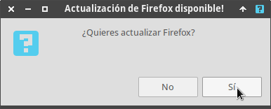

Me atrevería a decir que Debian es la distribución con los repositorios más completos. No obstante si usas Debian Testing o Debian estable no encontraréis la última versión de Firefox en los repositorios. La versión que encontraréis es la ESR. Para instalar y actualizar Firefox a la última versión existen muchas soluciones. Algunas de las que habría aplicado en el pasado sin dudarlo son las siguientes:<!--more-->

1. En el caso de estar usando Debian estable instalaría Firefox usando los [repositorios Backports]().
2. Si estuviera usando Debian testing instalaría la última versión de Firefox añadiendo los repositorios de Debian Sid.
3. Instalación mediante paquetes Snap o Flatpak.

No obstante a día de hoy prefiero no añadir repositorios adicionales a mi equipo y evitar la paquetería Snap y Flatpak. Por lo tanto en mi caso he optado por instalar y actualizar Firefox mediante un simple script.

**Nota:** Los script para instalar y actualizar Firefox deben funcionar en cualquier distribución Linux siempre y cuando el procesador del ordenador sea de 64 bits.

## INSTALAR FIREFOX DE FORMA AUTOMÁTICA MEDIANTE UN SCRIPT

Los pasos a seguir para instalar Firefox a través de un simple script son los que verán a continuación

### Preparación previa para instalar Firefox

Antes de iniciar la instalación es recomendable borrar todo rastro de cualquier instalación antigua de Firefox. Para ello ejecuten los siguientes comandos en la terminal:

> ```
> sudo apt remove --purge firefox-esr firefox
> 
> sudo apt autoremove
> ```

En el caso que también quieran borrar los archivos de configuración ejecuten el siguiente comando:

> ```
> sudo rm -r ~/.mozilla
> ```

### Generar el script para instalar Firefox

En estos momentos ya podemos generar el script para instalar Firefox. Para ello ejecutaremos el siguiente comando en la terminal:

> ```
> nano install_firefox.sh
> ```

Cuando se abra el editor de textos nano pegaremos el siguiente código:

> ```
> #!/bin/bash
> 
> wget "https://download.mozilla.org/?product=firefox-latest&os=linux64&lang=es-ES" -O latest-firefox.tar.bz2
> rm -r /opt/firefox
> tar -jxvf latest-firefox.tar.bz2 -C /opt
> echo 'Firefox instalado'
> ln -s /opt/firefox/firefox /usr/bin/firefox
> touch test.desktop
> echo -e "[Desktop Entry]\nName=Firefox\nComment=Navegador web\nGenericName=Web Browser\nX-GNOME-FullName=Firefox ''Su versión'' Web Browser\nExec=/opt/firefox/firefox %u\nTerminal=false\nX-MultipleArgs=false\nType=Application\nIcon=/opt/firefox/browser/chrome/icons/default/default128.png\nCategories=Network;WebBrowser;\nMimeType=text/html;text/xml;application/xhtml+xml;application/xml;application/vnd.mozilla.xul+xml;application/rss+xml;application/rdf+xml;image/gif;image/jpeg;image/png;x-scheme-handler/http;x-scheme-handler/https;\nStartupWMClass=Firefox\nStartupNotify=true\nPath=" > test.desktop
> mv test.desktop /usr/share/applications/firefox.desktop
> rm latest-firefox.tar.bz2
> ```

Una vez pegado el código guardamos los cambios y cerramos el editor de texto. A continuación daremos permisos de ejecución al script mediante el siguiente comando:

> ```
> chmod +x install_firefox.sh
> ```

### Instalar Firefox mediante el script que acabamo de generar

Con todo el trabajo ya realizado tan solo tendremos que ejecutar el siguiente comando para instalar Firefox:

> ```
> sudo bash install_firefox.sh
> ```

Una vez finalizada la ejecución del comando Firefox estará instalado en su equipo. Ademas estará perfectamente integrado con el escritorio.

## ACTUALIZAR FIREFOX DE FORMA AUTOMÁTICA MEDIANTE UN SCRIPT

Para actualizar Firefox de una forma sencilla y silenciosa lo haremos mediante otro script. Antes de crear y ejecutar el script instalaremos el paquete zenity. Para ello ejecutaremos el siguiente comando en al terminal:

> ```
> sudo apt install zenity
> ```

Acto seguido crearemos un script que diariamente comprobará si existe una actualización de Firefox. En el caso haya una actualización disponible aparecerá una ventana en la que tendremos que seleccionar si queremos actualizar o no. En caso de no actualizar, el siguiente día que usemos el ordenador nos volverá a aparecer la ventana para informarnos que hay una actualización pendiente.

### Crear el script para actualizar Firefox

Para crear el script ejecutaremos el siguiente comando en la terminal:

> ```
> sudo nano /etc/cron.daily/firefox_update
> ```

Cuando se abra el editor de textos nano pegaremos el siguiente código:

> ```
> #!/bin/bash
> 
> guitool=zenity
> 
> instalada=$(su $(whoami) -c 'firefox -v')
> version=$(curl -fI 'https://download.mozilla.org/?product=firefox-latest&os=linux64&lang=es-ES' | grep -o 'firefox-[0-9.]\+[0-9]')
> 
> if [[ ${instalada:16} = ${version:8} ]];
> then
> 
>  echo 'no es necesario actualizar'
> 
> else
> 
>  $guitool --question --width=250 --title 'Actualización de Firefox disponible!' --text '¿Quieres actualizar Firefox?' --ok-label="Sí" --cancel-label="No" ;
> 
>  case $? in
>  0)
>  wget "https://download.mozilla.org/?product=firefox-latest&os=linux64&lang=es-ES" -O latest-firefox.tar.bz2 "$1"
>  rm -r /opt/firefox "$1"
>  tar -jxvf latest-firefox.tar.bz2 -C /opt "$1"
>  rm latest-firefox.tar.bz2 "$1"
>  echo 'Firefox actualizado' "$1"
>  ;;
> 
>  1)
>  echo 'no es necesario actualizar' $1
>  ;;
>  esac
>  
> fi
> ```

Una vez pegado el código guardamos los cambios y cerramos el editor de texto. Finalmente daremos permisos de ejecución al script ejecutando el siguiente comando:

> ```
> sudo chmod +x /etc/cron.daily/firefox_update
> ```

### Hacer que Firefox se autoactualice de forma silenciosa

Para actualizar Firefox no es necesario ejecutar manualmente el script. El script lo podemos ejecutar de forma automática y silenciosa mediante [anacron](). Para ello ejecuten el siguiente comando en la terminal:

> ```
> sudo nano /etc/anacrontab
> ```

Cuando se abra el editor de texto nano añadan la siguiente línea al final del fichero:

> ```
> 1   5   update_firefox sudo /bin/bash /etc/cron.daily/firefox_update
> ```

Una vez introducida la línea guardan los cambios y cierran el fichero.

A partir de estos momentos a diario se comprobará si existen actualizaciones para Firefox. Si el ordenador está apagado no os tenéis que preocupar. Si el ordenador ha estado más de un día apagado, en el momento que lo inicien se comprobará si existen actualizaciones.

### ¿Qué pasará cuando haya una actualización?

En el momento que se detecte una actualización aparecerá la siguiente ventana. Una vez aparezca tan solo tienen que decidir si quieren o no instalar la nueva actualización. En mi caso como quiero actualizar presiono sobre el botón Sí.

[](images/notificacion-para-actualizacion-firefox.png)

En el caso que respondan No tendrán que esperar 24 horas para volver a recibir la notificación. Si presionan que No y no quieren esperar 24 horas pueden forzar la actualización ejecutando el siguiente comando:

> ```
> sudo bash /etc/cron.daily/firefox_update
> ```

## DESINSTALAR FIREFOX

Si algún día pretenden desinstalar Firefox tan solo tendrán que ejecutar el siguiente comando en la terminal:

> ```
> sudo rm -r /opt/firefox && sudo rm /usr/share/applications/firefox.desktop
> ```

Si además quieren borrar todos los ficheros de configuración tendrán que ejecutar el siguiente comando:

> ```
> sudo rm -r ~/.mozilla
> ```
