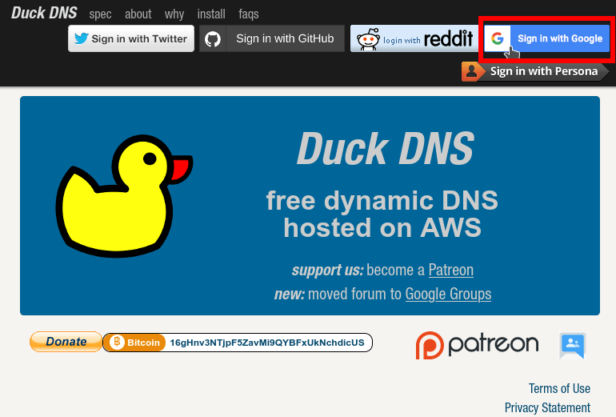
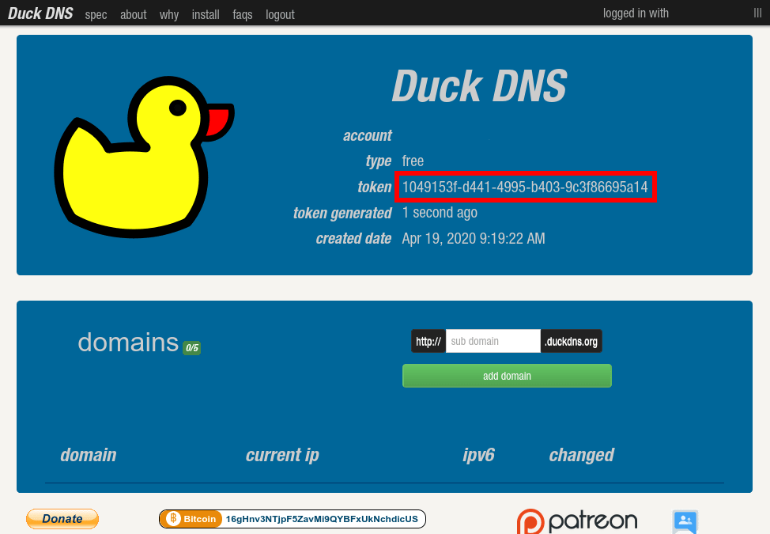
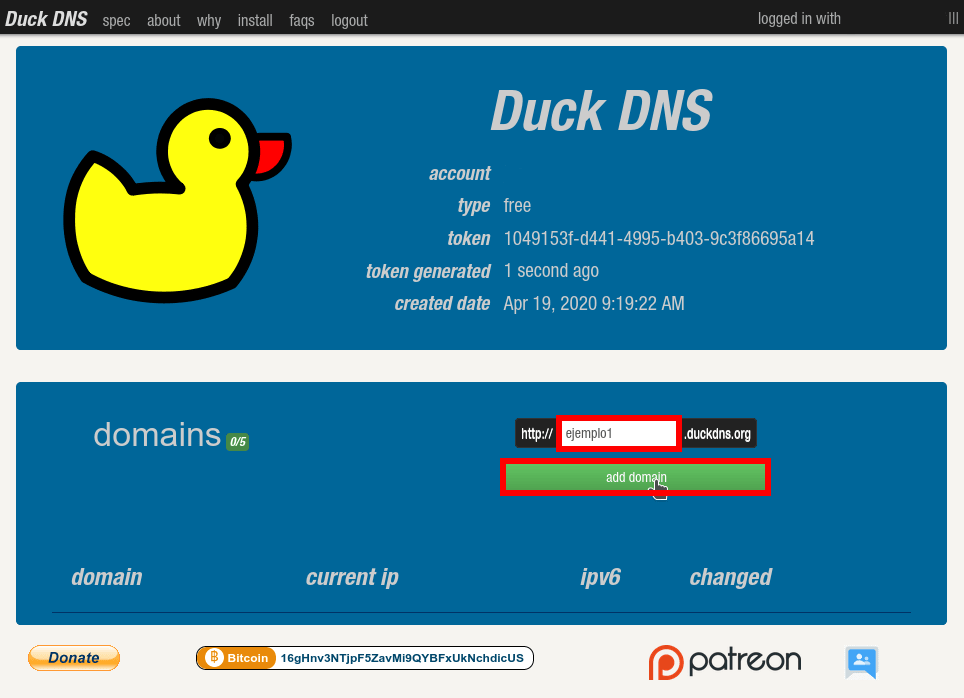
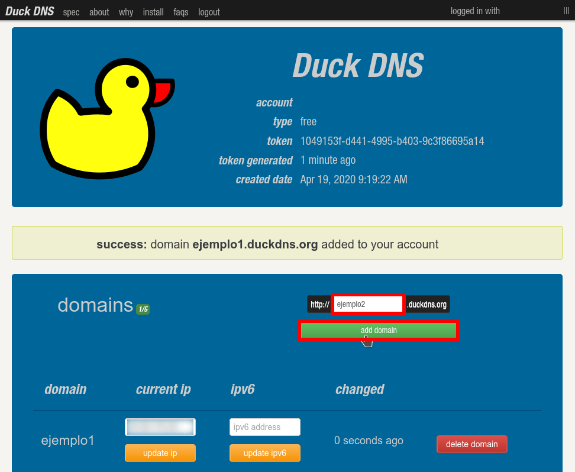
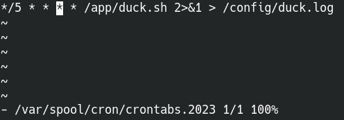

A continuación veremos como instalar y configurar el servicio DNS dinámico Duck DNS con Docker. Pero antes de todo veremos de forma breve que es un DNS dinámico y porque Duck DNS es una opción a tener muy en cuenta.<!--more-->

## FUNCIÓN QUE TIENE UN SERVICIO DNS DINÁMICO (DDNS)

La función de un servicio dinámico DNS es facilitar el acceso a un servidor que tiene una IP pública dinámica. Para entenderlo mejor imaginemos la siguiente situación:

1. Tenemos un servidor casero con la IP pública 88.41.25.30.
2. Por lo tanto para acceder a los servicios del servidor tendremos que usar la IP 88.41.25.30.
3. Como nuestro proveedor de Internet no nos ofrece una IP fija es posible que dentro de un día o dentro de una semanas la IP pública 88.41.25.30 pase a ser la 83.59.20.96 sin que sepamos absolutamente nada.
4. Como la IP se ha modificado cuando ingresemos la IP 88.41.25.30 no podremos acceder a nuestro servidor.

Para solucionar este problema podemos usar un servicio DNS dinámico que realizará la siguiente función:

1. El servicio DDNS asociará la IP pública de nuestro servidor a un dominio.
2. Por lo tanto si continuamos con el ejemplo anterior el dominio geekland.duckdns.org tendrá asociada la IP 88.41.25.30. Para acceder a nuestro servidor deberemos usar el dominio geekland.duckdns.org.
3. Cada 5 minutos nuestro servidor casero enviará nuestra IP pública al servicio DDNS y la asociará a nuestro dominio.
4. En el caso que la IP pase de 88.41.25.30 a 83.59.20.96 no pasará absolutamente nada porque en menos de 5 minutos el dominio geekland.duckdns.org quedará asociado a la nueva IP. De está forma nuestro servidor casero siempre estará accesible mediante un dominio.

Si quieren información más detallada sobre el funcionamiento de un servicio DNS dinámico les invito a leer el siguiente enlace:

https://geekland.eu/encontrar-servidor-con-dns-dinamico/

## MOTIVOS PARA USAR DUCKDNS

Los motivos para usar DuckDNS son varios y son los que cito a continuación:

1. Permiten generar hasta 5 dominios de forma gratuita. Una vez creados no hay que renovarlos periódicamente tal y como pasa con servicios como NO-IP.
2. Únicamente registran los datos necesarios para que funcione su servicio. Los datos registrados no se venderán a terceros ni serán usados para realizar spam vía email.
3. Ofrecen multitud de métodos para que nuestros routers y equipos puedan enviar nuestra IP pública a DuckDNS. Uno de estos métodos es mediante un contenedor de Docker.
4. Resulta extremadamente cómodo y sencillo poder gestionar un servicio DDNS a través de un contenedor de Docker. Ejecutas el contenedor y te puedes olvidar por completo del resto.

## INSTALAR Y CONFIGURAR EL SERVICIO DNS DINÁMICO (DDNS) DE DUCKDNS

Para instalar y configurar DuckDNS mediante un contenedor de Docker procederemos del siguiente modo.

### Crear una cuenta de DUCK DNS

Accederemos a la siguiente URL:

[https://www.duckdns.org/](https://www.duckdns.org/)

Una vez dentro de la URL crearemos una cuenta a partir de nuestra cuenta de Google, reddit, Github o Twitter. En mi caso la genero la cuenta usando mi cuenta de gmail.

[](images/crear-cuenta-dns-dinamico-duckdns.png)

### Apuntar el número de token que nos ofrece Duck DNS

Una vez generada la cuenta y una vez estamos logueados en Duck DNS veremos al siguiente pantalla.

[](images/anotar-token-duck-dns.png)

Acto seguido anotaremos el número de token. Lo podemos apuntar en un papel o copiar en un archivo de texto. En mi caso, tal y como se puede ver en la captura de pantalla, el token es:

> ```
> 1049153f-d441-4995-b403-9c3f86695a14
> ```

**Nota:** Este token es privado y no lo debéis mostrar absolutamente a nadie.

### Generar el dominio o dominios que usaremos para acceder a nuestro servidor

El siguiente paso consistirá en crear el dominio o dominios que usaremos para acceder a los servicios de nuestro servidor. En mi caso crearé los siguientes dominios:

> ```
> ejemplo1.duckdns.org
> ejemplo2.duckdns.org
> ```

Para crear el dominio ejemplo1.duckdns.org tan solo tenemos que escribir ejemplo1 en el apartado domains y acto seguido presionar el botón **add domain**. De inmediato se generará el dominio de forma automática.

[](images/crear-primer-dominio-duck-dns.png)

Del mismo modo que hemos creado el anterior dominio creamos el segundo dominio ejemplo2.duckdns.org

[](images/creando-segundo-dominio-duck-dns.png)

En estos momentos el proceso de configuración de Duck DNS en la web ha finalizado. Ahora tan solo tenemos que levantar el contenedor de Duck DNS en nuestro servidor con la ayuda de Docker.

### Instalar Docker

Probablemente ya tengáis Docker instalado en su equipo, pero en caso contrario lo podéis instalar siguiendo los siguientes pasos:

https://geekland.eu/instalar-docker-y-docker-compose-en-linux/

### Instalar el servicio DNS Dinámico DUCK DNS con Docker

Una vez instalado Docker tienen que ejecutar el siguiente comando en la terminal:

> ```
> docker create \
>   --name=duckdns \
>   -e PUID=1000 \
>   -e PGID=1000 \
>   -e TZ=Europe/Madrid \
>   -e SUBDOMAINS=ejemplo1,ejemplo2 \
>   -e TOKEN=1049153f-d441-4995-b403-9c3f86695a14 \
>   --restart unless-stopped \
>   linuxserver/duckdns
> ```

**Nota:** El contenedor creado funcionará en arquitectura amd64, arm64v8 y arm32v7. **Nota:** En vuestro caso tendréis que reemplazar las partes verdes del comando por los siguientes parámetros.

- **PUID:** Por lo general será 1000. Podéis comprobarlo ejecutando el comando id seguido del nombre del usuario que usáis en vuestro servidor. En mi caso el usuario es joan, por lo tanto usaré el comando id joan.
- **PGID:** Por lo general será 1000. Podéis comprobarlo ejecutando el comando id seguido del nombre del usuario que usáis en vuestro servidor. En mi caso el usuario es joan, por lo tanto usaré el comando id joan.
- **TZ:** Indicaremos la zona horaria de nuestro país. En mi caso como estoy ubicado en España, por lo tanto uso Europe/Madrid.
- **SUBDOMAINS:** Separado por comas introducimos el subdominio o subdominios que creamos en apartados anteriores y queremos asociar con la IP de nuestro servidor.
- **TOKEN:** Tenemos que pegar o escribir el token de DuckDNS. El token de DuckDNS lo apuntamos en apartados anteriores.

Una vez creado el contenedor lo levantaremos ejecutando el siguiente comando:

> ```
> docker start duckdns
> ```

A partir de estos momentos el procedimiento ha finalizado.

### Accediendo a nuestros servicios a través del DDNS Duck DNS

A partir de estos momentos podemos acceder a los servicios de nuestro servidor mediante los dominios de DuckDNS.

Por lo tanto si en nuestro servidor tenemos una web escuchando en el puerto 80 tan solo tendremos que abrir un navegador y visitar la siguiente dirección:

> ```
> http://ejemplo1.duckdns.org
> ```

A partir de estos momentos ya no será necesario usar la IP para acceder a nuestra página web.

### Comprobar el funcionamiento de DuckDNS

Para comprobar que DuckDNS trabaja de forma adecuada consulten sus logs ejecutando el siguiente comando en la terminal:

> ```
> docker logs -f duckdns
> ```

### Cambiar la periodicidad con que nuestro servidor envía la IP a Duck DNS

El contenedor de Docker informará a DuckDNS cada 5 minutos de la IP pública del servidor. So queréis podéis modificar la frecuencia del siguiente modo.

Inicialmente accederemos al contenedor ejecutando el siguiente comando en la terminal:

> ```
> docker exec -it duckdns /bin/bash
> ```

A continuación editaremos el trabajo cron encargado de refrescar la IP a Duck DNS. Para ello ejecutaremos el siguiente comando en la terminal:

> ```
> crontab -e -u abc
> ```

Acto seguido se abrirá el editor de textos vim con la programación de trabajos del usuario abc. A partir de esto momentos tan solo tendrán que definir la periodicidad con la que quieren que se ejecuten el script que proporciona la IP del servidor a Duck DNS.

[](images/periodicidad-trabajo-cron-duck-dns.png)

Una vez definida la periodicidad guardan los cambios, cierran el editor de textos y salen del contenedor.
