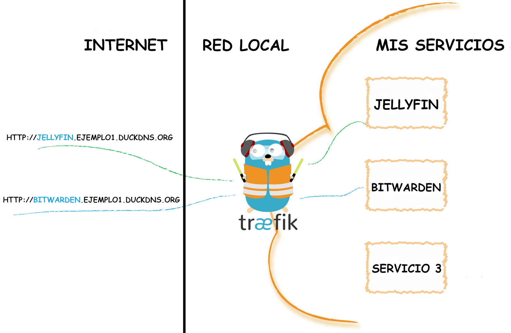
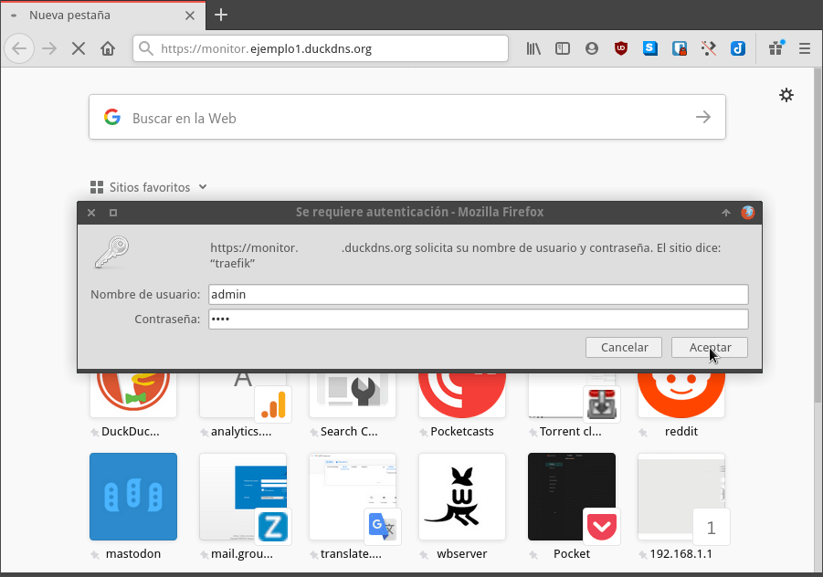
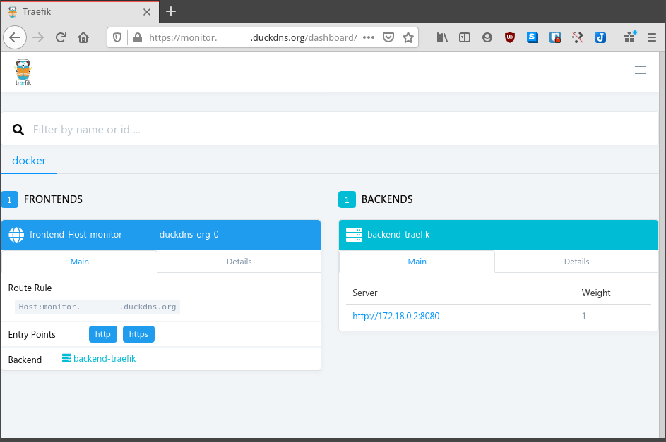
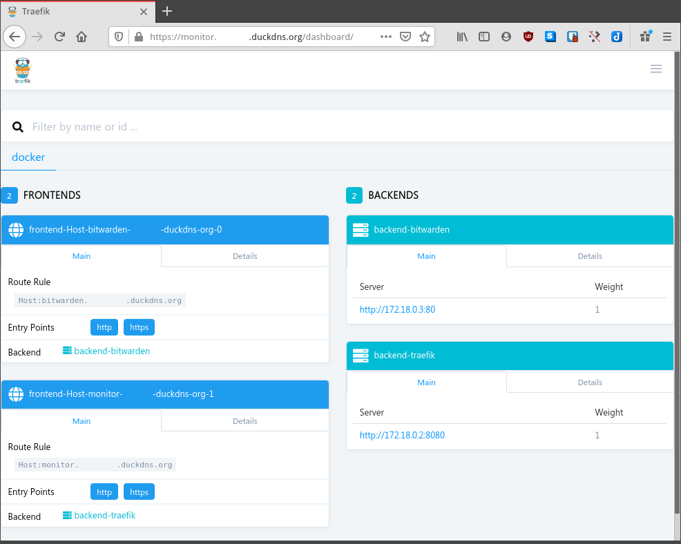
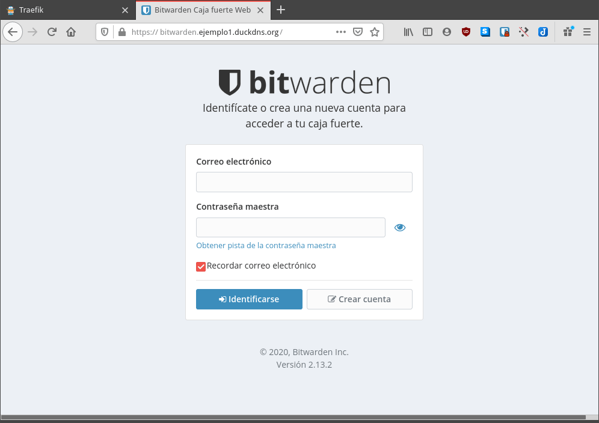

A continuación veremos como configurar el proxy inverso traefik en Docker para acceder a los servicios que están corriendo en nuestro servidor de forma sencilla y práctica. En mi caso lo haré usando la versión 1.7 de traefik. El motivo es que la versión 2 es más complicada de configurar y se introducen nuevos conceptos que hay que comprender.<!--more-->

Antes de iniciar la instalación y configuración de traefik haremos una breve explicación para que todo el mundo pueda entender la utilidad que tiene el proxy inverso traefik.

## FUNCIONES DEL PROXY INVERSO TRAEFIK

Traefik es un proxy inverso que principalmente tiene 2 funcionalidades.

- La primera de ellas es actuar como **balanceador de carga**. Imaginemos que tenemos 2 instancias de un mismo contenedor funcionando. En el momento que traefik reciba una petición externa la redirigirá al contenedor 1 o al contener 2 en función de los diferentes algoritmos disponibles.
- La segunda función, que además veremos en este artículo, es **actuar como proxy inverso**. Traefik recibirá todas las peticiones que provienen del exterior de nuestra red local. Una vez reciba una petición traefik la redirigirá al contenedor o servicio pertinente.

## QUE OBTENDREMOS UNA VEZ TRAEFIK ESTÉ CORRECTAMENTE CONFIGURADO

En nuestro caso dispondremos de un dominio que está apuntando constantemente a nuestro servidor. A modo de ejemplo usaremos el siguiente dominio:

> ```
> ejemplo1.duckdns.org
> ```

Añadiendo un subdominio o un sufijo al dominio principal podremos acceder a los servicios que están corriendo en un servidor que esté en nuestra red local. Por ejemplo para acceder a un contenedor que está corriendo jellyfin desde fuera de nuestra red local lo podremos hacer usando cualquiera de las siguientes URL:

> ```
> https://jellyfin.ejemplo1.duckdns.org
> https://ejemplo1.duckdns.org/jellyfin
> ```

Si en vez de acceder a jellyfin quisiéramos acceder al administrador de contraseñas bitwarden lo podremos hacer mediante las siguientes URL:

> ```
> https://bitwarden.ejemplo1.duckdns.org
> https://ejemplo1.duckdns.org/bitwarden
> ```

Lo que acabo de citar se puede ver reflejado en el siguiente esquema:

[](images/funcionamiento-proxy-inverso-traefik.png)

Traefik estará permanente escuchando todas las peticiones que vienen de fuera de nuestra red local. Una vez recibidas las peticiones las redirigirá a cualquier servicio que esté corriente dentro de nuestra red local.

**Nota:** Traefik permite acceder a cualquier servicio de cualquier equipo que esté corriendo en nuestra red local. Incluso permite acceder a servicios que corren fuera de un contenedor.

## VENTAJAS PROPORCIONADAS POR EL PROXY INVERSO TRAEFIK

Si os fijáis con la explicación anterior verán traefik proporciona las siguientes ventajas:

1. Con **tan solo un dominio podemos acceder a la totalidad de servicios** que corren en un servidor o en una red local.
2. Podemos **acceder a todos nuestros servicios sin tener que exponer un número elevado de puertos** al exterior. Tan solo exponiendo los puertos 80 y 443 podremos acceder a la totalidad de servicios instalados en un servidor web.
3. Permite **acceder de forma segura a todos nuestros servicios**. Traefik nos instala un certificado Wildcard de Let’s Encrypt que nos permite acceder vía https a todos nuestros servicios y webs.
4. **Traefik enruta todas las peticiones entrantes al servidor de forma completamente automática**. No tendremos que entrar en archivos de configuración y realizar el enrutamiento del tráfico.
5. **Permite centralizar un log** de acceso a nuestros servicios. Estos datos se podrán exportar para ser visualizados en otros software como por ejemplo Prometheus o Grafana.

## DISPONER DE UN DOMINIO PARA CONECTARNOS A NUESTROS SERVICIOS

Obviamente es necesario disponer de un dominio para poder llegar al servidor en el que instalaremos Traefik. Si no tenéis ningún dominio podéis usar un dominio de un servicio DDNS como DuckDNS. En mi caso me crearé el dominio ejemplo1.duckdns.org siguiendo las siguientes instrucciones:

https://geeklandlinux.github.io/posts/instalar-y-configurar-duck-dns-con-docker/

## INSTALAR Y CONFIGURAR EL PROXY INVERSO TRAEFIK EN DOCKER

Una vez dispongan del dominio ya pueden iniciar la instalación y configuración de Traefik. En mi caso acostumbro a seguir el siguiente procedimiento.

### Crear la contraseña que usaremos para loguearnos a traefik

Es recomendable crear una contraseña para poder acceder al panel de control web de traefik. Para ello usaremos la herramienta htpasswd para crear un hash de la contraseña que elijamos. Para usar htpasswd instalaremos el paquete apache2-utils ejecutando el siguiente comando en la terminal:

> ```
> sudo apt-get install apache2-utils
> ```

Acto seguido crearemos un password para un usuario que llamaremos admin. Para ello ejecutaremos el siguiente comando en la terminal:

> ```
> htpasswd -nb admin 1234
> ```

El resultado de aplicar el comando será parecido al siguiente:

> ```
> admin:$apr1$GmJtrqsV$mbjdMZBcv.4jsJzREANNS.
> ```

Guarden cuidadosamente este resultado porque es el hash de la contraseña 1234 para el usuario admin. Este hash lo usaremos para definir la contraseña de autenticación en el fichero de configuración de traefik.

### Crear el fichero de configuración de Traefik

Ahora crearemos el archivo de configuración de traefik. Para ello ejecutaremos el siguiente comando en la terminal:

> ```
> nano traefik.toml
> ```

Cuando se abra el editor de textos pegaremos el siguiente código para definir los puntos de entrada:

> ```
> defaultEntryPoints = ["http", "https"]
> ```

A continuación para tener acceso al panel de control web de traefik pegamos el siguiente código:

> ```
> [entryPoints]
>  [entryPoints.dashboard]
>   address = ":8080"
>   [entryPoints.dashboard.auth]
>    [entryPoints.dashboard.auth.basic]
>     users = ["admin:$apr1$GmJtrqsV$mbjdMZBcv.4jsJzREANNS."]
> 
> [api]
> entrypoint="dashboard"
> ```

**Nota:** en vuestro caso deberéis reemplazar admin:$apr1$GmJtrqsV$mbjdMZBcv.4jsJzREANNS. por el hash que han obtenido en el apartado anterior.

**Nota:** Según la configuración que acabamos de definir el acceso al panel web será por el puerto 8080.

Seguidamente tenemos que definir los puntos de entrada para http y https. Para ello pegaremos el siguiente código:

> ```
>  [entryPoints.http]
>   address = ":80"
>    [entryPoints.http.redirect]
>     entryPoint = "https"
>  [entryPoints.https]
>   address = ":443"
>    [entryPoints.https.tls]
> ```

En mi caso quiero acceder a todos mis servicios de forma segura usando el protocolo https. Por lo tanto añadiré el siguiente código para obtener un certificado wildcard de Let’s Encrypt.

> ```
> [acme]
> email = "su_email"
> storage = "acme.json"
> entryPoint = "https"
> onHostRule = true
>  [acme.httpChallenge]
>  entryPoint = "http"
> ```

**Nota:** Deberán reemplazar su\_email por una dirección de email válida. El fichero acme.json es el nombre y ruta de fichero que almacenará la información concerniente a los certificados generados para cada uno de nuestros servicios. Gracias a este código cualquier servicio accedido a través del proxy inverso será mediante el protocolo https.

Finalmente añadiremos las siguientes líneas para que a través del proxy inverso traefik podamos acceder a todos los contenedores y servicios de nuestra red local.

> ```
> [docker]
> domain = "ejemplo1.duckdns.org"
> watch = true
> network = "web"
> ```

**Nota:** Deberéis remplazar ejemplo1.duckdns.org por su dominio.

**Nota:** Hemos definido una red llamada web. Cualquier contenedor que se levante dentro de la red web será accesible des del exterior sin necesidad de realizar ninguna configuración.

Por lo tanto el contenido final del fichero de configuración traefik.toml será el siguiente:

> ```
> defaultEntryPoints = ["http", "https"]
> 
> [entryPoints]
>  [entryPoints.dashboard]
>   address = ":8080"
>   [entryPoints.dashboard.auth]
>    [entryPoints.dashboard.auth.basic]
>     users = ["admin:$apr1$GmJtrqsV$mbjdMZBcv.4jsJzREANNS."]
> 
> [api]
> entrypoint="dashboard"
> 
>  [entryPoints.http]
>   address = ":80"
>    [entryPoints.http.redirect]
>     entryPoint = "https"
>  [entryPoints.https]
>   address = ":443"
>    [entryPoints.https.tls]
> 
> [acme]
> email = "su_email"
> storage = "acme.json"
> entryPoint = "https"
> onHostRule = true
>  [acme.httpChallenge]
>  entryPoint = "http"
> 
> [docker]
> domain = "ejemplo1.duckdns.org"
> watch = true
> network = "web"
> ```

Una vez generado el fichero guardan los cambios y lo cierran.

### Crear una red para traefik

En la parte final del fichero de configuración definimos que el contenedor traefik estaría corriendo en la red web. La red web no está creada, por lo tanto ejecutaremos el siguiente comando en la terminal para crearla:

> ```
> docker network create web
> ```

### Archivo que registrará los certificados emitidos por Let’s Encrypt

En el fichero de configuración traefik.toml también definimos que la información de los certificados de Let’s Encrypt se almacenaría en el fichero acme.json. Para crear el fichero ejecutaremos el siguiente comando en la terminal:

> ```
> touch acme.json
> ```

Acto seguido le daremos los permisos pertinentes ejecutando el siguiente comando en la terminal:

> ```
> chmod 600 acme.json
> ```

### Abrir los puertos correspondientes para que todo pueda funcionar

Tanto el router como el servidor en el que instalaréis traefik tienen que tener los puertos 80 y 443 abiertos. Por lo tanto abran los puertos correspondientes en el router y en el Firewall del equipo en el que vais a levantar Traefik.

Si además pretenden acceder a servicios que corren fuera del equipo en el que instalarán Traefik también deben configurar el firewall de dichos equipos.

### Levantar el contenedor del proxy inverso traefik

A estás alturas ya estamos listos para levantar el contenedor del proxy inverso traefik. Para ello tan solo tenemos que ejecutar el siguiente comando en la terminal:

> ```
> docker run -d \
>  -v /var/run/docker.sock:/var/run/docker.sock \
>  -v $PWD/traefik.toml:/traefik.toml \
>  -v $PWD/acme.json:/acme.json \
>  -p 80:80 \
>  -p 443:443 \
>  -l traefik.frontend.rule=Host:monitor.ejemplo1.duckdns.org \
>  -l traefik.port=8080 \
>  --network web \
>  --name traefik \
>  traefik:1.7.24-alpine
> ```

**Nota:** Los valores de color rojo deben ser reemplazados por la ruta donde hemos almacenado los ficheros traefik.toml y acme.json.

**Nota:** Deberéis reemplazar ejemplo1.duckdns.org por vuestro dominio

### Acceder al panel de control web de Traefik

Según la configuración establecida en apartados anteriores accederemos al panel de control web de traefik mediante la siguiente URL:

> ```
> https://monitor.ejemplo1.duckdns.org:8080
> ```

Justo después de ingresar en la URL deberemos ingresar el usuario y contraseña que definimos en apartados anteriores:

[](images/introducir-credenciales-panel-control-traefik.png)

Una vez ingresadas la credenciales tendremos acceso al panel de control. Fíjense que estamos accediendo de forma segura mediante el protocolo https.

[](images/panel-de-control-web-traefik.png)

## CREAR UN SERVICIO Y ACCEDER A ESTE SERVICIO A TRAVÉS DEL PROXY INVERSO TRAEFIK

Cualquier contenedor que levantemos dentro de la red web será accesible de forma automática a través de traefik. A pesar de esto es recomendable usar etiquetas para sobrescribir la configuración estándar que aplica traefik.

**Nota:** Existe una [gran cantidad de etiquetas](https://docs.traefik.io/v1.7/configuration/backends/docker/) para modificar el comportamiento predeterminado de traefik.

A modo de ejemplo levantaremos el contenedor del gestor de contraseñas bitwarden. Para ello ejecutaremos el siguiente comando en la terminal:

> ```
> nano docker-compose.yml
> ```

Cuando se abra el editor de textos introduciremos el código para levantar el contenedor de Docker que queramos:

> ```
> version: "3"
> 
> services:
>  bitwarden:
>   image: bitwardenrs/server:raspberry
>   container_name: bitwarden
>   restart: unless-stopped
> 
>   networks:
>    - web
> 
>   restart: always
>   volumes:
>    - media/hd/services/bitwarden:/data/
> 
>   labels:
>    - traefik.backend=bitwarden
>    - traefik.frontend.rule=Host:bitwarden.ejemplo1.duckdns.org
>    - traefik.docker.network=web
>    - traefik.port=80
>    - traefik.enable=true
> 
> networks:
>  web:
>   external: true
> ```

**Nota:** el código en color azul es el que define la integración entre el contenedor de bitwarden y Traefik.

El significado de cada uno de los parámetro en azul es el siguiente:


|   **Código**   |   **Explicación**   |
| --- | --- |
|   networks: - web   |   El contenedor bitwarden se levantará en la red web.   |
|   \- traefik.backend=bitwarden   |   Damos un nombre al backend que traefik generará.   |
|   \- traefik.frontend.rule=Host:bitwarden.ejemplo1.duckdns.org   |   Definimos el dominio que usaremos para acceder a bitwarden des del exterior de nuestra red local.   |
|   \- traefik.docker.network=web   |   Para definir que el contenedor que levantamos pertenece a la red web.   |
|   \- traefik.port=80   |   Para indicar el puerto en que correrá el contenedor de bitwarden que estamos levantando.   |
|   \- traefik.enable=true   |   Al fijar el valor como True el contenedor que levantamos estará accesible a través de traefik.   |
|   networks:  web:   external: true   |   La red web ya está creada. Por lo tanto con external: true docker no intentará crear la red. Simplemente buscará la red web que ya está creada.   |

Una vez introducido el código en el fichero docker-compose.yml guardamos los cambios y cerramos el fichero. Para levantar el contenedor de Bitwarden ejecutaremos el siguiente comando en la terminal:

> ```
> docker-compose up
> ```

Una vez levantado el contenedor veremos que ya aparece en el panel de control web de Traefik.

[](images/traefik-con-servicio-añadido.png)

A partir de estos momentos abrimos el navegador y según la configuración aplicada ingresamos la siguiente dirección URL:

> ```
> https://bitwarden.ejemplo1.duckdns.org
> ```

Si toda funciona como debe verán que podemos acceder al contenedor desde fuera de nuestra red local y mediante el protocolo https.

[](images/servicio-bitwarden-a-traves-proxy-inverso.png)

## AÑADIR SERVICIOS A TRAEFIK QUE CORREN EN CUALQUIER EQUIPO DE NUESTRA RED LOCAL

En este artículo hemos visto como añadir contenedores a traefik que corren dentro de la misma red que Traefik. Si además pretenden acceder a servicios que corren en cualquier equipo de su red local deberán seguir las siguientes instrucciones:

https://geeklandlinux.github.io/posts/anadir-servicios-a-traefik-que-estan-corriendo-en-maquinas-remotas/

**Fuentes**

[https://www.digitalocean.com/community/tutorials/how-to-use-traefik-as-a-reverse-proxy-for-docker-containers-on-ubuntu-18-04-es](https://www.digitalocean.com/community/tutorials/how-to-use-traefik-as-a-reverse-proxy-for-docker-containers-on-ubuntu-18-04-es)

[https://docs.traefik.io/v1.7/configuration/logs/](https://docs.traefik.io/v1.7/configuration/logs/)
