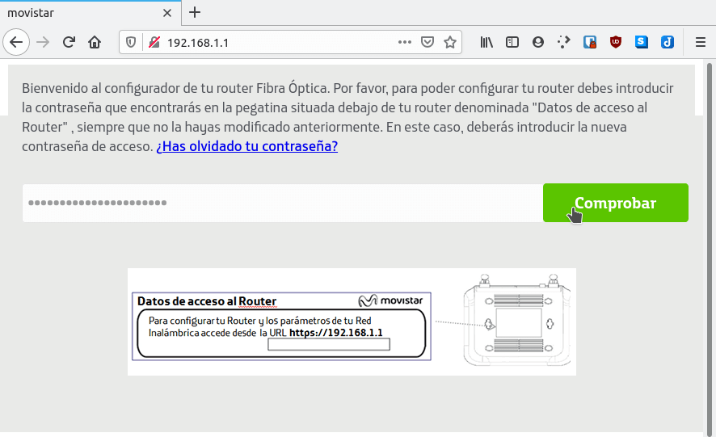
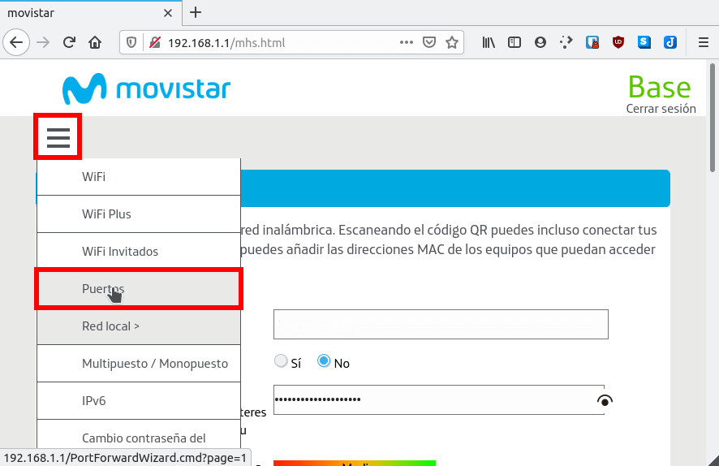
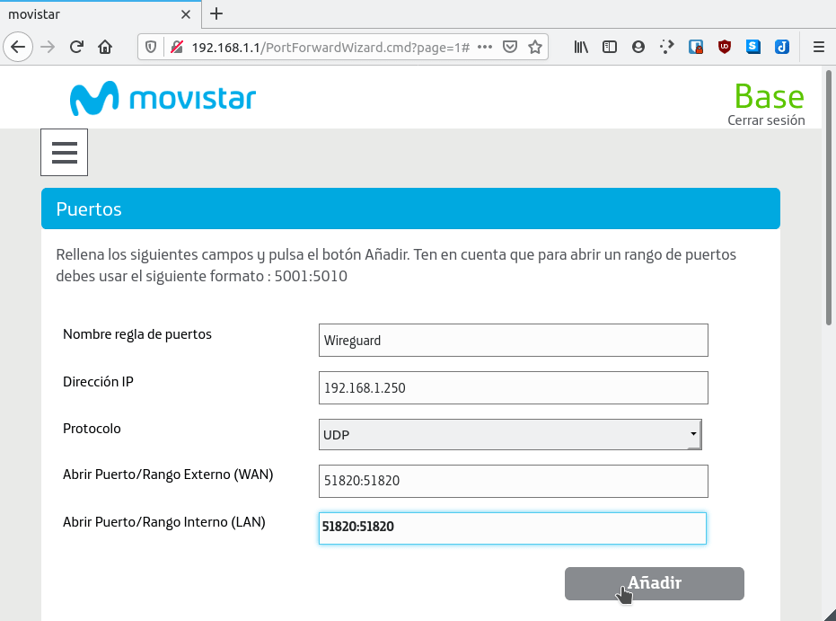
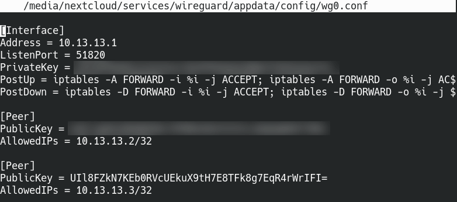
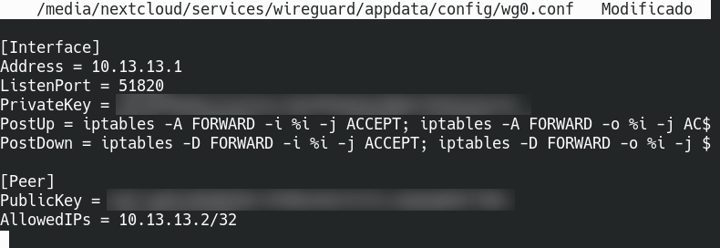

Existen varios métodos para instalar el VPN Wireguard de forma sencilla en nuestro servidor. Podemos usar scripts que realizan todo el trabajo de forma automática. No obstante en el siguiente artículo veremos otra forma muy sencilla y práctica que es mediante un contenedor de Docker. Los pasos a seguir para realizar la instalación y configuración son los que veréis a continuación.<!--more-->

**Nota:** La instalación del VPN Wireguard mediante docker se ha realizado en una Raspberry Pi con Raspbian. También debería funcionar sin problemas en equipos que usen el sistema operativo Debian o Ubuntu.

## INSTALAR DOCKER

Para completar este tutorial e instalar el servidor VPN Wireguard tienen que usar Docker. Para instalar Docker deberán seguir las instrucciones que les dejo en el siguiente enlace:

https://geeklandlinux.github.io/posts/instalar-docker-y-docker-compose-en-linux/

## DISPONER DE UNA IP PÚBLICA FIJA O UN DOMINIO DNS DINÁMICO

Obviamente es indispensable tener una IP fija o un servicio de DNS dinámico. En mi caso no dispongo de un servicio de IP fija, por lo tanto usaré Duck DNS para obtener un dominio que siempre esté apuntando a mi servidor VPN. Para ello seguiré las instrucciones del siguiente enlace:

https://geeklandlinux.github.io/posts/instalar-y-configurar-duck-dns-con-docker/

Una vez instalado y ejecutado el contenedor de Duck DNS dispondremos del dominio ejemplo1.duckdns.org que estará constantemente apuntando a la ip de nuestro servidor VPN.

## DISPONER DE UNA IP LOCAL FIJA

En el tercer paso consiste en tener una IP local fija en el equipo donde instalaremos el servidor VPN Wireguard. Existen muchos métodos para conseguir este propósito pero uno de los más más sencillos es hacerlo a través del router. En mi caso he configurado la IP local 192.168.1.250 siguiendo el siguiente procedimiento:

https://geeklandlinux.github.io/posts/ip-fija-servidor-dhcp-router/

## ABRIR EL PUERTO DEL VPN WIREGUARD EN EL ROUTER

A continuación tenemos que abrir un puerto en el Router para que el VPN Wireguard pueda acceder a nuestra red local. En mi caso abriré el puerto estándar de Wireguard que es el 51820 UDP.

El procedimiento variará en función del router que tengan. En mi Router se hace del siguiente modo.

Abrimos el navegador web. A continuación escribimos la dirección de la puerta de enlace del router y presionamos Enter. Finalmente introducimos la contraseña para acceder al router y presionamos el botón Comprobar.

[](images/acceder-configuración-router.png)

**Nota:** Las direcciones de enlace más habituales para acceder a la configuración del router son 192.168.1.1 o 192.168.1.0.

Una vez estemos dentro del menú de configuración del Router accedemos al apartado correspondiente para configurar los puertos:

[](images/acceder-a-la-configuracion-puertos.png)

En el apartado de configuración de puertos abriré el puerto 51820 UDP para la IP interna del equipo en que instalaré Wireguard. En apartado anteriores fijamos que la IP seria 192.168.1.250. La forma de abrir el puerto para la IP 192.168.1.250 se muestra en la siguiente captura de pantalla.

[](images/abrir-puerto-vpn-wireguard.png)

## INSTALAR EL SERVIDOR VPN WIREGUARD CON DOCKER

A partir de estos momentos ya estamos listos para levantar el contenedor de Wireguard en nuestro equipo. Para crear el contenedor de Wireguard en Docker tan solo tenemos que ejecutar el siguiente comando en la terminal:

> ```
> docker create \
>   --name=wireguard \
>   --cap-add=NET_ADMIN \
>   --cap-add=SYS_MODULE \
>   -e PUID=1000 \
>   -e PGID=1000 \
>   -e TZ= Europe/Madrid \
>   -e SERVERURL= ejemplo1.duckdns.org \
>   -e SERVERPORT=51820 \
>   -e PEERS=1 \
>   -e PEERDNS= 176.103.130.130,176.103.130.131 \
>   -e INTERNAL_SUBNET=10.13.13.0 \
>   -p 51820:51820/udp \
>   -v /media/nextcloud/services/wireguard/appdata/config:/config \
>   -v /lib/modules:/lib/modules \
>   --sysctl="net.ipv4.conf.all.src_valid_mark=1" \
>   --restart unless-stopped \
>   linuxserver/wireguard
> ```

**Nota:** El comando ejecutado sirve para arquitecturas x86-64, arm64 y armhf.

El comando ejecutado funcionará en sistemas operativos Ubuntu, Debian y Raspbian que usen el kernel que proporciona el sistema operativo. Para kernels no predeterminados u otros sistemas operativos deberán instalar las cabeceras del kernel ejecutando el siguiente comando en la terminal.

> ```
> sudo apt install linux-headers-$(uname -r)
> ```

**Nota:** Si no usan el gestor de paquetes apt deberán adaptar el comando anterior.

Una vez instaladas las cabeceras del kernel deberán ejecutar el comando para crear el contenedor añadiendo la siguiente línea.

> ```
>   -v /usr/src:/usr/src
> ```

### **Modificación de los parámetros para crear el contenedor del VPN Wireguard**

En vuestro tenéis y/o podéis reemplazar las partes verdes del comando usado para crear el contenedor del siguiente modo:


|   **Comando**   |   **Explicación**   |
| --- | --- |
|   \-e PUID=1000   |   Introducimos el identificador de usuario del usuario que arrancará el contenedor. Por norma general es 1000, pero compruébenlo ejecutado id seguido del nombre del usuario.   |
|   \-e PGID=1000   |   Introducimos el identificador de grupo del usuario que arrancará el contenedor. Por norma general es 1000, pero compruébenlo ejecutado id seguido del nombre del usuario.   |
|   \-e TZ= Europe/Madrid   |   Indicamos la zona horaria de nuestro país. En mi caso vivo en España, por lo tanto uso Europe/Madrid.   |
|   \-e SERVERURL= ejemplo1.duckdns.org   |   Introducimos el dominio del servidor DNS dinámico que estemos usando. También pueden introducir una IP pública siempre y cuando sea fija.   |
|   \-e SERVERPORT=51820   |   El puerto en que trabaja Wireguard será el 51820. Tiene que coincidir con el puerto que abrimos en el router.   |
|   \-e PEERS=1   |   Indicamos el número de clientes que tendrá nuestro servidor VPN Wireguard. En mi caso solo elijo uno. Más adelante podremos crear usuarios adicionales sin problema alguno.   |
|   \-e PEERDNS= 176.103.130.130,176.103.130.131   |   Escribimos los DNS que usará el cliente para resolver las peticiones DNS. En mi caso propongo usar los DNS de Adguard porque **respetan la privacidad y bloquean la publicidad.** También es posible resolver las peticiones vía Pihole, pero requiere configuración adicional.   |
|   \-e INTERNAL\_SUBNET=10.13.13.0   |   Definimos la red que usarán los clientes que se conecten al servidor VPN Wireguard. Pueden usar la misma que yo a no ser que ya la estén usando.   |
|   \-p 51820:51820/udp   |   Indicamos que cuando alguien realice un petición al puerto 51820 del servidor se redirija al puerto 51820 de Docker en el que está escuchando Wireguard.   |
|   \-v /media/nextcloud/services/wireguard/appdata/config:/config   |   Indicamos la ubicación de nuestro disco duro en que podremos ver y modificar la configuración de Wireguard. En la ubicación también encontraremos los archivos para que los clientes se puedan conectar al servidor VPN.   |

## CONFIGURAR EL FIREWALL DEL EQUIPO PARA QUE EL VPN WIREGUARD FUNCIONE

Partiendo de la base que queremos configurar un firewall con las peticiones entrantes bloqueadas tendremos que usar las siguientes reglas para que Wireguard funcione de forma correcta:

Para bloquear la totalidad de trafico entrante al servidor usamos la siguiente regla:

> ```
> iptables -P INPUT DROP
> ```

Para que todas las peticiones entrantes generadas por nuestro servidor puedan entrar usamos las siguientes reglas:

> ```
> iptables -A INPUT -i lo -j ACCEPT
> iptables -A INPUT -m state --state ESTABLISHED,RELATED -j ACCEPT
> ```

El mismo puerto que se abrió en el router también se tiene que abrir en el servidor. Para ello usaremos la siguiente regla:

> ```
> iptables -A INPUT -p udp --dport 51820 -j ACCEPT
> ```

Para que las peticiones entrantes dentro de nuestra red local puedan acceder al servidor donde hemos instalado Wireguard usaremos las siguientes reglas:

> ```
> iptables -A INPUT -i eth0 -p icmp -s 192.168.1.0/24 -d 192.168.1.250 -j ACCEPT
> iptables -A INPUT -i eth0 -p tcp -s 192.168.1.0/24 -d 192.168.1.250 -j ACCEPT
> iptables -A INPUT -i eth0 -p udp -s 192.168.1.0/24 -d 192.168.1.250 -j ACCEPT
> ```

Si además queremos que desde el servicio VPN podamos acceder a los servicios que están corriendo en el localhost del servidor en que hemos instalado Wireguard tendremos que introducir las siguientes reglas:

> ```
> iptables -A INPUT -i docker0 -p icmp -s 172.17.0.1/24 -d 192.168.1.250 -j ACCEPT
> iptables -A INPUT -i docker0 -p tcp -s 172.17.0.1/24 -d 192.168.1.250 -j ACCEPT
> iptables -A INPUT -i docker0 -p udp -s 172.17.0.1/24 -d 192.168.1.250 -j ACCEPT
> ```

**Nota:** Con estás simples reglas el VPN Wireguard funcionará de forma adecuada. Además podréis acceder a los servicios que tengáis disponibles en vuestra red local sin problemas.

### Detalle de los parámetros del firewall que tendréis que ajustar

Algunos de los valores de las reglas los deberéis adaptar en función de los parámetros de su red local. Para adaptarlos de forma adecuada lean lo que escribo a continuación.

- 51820 Se tiene que reemplazar por el puerto en que está escuchando Wireguard.
- eth0 se deberá reemplazar por la interfaz de red que estéis usando en vuestro servidor.
- 192.168.1.0/24 tiene que ser reemplazado por la interfaz de red del servidor en que instalamos el vpn Wireguard. Para averiguar su interfaz de red pueden usar el comando ifconfig.
- 172.17.0.1/24 se debe reemplazar el valor de la interfaz de red docker0. Para averiguar la interfaz de red docker0 pueden usar el comando ifconfig.
- 192.168.1.250 debe corresponder a la IP del servidor en que instalamos Wireguard.

## LEVANTAR EL CONTENEDOR DEL VPN WIREGUARD

Una vez finalizada toda la configuración tan solo falta iniciar el servidor. Para ello tan solo tenemos que ejecutar el siguiente comando.

> ```
> docker start wireguard
> ```

Una vez ejecutado el comando pueden ejecutar el siguiente comando para ver los logs y asegurarse que el contenedor de Wireguard se levanta sin errores y sin problemas:

> ```
> docker logs -f wireguard
> 
> ```

## CREAR NUEVOS CLIENTES EN WIREGUARD

Al iniciar el contenedor únicamente creamos un cliente. Según las opciones con que creamos el contenedor, los ficheros de configuración de este cliente se hallarán en /media/nextcloud/services/wireguard/appdata/config/peer1.

Si ahora queremos generar un nuevo cliente tan solo tenemos que ejecutar el siguiente comando en la terminal:

> ```
> docker exec -it wireguard /app/add-peer
> ```

Después de ejecutar el comando se creará un nuevo cliente o Peer llamado 2.

[](images/cliente-wireguard-creado.png)

La totalidad de claves y archivos de configuración del cliente 2 se hallarán en /media/nextcloud/services/wireguard/appdata/config/peer2.

## ELIMINAR CLIENTES EN WIREGUARD

La forma en que acostumbro a eliminar los clientes se subdivide en 2 pasos.

Para borrar el cliente 2 borraremos el directorio que almacena las claves y archivos de configuración del cliente 2. Por lo tanto en mi caso ejecutaré el siguiente comando en la terminal:

> ```
> rm -r /media/nextcloud/services/wireguard/appdata/config/peer2
> ```

Acto seguido accederemos al fichero de configuración de Wireguard ejecutando el siguiente comando en la terminal:

> ```
> nano /media/nextcloud/services/wireguard/appdata/config/wg0.conf
> ```

Dentro del fichero de configuración veremos que existen entradas para 2 clientes.

[](images/fichero-configuracion-wireguard.png)

Como queremos borrar el cliente 2 borraremos la segunda de las entradas.

[](images/cliente-wireguard-eliminado.png)

Finalmente reiniciamos el contenedor del VPN Wireguard ejecutando el siguiente comando en la terminal:

> ```
> docker stop wireguard && docker start wireguard
> ```

## CONECTARSE AL SERVIDOR VPN EN LOS DISTINTOS SISTEMAS OPERATIVOS

Para conectarse al servidor VPN que acaban de crear pueden acceder al siguiente enlace.

https://geeklandlinux.github.io/posts/conectarse-al-vpn-wireguard-en-windows-android-y-linux/

**Fuentes** [https://hub.docker.com/r/linuxserver/wireguard](https://hub.docker.com/r/linuxserver/wireguard)
