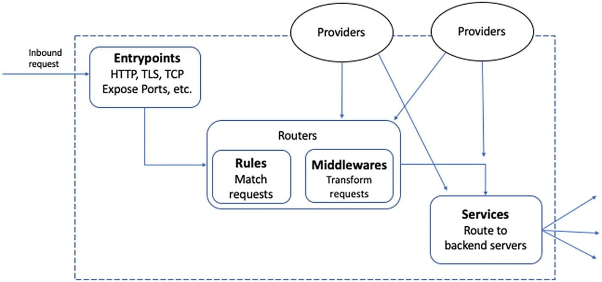
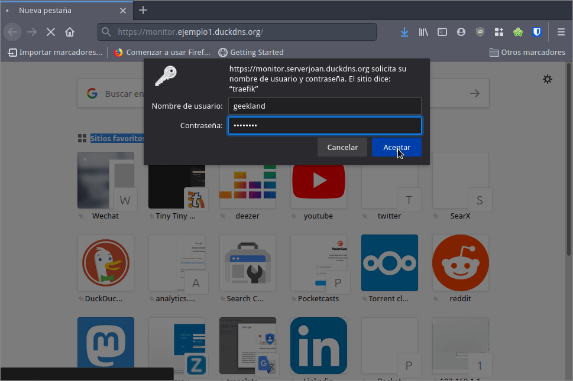
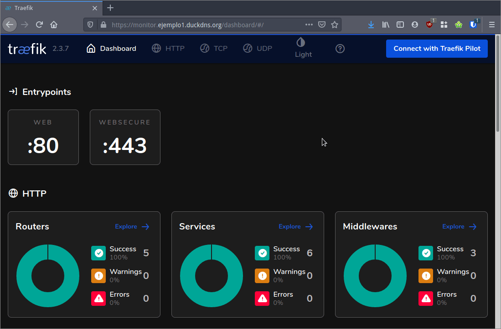

Meses atrás vimos como [instalar configurar y usar la versión 1.7 del proxy inverso Traefik](). A continuación veremos como configurar, instalar y entender la versión 2 de Traefik. Pero antes de empezar es importante conocer bien las diferencias existentes entre Traefik v1 y Traefik v2 y entender como funciona la versión 2 de Traefik.<!--more-->

## ¿CÓMO FUNCIONA LA VERSIÓN 2 DE TRAEFIK?

La principales diferencias entre la versión 2 y la versión 1 de Traefik son las siguientes:

En la versión 2 no existen los frontend y los backend. Los frontend y los backend han sido sustituidos por los routers, middlewares y services. Por lo tanto **en la versión 2 de Traefilk tendremos Entrypoints, Services, Routers, y proveedores de certificados**. El funcionamiento de cada uno de estos elementos se describe a continuación.

[](images/esquema-funcionamiento-traefik-v2.jpg)

### Puntos de entrada o Entrypoints

Los **Puntos de entrada** (Entrypoints) forman parte de la configuración estática y sirven para declarar los puertos en que estará escuchando Traefik. Para declarar los puntos de entrada tan solo tendremos que usar el siguiente código en el fichero de configuración traefik.toml.

> ```shell
> [entryPoints]
>   [entryPoints.web]
>     address = ":80"
>     [entryPoints.web.http.redirections.entryPoint]
>       to = "websecure"
>       scheme = "https"
> 
>   [entryPoints.websecure]
>     address = ":443"
> ```

### Que son los Servicios (services) en la versión 2 de Traefik

Los **servicios** (services) representan la aplicación web a la que queremos acceder a través de Traefik. Por ejemplo Owncloud, Nextcloud, Bitwarden, etc. Por lo tanto para cada Docker que levantemos Traefik creará un servicio de forma completamente automática. Para asegurar que el servicio que se levante sea accesible a través de Traefik tendremos que usar la etiqueta `traefik.enable=true`

> ```shell
> version: '3'
> services:
>   filebrowser
>     image: "hurlenko/filebrowser"
>     labels:
>       - "traefik.enable=true"
> ```

**Nota**: Si la etiqueta `traefik.enable=true` tuviera el valor false Filebrowser no seria accesible a través de Traefik.

Si la configuración automática por defecto no es la que queremos, la podremos modificar mediante las etiquetas o labels en Docker compose. De este modo podremos por ejemplo levantar más de una instancia del mismo contenedor y que por ejemplo se realice un balanceo de carga entre las diversas instancias.

### Que son los Routers en la versión 2 de Traefik

Los routers son los encargados de interconectar los puntos de entrada (Entrypoints) con los servicios (services). Gracias a los routers se redirigirá nuestra petición y podremos acceder a nuestro servicio. Las etiquetas (labels) necesarias para definir un router en el Docker compose son:

> ```base
> version: '3'
> services:
>   filebrowser
>     image: "hurlenko/filebrowser"
>     labels:
>       - "traefik.enable=true"
>       - "traefik.http.routers.filebrowser.rule=Host(`filebrowser.example.com`)"
>       - "traefik.http.routers.filebrowser.entrypoints=secure"
>       - "traefik.http.routers.filebrowser.tls.certresolver=le"
> ```

Con las tres líneas que acabamos de añadir:

- Definimos que el router definido con el nombre filebrowser solo actúe cuando las peticiones se hacen al dominio `filebrowser.example.com`.
- Establecemos que el entrypoint o punto de entrada es a través del puerto 443.
- Establecemos que el proveedor de certificados sea Let's Encrypt.

### Proveedores de certificados (Certificate resolvers)

Los proveedores de certificados nos ayudan a obtener los certificados SSL para nuestros servicios. Existen varios proveedores, pero lo más común es usar Let's Encrypt. Añadiendo el siguiente código en el fichero de configuración `traefik.toml` conseguiremos nuestro propósito.

> ```shell
> [certificatesResolvers.lets-encrypt.acme]
>   email = "email@email.com"
>   storage = "acme.json"
>   [certificatesResolvers.lets-encrypt.acme.tlsChallenge]
> ```

**Nota**: Deberán reemplazar el email existente en el ejemplo por su email.

### Middlewares en la versión 2 de Traefik

Los Middlewares están entre el punto de entrada (Entrypoint) y los servicios (Services). Los Middleware interceptaran la totalidad del tráfico entre el punto de entrada y el servicio. En función de los valores del tráfico interceptado los middleware realizarán acciones como por ejemplo las siguientes:

1. Limitar el número de peticiones que un usuario determinado puede realizar sobre un servicio.
2. Limitar el número de conexiones simultaneas a un determinado servicio.
3. Añadir autenticación para que un usuario pueda acceder a un servicio.
4. Definir las IP o rango de IP que podrán acceder a un servicio.
5. Hacer que la respuesta del servicio al cliente se envíe de forma comprimida mediante gzip.
6. Redirigir la totalidad de peticiones http a https.
7. Etc.

**Nota**: Un middleware se puede usar para más de un contenedor.

Existen multitud de middlwares preconfigurados en Traefik. En el siguiente enlace encontrarán la totalidad de [middleware disponibles](https://doc.traefik.io/traefik/v2.0/middlewares/overview/). También encontrarán las etiquetas a usar para configurar cada uno de los middleware en los Docker compose.

## CONSEGUIR UN DOMINIO PARA PODER ACCEDER A NUESTROS SERVICIOS

Es necesario disponer de un dominio para poder llegar al servidor en el que instalaremos Traefik y levantaremos los Docker. Si no tenéis ningún dominio podéis usar un dominio de un servicio DDNS como DuckDNS. En mi caso crearé el dominio `ejemplo1.duckdns.org` siguiendo las siguientes instrucciones:

https://geekland.eu/instalar-y-configurar-duck-dns-con-docker/

## CREAR UNA CONTRASEÑA PARA LOGUEARSE A TRAEFIK

El primer paso consiste en crear un hash para loguearnos al panel web de Traefik. Para generar el hash deberemos instalar el paquete apache2-utils ejecutando el siguiente comando en la terminal:

> ```shell
> ubuntu@netherlands:~$ sudo apt-get install apache2-utils
> ```

Una vez instalado el paquete crearemos el hash. Para ello deberemos definir un nombre de usuario y una contraseña para este usuario. En mi caso el usuario es `geekland` y la contraseña es `passwordgeekland`. Una vez definidos estos parámetros ejecutaremos el siguiente comando para generar el hash de la contraseña `passwordgeekland`:

> ```shell
> ubuntu@netherlands:~$ htpasswd -nb geekland passwordgeekland
> geekland:$adv1$QRkRTxki$2/wpm9wZoobDe.M/ldit5/
> ```

Si observamos la salida del comando vemos que el usuario `geekland` tiene el hash `$adv1$QRkRTxki$2/wpm9wZoobDe.M/ldit5/`. Anotad bien el usuario, la contraseña y el hash. Más adelante los necesitaremos.

## CREAR LA CONFIGURACIÓN DE TRAEFIK 2

La versión 2 de Traefik dispone de los siguientes archivos de configuración:

- **traefik.toml**: Contiene la configuración estática, o dicho de otra forma de las partes que no cambiarán en tiempo de ejecución. Por lo tanto en este fichero definiremos los puertos en que Traefik estará escuchando (Entrypoints), la parte de obtención de certificados a través de Let's Ecrypt, etc.
- **traefik\_dynamic.toml**: Contiene la configuración dinámica, o dicho de otra forma la configuración de los parámetros para que Traefik pueda detectar los cambios que se producen en nuestra infraestructura. Gracias a este fichero Traefik actualizará automáticamente su configuración cuando ocurran ciertos eventos. Por ejemplo actualizará de forma automática la configuración cuando arranquemos un nuevo contenedor para que se enrute el tráfico. En el caso que paremos un contenedor también se modificará la configuración para dejar de enrutarse el tráfico en el contenedor que paremos, etc. Para detectar los cambios que se producen en el servicio Traefik usará los `**providers**`. Los **providers** serán los encargados de monitorizar los cambios y una vez detectados aplicarán configuraciones preestablecidas para dar respuesta a los cambios. Traefik dispone de multitud de providers disponibles para su uso.
- **acme.json**: Almacena los certificados que Traefik genera para cada uno de nuestro servicios.

Por lo tanto lo primero que tenemos que realizar es crear los 3 ficheros de configuración que acabo de citar ejecutando los siguientes comandos en la terminal:

> ```shell
> touch traefik.toml
> touch traefik_dynamic.toml
> touch acme.json
> ```

También otorgaremos los permisos adecuados al fichero `acme.json` ejecutando el siguiente comando en la terminal:

> ```shell
> chmod 600 acme.json
> ```

A continuación iniciaremos la configuración del fichero traefik.toml.

### Configuración estática en el fichero traefik.toml

En la terminal ejecutamos el siguiente comando:

> ```shell
> ubuntu@netherlands:~$ nano traefik.toml
> ```

Cuando se abra el editor de textos tenemos que especificar los puertos en que estará escuchando Traefik (Entrypoints). En la gran mayoría de casos los puertos serán el 80 y el 443. Por lo tanto generaremos 2 Entrypoints con los nombres `web` y `websecure` que estarán escuchando en el puerto 80 y 443. Para ello pegaremos el siguiente código en el editor de textos:

> ```shell
> [entryPoints]
>   [entryPoints.web]
>     address = ":80"
>     [entryPoints.web.http.redirections.entryPoint]
>       to = "websecure"
>       scheme = "https"
> 
>   [entryPoints.websecure]
>     address = ":443"
> ```

A continuación habilitaremos el Dashboard y la API de traefik. Para realizar lo que acabo de citar deberemos añadir el siguiente código en el fichero `traefik.toml`.

> ```shell
> [api]
>   dashboard = true
> ```

Para que Let's Encrypt genere los certificados https usaremos el siguiente código. En vuestro caso deberéis reemplazar el correo del ejemplo por vuestro correo. El código pegado hará que Traefik se comunique con Let's Encrypt mediante el protocolo acme. Una vez generados los certificados los almacenará en el fichero `acme.json` que creamos en el inicio de este apartado:

> ```shell
> [certificatesResolvers.lets-encrypt.acme]
>   email = "email@email.com"
>   storage = "acme.json"
>   [certificatesResolvers.lets-encrypt.acme.tlsChallenge]
> ```

Finalmente configuraremos Traefik para que pueda funcionar con Docker. Para ello añadiremos el siguiente código:

> ```shell
> [providers.docker]
>   watch = true
>   network = "web"
> ```

Con el código que acabamos de añadir Traefik actuará como proxy en la totalidad de Docker que estén levantados en la red `web`. Por lo tanto cualquier contenedor que se levante dentro de la red `web` será accesible des del exterior a través del puerto 443 sin necesidad de realizar ninguna configuración.

Finalmente añadiremos una última línea de código para decirle a Traefik que tenga en cuenta la totalidad de reglas que definiremos en el fichero `traefik_dynamic.toml`

> ```shell
> [providers.file]
>   filename = "traefik_dynamic.toml"
> ```

Una vez introducidos todos los cambios tendremos el siguiente código dentro del fichero `traefik.toml`

> ```shell
> [entryPoints]
>   [entryPoints.web]
>     address = ":80"
>     [entryPoints.web.http.redirections.entryPoint]
>       to = "websecure"
>       scheme = "https"
> 
>   [entryPoints.websecure]
>     address = ":443"
>     
> [api]
>   dashboard = true
> 
> [certificatesResolvers.lets-encrypt.acme]
>   email = "email@email.com"
>   storage = "acme.json"
>   [certificatesResolvers.lets-encrypt.acme.tlsChallenge]
> 
> [providers.docker]
>   watch = true
>   network = "web"
> 
> [providers.file]
>   filename = "traefik_dynamic.toml"
> ```

Con la configuración realizada podemos guardar los cambios y cerrar el fichero.

### Configuración dinámica en el fichero traefik\_dynamic.toml

En la ubicación donde crearon el fichero `traefik_dynamic.toml` ejecutan el siguiente comando:

> ```shell
> ubuntu@netherlands:~$ nano traefik_dynamic.toml
> ```

Cuando se abra el editor de texto configuraremos los `**middlewares**` y los `**routers**`. Como hemos dicho anteriormente los middlewares son los encargados de modificar las peticiones realizadas por un usuario antes que lleguen al destino final o servicio (services).

Para añadir un middleware de autenticación para un servicio cualquiera añadiremos el siguiente código.

> ```shell
> [http.middlewares.simpleAuth.basicAuth]
>   users = [
>     "geekland:$adv1$QRkRTxki$2/wpm9wZoobDe.M/ldit5/"
>   ]
> ```

El código que acabamos copiar realiza lo siguiente:

- `[http.middlewares.simpleAuth.basicAuth]`: Especificamos que estamos configurando un middleware con el nombre `simpleAuth`. También definimos que el tipo de middleware preconfigurado que usaremos es el `basicAuth`. Si realizamos la configuración correctamente todo usuario que acceda a un servicio conectado con el middleware SimpleAuth tendrá que introducir un usuario y una contraseña. Otro tipo de middleware de autenticación alternativo a `basicAuth` es el `digestauth`.
- `geekland:$adv1$QRkRTxki$2/wpm9wZoobDe.M/ldit5/"`: Especificamos el usuario y el hash de la contraseña del usuario que queremos que tenga acceso al servicio.

A partir de estos momentos cualquier usuario que se quiera conectar a un servicio o a un docker que está linkado con el middleware `simpleAuth` tendrá que introducir su usuario y su contraseña.

A continuación crearemos un **`router`** para el panel de administración de traefik. En el momento que el router esté creado y reciba una petición al dominio `monitor.ejemplo1.duckdns.org` la redireccionará a https y hará que pase por el middleware de autenticación `simpleAuth`. Cuando nos hayamos autenticado correctamente la petición se redericcionará des del middleware al servicio que en este caso será el panel web de administración de Traefik.

> ```shell
> [http.routers.api]
>   rule = "Host(`monitor.ejemplo1.duckdns.org`)"
>   entrypoints = ["websecure"]
>   middlewares = ["simpleAuth"]
>   service = "api@internal"
>   [http.routers.api.tls]
>     certResolver = "lets-encrypt"
> ```

Una vez realizados todos los pasos correctamente el fichero `traefik_dynamic.toml` tendrá el siguiente aspecto:

> ```shell
> [http.middlewares.simpleAuth.basicAuth]
>   users = [
>     "geekland:$adv1$QRkRTxki$2/wpm9wZoobDe.M/ldit5/"
>   ]
>   
> [http.routers.api]
>   rule = "Host(`monitor.ejemplo1.duckdns.org`)"
>   entrypoints = ["websecure"]
>   middlewares = ["simpleAuth"]
>   service = "api@internal"
>   [http.routers.api.tls]
>     certResolver = "lets-encrypt" 
> ```

Finalmente guardamos los cambios y ya podemos cerrar el fichero.

## CREAR LA RED WEB

En el fichero de configuración `traefik.toml` definimos que Traefik actuaria de forma automática en la totalidad de contenedores que están levantados en la red `web`. Por lo tanto a continuación crearemos la red `web` ejecutando el siguiente comando:

> ```shell
> ubuntu@netherlands:~$ docker network create web
> 76af4bc2b93073491ad12f562a3656d82403d080eac0182a3b94f8ed07cfdbad
> ```

Una vez creada la red web ya podemos levantar el contenedor de Traefik. Para ello seguiremos los pasos del siguiente apartado.

## ASEGURAR QUE LOS PUERTOS 80 Y 443 ESTÁN ABIERTOS EN EL ROUTER Y EN EL FIREWALL

Tanto en el router de su casa como en el servidor en el que instalaréis Traefik tienen que tener los puertos 80 y 443 abiertos. Por lo tanto abran los puertos correspondientes en el router y en el Firewall del equipo en el que vais a levantar Traefik.

Si además pretenden acceder a servicios que corren fuera del equipo en el que instalarán Traefik también deben configurar el firewall de dichos equipos.

## LEVANTAR EL CONTENEDOR DE TRAEFIK

En mi misma ubicación que tenemos creados los 3 ficheros de configuración con los que trabaja Traefik ejecutamos el siguiente comando en la terminal:

> **`ubuntu@netherlands:~$     docker run -d \ >       -v /var/run/docker.sock:/var/run/docker.sock \ >       -v $PWD/traefik.toml:/traefik.toml \ >       -v $PWD/traefik_dynamic.toml:/traefik_dynamic.toml \ >       -v $PWD/acme.json:/acme.json \ >       -p 80:80 \ >       -p 443:443 \ >       --network web \ >       --name traefik \ >       traefik:latest`**

**Nota:** Los valores de color rojo deben ser reemplazados por la ruta donde hemos almacenado los ficheros traefik.toml, traefik\_dynamic.toml y acme.json.

Una vez ejecutado el comando se descargará la imagen de Traefik y se creará y levantará el contenedor. A partir de estos momentos ya podemos acceder al panel de administración web de Traefik.

## ACCEDER AL PANEL DE ADMINISTRACIÓN WEB O DASHBOARD DE TRAEFIK

Con el contenedor levantado tan solo tenemos que abrir el navegador web e ingresar a la siguiente URL:

> ```shell
> https://monitor.ejemplo1.duckdns.org
> ```

**Nota**: Deberéis reemplazar `ejemplo1.duckdns.org` por el dominio que tengan en su caso.

[](images/acceder-panel-admnistracion-traefik.png)

Una vez ingresadas la credenciales tendremos acceso al panel de control. Fíjense que estamos accediendo de forma segura mediante https.

[](images/panel-administracion-traefik.png)

En futuros artículos veremos como podemos instalar la nube Owncloud en vuestra Raspeberry Pi usando la versión 2 del proxy inverso Traefik. De este modo podrán aprender y practicar para usar Traefik de forma adecuada.

## EJEMPLO DE USO DEL PROXY INVERSO TRAEFIK

Para ver un ejemplo e uso del proxy inverso Traefik v2 pueden leer el siguiente enlace:

https://geekland.eu/instalar-owncloud-docker-y-traefik-v2/

#### Fuentes

[https://offby2.com/posts/002-introduction-to-traef-v2-with-docker/](https://offby2.com/posts/002-introduction-to-traefik-v2-with-docker/) [https://www.digitalocean.com/community/tutorials/how-to-use-traef-v2-as-a-reverse-proxy-for-docker-containers-on-ubuntu-20-04](https://www.digitalocean.com/community/tutorials/how-to-use-traefik-v2-as-a-reverse-proxy-for-docker-containers-on-ubuntu-20-04)
