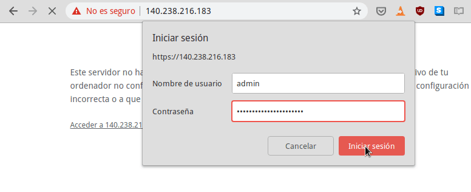
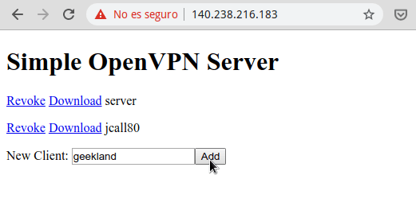
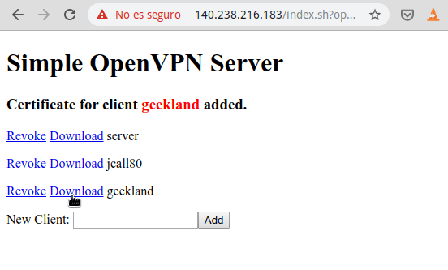
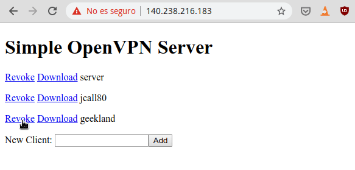

En el pasado escribí un post de como instalar y configurar un [servidor VPN]() paso a paso. Si lo consultan verán que el proceso es largo, tedioso y difícil. Por esto motivo en el siguiente artículo les mostraré otro procedimiento para poder instalar y configurar un servidor OpenVPN en menos de 3 minutos y con tan solo 3 comandos. <!--more-->La totalidad de la instalación y configuración se puede realizar mediante el siguiente [script](https://github.com/theonemule/simple-openvpn-server "Ubicación del creador del Script") que podéis encontrar en Github.

## REQUISITOS PARA SEGUIR EL TUTORIAL E INSTALAR Y CONFIGURAR UN SERVIDOR OPENVPN

Los requisitos para poder instalar y configurar un servidor OpenVPN son los que cito a continuación

1. Disponer de un ordenador o servidor con el sistema operativo Ubuntu 18.04 o 16.04. Imagino que si usáis otras distribuciones con paquetería .deb como por ejemplo Debian o Linux Mint también funcionará.
2. Disponer de una IP pública fija. En el caso que no dispongáis de una IP pública fija deberéis [usar un servicio DNS dinámico]() como por ejemplo NO-IP o Duck DNS.

## INSTALAR Y CONFIGURAR UN SERVIDOR VPN DE FORMA FÁCIL

Para aplicar y sacar partido de nuestro propio servidor VPN no es necesario tener grandes conocimientos técnicos. Para instalar y configurar el servidor VPN tan solo tenéis que copiar y pegar 3 comandos de la forma que veréis a continuación.

### Descargar el script de instalación

Descargamos el script de instalación y configuración del servidor OpenVPN ejecutando el siguiente comando en la terminal:

> ```
> wget https://raw.githubusercontent.com/theonemule/simple-openvpn-server/master/openvpn.sh
> ```

### Dar permisos de ejecución al script de instalación

Damos permisos de ejecución al script que acabamos de descargar ejecutando el siguiente comando en la terminal:

> ```
> chmod +x openvpn.sh
> ```

### Ejecutar el script para instalar y configurar el servidor OpenVPN

Acto seguido ejecutamos el script de instalación y configuración mediante un comando del siguiente tipo:

> ```
> sudo ./openvpn.sh --adminpassword=contraseña_administración --dns1=servidor_dns1 --dns2=servidor_dns2 --protocol=protocolo_a_usar --vpnport=puerto_servidor_vpn --host=ip_pública_sevidor_o_dominio
> ```

Cada una de las partes coloreadas del comando se deberá reemplazar por lo siguiente:

- contraseña\_administración: Definimos una contraseña cualquiera. Esta contraseña servirá para conectarnos a la interfaz de administración web. En mi caso usaré la contraseña geeklandpassword.
- servidor\_dns1: Escribiremos la dirección IP del servidor DNS primario. Cuando esté conectado al servidor VPN quiero que mis peticiones sean resueltas por OpenDNS, por lo tanto escribiré 208.67.222.222
- servidor\_dns2: Escribiremos la dirección IP del servidor DNS secundario. Cuando esté conectado al servidor VPN quiero que mis peticiones sean resueltas por OpenDNS, por lo tanto escribiré 208.67.220.220
- protocolo\_a\_usar: Podemos elegir entre el protocolo tcp o udp. Por cuestiones de rendimiento los VPN acostumbran a trabajar usando el protocolo udp. Por lo tanto en mi caso elijo la opción udp.
- puerto\_servidor\_vpn: Tenemos que escribir el puerto en que trabajará el servidor VPN. En mi caso uso el estándar que es el 1194.
- ip\_pública\_sevidor\_o\_dominio: Finalmente escribimos la IP Pública de nuestro servidor que en mi caso es 140.238.216.183. También pueden escribir su nombre de dominio o dominio dinámico DNS.

Por lo tanto en mi caso ejecutaré el siguiente comando:

> ```
> sudo ./openvpn.sh --adminpassword=geeklandpassword --dns1=208.67.222.222 --dns2=208.67.220.220 --protocol=udp --vpnport=1194 --host=140.238.221.137
> ```

La ejecución del script durará unos segundos y no es necesario realizar nada. Tan solo tendremos que esperar a que termine su ejecución. Una vez terminada la espera dispondremos de un servidor VPN correctamente instalado y configurado. Así de fácil y con tan solo 3 comandos.

### Crear clientes para el servidor OpenVPN

Los clientes del servidor OpenVPN se gestionarán a través de una interfaz web creada por lighttpd. Por este motivo abriremos los puertos 80 y 443 ejecutando los siguientes comando en la terminal:

> ```
> sudo iptables -I INPUT 5 -i ens3 -p tcp --dport 80 -m state --state NEW,ESTABLISHED -j ACCEPT
> ```
> 
> ```
> sudo iptables -I INPUT 6 -i ens3 -p tcp --dport 443 -m state --state NEW,ESTABLISHED -j ACCEPT
> ```

###### Nota: Si están aplicando el tutorial en su casa recuerden que también tendrán que abrir los puertos 80, 443 y 1194 en su router. Estos puertos los deberán redireccionar al equipo en que han instalado el servidor OpenVPN.

Acto seguido accederemos a nuestro navegador web e ingresaremos la siguiente URL

> ```
> https://140.238.216.183
> ```

###### Nota: En vuestro caso deberéis reemplazar la 140.238.216.183 por la IP de su servidor

A continuación, en el campo **Nombre de usuario** escribiréis admin. En el campo **Contraseña** escribiremos la contraseña que definimos en el comando de ejecución del script instalación. Finalmente presionaremos el botón Iniciar Sesión.

[](images/log-web-administracion-vpn.png)

###### Nota: El acceso al servidor web es completamente seguro y cifrado. La advertencia de "No es seguro" se debe a que usamos un certificado autogenerado.

A continuación, en el campo **New Client** escribiremos el nombre del usuario que queremos crear y clicaremos el botón Add.

[](images/crear-cliente-servidor-vpn.png)

Una vez creado el usuario presionaremos en el Link Download para descargar el archivo de configuración del cliente. El archivo de configuración descargado es el que deberán usar los clientes para conectarse al servidor VPN.

[](images/descargar-configuracion-cliente-vpn.png)

### Revocar los permisos de un cliente del servidor VPN

Si queremos quitar los permisos de conexión a uno de los usuarios que hemos creado actuaremos del siguiente modo.

En el panel de administración web clicamos en el link Revoke que está al lado del usuario al que queremos cancelar el permiso.

[](images/revocar-permiso-cliente-vpn.png)

Una vez clicado en Revoke, el usuario geekland no podrá conectarse más al servidor OpenVPN.

## MODIFICAR LA CONFIGURACIÓN ESTÁNDAR DEL SERVIDOR

Si tienen conocimientos de como se configura un servidor OpenVPN pueden modificar los parámetros del servidor instalado y configurado por el script. Para ello deberán editar los siguientes ficheros:

 
|   **Parámetros a modificar/consultar**   |   **Archivo/****ubicación** **a** **consultar**   |
| --- | --- |
|   Modificar Las reglas del firewall   |   /etc/rc.local   |
|   Modificar la configuración y comportamiento del servidor   |   /etc/openvpn/server.conf   |
|   Modificar la configuración estándar de los clientes que se crean   |   /etc/openvpn/client-common.txt   |
|   Ubicación donde se almacenan las claves públicas de los usuarios creados   |   /etc/openvpn/clients   |

## CONECTARNOS AL SERVIDOR OPENVPN

Para conectarnos al servidor OpenVPN en Linux deberemos seguir las siguientes instrucciones:

https://geekland.eu/conectarse-servidor-openvpn-linux-terminal-networkmanager/

En breve detallaré el proceso para el resto de sistemas opeargivos.
