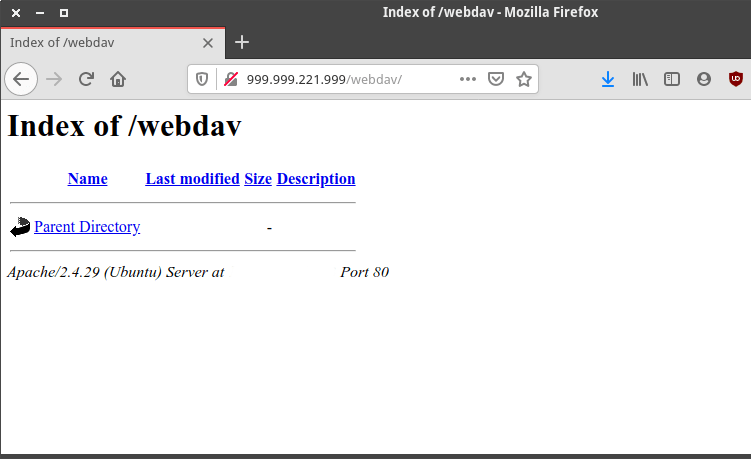
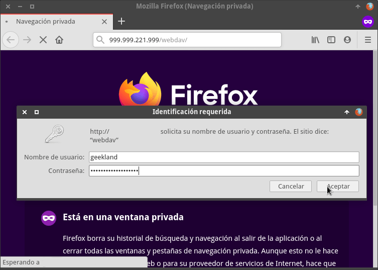
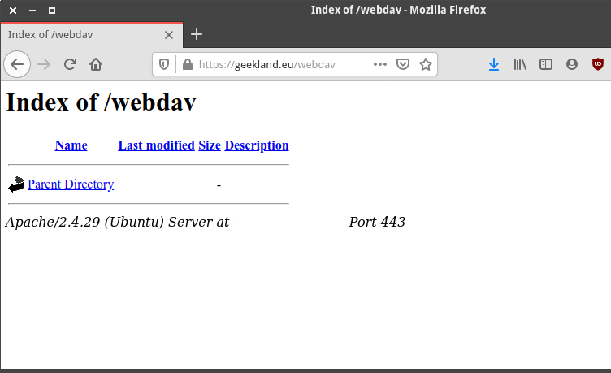

A continuación veremos como instalar y configurar un servidor WebDav sobre un servidor Apache en el sistema operativo Ubuntu. Pero antes de iniciar el proceso veremos que es un servidor WebDav y para que sirve.<!--more-->

## ¿QUÉ ES UN SERVIDOR WEBDAV?

WebDav (Creación y control de versiones distribuidos en Web) es una extensión del protocolo http.

El protocolo http únicamente permite leer el contenido almacenado en un servidor Web. Mediante WebDav, además de leer el contenido, también podremos editar y manipular el contenido almacenado en un servidor Web. Por lo tanto, **WebDav permite leer, editar y reproducir todo el contenido almacenado en un servidor web**.

## UTILIDADES QUE PODEMOS DAR A UN SERVIDOR WEBDAV

Disponer de un servidor WebDav tiene más utilidad de lo que uno puede pensar. Algunas de las utilidades que se le pueden dar son las siguientes:

1. **Con un simple navegador web podemos ver y descargar los archivos almacenados** en el servidor WebDav. Por lo tanto estemos donde estemos tendremos acceso a la información almacenada en nuestro servidor.
2. Con nuestro gestor de archivos podremos **crear, eliminar, ver y editar los ficheros almacenados en el servidor WebDav** como si estuvieran almacenados en un directorio local. Si no les gustan los gestores de archivos pueden usar clientes WebDav para conectarse y trabajar con los archivos almacenados en el servidor WebDav.
3. Gracias a WebDav podemos subir, bajar, editar y sincronizar archivos de nuestra nube Nextcloud sin tener que instalar un cliente. Por lo tanto un servidor WebDav puede **funcionar como una nube** que además será muy ligera.
4. Muchos **programas pueden usar WebDav para trabajar y para almacenar su contenido**. Un ejemplo de lo que digo es la aplicación de notas Joplin.
5. **Reproducir archivos multimedia** almacenados en la nube mediante nuestro teléfono, tablet o televisor.

## INSTALAR Y CONFIGURAR UN SERVIDOR WEBDAV

A continuación detallaremos el proceso de instalación y configuración de un servidor WebDav.

### Instalar el servidor web Apache

Para instalar el servidor web Apache ejecutaremos el siguiente comando en la terminal:

> ```
> sudo apt-get install apache2 apache2-utils
> ```

###### Nota: WebDav también se puede usar con otros servidores web como Nginx o Lighttpd. En mi caso uso Apache para asegurar que no tendré problemas de compatibilidad.

### Crear la ubicación que almacenará nuestros archivos

Acto seguido crearemos el directorio que almacenará la totalidad de ficheros que contendrá el servidor WebDav. En mi caso quiero almacenar los ficheros en el directorio /var/www/webdav. Por lo tanto ejecutaremos el siguiente comando en la terminal:

> ```
> sudo mkdir /var/www/webdav
> ```

A continuación otorgaremos el usuario y grupo www-data de forma recursiva a todos los directorios y ficheros del servidor web. Para ello ejecutaremos el siguiente comando en la terminal:

> ```
> sudo chown -R www-data:www-data /var/www/
> ```

### Habilitar los módulos dav y dav\_fs en Apache

Habilitaremos los módulos dav y dav\_fs ejecutando los siguientes comandos en la terminal:

> ```
> sudo a2enmod dav
> 
> sudo a2enmod dav_fs
> ```

Seguidamente reiniciaremos el servidor Apache mediante el siguiente comando:

> ```
> sudo systemctl restart apache2
> ```

### Configuración inicial del Virtual host de Apache

A continuación configuraremos el el Virtual Host de Apache. Para ello ejecutaremos el siguiente comando en la terminal:

> ```
> sudo nano /etc/apache2/sites-available/000-default.conf
> ```

Cuando se abra el editor de texto nano tendremos asegurar que tenga el siguiente contenido:

> ```
> DavLockDB /var/www/DavLock
> <VirtualHost *:80>
> 
>   ServerAdmin webmaster@localhost
>   DocumentRoot /var/www/html
> 
>   ErrorLog ${APACHE_LOG_DIR}/error.log
>   CustomLog ${APACHE_LOG_DIR}/access.log combined
> 
>   Alias /webdav /var/www/webdav
> 
>   <Directory /var/www/webdav>
>     DAV On
>   </Directory>
> 
> </VirtualHost>
> ```

Una vez realizada la configuración en el Virtual Host guardaremos los cambios y cerraremos el fichero.

Como nota informativa, el significado de los parámetros añadidos en el fichero de configuración de Apache es:

 
|   **Parámetro**   |   **Significado**   |
| --- | --- |
|   DavLockDB   |   Especificamos que la ubicación para la base de datos de bloqueos es /var/www/DavLock   |
|   Alias   |   Alias permite el acceso a cualquier carpeta fuera de la raíz del servidor web. En nuestro caso Alias mapea las peticiones `http://dominio/webdav` al contenido almacenado /var/www/webdav   |
|   Directory   |   Establecemos la totalidad de directivas que se deben aplicar a /var/www/webdav. La directiva DAV On especifica que debemos activar WebDav en el directorio /var/www/webdav   |

Acto seguido reiniciamos el servidor ejecutando el siguiente comando en al terminal:

> ```
> sudo systemctl restart apache2
> ```

### Comprobar el funcionamiento del servidor WebDav

En este momento el servidor WebDav ya debería estar operativo y accesible. Para comprobarlo abran el navegador e ingresen la siguiente dirección web:

> ```
> ip_servidor/webdav
> ```

###### Nota: Deberéis reemplazar ip\_servidor por la IP real de su servidor web.

Si obtienen un resultado parecido al siguiente todo lo realizado hasta el momento está funcionando de forma adecuada:

[](images/primer-acceso-servidor-webdav.png)

###### Nota: Recuerden que para acceder al servidor Web es necesario tener abiertos los puertos 80 y 443. Además el firewall tiene que permitir las entradas y las salidas por los puertos 80 y 443.

## AÑADIR UN MÉTODO DE AUTENTICACIÓN AL SERVIDOR WEBDAV

En estos momentos todo el mundo que conozca nuestra IP tendrá acceso a la información almacenada en nuestro servidor. Por este motivo implementaremos un sistema de autenticación por usuario y contraseña. De esta forma, solo quien sea capaz de introducir un nombre de usuario con su correspondiente contraseña podrá acceder al contenido.

Existen varios métodos de autenticación. A continuación veremos el DIGEST y el BASIC. Usaremos uno u otro en función de las circunstancias detalladas en la siguiente tabla:

  
|  |   **http**   |   **https**   |
| --- | --- | --- |
|   Autenticación BASIC   |   Linux, MacOS   |   MacOS, Windows, Linux   |
|   Autenticación DIGEST   |   MacOS, Windows, Linux   |   MacOS, Windows, Linux   |

Recomiendo usar el método DIGEST porque funcionará en todas las situaciones y en todos los sistemas operativos. También tenemos que tener en cuenta que el método BASIC envía las contraseñas desde el cliente al servidor sin cifrar, por lo tanto si usan el método BASIC deberán instalar un certificado SSL.

### Crear un usuario y definir su contraseña para acceder al servidor WebDav

**Para crear el primer usuario con la autenticación DIGEST** ejecutaremos el siguiente comando:

> ```
> sudo htdigest -c /etc/apache2/users.password webdav geekland
> ```

###### Nota: Deberéis reemplazar geekland por el nombre de usuario que queráis.

**Si por lo contrario queremos usar la autenticación BASIC**, crearemos el primer usuario ejecutando el siguiente comando en la terminal:

> ```
> sudo htpasswd -c /etc/apache2/.users.password geekland
> ```

###### Nota: Deberéis reemplazar geekland por el nombre de usuario que queráis.

Una vez ejecutado cualquiera de los 2 comandos se nos pedirá que definamos la contraseña de acceso del usuario geekland. La introducimos del siguiente modo:

> ```
> New password: contraseña_geekland
> Re-type new password: contraseña_geekland
> Adding password for user geekland
> ```

Para la creación de futuros usuarios deberemos usar los mismos comandos que acabamos de usar omitiendo el parámetro **\-c**.

### Dar permisos para que Apache pueda leer el fichero que almacena las contraseñas

Para permitir que Apache pueda leer el fichero que almacena las contraseñas ejecutaremos el siguiente comando en la terminal:

> ```
> sudo chown www-data:www-data /etc/apache2/users.password
> ```

### Configurar el Virtual Host para habilitar el método de autenticación

Acto seguido editaremos el Virtual Host del servidor Apache para aplicar el nuevo método de autenticación. Para ello ejecutaremos el siguiente comando en la terminal:

> ```
> sudo nano /etc/apache2/sites-available/000-default.conf
> ```

Cuando se abra el editor de textos nano, **si estamos usando el método DIGEST** modificaremos el fichero para que quede de la siguiente forma:

> ```
> DavLockDB /var/www/DavLock
> <VirtualHost *:80>
> 
>   ServerAdmin webmaster@localhost
>   DocumentRoot /var/www/html
>   
>   ErrorLog ${APACHE_LOG_DIR}/error.log
>   CustomLog ${APACHE_LOG_DIR}/access.log combined
> 
>   Alias /webdav /var/www/webdav
> 
>   <Directory /var/www/webdav>
>     DAV On
>     AuthType Digest
>     AuthName "webdav"
>     AuthUserFile /etc/apache2/users.password
>     Require valid-user
>   </Directory>
> 
> </VirtualHost>
> ```

**En el caso que usemos el método de autenticación BASIC** deberá quedar de la siguiente forma:

> ```
> DavLockDB /var/www/DavLock
> <VirtualHost *:80>
> 
>   ServerAdmin webmaster@localhost
>   DocumentRoot /var/www/html
>  
>   ErrorLog ${APACHE_LOG_DIR}/error.log
>   CustomLog ${APACHE_LOG_DIR}/access.log combined
> 
>   Alias /webdav /var/www/webdav
> 
>   <Directory /var/www/webdav>
>     DAV On
>     AuthType Basic
>     AuthName "webdav"
>     AuthUserFile /etc/apache2/users.password
>     Require valid-user
>   </Directory>
> 
> </VirtualHost>
> ```

Una vez realizadas las modificaciones guardaremos los cambios y cerramos el fichero. El significado de cada uno de los parámetros añadidos al fichero es el siguiente:

 
|   **Directivas**   |   **Significado**   |
| --- | --- |
|   AuthType   |   Definimos el método de autenticación para acceder al directorio /var/www/webdav. Podemos definir el Basic o el Digest.   |
|   AuthName   |   Especificamos el nombre del ámbito de autenticación que en mi caso es webdav. Esto tiene varias implicaciones. La primera es que la palabra webdav aparecerá en el cuadro de autenticación de los usuarios que se conectan al servidor para darles pistas de la contraseña que tienen que introducir. La segunda es que si usamos el método Digest, el AuthName delimitará las contraseñas de los usuarios por zonas. Por lo tanto un usuario para acceder a una carpeta que pertenece a la zona webdav deberá introducir una contraseña, pero si la carpeta pertenece a otra zona deberán introducir otra contraseña.   |
|   AuthUserFile   |   Especifica la ruta del fichero que almacena las contraseñas. En nuestro caso los nombres de usuarios y contraseñas se almacenan en /etc/apache2/users.password   |
|   Require valid-user   |   Para definir que todo usuario que se pueda autenticar correctamente puede acceder al directorio /var/www/webdav. Si cambiásemos valid-user por group geekland solo podrían acceder a /var/www/webdav los usuarios que se autentiquen correctamente y pertenezcan al grupo geekland.   |

### Aplicar los cambios para que se pueda realizar la autenticación

**Si usamos la autenticación DIGEST** ejecutaremos el siguiente comando para habilitar el módulo auth\_digest:

> ```
> sudo a2enmod auth_digest
> ```

En cambio **si usamos la autenticación BASIC** deberemos habilitar el módulo auth\_basic mediante el siguiente comando:

> ```
> sudo a2enmod auth_basic
> ```

Finalmente reiniciaremos el servidor Apache para que se apliquen los cambios. Para ello ejecutaremos el siguiente comando:

> ```
> sudo service apache2 restart
> ```

### Acceder al servidor WebDav con la autenticación configurada

Del mismo modo que hicimos anteriormente abrimos el navegador e ingresamos la dirección para acceder a nuestro servidor WebDav. En el momento de ingresar se nos preguntará nuestro nombre de usuario y contraseña. Una vez introducidos presionamos el botón Aceptar y acto seguido ingresaremos a nuestro servidor WebDav.

[](images/acceder-servidor-webdav-autenticacion.png)

## INSTALAR CERTIFICADO SSL MEDIANTE CERTBOT Y LET’S ENCRYPT

Para que la transmisión de información entre cliente/servidor se haga de forma cifrada instalaremos un certificado de Let’s Encript. Para ello tendremos que [disponer de un dominio](). Una vez dispongamos del dominio instalaremos Certbot ejecutando el siguiente comando en la terminal:

> ```
> sudo apt-get install certbot python-certbot-apache apache2
> ```

###### Nota: Para obtener el certificado SSL tenemos que tener los puertos 80 y 443 abiertos y accesibles desde fuera de la red local.

Una vez finalizada la instalación de Certbot ejecutaremos el siguiente comando para instalar y obtener el certificado:

> ```
> sudo certbot --apache
> ```

Una vez ejecutado el comando se iniciará el proceso de instalación del certificado. Durante la instalación se realizarán las siguientes preguntas.

### Introducción de la dirección de email

`Enter email address (used for urgent renewal and security notices) (Enter 'c' to cancel):` `geeklandarrobargeekland.com`

### Aceptación de las condiciones de servicio

`- - - - - - - - - - - - - - - - - - - - - - - - - - - - - - - - - - - - - - - -` `Please read the Terms of Service at` `https://letsencrypt.org/documents/LE-SA-v1.2-November-15-2017.pdf. You must` `agree in order to register with the ACME server at` `https://acme-v02.api.letsencrypt.org/directory` `- - - - - - - - - - - - - - - - - - - - - - - - - - - - - - - - - - - - - - - -` `(A)gree/(C)ancel: A`

### Compartir la dirección de email

`- - - - - - - - - - - - - - - - - - - - - - - - - - - - - - - - - - - - - - - -` `Would you be willing to share your email address with the Electronic Frontier` `Foundation, a founding partner of the Let's Encrypt project and the non-profit` `organization that develops Certbot? We'd like to send you email about our work` `encrypting the web, EFF news, campaigns, and ways to support digital freedom.` `- - - - - - - - - - - - - - - - - - - - - - - - - - - - - - - - - - - - - - - -` `(Y)es/(N)o: N`

### Introducir el dominio/s para el que queremos obtener el certificado

`No names were found in your configuration files. Please enter in your domain` `name(s) (comma and/or space separated) (Enter 'c' to cancel): geekland.eu www.geekland.eu`

### Definir si queremos redirigir de http a https

`Please choose whether or not to redirect HTTP traffic to HTTPS, removing HTTP access.` `- - - - - - - - - - - - - - - - - - - - - - - - - - - - - - - - - - - - - - - -` `1: No redirect - Make no further changes to the webserver configuration.` `2: Redirect - Make all requests redirect to secure HTTPS access. Choose this for` `new sites, or if you're confident your site works on HTTPS. You can undo this` `change by editing your web server's configuration.` `- - - - - - - - - - - - - - - - - - - - - - - - - - - - - - - - - - - - - - - -` `Select the appropriate number [1-2] then [enter] (press 'c' to cancel): 2`

### Mensaje de confirmación

Después de responder la totalidad de preguntas deberíamos obtener el siguiente mensaje:

`Congratulations! You have successfully enabled https://webdavserver.ml and` `https://www.webdavserver.ml`

`You should test your configuration at:` `https://www.ssllabs.com/ssltest/analyze.html?d=geekland.eu` `https://www.ssllabs.com/ssltest/analyze.html?d=www.geekland.eu`

Si véis un mensaje similar el proceso a terminado. En este momentos ya disponemos de un servidor WebDav plenamente funcional y seguro.

### Acceder al servidor WebDav con el certificado SSL instalado

Finalmente tan solo tenemos que introducir la dirección de nuestro dominio seguido de /webdav en nuestro navegador. Por lo tanto en mi caso introduciré la siguiente dirección:

> ```
> https://geekland.eu/webdav/
> ```

Acto seguido introduciremos nuestro usuario y contraseña y presionaremos el botón Aceptar. De esta forma accederemos sin problema a nuestro servidor WebDav.

[](images/servidor-webdav-plenamente-funcional.png)

## CONECTARSE Y USAR EL SERVIDOR WEBDAV

Para conectarse y usar el servidor WebDav existen infinidad de opciones. Una de ellas es la que cito a continuación:

https://geekland.eu/montar-servidor-webdav-en-un-sistema-de-archivos-con-davfs2/

En un futuro escribiré otro post detallando el resto de opciones disponibles.

##### REFERENCIAS

[https://httpd.apache.org/docs/2.4/mod/mod\_dav.html](https://httpd.apache.org/docs/2.4/mod/mod_dav.html) [https://wiki.archlinux.org/index.php/WebDAV](https://wiki.archlinux.org/index.php/WebDAV) [https://www.digitalocean.com/community/tutorials/how-to-configure-webdav-access-with-apache-on-ubuntu-14-04](https://www.digitalocean.com/community/tutorials/how-to-configure-webdav-access-with-apache-on-ubuntu-14-04)
