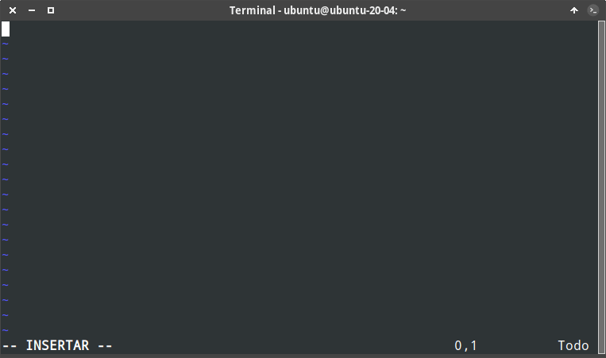
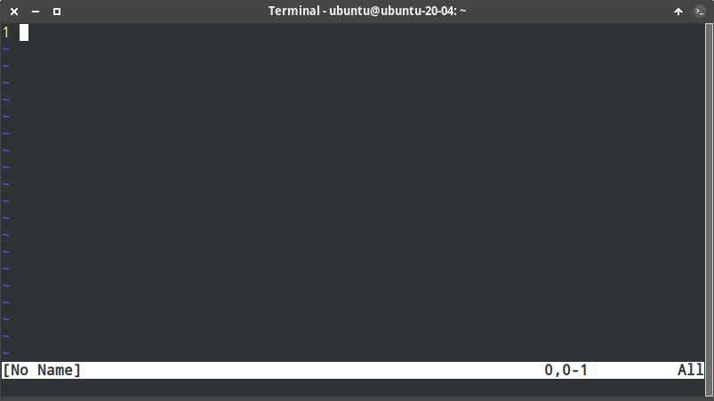
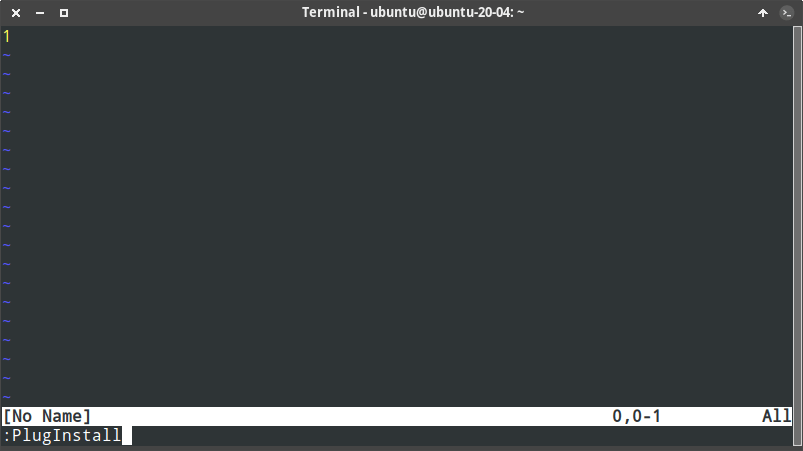
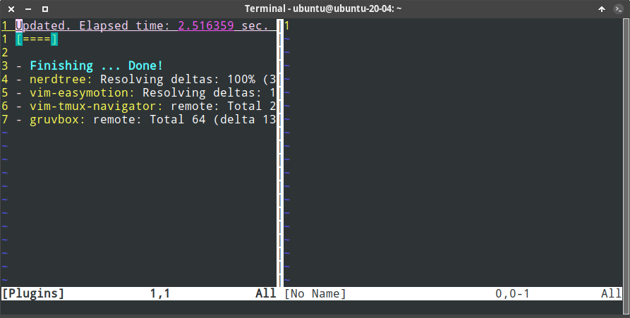
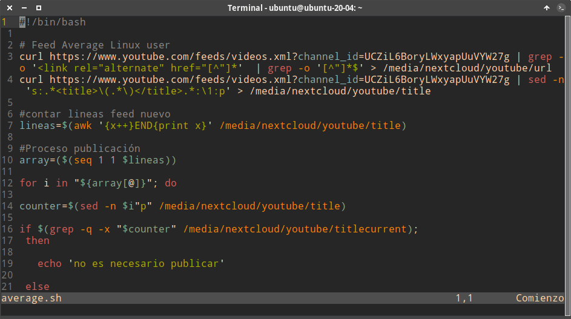
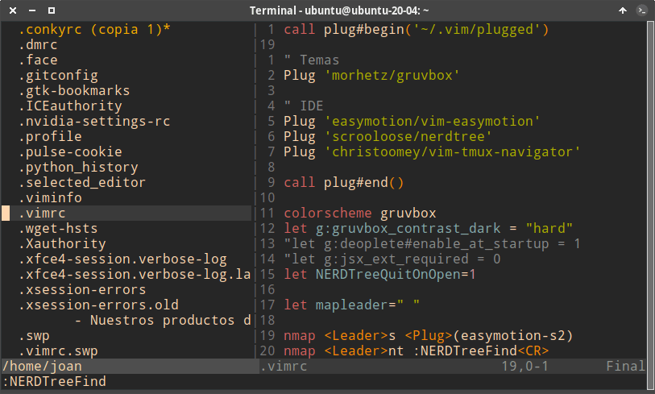
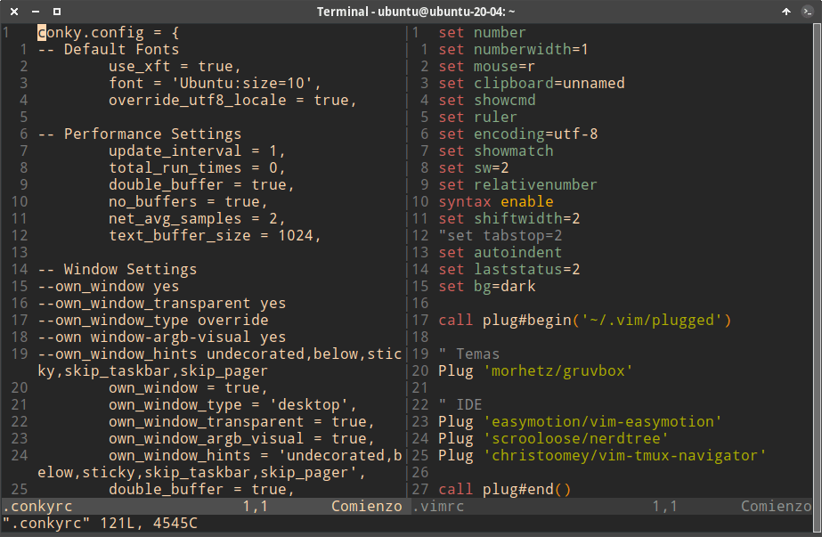

Si bien es cierto que el uso del editor de texto VIM no es intuitivo, también es verdad que dedicándole unas pocas horas podemos aprender su funcionamiento básico y darnos cuenta de su increíble utilidad y productividad. Por este motivo a continuación les mostraré como instalar y configurar VIM de forma básica para que podáis empezar a usarlo de forma más cómoda.<!--more-->

## INSTALAR Y CONFIGURAR VIM

Para instalar y configurar VIM en una distribución que use el gestor de paquetes apt tan solo tienen que ejecutar el siguiente comando en la terminal:

> ```shell
> sudo apt install vim git curl
> ```

Una vez instalado verán que VIM tiene el siguiente aspecto:

[](images/aspecto-inicial-de-vim.png)

Para tener un aspecto más agradable y poder usarlo de forma más productiva les recomiendo que sigan leyendo el artículo.

## INSTALAR EL GESTOR DE PLUGINS VIM-PLUG

Para facilitar la instalación y gestión de plugins podemos usar el gestor de plugins vim-plug. Para instalar vim-plug tan solo hay que ejecutar el siguiente comando en la terminal:

> ```shell
> curl -fLo ~/.vim/autoload/plug.vim --create-dirs \
>     https://raw.githubusercontent.com/junegunn/vim-plug/master/plug.vim
> ```

Una vez finalizada la instalación ya podremos instalar plugins en nuestro editor de textos VIM. Conforme al comando usado para instalar Vim-plug, la totalidad de plugins instalados se almacenarán en la ubicación `~/.vim/autoload/`

Una vez tengamos el gestor de plugins instalado pasaremos a ver como instalar plugins y como configurar el editor de textos VIM.

**Nota:** Los plugins aportarán funcionalidades adicionales a VIM. Hay miles de plugins disponibles para incrementar las funcionalidades de VIM.

## CONFIGURAR EL EDITOR DE CÓDIGO VIM

Una vez finalizada la instalación de VIM y del gestor de plugins editaremos el archivo de configuración de VIM. El fichero de configuración de VIM lo ubicaremos dentro de nuestro partición /home en un archivo oculto llamado `.vimrc`. Para ello ejecutaremos el siguiente comando en la terminal:

> ```shell
> nano ~/.vimrc
> ```

Una vez se habrá el editor de textos nano pegaremos el siguiente código que es el que definirá la configuración y comportamiento de VIM.

> ```shell
> set number
> set numberwidth=1
> set mouse=r
> set clipboard=unnamed
> set showcmd
> set ruler
> set encoding=utf-8
> set showmatch
> set sw=2
> set relativenumber
> syntax enable
> set tabstop=2
> set autoindent
> set laststatus=2
> set bg=dark
> 
> call plug#begin('~/.vim/plugged')
> 
> " Temas
> Plug 'morhetz/gruvbox'
> 
> " IDE
> Plug 'easymotion/vim-easymotion'
> Plug 'scrooloose/nerdtree'
> Plug 'christoomey/vim-tmux-navigator'
> 
> call plug#end()
> 
> colorscheme gruvbox
> let g:gruvbox_contrast_dark = "hard"
> let NERDTreeQuitOnOpen=1
> 
> let mapleader=" "
> 
> nmap <Leader>s <Plug>(easymotion-s2)
> nmap <Leader>nt :NERDTreeFind<CR>
> ```

Una vez pegada la configuración guardan los cambios y cierran el fichero. A continuación abren VIM y veremos que ya se habrán aplicado gran parte de las configuraciones presentes en el archivo de configuración. En el ejemplo que estamos viendo únicamente faltará instalar los plugins y el tema Gruvbox.

[](images/vim-con-nuevas-opciones-configuracion.png)

**Nota**: La configuración vista en este apartado solo se aplicará a nuestro usuario. Si queremos que la configuración se aplique a todos los usuarios debemos introducir la configuración en el fichero `/etc/vim/vimrc`

### Significado de cada uno de los parámetros introducidos en el fichero de configuración de VIM

El significado de todas y cada una de las líneas del fichero de configuración es el siguiente:

| Código configuración | Acción que realiza el código |
| --- | --- |
| `set number` | En el lateral izquierdo de nuestro monitor se mostrarán los número de línea. |
| `set numberwidth=1` | Determinar la distancia entre el cursor y el número que indica la línea en que estamos. |
| `set mouse=r` | Permite interactuar con el ratón dentro de VIM. Por ejemplo sin esta línea no podríamos usar el ratón para cortar y pegar contenido. |
| `set clipboard=unnamed` | Para que el contenido que copiamos quede dentro del clipboard del sistema operativo. Si no introducimos esta opción no podremos copiar y pegar texto. |
| `set showcmd` | Para que en la parte inferior de la pantalla se muestren los comandos que estamos ejecutando. |
| `set ruler` | Para que VIM muestre el número de línea y columna en que tenemos posicionado el cursor. |
| `set encoding=utf-8` | Configurar que el formato de codificación de nuestros caracteres sea utf-8. |
| `set showmatch` | En el momento que nos posicionamiento sobre un paréntesis que abra o cierra se resaltará el siguiente paréntesis que que cierra o abra el primero. |
| `set sw=2` | Cada vez que pulsemos la tecla tab para tabular el código se realizarán 2 espacios. |
| `set relativenumber` | Los números de línea se muestran de forma relativa. Si ubicamos el cursor en la línea 10 veremos que la línea anterior a 10 es la 1 y la posterior a 10 también es la uno. |
| `syntax enable` | Para habilitar la sintaxis dentro de VIM. De este modo nuestro código se resaltará en color para que sea más fácil de entender. |
| `set tabstop=2` | Cada vez que presionamos la tecla tab para tabular el código se realizarán 2 espacios. |
| `set autoindent` | Si aplicamos una tabulación escribimos código y saltamos de línea presionando Intro, VIM nos mantendrá la tabulación definida en la línea anterior. |
| `set laststatus=2` | Para que la línea de estatus de VIM siempre sea visible. |
| `set bg=dark` | Para definir que el esquema de color del tema gruvbox que usaremos sea el oscuro. Más adelante veremos como instalar el tema Gruvbox. |
| `call plug#begin('~/.vim/plugged')` | Para indicar la ubicación donde queremos que se instalen los plugins. En mi caso los instalo en `~/.vim/plugged`. |
| `Plug 'morhetz/gruvbox'` | Para instalar el tema gruvbox mediante el gestor de paquetes vim-plug. Por este motivo escribimos `Plug` más el `nombre de usuario de github`/`nombre del repositorio de github donde se ubica el plugin`. Por lo tanto el texto a introducir es `morhetz/gruvbox`. |
| `Plug 'easymotion/vim-easymotion'` | Para instalar el plugin easymotion. |
| `Plug 'scrooloose/nerdtree'` | Para posteriormente instalar el plugin nerdtree. |
| `Plug 'christoomey/vim-tmux-navigator'` | Instalación del plugin vim-tmux-navigator. |
| `call plug#end()` | Para cerrar el apartado de instalación de plugins. |
| `colorscheme gruvbox` | Para indicar que queremos el esquema de color del tema gruvbox. |
| `let g:gruvbox_contrast_dark = "hard"` | El esquema de color del tema gruvbox tendrá un contraste alto. |
| `let NERDTreeQuitOnOpen=1` | En el momento de abrir un archivo con Nerdtree, Nerdtree se cerrará de forma automática. |
| `let mapleader=" "` | Definimos que la tecla espacio sea la primera tecla que tengamos que pulsar para ejecutar los plugins. |
| `nmap <Leader>s <Plug>(easymotion-s2)` | Establecemos que la combinación de teclas para usar el plugin easymotion sea `Espacio+s` |
| `nmap <Leader>nt :NERDTreeFind<CR>` | Nerdtree se ejecuta presionando la combinación de teclas `Espacio+nt` |

## INSTALAR LOS PLUGINS Y LOS TEMAS DEFINIDOS EN EL ARCHIVO DE CONFIGURACIÓN

En el archivo de configuración hemos introducido el código necesario para:

1. Usar el tema Gruvbox.
2. Usar los plugin Easymotion, Nerdtree y Vim-tmux-navigator.

Pero a estas altura aun no podemos ver el nuevo tema ni usar los plugins que acabamos de mencionar. El motivo es que aun no están instalados. Para instalarlos tenemos que Abrir VIM. Una vez abierto ejecutamos el comando `:PlugInstall`

[](images/Instalando-plugins-vim.png)

A continuación se procederá a la instalación de todos los temas y los plugins.

[](images/plugins-instalados-vim.png)

Ahora cerramos VIM y lo volvemos abrir. Acto seguido podremos empezar a editar código y verán que la experiencia será completamente diferente a la anterior.

[](images/vim-configurado-y-con-los-plugins.png)

**Nota**: Antes de sacar partido a VIM es indispensable dedicar unas 4 o 5 horas para conocer los atajos de teclado, tener una idea clara del flujo de funcionamiento y ver como funcionan los plugin que hayamos instalado.

### Utilidad de los plugins que hemos instalado

Como han visto en apartados anteriores en mi caso he instalado 3 plugins. Hay miles de ellos y tan solo tienen que buscar los que más les convengan. La funcionalidad de los plugin que he instalado en mi caso es la siguiente:

**Easymotion**: Mediante la combinación de teclas `Espacio+S` podemos mover el cursor de la posición actual a donde queramos de forma rápida y cómoda. Con este plugin podremos mejorar enormemente nuestra productividad.

**NerdTree**: Para ver nuestro sistema de archivos en forma de árbol y de este modo realizar operaciones como por ejemplo abrir, mover, copiar, borrar archivos sin tener que salir de VIM.

[](images/muestra-plugin-nerdtree.png)

**vim-tmux-navigator:** Para navegar entre los archivos que estamos editando de forma cómoda usando únicamente el teclado. En otras palabras podremos abrir más de un archivo de forma simultanea y pasar de un archivo a otro mediante atajos de teclado.

[](images/muestra-plugin-tmux.png)

### Gestionar los plugins instalados con Vim-Plug

Vim-Plug permite gestionar nuestros plugin de forma sencilla mediante comandos. Usando los siguientes comandos podremos realizar las siguientes acciones:

| Comandos | Descripción |
| --- | --- |
| `:PlugInstall` | Instalar todos los plugins definidos en el archivo de configuración. |
| `:PlugUpdate` | Actualizar los plugins que tenemos instalados. Si al finalizar la actualización presionamos la tecla **D** veremos una descripción detallada informando sobre las modificaciones realizadas en los plugins actualizados. |
| `:PlugClean` | Para borrar de nuestro disco duro los plugins que hayamos borrado de nuestro archivo de configuración. |
| `:PlugUpgrade` | Actualizar el gestor de plugins Vim-Plug. |
| `:PlugStatus` | Para listar los plugins instalados y conocer su estatus. |
| `:PlugDiff` | Listar los cambios realizados en una actualización reciente de plugins. |
| `:PlugSnapshot ~/.vim/plug.snapshot` | Generar un script en `~/.vim/plug.snapshot` para restaurar el estado actual de los plugins en caso que tengamos que restaurar el equipo. Para restaurar el estado de los plugins tan solo tendrán que ejecutar el comando `vim -S ~/.vim/plug.snapshot` |

Si quieren más información de como gestionar los plugin les recomiendo que visiten en siguiente [enlace](https://github.com/junegunn/vim-plug "Github del desarollador de vim-plug").

## DONDE ENCONTRAR MÁS PLUGIN Y OPCIONES DE CONFIGURACIÓN DE VIM

Vim ofrece una gran variedad de opciones de configuración y de plugins para adaptarlo a nuestras necesidades y para facilitar nuestro trabajo. Si quieren profundizar en las opciones que ofrece pueden visitar los siguientes enlaces.

[https://www.shortcutfoo.com/blog/top-50-vim-configuration-options/](https://www.shortcutfoo.com/blog/top-50-vim-configuration-options/)

[http://vimdoc.sourceforge.net/htmldoc/options.html](http://vimdoc.sourceforge.net/htmldoc/options.html)

[https://catonmat.net/vim-plugins](https://catonmat.net/vim-plugins)

[https://code.tutsplus.com/series/vim-essential-plugins--net-19224](https://code.tutsplus.com/series/vim-essential-plugins--net-19224)

Otra opción que tenéis disponible es usar el comando `:options` dentro del editor de código VIM. Allí podréis encontrar infinidad de parámetros para introducir en su fichero de configuración. De está forma tan simple y rápido podemos instalar y configurar VIM en cualquier distribución Linux.

Y si finalmente quieren conocer los atajos de teclado y comandos para usar VIM como un experto les recomiendo leer el siguiente artículo.

https://geekland.eu/atajos-de-teclado-y-comandos-para-usar-vim-eficientemente/
