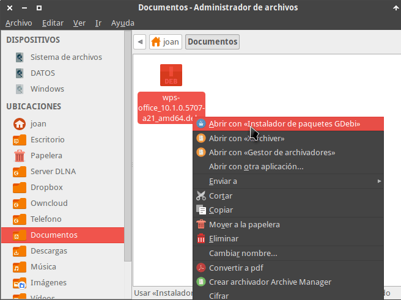
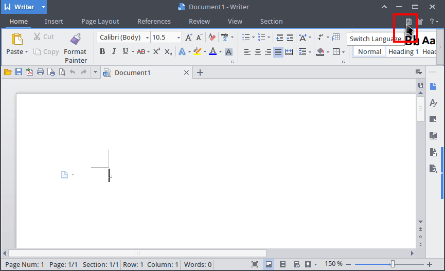
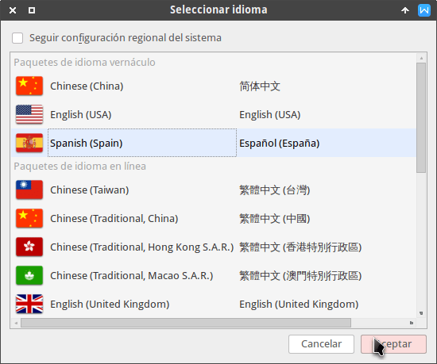
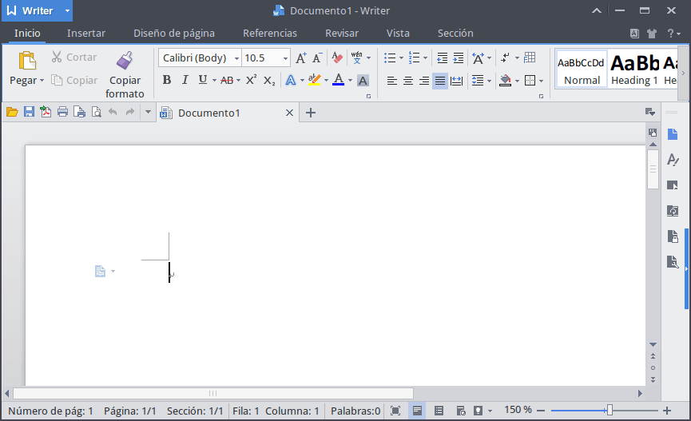
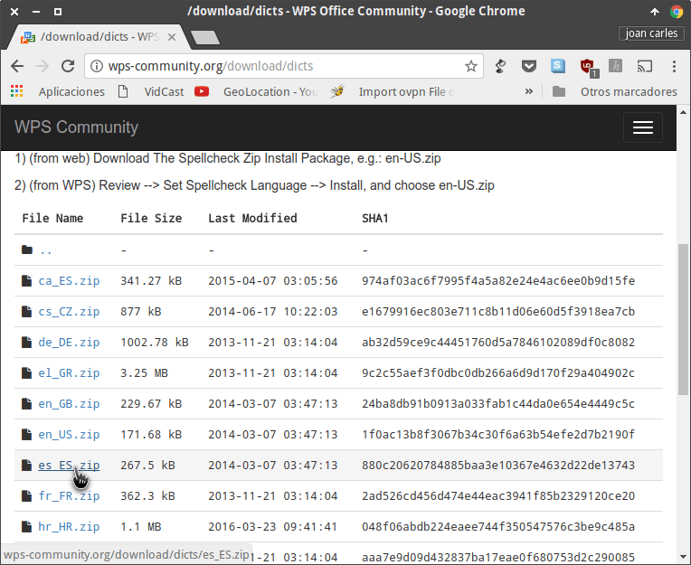
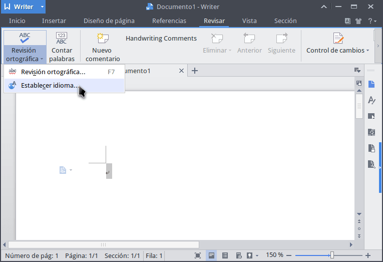

En mi caso siempre he usado Libreoffice y continuaré usándolo. No obstante Libreoffice hace demasiado tiempo que me da problemas y el rendimiento en mi equipo no es el adecuado. Por este motivo he empezado a usar WPS Office. Los pasos a seguir para instalar y disfrutar de esta suite ofimática son los siguientes:<!--more-->

## INSTALAR WPS OFFICE EN LINUX

A continuación veremos los pasos a seguir para descargar y empezar a usar WPS Office:

### Descargar WPS Office

El primer paso consiste en descargar el programa. Para descargarlo pueden usar los siguientes links:

[Descargar versión de 32 bits para Debian, Ubuntu y distribuciones derivadas](http://kdl.cc.ksosoft.com/wps-community/download/8392/wps-office_11.1.0.8392_i386.deb "Descargar paquete .deb de 32 bits")

[Descargar versión de 64 bits para Debian, Ubuntu y distribuciones derivadas](http://kdl.cc.ksosoft.com/wps-community/download/8392/wps-office_11.1.0.8392_amd64.deb "Descargar paquete .deb de 64 bits")

[Descargar versión de 32 bits para Fedora, Opensuse y distribuciones derivadas](http://kdl.cc.ksosoft.com/wps-community/download/8392/wps-office-11.1.0.8392-1.i686.rpm "Descargar paquete .rpm de 32 bits")

[Descargar versión de 64 bits para Fedora y Opensuse y distribuciones derivadas](http://kdl.cc.ksosoft.com/wps-community/download/8392/wps-office-11.1.0.8392-1.x86_64.rpm "Descargar paquete rpm de 32 bits")

###### Nota: Los links de descarga corresponden a la versión 11.1.0.8372 de WPS Office. Si lo prefieren pueden [descargar el programa](http://wps-community.org/downloads "Web para descargar WPS Office") directamente de la web de WPS office.

### Instalar WPS Office

Una vez descargado el paquete binario la instalación del programa es muy sencilla. Tan solo tienen dirigirse a la ubicación donde descargaron el paquete e instalarlo de la forma habitual. Tal y como se puede ver en la captura de pantalla, en mi caso instalo el paquete usando gdebi.

[](images/instalar-wps-office-con-gdebi.png)

Una vez instalado el paquete ya podemos empezar a configurar la suite ofimática.

### Instalar Fuentes adicionales de WPS Office

En el momento de abrir el programa es más que posible que obtengan el siguiente error:

> ```
> Some formula symbols might not be display correctly due to missing fonts: Wingdings, Wingdings 2, Wingdings 3
> ```

El motivo de este error es que faltan fuentes en nuestro sistema operativo. Para descargar las fuentes que faltan descargamos el [siguiente archivo](https://drive.google.com/file/d/0Bzt4WYx9Sj_XQTVxaGxqc2ttU2c/view?usp=sharing&resourcekey=0-7QzBF_lSnKPQ3ACpnrsOvg "Link para descargar fuentes adicionales de WPS Office").

Una vez descargado el archivo tenemos que descomprimir su contenido en la ubicación ~/.fonts. Para ello desde la ubicación donde descargamos el archivo ejecutamos el siguiente comando en la terminal:

> ```
> unzip wps_symbol_fonts.zip -d ~/.fonts
> ```

A continuación recargamos la lista de fuentes ejecutando el siguiente comando en la terminal:

> ```
> sudo fc-cache -f -v
> ```

En estos momentos, el proceso de instalación de las fuentes ha finalizado. La próxima vez que arranquemos WPS Office ya no aparecerá el error que nos aparecía.

###### Nota: Las fuentes instaladas únicamente estarán disponibles para nuestro usuario. Si queremos que estén disponibles para todos los usuarios deberemos instalar las fuentes que nos descargamos en la ubicación /usr/share/fonts

### Cambiar el idioma del Programa WPS Office

Al arrancar el programa observarán que está en Inglés. Para cambiar el idioma tendrán que instalar las traducciones del programa.

Para ello, **los usuarios que tengan distribuciones que usen paqueteria .deb** accedan al siguiente enlace para descargar e instalar el paquete wps-full-fix-es\_1.0-2019\_all:

[Paquete .deb para traducir Libreoffice al Español en Ubuntu, Debian, Linux Mint, etc](https://drive.google.com/file/d/1WjvO0tGffN0nI7uAxoq9VR-DmHdqmjlE/view?usp=sharing "Link para descargar la traducción en Español de WPS Office en distros que usen paquetes .deb").

**En el caso que sean usuarios de Fedora** o cualquier otra distribución que use paquetes .rpm accedan al siguiente enlace para descargar e instalar el paquete wps-i18n-es\_ES-10.1.0.5707-1.gitf455096.fc27.x86\_64:

[Paquete .rpm para traducir Libreoffice al Español en Fedora y derivadas](https://drive.google.com/file/d/1UjaraIv37V8OnQe05CxjHL55KQzc_R1S/view?usp=sharing "Link para descargar la traducción en Español de WPS Office en distros que usen paquetes rpm").

Una vez descargado e instalado el paquete cambien el idioma clicando encima del icono para cambiar el idioma del programa.

[](images/cambiar-idioma-wps-office.png)

A continuación aparecerá una ventana en la que deberemos seleccionar nuestro idioma. Por lo tanto en mi caso selecciono el idioma Español y presiono el botón Aceptar.

[](images/seleccionar-idioma-wps-office.png)

Después de apretar el botón aparecerá un mensaje que nos dirá que para que la configuración tenga efecto se tiene que reiniciar el programa. Presionamos el botón Aceptar y reiniciamos el programa. La próxima vez que arranquen el programa verán que está en Español.

[](images/wps-office-en-castellano.png)

### Instalar el diccionario en Español

El corrector de ortografía predeterminado de WPS Office es el Inglés. Si queremos disponer de correctores de ortografía para otros idiomas tenemos que seguir las siguientes instrucciones.

Accedemos a la siguiente URL para [descargarnos los diccionarios](http://wps-community.org/download/dicts "Web para descargar los diccionarios de WPS Office") que necesitemos. Tal y como se puede ver en la captura de pantalla en mi caso descargo el archivo es\_ES.zip que corresponde al diccionario en Español.

[](images/descargar-diccionario-wps-office.png)

Para instalar el diccionario descomprimiremos el contenido del fichero que hemos descargado en la ubicación ~/.kingsoft/office6/dicts/. Para ello desde la ubicación donde descargamos el diccionario ejecutamos el siguiente comando en la terminal:

> ```
> sudo unzip es_ES.zip -d /opt/kingsoft/wps-office/office6/dicts/spellcheck
> ```

En estemos momentos ya podemos abrir WPS Office. Nos dirigimos a la pestaña Revisar, clicamos el botón de Revisión Ortográfica y cuando aparezca el submenú clicamos encima de Establecer idioma.

[](images/cambiar-diccionario-wps-office.png)

A continuación aparecerá la ventana donde tenemos que seleccionar el idioma del corrector ortográfico. En mi caso selecciono Español y presiono encima del botón Establecer predeterminado.

[](images/seleccionar-diccionario-wps-office.png)

Después de finalizar estos pasos ya dispondremos de corrector ortográfico en Español.

De la misma forma que hemos instalado el corrector en Español podemos instalar otros idiomas como por ejemplo el Francés, el Catalán, el Italiano, etc.

###### Nota: Los correctores ortográficos instalados estarán disponibles para todos los usuarios.

## PUNTOS DESTACABLES DE WPS OFFICE

La interfaz gráfica de este programa es muy similar a la de Microsoft Office. Esto sin duda es un punto a favor por los siguientes motivos:

1. La curva de aprendizaje es muy baja porque la forma de usarlo es la misma que Microsoft Office.
2. En el momento que estás usando esta suite ofimática tienes la sensación de estar usando Microsoft Office.
3. La interfaz gráfica del programa es elegante, intuitiva y agradable visualmente.

Además de lo citado hasta el momento también podemos destacar los siguientes puntos:

1. El rendimiento de está suite ofimática es perfecto. En mi caso y en mi hardware el rendimiento es bastante superior al que ofrece Libreoffice.
2. La compatibilidad con ficheros de Microsoft Office es excelente. Sin duda su compatibilidad es muy superior a la que nos ofrece Libreoffice.
3. En esta suite ofimática prácticamente no hecho de menos ninguna de las características y funcionalidades de Microsoft Office.
4. WPS Office es una suite ofimática multiplataforma. Está presente en Windows, GNU Linux, Android e iOS.
5. Nos proporciona un procesador de textos, una hoja de cálculo y un software para realizar nuestras presentaciones. Por lo tanto podemos cumplir gran de nuestras necesidades.

## PUNTOS DÉBILES DE WPS OFFICE

Si embargo también hay cosas que no me gustan de este suite ofimática. Algunas de ellas son las siguientes:

1. WPS Office no es capaz de trabajar con ficheros .odf. Esto sin duda es un problema porque la gran mayoría de mis documentos están en formato .odf. Usar formatos de archivo cerrados como .docx no es algo que me entusiasme.
2. Desafortunadamente, la versión de WPS para Linux no dispone de editor de ecuaciones. Esto en algunos casos puede resultar un problema importante.
3. El procedimiento de instalación no están sencillo como por ejemplo Libreoffice.
4. Prácticamente no existen actualizaciones en Linux y entre versión y versión de programa hay que esperar bastante tiempo. El motivo de que pase esto es que la comunidad Linux que hay detrás de WPS es pequeña.
5. Está suite no se puede agregar a los repositorios de nuestra distro. Por lo tanto el procedimiento de actualización de WPS Office no es sencillo y habrá que realizar las actualizaciones de forma manual.
6. Desafortunadamente WPS Office es una suite Ofimática privativa. Por lo tanto no es una opción para la gente que única y exclusivamente quiera usar Software libre.
