Las Chrome Apps o aplicaciones de Google denominadas Packaged App aparecieron el 5 de Septiembre del 2013. Inicialmente aparecieron para Chrome OS y para Windows. A partir de la versión 35 de Google Chrome también aparecieron para Linux. Por lo tanto a día de hoy podremos aplicar lo citado en este post en Linux, Windows y Mac OS X.<!--more-->

## ¿QUÉ SON LAS CHROME PACKAGED APPS O APLICACIONES DE GOOGLE?

Una Chrome App o aplicación de Google **es una aplicación o programa construido con tecnología Web** como por ejemplo HTML5, javascript, CSS feed, etc. Al igual que prácticamente la totalidad de aplicaciones de escritorio que todo el mundo conoce, las Chrome App también **disponen de las siguientes características**:

1. Las Chrome App denominadas “Chrome packaged Apps” **trabajan como aplicaciones de escritorio y por lo tanto nos permitirán trabajar Offline** sin precisar de una conexión a Internet.
2. Las Chrome App **pueden acceder a dispositivos externos como por ejemplo cámaras de fotos, pendrives vía USB y Bluetooth**.
3. Con las Chrome App podremos **acceder a documentos que tenemos almacenados tanto en nuestro disco duro como en la nube**.
4. En el caso de usar una Chrome App de las denominadas “Chrome Packaged App”, las App **se iniciaran sin que nuestro navegador se abra**. Se iniciaran como si de una aplicación de escritorio se tratará. En ningún momento se verán pestañas de navegador ni otros elementos que nos puedan molestar.
5. Las Chrome App **podrán disponer de notificaciones en nuestro escritorio**.
6. **Las Chrome Apps y el contenido de las Chrome Apps siempre están sincronizados en la totalidad de nuestros dispositivos** y ordenadores.
7. La totalidad de Chrome Apps **se actualizarán en segundo plano de forma automática tal y como ocurre con el navegador Google Chrome**. De esta forma siempre tendremos las aplicaciones actualizadas sin tener que realizar nada.
8. Las Chrome Apps **disponen de mecanismos de seguridad típicos de las aplicaciones de escritorio** como por ejemplo sistemas de permisos para realizar ciertas operaciones, Mecanismos de CSP (Content security policy) para evitar distintos tipos de ataques, protección sandbox de Google Chrome, etc.

Ejemplos de **Chrome Apps** muy **conocidas** en la actualidad **son** [Google Keep](https://chrome.google.com/webstore/detail/google-keep-notes-and-lis/hmjkmjkepdijhoojdojkdfohbdgmmhki?hl=es "Link de información y de instalación de Google Keep") (Aplicación de Notas), [Pixrl](https://chrome.google.com/webstore/detail/pixlr-o-matic/ehcibdjmpjlekgjhepbfmenfppliikcj "Link de información y de instalación de Pixrl") (Editor de fotos), [Webogram](https://chrome.google.com/webstore/detail/telegram/clhhggbfdinjmjhajaheehoeibfljjno "Instalación e información de Webogram") (Cliente de Telegram), etc.

###### Nota: No hay que confundir una Chrome Apps con una extensión del navegador. Una extensión del navegador Chrome simplemente se limita a añadir una funcionalidad adicional a nuestro navegador. Además una extensión no dispone de ninguna interfaz gráfica de usuario (GUI). Ejemplos de extensiones muy conocidas y que imagino que todo el mundo debe conocer son [Adblock Plus](https://chrome.google.com/webstore/detail/adblock-plus/cfhdojbkjhnklbpkdaibdccddilifddb?hl=es "Información e instalación de la extensión Adblock Plus") (Bloqueador de anuncios), [Hola](https://chrome.google.com/webstore/detail/hola-better-internet/epbfmioobedknooiakdehepogalbgkng?hl=es "Información e instalación de la extensión Hola") (Servicio VPN), etc. Si quieren instalar extensiones en el navegador pueden consultar el siguiente [link](https://chrome.google.com/webstore/category/extensions "Enlace para acceder a la instalación de extensiones").

## ¿QUÉ SON LAS CHROME HOSTED APPS O APLICACIONES DE GOOGLE?

L**as Chrome Apps del tipo Hosted App también son consideradas como Chrome Apps pero presentan diferencias importantes respecto a las Chrome Apps denominadas Packaged Apps**. Algunas de estas diferencias son son las siguientes:

1. **La Hosted App se crean añadiendo una serie de metadatos al contenido de páginas web normales y corrientes**. En definitiva una Chrome hosted App viene a ser una Web App y por lo tanto al igual que en el caso anterior usa tecnología Web como por ejemplo HTML5, javascript, CSS feed, etc.
2. Desarrollar una Chrome Hosted App es cuestión de minutos y se puede realizar sin prácticamente tener conocimientos de programación. Nosotros mismos podemos crear una Chrome Hosted App a partir de cualquier página web existente de forma fácil y sencilla.
3. Acabamos de comentar que **las Hosted App se alimentan del contenido y del código de programación de una página Web. Por lo tanto para que una Chrome App sea operativa precisaremos de una conexión a Internet**.
4. Normalmente las Hosted App se inician en nuestro navegador. Por lo tanto **cuando estamos utilizando las Hosted Apps se abrirá nuestro navegador y estaremos viendo las pestañas de nuestro navegador**. En ningún momento tendremos la sensación de estar usando una aplicación de escritorio.

Ejemplos de Chrome Hosted Apps muy conocidas en la actualidad son [Google Drive](https://chrome.google.com/webstore/detail/google-drive/apdfllckaahabafndbhieahigkjlhalf "Información e instalación de Google Drive") (Nube i suite Ofimática), [Spotify](https://chrome.google.com/webstore/detail/spotify-music-for-every-m/cnkjkdjlofllcpbemipjbcpfnglbgieh "Información e instalación de Spotify") (Reproducción de Música), [Google Maps](https://chrome.google.com/webstore/detail/google-maps/lneaknkopdijkpnocmklfnjbeapigfbh "Información e instalación de Google Maps") (Mapas de Google), etc.

## COMO INSTALAR CHROME APPS O APLICACIONES DE GOOGLE

Podemos instalar fácilmente Chrome Apps accediendo a la Chrome Store de Google.

**Quien precise instalar Chrome Packaged Apps lo puede realizar clicando encima del siguiente** [enlace](https://chrome.google.com/webstore/category/collection/for_your_desktop "Link para la instalación de Chrome packaged Apps"). Una vez hayan clicado en el link verán que la totalidad de aplicaciones que están dentro del apartado **para tu escritorio** son Chrome Packaged Apps.

**Si** por lo contrario **precisan instalar Chrome Hosted Apps lo pueden hacer accediendo en el siguiente** [link](https://chrome.google.com/webstore/category/apps "Enlace para la instalación de Crome hosted Apps").

###### Nota: Para ver la totalidad de extensiones y aplicaciones que tenemos instaladas en nuestro navegador, tan solo tenemos que abrir nuestro navegador Chrome y teclear chrome://extensions/ en la barra de direcciones, seguidamente presionamos Enter.

## ACTIVACIÓN DEL MENÚ DE APLICACIONES DE CHROME "CHROME LAUNCHER"

**El menú de aplicaciones de Chrome, o Chrome App Launcher, no está habilitado por defecto. Para habilitar el menú deberemos seguir los pasos descritos a continuación:**

**Abrimos nuestro navegador Google Chrome**. Una vez abierto el navegador **tecleamos el siguiente comando en la barra de direcciones**:

> ```
> chrome://flags/
> ```

**Presionamos** la tecla **Enter** y aparecerán una serie de opciones de configuración para nuestro navegador Google Chrome. Entre la multitud de opciones de configuración que encontraremos **tenemos que encontrar y habilitar la siguiente opción:**

> **Habilitar el menú de aplicaciones. Linux** Habilita el menú de aplicaciones. Una vez que se haya habilitado, crea accesos directos del sistema operativo en el menú de aplicaciones. #enable-app-list Habilitar

[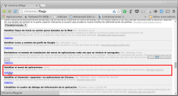](images/1-Habilitar-menú-de-aplicaciones.png)

Una vez encontrada la opción, tal y como se puede ver en la captura de pantalla, **tenemos que clicar encima de la opción** **Habilitar**.

Una vez habilitada la opción tan solo **tenemos que reiniciar nuestro navegador Google Chrome**. **Para ello** tal y como podemos ver en la captura de pantalla, **tenemos que presionar encima del botón **Reiniciar Ahora**.**

[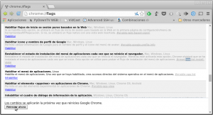](images/2-Reiniciar-el-navegador.png)

Una vez reiniciado el navegador, el menú de aplicaciones de Google Chrome estará habilitado y además, tal y como se puede ver en la captura de pantalla, en el menú de vuestro escritorio aparecerá un nuevo apartado de **Aplicaciones de Chrome**:

[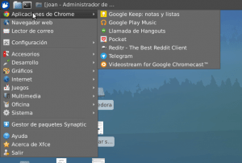](images/3-Aplicaciones-de-Chrome-en-los-menú.png)

Por lo tanto en estos momentos podremos acceder tranquilamente y fácilmente a cualquier Chrome App a través de los menús de nuestra distribución Linux, Windows o Mac OS X. En ningún momento tendremos que arrancar nuestro navegador para poder acceder a nuestras Chrome Apps o aplicaciones de Chrome.

## INTEGRAR LAS APPS DE CHROME EN NUESTRO ESCRITORIO

**Una vez activado el menú de aplicaciones también podemos crear un lanzador del menú de aplicaciones** para poder acceder aún de forma más fácil y sencilla a la totalidad de Chrome Apps que tengamos instaladas.

###### Nota: El procedimiento descrito a continuación únicamente es útil para XFCE que es el entorno de escritorio que utilizo actualmente. En el caso de usar un entorno de escritorio diferente a XFCE deberéis buscar en Google como se debe crear un Lanzador. En otros entornos de escritorio conocidos, como por ejemplo Unity, el proceso de crear un lanzador del menú de aplicaciones de Chrome es muchísimo más sencillo que en XFCE.

Para ello **ubicamos el puntero de nuestro ratón encima del panel de XFCE y presionamos el botón derecho**. Aparecerá un menú en el que tenemos que **seleccionar** **Panel** y seguidamente **en el submenú** que saldrá tenemos que **seleccionar** **Añadir nuevos elementos**.

[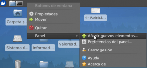](images/4-Añadir-Lanzador.png)

Después de seleccionar Añadir nuevos elementos aparecerá la siguiente ventana:

[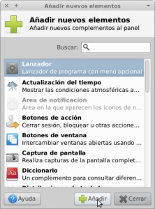](images/5-añadir-lanzador.png)

**Seleccionamos la opción** **Lanzador** y seguidamente **presionamos el botón** **Añadir**. Después de presionar el botón añadir, tal y como se puede ver en la captura de pantalla, aparecerá un lanzador en blanco en el panel de nuestro escritorio XFCE:

[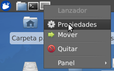](images/6-Configurar-lanzador.png)

**Nos ubicamos encima del lanzador en blanco y presionamos el botón derecho de nuestro ratón**. Después de presionar el botón aparecerá un menú desplegable en el que tenemos que **seleccionar la opción** **Propiedades**. Al seleccionar la opción Propiedades aparecerá la siguiente ventana:

[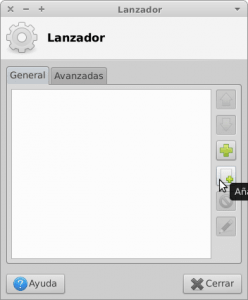](images/7-Añadir-elemento.png)

Tal y como se puede ver en la captura de pantalla, **clicamos encima del icono** **Añadir un nuevo elemento vacío**. Después de esta acción aparecerá la siguiente ventana:

[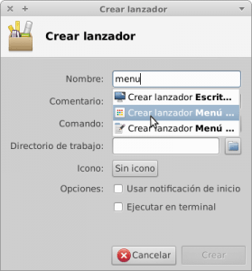](images/8-Creando-acceso-directo.png)

**Nos posicionamos encima de la celda** **Nombre** **y escribimos la palabra menú**. Al escribir la palabra menú, tal y como se puede ver en la captura de pantalla, **aparecerán una serie de propuestas para la creación del lanzador.** Tal y como se puede ver en la captura de pantalla**, tenemos que seleccionar la propuesta **Crear lanzador Menú de aplicaciones****. Una vez seleccionada la propuesta, tal y como se puede ver en la captura de pantalla, tenemos que **presionar el botón** **Crear**.

[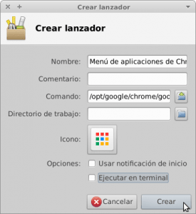](images/9-Menu-Creado.png)

**Una vez creado el lanzador tan solo tenemos que ir al panel de nuestro escritorio y presionar sobre el icono del Chrome Launcher**. **Una vez hayamos presionado sobre él**, tal y como se puede ver en la captura de pantalla, **aparecerán la totalidad de Chrome Apps que tenemos instaladas**.

[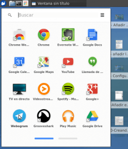](images/10-usando-el-menu.png)

**Clicamos encima de una Chrome App cualquiera** que en mi caso es Webogram. Una vez hayamos clicando encima de la App se iniciará **y podremos usarla sin ningún tipo de problema.**

[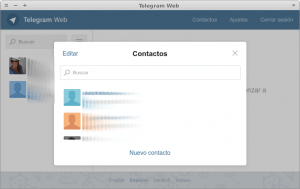](images/11-Usando-chrome-app.png)

De esta forma las Chrome Apps quedan perfectamente integradas a nuestro entorno de escritorio y podemos acceder a ellas de forma muy práctica y cómoda.

## OPCIONES DE CONFIGURACIÓN ADICIONAL DE LAS CHROME APPS

Si repasáis los pasos realizados veréis que durante la activación del menú de aplicaciones, veréis que accedimos al menú de configuración de Google Chrome tecleando **chrome://flags/** en la barra de direcciones del navegador y presionando **Enter**.

Allí habilitamos el menú de escritorio o Chrome Launcher de forma sencilla, pero **aparte de habilitar el menú de escritorio podemos configurar más opciones relacionadas con las Chrome Apps**.

Así por lo tanto **una vez dentro del menú de configuración si queremos que el menú de aplicaciones aparezca en el medio de la pantalla**, en lugar de justo al lado del icono del menú de aplicaciones, **tenemos que localizar y activar la siguiente propiedad**:

> **Centrar el menú de aplicaciones. Windows, Linux, Chrome OS** Coloca el menú de aplicaciones en el centro de la pantalla en horizontal. #enable-centered-app-list

**Si queremos que en el menú de aplicaciones aparezcan la totalidad de aplicaciones de Google Drive tendremos que localizar y activar la siguiente propiedad:**

> **Habilitar aplicaciones de Drive en el menú de aplicaciones. Mac, Windows, Linux, Chrome OS** Muestra aplicaciones de Drive junto con aplicaciones de Chrome en el menú de aplicaciones. #enable-drive-apps-in-app-list

**Si queremos que cada vez que abramos una nueva pestaña en el navegador aparezcan la totalidad de Chrome apps que tenemos instaladas, tan solo tenemos que localizar y activar la siguiente propiedad:**

> **Habilitar el elemento <appview> en aplicaciones de Chrome. Mac, Windows, Linux, Chrome OS, Android** Permite el uso del elemento experimental  #enable-app-view

Finalmente **si queremos que la totalidad de nuestras Chrome Apps estén sincronizadas en la totalidad de nuestros dispositivos deberemos localizar y asegurar que la siguiente opción esté habilitada:**

> **Habilitar sincronización del menú de aplicaciones Mac, Windows, Linux, Chrome OS** Habilita la sincronización del menú de aplicaciones. También habilita las carpetas si están disponibles (no en OS X). #enable-sync-app-list

## CONCLUSIONES FINALES

**Las Chrome Apps son desconocidas por el público en general**. A pesar de esto mi punto de vista es que con las Chrome se **pueden llegar a cubrir gran parte de las necesidades de software y de uso de los usuarios más comunes**. En mi caso utilizo las Chrome App para suplir algunas carencias de Linux como por ejemplo:

1. Usando Reditr dispongo de un cliente de Reddit en condiciones para poder acceder a Reddit en linux.
2. Mediante Google Keep dispongo de una aplicación de notas que me permite la sincronización de notas en la totalidad de mis dispositivos.

Aparte de las Chrome Apps que acabo de citar existen otras Chrome Apps que uso y que son interesantes, pero en este post no considero que sea necesario hablar de ellas.

En definitiva pienso que **el futuro de las Chrome Apps irá muy ligado a los siguientes aspectos**:

1. Irá ligado al **éxito del sistema operativo de Google Chrome OS**.
2. **Que google acabe consiguiendo que las Google Apps se puedan utilizar en dispositivos Android e iOS**.
3. **Que el público y el mundo empresarial acabe usando de forma masiva las Google Apps**. Todos sabemos que si la gente no presta atención a uno de los servicios de Google simplemente se limitan a cerrar el proyecto.
