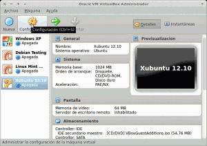
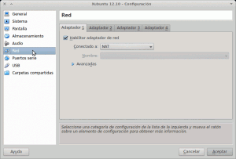
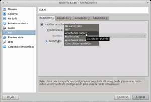
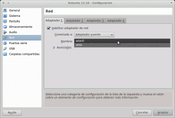
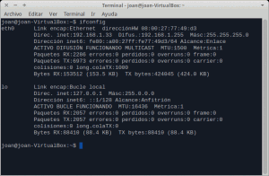
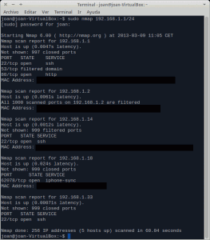

Seguidamente les mostraremos como hacer que el sistema operativo que estamos virtualizando en nuestra máquina virtual ([Virtualbox](https://www.virtualbox.org/ "Web Virtualbox")) este integrado a nuestra red local. Una vez conseguido nuestra máquina virtual estará plenamente integrada en nuestra red local tal y como si un dispositivo real se tratará.<!--more-->

## ¿POR QUÉ INTEGRAR MAQUINA VIRTUAL EN UNA RED LOCAL?

Una vez hemos integrado nuestro sistema operativo en nuestra red local podremos utilizar el sistema operativo virtualizado como si se tratará de una máquina física integrada en nuestra red. Por lo tanto una vez realizados los pasos pertinentes con nuestro equipo seremos capaces de:

1. En el caso de tener escasez de equipos podremos utilizar la máquina virtual tal y como si fuera un servidor. Nos podremos montar el tipo de servidor que nosotros queramos. Por ejemplo un servidor DNS, un servidor Web, un servidor NFS, un servidor de correo, un servidor SSH, un servidor VPN, etc.
2. Tendremos la posibilidad de simular una pequeña red local con varios equipos con el fin de realizar todo tipo de pruebas y test.
3. Podremos compartir fácilmente información entre el sistema operativo virtualizado y el  sistema operativo anfitrión.  (sin la necesidad de tener la carpeta compartida que nos ofrece Virtualbox)
4. Podremos usar la máquina virtualizada para establecer un túnel SSH y así cifrar todo el tráfico hacia el exterior generado por nuestro ordenador.

##### Nota: Aparte de los usos que acabo de citar si pensáis un poco seguro que le podéis dar muchas más utilidades a las que acabo de citar.

## PASOS A SEGUIR PARA INTEGRAR MAQUINA VIRTUAL EN UNA RED LOCAL

La integración es sumamente sencilla. Con 4 clicks de ratón lo conseguiremos fácilmente. Lo primero que necesitamos es un sistema operativo instalado en nuestra máquina virtual Virtualbox. En mi caso este sistema es Xubuntu 12.10. Abrimos nuestra máquina virtual y veremos algo similar a la siguiente imagen:

[](images/Configurar-Máquina-Virtual.png)

Selecciono cualquiera de los sistemas operativos que tengo instalados, en mi caso Xubuntu 12.10, y doy click al icono de Configuración. Seguidamente nos aparecerá la siguiente ventana de configuración:

[](images/paso1.png)

Una vez dentro de la ventana de configuración tenemos que seleccionar la opción **red**.

[](images/paso2.png)

Una vez seleccionada la opción **red** nos aseguramos que tenemos activada la opción **habilitar adaptador de red**. Seguidamente, como podemos ver en las imágenes, cambiamos la opción **conectado a** de **NAT** a **Adaptador Puente**.  Para Finalizar la integración ya solo nos falta definir la opción **Nombre**.

[](images/paso3.png)

Como podéis ver en la imagen, el campo **Nombre** nos ofrece la opción **wlan0** y **eth0**. En mi caso elijo la opción **wlan0** y clico al botón de **aceptar** porqué la conexión que tengo en este momento es vía wifi.

En el caso que mi conexión fuera por cable tendría que elegir la opción **eth0** y darle click al botón de **aceptar**.

Una vez realizados correctamente los pasos que acabamos de citar la integración de la máquina virtual en nuestra red local ha terminado. Solamente falta comprobar que los pasos realizados funcionan.

## COMPROBACIÓN QUE NUESTRA MÁQUINA VIRTUAL ESTA INTEGRADA EN NUESTA RED LOCAL

Para comprobar que nuestra máquina virtual se puede hacer de muchas formas. En mi caso lo voy a realizar con nmap. Primero arranco la máquina virtual, abro una terminal y tecleo:

> ```
> sudo apt-get install nmap
> ```

###### Nota: Este paso es simplemente para asegurarme que tengo el paquete nmap instalado. Probablemente muchos de vosotros ya lo tengan preinstalado.

Seguidamente compruebo la IP que tiene mi sistema mediante la terminal y el comando:

> ```
> ifconfig
> ```

El resultado obtenido es el siguiente:

[](images/ifconfig-máquina-virtualizada.png)

Como podéis ver la ip interna que mi router está asignando a la máquina virtual es **192.168.1.33**. Con esto ya debéis tener la seguridad que vuestra máquina virtual está integrada en la red local ya que por defecto Virtualbox asigna IP del tipo 10.0.2.x/24.

Finalmente podemos hacer la comprobación de los equipos que vemos desde nuestra máquina virtual. Para hacer esto simplemente abrimos una terminal y usamos nmap:

> ```
> sudo nmap 192.168.1.1/24
> ```

###### Nota: Puede que en vuestro caso el comando sea distinto.  Lo tendréis que adaptar en función de vuestra puerta de entrada y en función de vuestra máscara de subred. El comando es simple. Simplemente tenéis que teclear nmap seguido de la puerta de entrada de vuestro router (192.168.1.1) más una **/** y finalmente poner vuestra máscara de subred en forma canónica (24).

[](images/nmap-máquina-virtualizada.png)

Como podemos ver en la imagen des de nuestra máquina virtual somos capaces de ver e interactuar con la totalidad de dispositivos que están actualmente en mi red doméstica. En la imagen podéis ver que desde nuestra máquina virtual podemos ver nuestro router (**192.168.1.1**), ipad (**192.168.1.18**), ordenador anfitrión (**192.168.1.14**), y otro ordenador que tengo en estos momentos conectado (**192.168.1.2**).  Además podéis ver que también nos podemos ver a nosotros mismos ya que la última ip (**192.168.1.33**) es la de nuestra máquina virtual.
