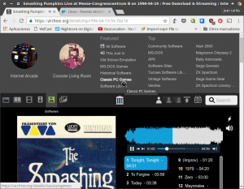

El motivo de escribir sobre el proyecto internet archive es que se trata de un proyecto interesante y ambicioso que es bastante desconocido por el publico en general.

Las cosas que todo el mundo debería saber sobre este interesante proyecto son las siguientes:<!--more-->

## ¿QUÉ ES Y QUE OBJETIVOS TIENE INTERNET ARCHIVE?

Internet archive es una biblioteca digital sin ánimo de lucro creada por [Brewster Kahle](https://en.wikipedia.org/wiki/Brewster_Kahle "Biografía de Brewster Kahle") en mayo de 1996.

Los objetivos principales de esta biblioteca digital son los siguientes:

1. Guardar una copia de la totalidad del contenido presente internet para que el contenido creado perdure en el tiempo y sea accesible para todo el mundo.
2. Mantener la libertad en internet facilitando la circulación libre de la información.
3. Conseguir una internet libre y abierto para todo el mundo facilitando de este modo el acceso universal al conocimiento.

Actualmente está biblioteca digital es gestionada por una organización sin ánimo de lucro.

###### Nota: Brewster kahle no solo es conocido por ser el creador de Internet Archive. También será conocido por ser el creador de Alexa y del protocolo de búsqueda (WAIS)

## ¿QUÉ PODEMOS ENCONTRAR EN INTERNET ARCHIVE?

En la biblioteca digital de Internet Archive podemos encontrar multitud de contenido. Ejemplos del contenido que podemos hallar son los siguientes:

1. Distintas versiones de la misma página web para ver y analizar como ha ido evolucionando el diseño y contenido de una determinada página web con el paso del tiempo.
2. Páginas web que han desaparecido porque han sido retiradas o porque han desaparecido por ser abandonadas por sus administradores.
3. Libros digitales, manuales de usuarios, fotografías, imágenes, películas, revistas, videojuegos antiguos, emuladores de videojuegos antiguos, etc.
4. Listas de contenidos almacenados en servicios externos como por ejemplo Google Books, etc.

Todo el contenido ofrecido por Internet Archive dispone de licencia Creative Commons, o en su defecto dispone de una licencia que permite su distribución. Por lo tanto la totalidad de contenido que encontraremos respeta los derechos de autor.

En el caso que encuentren contenido privativo, o que en su día fuese privativo, será porque los voluntarios de Internet Archive han llegado a acuerdos con los propietarios de los derechos de autor.

###### Nota: A pesar de los intentos de ofrecer contenido que respete los derechos de autor, Internet Archive ha tenido problemas y denuncias de entidades y de periódicos como por ejemplo The New York Times.

## VOLUMEN DE INFORMACIÓN ALMACENADA EN INTERNET ARCHIVE

La cantidad de contenido almacenado en esta librería es enorme y día tras día se va incrementando.

Solo para hacernos una idea el volumen de información almacenada es del siguiente orden:

1. Más de 400 billones de páginas web.
2. 10 millones de [textos](https://archive.org/details/texts "Muestra de textos almacenados") que incluyen revistas como por ejemplo la mítica revista informática [Byte](https://archive.org/details/byte-magazine "Acceso al histórico de la revista BYTE"), periódicos y más de 6 millones de libros almacenados en formato digital.
3. Más de 3 millones de [archivos de audio](https://archive.org/details/audio "Acceso a la totalidad de audios disponibles") entre los que se incluyen más de 53,000 [podcast](https://archive.org/details/audio_podcast "Consultar los podcast almacenados"), 13,000 [audiolibros](https://archive.org/details/audio_bookspoetry "Ver los audilibros disponibles"), conciertos de artistas conocidos como por ejemplo [Smashing Pumpkins](https://archive.org/details/tsp1996-04-19.fm.flac16 "Escuchar el concierto de Smashing Pumpkins"), etc.
4. 1,2 millones de [archivos de imagen](https://archive.org/details/image "Ver las imágenes disponibles") debidamente clasificados por temática. Dentro de las imágenes podemos destacar un amplio surtido de fotografías perteneciente a la [NASA](https://archive.org/details/nasa "Imágenes cedidas por la NASA") o a nuestro [sistema solar](https://archive.org/details/solarsystemcollection "Imágenes de nuestro sistema solar").
5. 1,2 millones de [archivos de vídeo](https://archive.org/details/movies "totalidad de archivos de vídeo disponibles") en los que se encuentran [películas](https://archive.org/details/moviesandfilms "Consultar la películas disponibles"), documentales, [Vlogs](https://archive.org/details/vlogs "Ver los Vlogs"), etc.
6. Miles de [juegos y Software antiguo](https://archive.org/details/software "Ver la totalidad de Software almacenado") como por ejemplo más de 15.000 juegos de [MS-DOS](https://archive.org/details/softwarelibrary_msdos "Jugar a juegos diseñados para MS-DOS"), alrededor de 10,000 juegos de [Spectrum](https://archive.org/details/zx_spectrum_library_games "Jugar a juegos de Spectrum"), más de 500 juegos de [Atari](https://archive.org/details/atari_2600_library "Jugar a juegos de Atari"), etc. La totalidad de juegos se pueden jugar directamente desde el navegador sin necesidad de instalar ningún software adicional en nuestro ordenador.
7. Etc.

La recopilación de la totalidad de está información actualmente ocupa un tamaño de 20 petabytes.

Esta cantidad irá subiendo progresivamente ya que este proyecto tiene la capacidad para realizar un millón de capturas de páginas web por semana.

Después de leer este apartado podríamos decir que Internet Archive es la biblioteca de Alejandría de nuestra época.

###### Nota: Las cifradas mostradas en este apartado corresponden al año 2016.

## MECANISMOS USADOS PARA AÑADIR CONTENIDO A LA LIBRERIA DIGITAL

Día tras día el contenido de la librería se incrementa a través de los siguientes mecanismos:

1. Mediante arañas que rastrean la web para encontrar contenido nuevo para incorporar a la librería digital. Una vez la información esté almacenada la podremos consultar de forma sencilla con la herramienta [Wayback Machine](https://es.wikipedia.org/wiki/Wayback_Machine "Explicación de lo que es la Wayback Machine") presente en la web de archive.org.
2. Particulares, como por ejemplo nosotros mismos, pueden subir su propio contenido a la librería de forma gratuita. Alguno de los contenidos que se pueden subir son por ejemplo Vlogs, podcasts, etc.
3. Mediante voluntarios y personal que se dedica a digitalizar libros y documentos de texto para almacenarlos en la librería.

###### Nota: Internet archive se puede usar como un hosting de audio gratuito. De hecho existen varios podcasters que utilizan archive.org como hosting para poder almacenar y distribuir sus audios.

## ¿CÓMO SE MANTIENE VIVO EL PROYECTO?

El proyecto se mantiene vivo gracias a distintas fuentes de ingresos. Algunas de ellas son las siguientes:

1. Las donaciones de empresas y particulares como por ejemplo Google, Smithsonian Institute, etc.
2. De la fortuna personal del creador de Internet archive. Brewster Kahle acumulo una gran fortuna con la venta de Alexa a Amazon y del protocolo WAIS a AOL.
3. Mediante partnerships establecidas con terceros.

Desde aquí animo a todo el mundo que se anime a contribuir a este interesante proyecto porque vale la pena.

## ¿CÓMO PODEMOS CONSULTAR LA LIBRERÍA DE INTERNET ARCHIVE?

Toda la información almacenada en la biblioteca digital se puede consultar y/o descargar a través de la siguiente página web:

[https://archive.org/index.php](https://archive.org/index.php "Web donde se almacena el contenido")

Una vez dentro de la página web de forma muy fácil e intuitiva podremos consultar y descargar el contenido que nos interese:

Si además nos hacemos una cuenta de usuario podremos subir contenido, indicar como favoritos los contenidos que nos gustan y realizar nuestras propias colecciones de contenidos para que nos sea fácil acceder y consumir el contenido que nos gusta.

Sin duda es absolutamente recomendable que inviertan 10 minutos de su tiempo para visitar su web y ver la totalidad de opciones que nos ofrecen.

## ¿POR QUÉ INTERNET ARCHIVE ES UN PROYECTO IMPORTANTE?

Internet Archive es un proyecto de vital importancia porque la gran mayoría de contenido en Internet es efímero y si nadie lo almacena se perderá irremediablemente.

Según [Brewster Kahle](http://brewster.kahle.org/2015/08/11/locking-the-web-open-a-call-for-a-distributed-web-2/ "Blog de Brewster Kahle"), la duración media del contenido que aparece en Internet son 100 días. A los 100 días es probable que el contenido de internet haya desaparecido o haya sido modificado/actualizado por sus administradores.

Por lo tanto este proyecto contribuye de forma importante a que el contenido creado en la red perdure en el tiempo y que esté a disposición de absolutamente todo el mundo que lo quiera consultar.

Por lo tanto es Internet Archive es un proyecto que fomenta que Internet sea libre y abierto y fomenta que el conocimiento y la cultura esté al alcance de prácticamente todo el mundo.

Además Internet Archive esta llegando a acuerdos con Webs como la Wikipedia, Alexa y OCLC para que en caso que una de estas web tenga enlaces rotos se acceda a la versión del contenido almacenada en la librería Internet Archive

###### Nota: Con proyectos como Internet Archive, y otros similares, la gente tiene que ser consciente que lo que se publique en internet es para siempre.

## PREGUNTAS FRECUENTES SOBRE EL PROYECTO

En el caso que tengan preguntas sobre el proyecto seguramente las puedan encontrar en su sección de preguntas frecuentes:

[https://archive.org/about/faqs.php](https://archive.org/about/faqs.php "Consultar las preguntas frecuentes del Proyecto Internet Archive")
